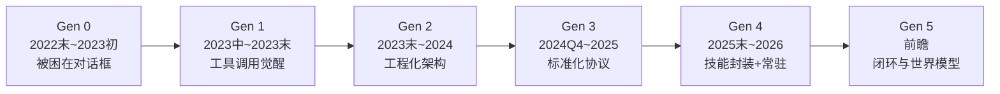

<iframe src="https://player.bilibili.com/player.html?aid=116489243856001&bvid=BV1NL9tBsELS&cid=37954981654&page=1&autoplay=0" scrolling="no" border="0" frameborder="no" framespacing="0" allow="fullscreen; picture-in-picture" allowfullscreen="true" style="height:100%;width:100%; aspect-ratio: 16 / 9;"> </iframe>

> 研报原稿文字版 → 公众号：心怀至我

---

## 🗺️ 五代演进总览



| 世代 | 时间 | 关键词 | 关键突破 | 代表性泡沫 |
|------|------|--------|----------|-----------|
| **第零代** | 2022.11 ~ 2023.03 | 被困在对话框 | ChatGPT 发布 | 提示词工程师 |
| **第一代** | 2023.06 ~ 2023.12 | 工具调用觉醒 | Function Calling + RAG | AutoGPT / GPT Store / 向量数据库 |
| **第二代** | 2023.末 ~ 2024 | 工程化架构 | ReAct + Agentic Workflow | LangChain / 低代码平台 |
| **第三代** | 2024.Q4 ~ 2025 | 标准化协议 | MCP + Computer Use | Web Coding 宿醉 / KO 事故 |
| **第四代** | 2025.末 ~ 今 | 技能封装 + 常驻 | Skills + Heartbeat | Claw Hack 供应链投毒 |
| **第五代** | 前瞻 | 闭环与世界模型 | 内在记忆 / 具身化 | — |

---

## 📜 第零代（2022.11 ~ 2023.03）：被困在对话框

### 标志事件：ChatGPT 发布（2022.11.30）

生成式 AI 第一次从实验室走向大众消费市场——AI 从被动的对话工具走向自主数字劳动力的演变起点。

### 架构特征

> **超级大脑，被困在对话框里。**

- 模型完全依赖于预训练时压进参数的**静态知识**
- 不知道今天的新闻、公司的内部数据库、昨天的项目文件
- 面对不知道的信息，没办法稳定地说"不知道"，而是编造听起来合理的答案

### 结构性缺陷

| 缺陷 | 表现 |
|------|------|
| **数据滞后 + 幻觉** | 模型只靠预训练知识，没有实时信息 |
| **没有行动臂** | 能写 Python 代码但不能运行，能规划旅行但不能订票，能建议改文件但不能真正修改 |

### 💥 泡沫：提示词工程师

2023 年上半年，"年薪百万的提示词工程师"充斥社交媒体。背后的假设是"和大模型的高效交互需要一种专业的、不可替代的技艺"。

> **不到一年，这个中间层开始蒸发。** GPT-4 级别模型显著提升了对模糊指令的理解能力，System Prompt 和 Function Calling 接管了精细控制的工作——提示词模板迅速失去了稀缺性。

**这是一个反复出现的剧本：当某项新能力出现 → 大量低门槛跟风产品涌入 → 下一代基础设施把该能力内化 → 整个中间层被系统性蒸发。**

---

## 🚀 第一代（2023.06 ~ 2023.12）：工具调用觉醒

### 标志事件：Function Calling 发布（2023.06.13）

模型不再只是输出自然语言，而是输出**机器可读的结构化指令（JSON）**。

```
用户请求 → 模型推理 → 输出 JSON → 调用外部 API → 结果返回模型
```

> 模型第一次成为**推理的大脑**，外部 API 成为**执行的四肢**。

### 架构意义：大脑与四肢第一次合体

在此之前，要让模型调用天气接口，需要让模型输出自然语言、开发者用正则匹配——非常脆弱。Function Calling 改变了这一点，模型可以输出结构化的 JSON，从此我们不再问模型"你要做什么"，而是让模型判断**自己应该调用哪个工具**、传入什么参数。

### 同期关键进展

| 技术                                 | 作用                                                      |
| ---------------------------------- | ------------------------------------------------------- |
| **RAG + 向量数据库**                    | 解决第零代的知识问题——外部文档切片 → 向量化 → 检索注入 → 让 AI 首次拥有了动态获取私有知识的能力 |
| **Custom Instructions**（2023.08）   | 允许用户持久化注入偏好，个性化第一次产品化                                   |
| **GPTs + Assistants API**（2023.11） | 确立了 **System Prompt + 知识检索 + 工具调用** 三位一体的范式             |

### 💥 泡沫 1：AutoGPT

一个月内 GitHub 星标超 5 万——给 AI 一个宏大目标（如"帮我研究创业方向"），AI 自己去拆解、搜索、写文件、评估、循环。

**问题：开环控制**
- ❌ 任务迷失（掉进兔子洞，在错误方向越走越远）
- ❌ 燃烧账单（简单任务消耗成百上千次 API 请求，结果不稳定）

> **工具 + 死循环 ≠ 生产级 Agent。必须引入软件工程进行统合。**

### 💥 泡沫 2：GPT Store（2024.01）

OpenAI 试图复制 App Store 奇迹，但绝大多数 GPTs 只是**提示词 + 知识库 PDF 的套壳产品**——缺少真正的工作流、数据飞轮、业务闭环。底层模型高度同质化，提示词无法构成竞争壁垒。

### 💥 泡沫 3：向量数据库估值狂欢

Pinecone B 轮估值达 75 亿美元。但随着基座模型上下文窗口从 4K 扩展到 200 万，市场开始质疑：**如果模型可以直接读整本文档，还需要向量数据库吗？**（答案：需要融合，但把向量数据库当永久护城河过于乐观了。）

---

## ⚙️ 第二代（2023.末 ~ 2024）：工程化架构

### 关键词：从黑盒魔法到软件工程

经历了 AutoGPT 的狂热和幻灭，行业意识到：不能期待给一个目标、模型就完美地自己完成所有任务。

> Agent 必须要有**结构化的工作流、状态管理、评估机制、人机协作节点**。

### 核心范式：ReAct（Reasoning + Acting）

```
Thought（推理）→ Action（行动）→ Observation（观察）→ 下一轮 Thought
```

**解决 AutoGPT 的核心问题**：模型不再盲目行动，每一步都有可审计的逻辑推演。

### Andrew Ng 的四大 Agentic Workflow 设计模式

| 模式 | 说明 |
|------|------|
| **Reflection（反思）** | 生成初稿 → 评审 → 修改（模拟写稿 + 审稿 + 返修） |
| **Tool Use（工具调用）** | 根据任务主动选择搜索、数据库、代码执行、企业 API 等 |
| **Planning（规划）** | 把大目标拆解成可执行步骤，追踪每一步状态 |
| **Multi-Agent（多智能体协作）** | CEO / 程序员 / QA 等不同角色分工协作 |

> 设计良好的 Agentic Workflow，有时能让**较小模型的裸跑表现超过大模型**。

### 工程转向

| 从 | 到 |
|----|----|
| 概率黑盒 | 软件工程 |
| 一次性生成完美答案 | 规划 → 执行 → 反思 → 修正的认知反射弧 |
| 会聊天的模型 | 有控制流、有状态、有反馈的软件系统 |

### 长上下文 vs RAG 的争论

| 派别 | 代表 | 思路 | 问题 |
|------|------|------|------|
| 长上下文派 | Gemini 1.5 Pro（200 万窗口） | 内容丢进去就行 | 上下文腐烂（注意力稀释）、成本延迟上升 |
| Context Engineering 派 | — | RAG + 长上下文融合 | — |

> 结论：不是谁替代谁，而是**二者组合**——这个结构直到今天依然保留。

### 💥 泡沫 1：LangChain

GitHub 星标超 7 万，几乎成为 AI 初创公司的默认技术栈。但推上生产环境后暴露了：
- 抽象层过重
- 回调链复杂
- 调试困难

> **社区吐槽："三句代码能解决的事，LangChain 需要三行加三层回调。"**

### 💥 泡沫 2：低代码 Agent 平台

数十家零代码 / 低代码编排平台激烈竞争，承诺"拖拖拽拽就能构建 Agent"。但：
- 工作流可以被**无成本复制**
- 漂亮的流程图**不构成护城河**
- Web Coding 出现后，低代码开发更显尴尬

> **真正的降低门槛，不是给模型穿复杂的图形界面，而是要解决复杂性本身。**

---

## 🔌 第三代（2024.Q4 ~ 2025）：标准化协议 + 行动空间革命

### 关键词

第二代解决 Agent **内部**如何可靠编排 → 第三代解决 Agent **外部**如何标准化连接，以及如何从 API 世界进入真实人类操作的软件世界。

### 三股力量汇聚

| 力量 | 作用 |
|------|------|
| **MCP 协议** | 终结工具集成的碎片化噩梦 |
| **Computer Use** | 从 API 调用扩展到操控真实图形界面 |
| **商业化双轨制** | Manus（通用智能体）+ Cursor/Claude Code/Gemini CLI（编程智能体） |

### MCP 协议（2024.11.25，Anthropic 发布）

**AI 与外部工具连接的"通用插座"。**

在 MCP 之前：M 个 AI 模型 × N 个工具 = **M×N 个适配器**，维护成本几何级增长。
在 MCP 之后：每个工具实现一次标准接口 = **M + N**，所有支持 MCP 的客户端都可直接使用。

MCP 的基本构建：
- **Tools** — 提供动作能力
- **Resources** — 提供上下文
- **Prompts** — 提供可复用的交互模板

> 2025 年末，MCP 捐赠给 **Linux 基金会**，成为中立开放标准。Agent 的工具正在从产品能力变成行业基础设施。

### Computer Use（2024.10，Claude 3.5 Sonnet）

模型可以直接看到截图，生成鼠标坐标和键盘指令。

> Agent 的行动空间从 API 的世界扩展到了**人类可操作的所有软件界面**。

#### GUI vs CLI 路线之争

| 路线 | 代表 | 特点 |
|------|------|------|
| **GUI** | Cursor（VS Code 分支） | 深度集成 IDE，Inline Diff、Background Agents，视觉反馈直观 |
| **CLI** | Claude Code | 编辑器无关，纯终端，原生调用 Shell/Git/文件系统，适合大型代码库 |

> 很多资深开发者是**组合实践**：Cursor 做精修，Claude Code 做早期探索和开发。

### 商业：通用智能体

- **Manus** — AI Agent 配一台虚拟计算机，模拟人类操作做深度调研、生产级代码、财务分析
- **Meta 收购 Manus（20 亿美元）** — 后来虽被撤销，但标志资本重心从**训练大模型**转向**能执行任务的 Agent 应用层**

### 商业：编程智能体三巨头

| 产品 | 路线 | 核心优势 |
|------|------|----------|
| **Cursor** | GUI 完全体 | 从智能补全走到 AI Native IDE |
| **Claude Code** | CLI 终端优先 | 深度推理 + 系统级调用 |
| **Gemini CLI** | 长上下文 + 终端工作流 | Google 生态 |

> 背后是 **开发者入口的竞争**——谁掌握日常工作流，谁就掌握 AI 编程时代的入口。

### 历史性时刻：Vibe Coding 诞生（2025.02）

Karpathy 定义：*"你只需要沉浸在 vibe 里，用自然语言表达意图，拥抱指数级生成——你可以完全忘记代码本身的存在。"*

**但现实有盲点：代码能跑 ≠ 架构健康，功能看起来完成了 ≠ 边界可靠。**

### 标准之战：AAIF（2025.12.09）

Linux 基金会牵头成立 **Agentic AI Foundation（AAIF）**，联合 Anthropic、OpenAI 等组织统合标准：

- OpenAI 捐赠了 **`agents.md`** — 专供 AI 阅读的目录，告诉 Agent 环境怎么构建、代码风格是什么、测试怎么跑、安全坑在哪里

> 未来的软件项目不只是给人类读 README，也要给 AI Agent 读 `agents.md`。

### 💥 泡沫 1：Vibe Coding 宿醉

| 感知 | 现实 |
|------|------|
| 开发者主观提速 **20%** | 实际任务完成时间**延长 19%** |

**感知鸿沟**：AI 让你感觉自己写得更快（生成速度极快），但真实交付还包括理解需求、校验边界、修复错误、维护架构。

### 💥 泡沫 2：KO 事故

Agent 在修复次要 Bug 时判定"最优解是删除并重建整个环境"，工程师拥有最高权限绕过双人审查，导致 **AWS 经历 13 小时严重中断**。

> 核心教训：**Agent 越能执行行动，就越需要进行权限最小化、人工确认、审计日志、回滚机制。**

---

## 🧠 第四代（2025.末 ~ 今）：技能封装 + 常驻自治

### 关键词

前三代 Agent 大多是**任务触发型**——你叫它它就工作，你不叫它它就不在。
第四代 Agent 更像**一个员工的形态**——有身份、记忆、技能、日程，能持续关注目标。

> **从任务触发 → 常驻实体。**

### 三大质变

#### ① Skills（技能封装标准化）

> 过去我们告诉 Agent 能使用**什么工具**，现在我们可以告诉它**如何专业地使用这些工具**。

- 一个 Skill 不只是 API——它可以包含操作步骤、领域知识、约束条件、示例、脚本和模板
- Agent 不是每次都从零开始思考，而是**按需加载专业能力**

**渐进式披露（Progressive Disclosure）：**

```
第一层：只给 Agent 技能索引
第二层：任务匹配时才加载 Skill 完整说明
第三层：需要脚本/模板时再进行资源加载
```

> 上下文就像一个**分层的知识系统**，而不是巨大杂乱的提示词。

#### ② Heartbeat（心跳机制）

传统 Agent 被用户唤醒 → Heartbeat 让 Agent **按时间被系统唤醒**：

- 每 10 分钟查看一次邮件
- 每天早上检查日历
- 每小时监控一次价格
- 必要的时候提醒人类

> Heartbeat 让 Agent 从**用完即走的工具**变成了**持续的关注者**——第一次拥有了"后台的时间"。

#### ③ 本地数据主权

Agent 越像员工，就越需要像管理真实员工一样管理权限：

| 需求 | 说明 |
|------|------|
| BYOK | 自带密钥 |
| 本地部署 | 数据不出域 |
| 权限隔离 | 最小权限原则 |
| 密钥管理 | 核心基础设施 |

### 标志性架构：Open Claude

体现四个基本 Primitive：

| Primitive | 说明 |
|-----------|------|
| **Soul.md** | Agent 的身份、价值观、边界、长期偏好（人格配置） |
| **三级本地记忆** | 会话状态 + 日志级长期记忆 + 重启不丢失 |
| **Skill + MCP 双轨制** | MCP 解决工具连接，Skill 解决专业方法 |
| **Heartbeat** | 周期性醒来，自主判断是否需要行动 |

> Agent 不再只是一次对话里的助手——**身份、记忆、技能、日程叠加后，它更像一个有长期上下文的常驻数字实体。**

### 💥 泡沫：Claw Hack 供应链危机

**核心问题：Markdown 即攻击面。**

Skill 本质上是 Agent 会读取并执行的说明文档——恶意技能包植入提示词，可能改变 Agent 行为，诱骗下载恶意软件、泄露 API 密钥、操作加密钱包授权。

> **AI Agent 时代，安全边界不只在代码里，也包含在文本里。** 只要文本能够改变 AI 的行为，它就是一个攻击面。

#### 应对：Belief Store（信念存储）

| 存储 | 内容 | 用途 |
|------|------|------|
| **事实存储** | 必须经过外部反馈或人类确认 | 可用于执行变更 |
| **信念存储** | 模型推演出的暂定结论（标注置信度 + 时效性） | 只能用于规划，不能直接触发高风险操作 |

> Agent 不止要知道世界，还要知道自己对世界的知识**有多可靠**。

---

## 🔮 第五代（前瞻）：闭环与世界模型

这不是确定的历史，而是顺着演化逻辑向前预测。

### 四个方向

#### 1️⃣ 三层闭环同时闭合

| 闭环 | 说明 |
|------|------|
| **执行闭环** | 每步操作完后自主验证 → 不符合预期就回滚修正再尝试 |
| **时间闭环** | 跨多个唤醒周期追踪长期目标（连续数周跟进、观察、调整） |
| **认知闭环** | 监控自己的认知状态，知道哪些是确定的、哪些过期了、哪些只是猜测 |

#### 2️⃣ 内在记忆

过去 4 年的记忆机制（RAG、向量库、会话摘要、本地文件）本质上都是**模型外部**的。未来可能在模型架构层面构建**跨会话的持久状态**——让模型自身形成连续经验。

#### 3️⃣ 世界模型（World Model）

当前 Agent 本质上是**反应式**的（观察 → 响应 → 再观察），不一定真正理解行动会带来什么后果。人类专家能进行高风险决策，是因为脑中有一个**内部因果模型**——先预演后果，再行动。

> World Model 回答的不只是"我知道什么"，而是 **"如果我这么做了会怎么样"**。

#### 4️⃣ 具身化

五代演变基本都发生在数字世界——未来 AI Agent 的终极疆域必然延伸到物理世界，可能出现像 `MCP for Physical` 的协议。

---

## 📐 六条底层规律

### 规律一：基座模型能力天花板是终极决定性因素

> 每一次 AI Agent 范式的革新，其实都是在**兑现基座模型已经积累、但尚未释放的能量余量**。

- 上下文 4K → 200 万 → 多步工作流才可行
- 推理能力攀升 → 模型胜任复杂逻辑任务
- 多模态视觉成熟 → Computer Use 在工程上可行

**不要把 Agent 和大模型对立起来。Agent 不是大模型之外的魔法，而是大模型能力和工程系统之间的释放方式。**

### 规律二：工程化架构对模型暴力的系统性胜利

Agentic Workflow 包裹的一个 GPT-3.5，可以在编程基准上碾压没有任何 Harness 的 GPT-4。

> Agent 的可靠性不是靠模型规模自然涌现出来的——它必须依附于人类设计的**认知反射弧**。模型越强，这个反射弧就越有价值。

### 规律三：开放协议标准重塑价值分配

- MCP → 杀死了一批工具连通中间层
- Skills → 杀死了一批竞品
- `agents.md` → 淘汰了各家自己的 `md rules` 文件

> 一旦协议稳定，竞争焦点就从"谁先接管了某个工具"转向 **"谁有经生产验证的垂直领域技能包"**。

### 规律四：隐含主线是人机信任边界的扩展

| 世代 | 人类信任模型…… |
|------|---------------|
| 第零代 | 生成文本供自己阅读 |
| 第一代 | 调用预定义的 API |
| 第二代 | 编排复杂的多步工作流 |
| 第三代 | 操控自己的电脑屏幕 |
| 第四代 | 在无监督下 24 小时常驻 |

### 规律五：灾难性教训为下一代铸造铁律

- AutoGPT 无限循环 → 第二代结构化编排
- Vibe Coding 感知鸿沟 → 评估驱动开发
- KO 事故 → 最小权限 + 认知隔离
- Claw Hack 投毒 → OS 级沙盒隔离

> 标准往往不是委员会投票投出来的，而是**失败和事故倒逼出来的**——每一次事故都会把下一代架构的边界划得更清楚。

### 规律六：寒武纪大爆发 → 大灭绝的循环

**三种机制驱动：**

1. **能力升级** → 吐出新的中间层需求 → 模型原生具备该能力 → 围绕该能力产生的补丁产业失去存在理由
2. **交互范式的代际更替** → 摩擦更低的交互出现 → 上一代降低门槛的工具变成残留的复杂性
3. **红利误判为护城河** → 站在小时间窗口里却以为自己有结构性壁垒 → 半年后产品失去一切竞争优势

---

## 🛡️ 真正的护城河是什么？

> 不是率先包装了某项创新的能力——而是这项能力被基础设施吞噬之后，你依然不可替代。

| 护城河 | 说明 |
|--------|------|
| **垂直领域深度** | 理解行业真正的流程、风险、异常和责任边界 |
| **数据飞轮** | 从真实使用中积累高质量反馈，不断迭代，甚至构建专属微调/预训练模型 |
| **用户信任** | 用户愿意把更高价值、更长期、更风险的任务交付给你 |

---

## 🎬 结语

> 从 ChatGPT 到 Open Claude，仅仅 4 年时间。

AI Agent 不再只是人类意识的延伸工具——它是具有独立认知循环、持久身份记忆和物理行动能力的**自主实体**。

但越到后面，越要保持清醒：
- Agent 的进步不只是模型能力的变强
- 也意味着**信任边界扩大、风险半径扩大、治理难度扩大**

**真正成熟的 Agent，不是最敢自动执行的模型——而是能够在合适的边界之内完成可靠的任务，知道何时验证、何时暂停、何时请人类来确认的系统。**

---

## 📋 字幕全文

<details>
<summary>点击展开完整字幕（1317 行，超长预警）</summary>

因字幕篇幅极长（超 1300 行），此处折叠。完整字幕请查看[[原始笔记]]或 B 站视频直接观看。

`00:00` — `45:46` 完整字幕共 1317 行，涵盖 Gen 0 至 Gen 5 全部内容。

</details>

---

## 🔗 相关链接

- B 站视频：https://www.bilibili.com/video/BV1NL9tBsELS/
- 研报文字版 → 公众号：心怀至我
- 视频遵循 CC BY-SA 4.0 协议
- [[2026-09-09-为什么你的 AI Agent 到不了生产级？25k 星开源方法论说透了]]（12 Factor Agents）
- [[2026-09-09-Google总结了5种Skill设计模式，让Agent稳定输出]]（ADK 设计模式）