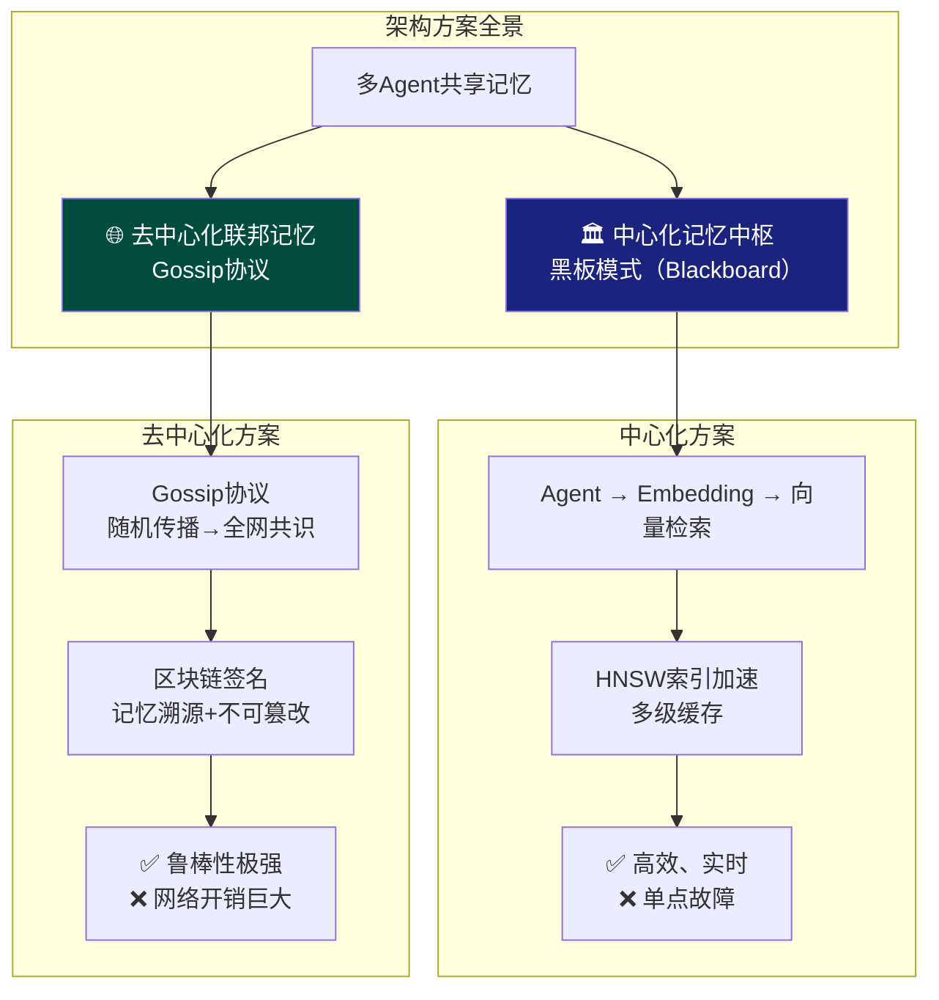

<iframe src="https://player.bilibili.com/player.html?aid=116827120208055&bvid=BV1WLTM6SEbr&cid=39478821488&page=1&autoplay=0" scrolling="no" border="0" frameborder="no" framespacing="0" allow="fullscreen; picture-in-picture" allowfullscreen="true" style="height:100%;width:100%; aspect-ratio: 16 / 9;"> </iframe>

> [!danger] 面试不要踩的坑
> 面试官问"多 Agent 系统怎么实现共享记忆"，千万别脱口而出"搞个 Redis 或共享数据库"——在真正的架构师眼里，数据库能装下数据，但**装不下智能体之间的语义理解和协作共识**。

---

## 1️⃣ 为什么共享数据库会失败？

| 误区 | 真相 |
|------|------|
| **物理存储 = 语义理解** | 从数据库读出一行字符串，Agent 还得自己分析半天。这不叫记忆，叫**查档案** |
| **无脑覆盖写** | Agent A 写"前方路口安全"，Agent B 同时写"有危险"——传统数据库直接覆盖，系统决策链路**瞬间分裂** |
| **单点瓶颈** | 中央数据库在高并发下读写瓶颈 + 网络延迟 + 分区容错性——本质是**分布式系统的 CAP 权衡** |

> **真正的共享记忆**应该是 Agent 只要抛出一个意图，系统就能精准反馈最相关的历史经验，而不是存个数据那么简单。

---

## 2️⃣ 两大主流架构方案



---

### 🏛️ 方案一：中心化记忆中枢（黑板模式）

把多 Agent 之间的共享记忆抽象成一块**智能黑板**，所有 Agent 通过这块黑板交换信息。

#### 工作流程

```
Agent A 感知环境
      ↓
  Embedding 模型 → 高维语义向量
      ↓
  存入向量数据库（Milvus / Pinecone）
      ↓
Agent B 工作时 → 根据当前意图向量做相似度检索
      ↓
  得到历史类似场景的处理经验
```

#### 技术要点（面试加分）

| 技术 | 作用 |
|------|------|
| **HNSW 索引**（Hierarchical Navigable Small World） | 加速向量检索，将近似最近邻搜索从暴力遍历降到对数复杂度 |
| **多级缓存**（LRU / Redis Cache） | 减轻主向量库压力，热点记忆秒级响应 |

#### 死穴

> [!warning] 单点故障
> 向量库一旦宕机或网络断了，所有 Agent 瞬间变成**痴呆**，完全丧失协作能力。

---

### 🌐 方案二：去中心化联邦记忆协议

> 面试官杀手锏——不需要中央数据库，Agent 之间通过 **Gossip 协议（八卦协议）** 自组织达成记忆共识。

#### 传播机制

```
Agent A 知道了一件事
      ↓
  随机传给 2~3 个邻居
      ↓
  邻居再传给邻居
      ↓
  （最终）全网达成记忆共识
```

#### 防篡改机制

引入**轻量级区块链技术**——每一段记忆都打上数字签名 + 时间戳，实现：
- **记忆溯源**：谁在什么时候写了什么
- **不可篡改**：历史记忆任意节点可校验

#### 防消息风暴

> [!tip] 工程要点
> 设定 **TTL（生存时间）** 和 **跳数限制（Hop Limit）**，防止消息在整个网络中无限传播。

#### 优劣势

| 维度 | 评价 |
|------|------|
| 鲁棒性 | ✅ 网状结构——坏掉一两个节点完全不影响大局 |
| 扩展性 | ✅ 节点越多，网络越健壮 |
| 网络开销 | ❌ 传播量大，延迟高 |
| 实现复杂度 | ❌ 共识机制 + 加密验证，工程难度翻倍 |

---

## 3️⃣ 三大架构师杀手锏

> 讲完前两个方案，面试官觉得你技术面挺广。要拿高薪定高级，还得再祭出这三招。

### ① 熵值记忆过滤系统

```
         Agent 输入
             ↓
        ┌─────────────┐
        │  前置过滤引擎  │ ← 计算信息的熵值
        └──────┬──────┘
               ↓
        ┌─────────────┐
        │ 高熵 → 保留   │ ← 真正有价值的关键关联
        │ 低熵 → 过滤   │ ← 冗余、重复、噪音
        └─────────────┘
```

> **不能什么垃圾信息都往记忆里塞**——只保留那些真正能产生高维度价值的信息。

### ② 信任加权投票（冲突解决）

当 Agent A 和 Agent B 记忆冲突时（一个说安全，一个说危险）：

```
Agent A 正确率: 85% ─┐
                      ├──→ 加权共识算法 → 判定最可靠版本
Agent B 正确率: 62% ─┘
```

**建立动态信任权重矩阵：**
- 基于历史表现的正确率
- 网络评级
- 时间衰减因子

### ③ 属性基加密（ABE — Attribute-Based Encryption）

> Agent C 的私密经验，凭什么让 Agent D 看到？

```
ABE 加密 → 只有符合特定属性权限的 Agent 才能解密
          ├── 组织级别
          ├── 角色类型
          └── 安全等级
```

**适用场景：** 多组织协作，跨企业共享 Agent 记忆时的隐私保护。

---

## 4️⃣ 终极公式

> [!quote] 面试官想听你记住这个公式
> **共享记忆系统 = 存储介质 + 交换协议 + 共识逻辑**

| 要素 | 说明 | 具体技术 |
|------|------|----------|
| **存储介质** | 记忆放哪 | 向量数据库 / 区块链 / 分布式 KV |
| **交换协议** | 怎么传播 | 黑板模式（REST/gRPC）/ Gossip 协议 |
| **共识逻辑** | 谁的正确 | 信任加权投票 / 熵值过滤 / ABE 权限 |

---

## 5️⃣ CAP 场景选型指南

| 场景 | 推荐方案 | 理由 |
|------|----------|------|
| **内网环境，高实时** | 🏛️ 中心化黑板模式 | 低延迟，做好分片 + 容灾即可 |
| **边缘计算/无人机群** | 🌐 去中心化联邦 | 无中心依赖，自适应组网 |
| **多组织协作** | 🏛️+🌐 混合 | 中心化管控 + 去中心化隐私保护（ABE） |

> 在 CAP 的世界里，根据业务形态精准落子，**这才是架构师最高级的职业素养。**

---

## ✅ 面试标准答案框架

| 层级 | 要点 | 加分项 |
|------|------|--------|
| **第一层：为什么共享 DB 不行** | 物理存储 ≠ 语义理解；冲突覆盖；单点瓶颈 | 提到 CAP 权衡 |
| **第二层：两种主流架构** | 中心化（黑板 + 向量库 + HNSW）vs 去中心化（Gossip + 区块链） | 背出优缺点 |
| **第三层：杀手锏** | 熵值过滤 / 信任投票 / ABE 加密 | 说出英文全称 |
| **收尾：公式** | 共享记忆 = 存储 + 协议 + 共识 | 结合 CAP 给出场景选型 |

---

## 📋 字幕全文

<details>
<summary>点击展开完整字幕</summary>

`00:00` 如果面试官突然问你
`00:01` 在多agent的系统里
`00:02` 你怎么实现共享记忆
`00:04` 你可千万别想都不想就脱口而出
`00:06` 那简单啊
`00:07` 搞个REDIS或者共享数据库不就行了
`00:09` 我跟你讲
`00:10` 只要你这么答了
`00:11` 这面试基本上就到此为止了
`00:13` 为什么
`00:13` 因为在真正的架构师眼里
`00:15` 数据库只是一个装东西的桶
`00:16` 它能装下数据
`00:17` 但装不下智能体之间的语义理解和协作共识
`00:21` 很多同学把多agent系统想成了传统的CRUD业务
`00:25` 这完全是两码事
`00:26` 今天我们就彻底把这个困扰很多人的底层架构拆透
`00:30` 我会带你跳出存储的舒适区
`00:32` 看看什么才是真正的分布式智能协同
`00:35` 这就是你从高级开发进阶到架构师的关键分水岭
`00:39` 咱们先来深度盘一盘
`00:40` 为什么直接答共享数据库会失败
`00:43` 首先你要明白物理存储
`00:44` 它不等同于语义理解
`00:46` 你想啊agent需要的是什么
`00:48` 是经验
`00:49` 是那种能直接用来做决策的高维度信息
`00:52` 如果你只是从数据库里读出一行字符串
`00:54` agent还得自己去分析半天
`00:56` 这不叫记忆
`00:57` 这叫查档案
`00:58` 真正的共享记忆应该是agent
`01:00` 只要抛出一个意图
`01:02` 系统就能精准反馈给他最相关的历史经验
`01:05` 再一个冲突处理才是最头疼的
`01:07` 假设agent a写入一条记忆
`01:09` 说前方路口安全
`01:10` 这时候A忍B突然感知到有危险
`01:12` 他也往数据库里写
`01:14` 传统数据库会怎么办
`01:15` 无脑覆盖对吧
`01:16` 那之后agent a接收到的信息就完全乱了
`01:20` 整个系统的决策链路会瞬间分裂
`01:22` 最后你还得考虑分布式环境的限制
`01:24` 单点依赖一个中央数据库
`01:26` 在高并发下的读写瓶颈
`01:27` 网络延迟
`01:28` 还有分区容错性
`01:30` 哪一个不是致命伤
`01:31` 所以这绝对不是存个数据那么简单
`01:33` 这是在做分布式系统的CAP权衡
`01:36` 那高手会怎么设计呢
`01:38` 咱们来看第一种主流方案
`01:39` 中心化记忆中枢
`01:40` 也就是架构界大名鼎鼎的黑板模式
`01:43` 你可以把它想象成所有agent面前摆了一块巨大的智能的黑板
`01:47` agent们不再是往里面存简单的表数据
`01:50` 而是把它们感知到的环境通过embedding模型转化成高维度的语义向量
`01:55` 然后丢进向量数据库里
`01:56` 比如大家熟悉的MILAS或者是penny控别的agent在干活的时候
`02:01` 他会根据自己当下的意图向量去黑板上做相似度检索
`02:05` 他不需要知道记忆存哪了
`02:07` 他只需要问黑板
`02:08` 黑板以前有没有类似的场景
`02:10` 别人是怎么处理的
`02:11` 这时候你就得跟面试官露一手了
`02:13` 你可以聊聊HNSW索引是怎么加速检索的
`02:17` 聊聊多级缓存是怎么减轻主库压力的
`02:20` 当然你也要非常客观地指出
`02:22` 这种方案虽然高效
`02:23` 但它有个死穴
`02:24` 就是单点故障
`02:25` 一旦销量库宕机了
`02:27` 或者网络断了
`02:28` 所有agent就会瞬间变成痴呆
`02:30` 完全丧失协作能力
`02:32` 如果你想让面试官彻底对你刮目相看
`02:34` 你得聊聊更硬核的去中心化联邦记忆协议
`02:37` 这种方案简直就是分布式极客的最爱
`02:40` 因为它根本不需要中央数据库
`02:42` agent之间不再依赖中间商
`02:44` 而是通过gossip协议
`02:45` 也就是八卦协议在整个集群里互相对齐状态
`02:48` agent的A知道了一件事
`02:50` 他会随机传给几个邻居
`02:52` 邻居再传给邻居
`02:53` 很快整个网络就达成了记忆共识
`02:56` 这种网状结构的鲁棒性极其恐怖
`02:58` 坏掉一两个节点完全不影响大局
`03:01` 更绝的是
`03:01` 为了防止有些agent记错了或者故意撒谎
`03:04` 咱甚至可以引入轻量级的区块链技术
`03:06` 给每一段记忆都打上数字签名和时间戳
`03:09` 实现真正的记忆溯源和不可篡改
`03:12` 当然聊到这
`03:13` 你得提醒面试官去中心化
`03:15` 虽然高级
`03:15` 但网络开销巨大
`03:17` 所以我们要设定生存时间TTL和跳数限制
`03:20` 防止整个网络被消息风暴给淹没了
`03:23` 讲完前面两个方案
`03:24` 面试官可能觉得你技术面挺广
`03:26` 但要拿高薪定高之极
`03:28` 你还得祭出这三个真正的架构师杀手锏
`03:31` 第一个原记忆过滤系统
`03:33` 你要告诉面试官
`03:34` 咱不能什么垃圾信息都往记忆里塞
`03:36` 得有一个前置引擎
`03:37` 专门计算信息的熵值
`03:39` 把那些冗余的重复的噪音直接过滤掉
`03:42` 只保留那些真正能产生价值的关键关联
`03:45` 第二个信任加权投票
`03:47` 这就是为了解决刚才说的记忆冲突
`03:49` agent a和B说法不一致
`03:51` 怎么办
`03:51` 咱得根据他们历史表现的正确率
`03:53` 网络评级建立一个动态的信任权重矩阵
`03:56` 通过加权共识算法让系统自动判定出那个最可靠的记忆版本
`04:00` 第三个属性基加密
`04:02` 也就是ABE加密
`04:04` 在多组织协作的场景里
`04:05` 隐私太重要了
`04:06` agent c的私密经验
`04:08` 凭什么让agent d看到通过ABE加密
`04:10` 只有符合特定属性全线匹配的agent才能解开那段记忆
`04:14` 这一套组合全打下来
`04:21` 好了
`04:21` 最后咱们得利落地给全场做一个总结
`04:24` 你要让面试官记住一个公式
`04:26` 共享记忆系统
`04:27` 它不仅仅是存储
`04:28` 它是存储介质
`04:30` 加上交换协议
`04:31` 再加上最核心的共识逻辑
`04:33` 作为架构师
`04:34` 我们要明白
`04:34` 这个世界上没有完美的方案
`04:36` 只有最适合场景的权衡
`04:38` 如果你做的是内网环境
`04:39` 对实时性要求极高
`04:41` 那你就大方的选中心化黑板架构
`04:43` 做好分片和容灾就行
`04:45` 但如果你做的是边缘计算
`04:46` 或者像无人机群这种复杂的公网场景
`04:49` 那去中心化的联邦网络才是出路
`04:52` 在CAP的世界里
`04:53` 根据业务形态精准落子
`04:55` 这才是架构师最高级的职业素养

</details>

---

## 🔗 参考链接

- B 站视频：https://www.bilibili.com/video/BV1WLTM6SEbr/
- [[Bilibili/2026-09-09-Google总结了5种Skill设计模式，让Agent稳定输出|五种 Skill 设计模式]]
- [[Bilibili/2026-09-10-万字拆解AI Agent编年史：一个视频看懂2022~2026五代演进|AI Agent 编年史]]