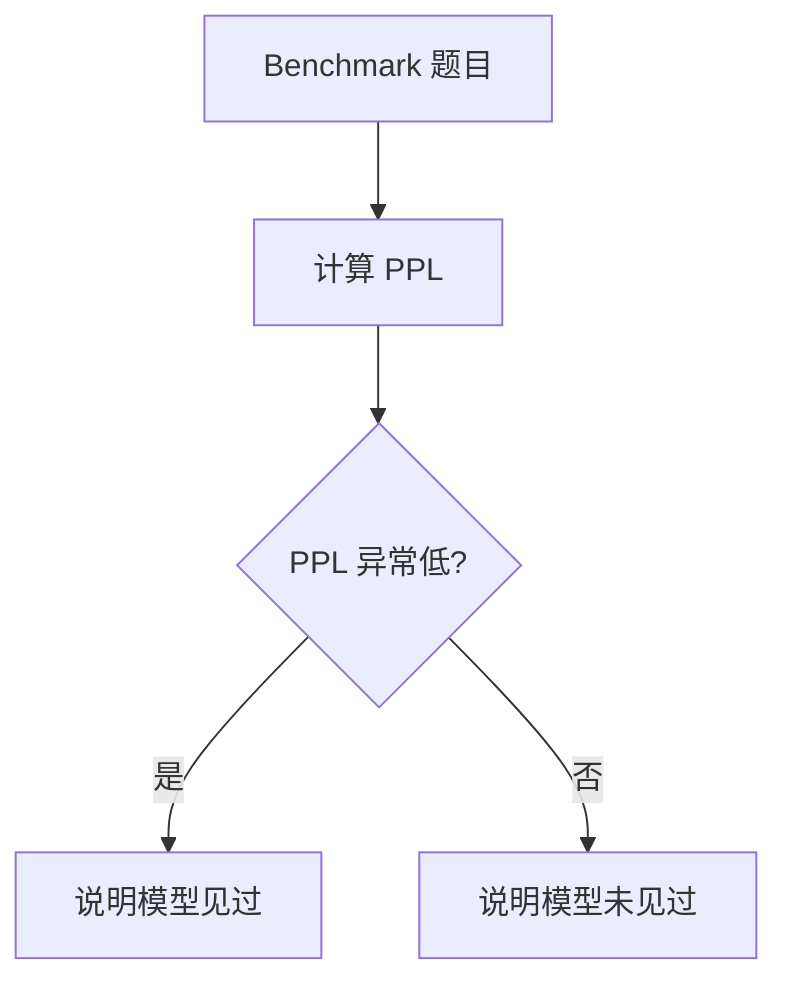
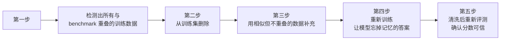
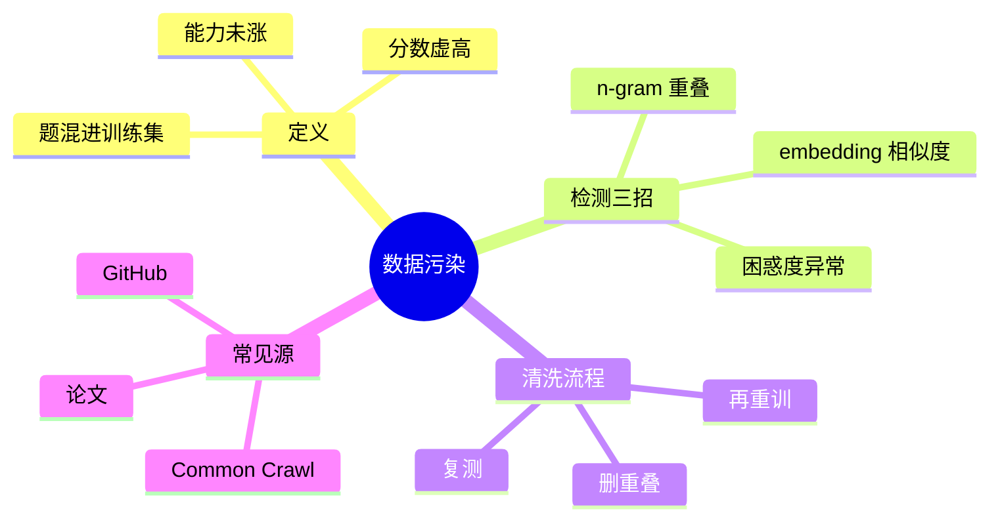

> [!summary]
> 模型在 MMLU 上考了九十分，但其实是训练时见过这些题。数据污染让分数虚高，而非能力提升。本视频讲透如何通过三种检测方法（n-gram、embedding、PPL）识别和清洗数据污染。

## 📹 视频信息

- **标题**: 【评测可信度】数据污染的检测与清洗：n-gram、embedding 与 PPL 三重检测
- **作者**: 古希腊掌管代码的神
- **B站ID**: BV1mrb76uEDc
- **发布日期**: 2026-09-15
- **字幕语言**: 中文



---

## 📖 核心内容

### 1. 什么是数据污染？

> [!definition]
> **数据污染（Data Contamination）**
> 训练数据中混入了 benchmark 测试题，模型不是学会了能力，而是记住了答案。

- 数据污染是预训练最常见的问题之一
- 导致模型分数虚高，但实际能力并未提升
- **本质**: 模型只是记忆了答案，而非真正理解

---

### 2. 三种检测方法

#### 方法一：n-gram 匹配

- **原理**: 将 benchmark 题目切分成 n-gram（连续的 n 个词或字符）
- **方法**: 在训练数据中搜索重叠的 n-gram
- **优点**: 快速、直接
- **缺点**: 只能检测完全相同的文本，无法发现同义改写

#### 方法二：Embedding 相似度

> [!tip]
> 找到语义相同但措辞不同的污染，这是 n-gram 抓不到的。

- **原理**: 将文本转换为向量表示，计算语义相似度
- **方法**: 找到与 benchmark 题目语义相似但措辞不同的训练数据
- **优点**: 能发现同义改写的污染
- **缺点**: 可能产生误判

#### 方法三：Perplexity 检测

- **原理**: 测量模型对文本的困惑度（Perplexity）
- **方法**: 模型对 benchmark 题目的 PPL 异常低，说明训练时见过
- **优点**: 直接反映模型记忆程度
- **缺点**: 计算成本较高

---

### 3. 清洗方法五步流程

1. **检测重叠**: 找出所有与 benchmark 题目重叠的训练数据
2. **删除污染**: 从训练集中删除重叠数据
3. **补充数据**: 如果数据量不足，用相似但不重叠的数据补充
4. **重新训练**: 重新训练模型，让它"忘记"记忆的答案
5. **重新评测**: 清洗后重新评测，确认分数可信

---

### 4. 常见污染源

| 污染源 | 描述 | 解决方案 |
|--------|------|----------|
| **Common Crawl** | 爬取了包含 MMLU 的网页 | 使用 n-gram + embedding 双重过滤 |
| **GitHub** | 有人把 benchmark 题目上传 | 检测后删除，避免使用公开数据 |
| **论文引用** | 论文引用 benchmark 题目后被爬取 | 在采集时过滤，避免爬取论文 |

> [!warning]
> 这些污染大多不是故意的，但都需要被清理。

---

### 5. 实操建议

#### ✅ 推荐做法

1. **双重检测**: 使用 n-gram 和 embedding 双重检测
2. **删除重叠**: 检测后立即删除重叠数据
3. **重新训练**: 重新训练或微调模型
4. **重新评测**: 清洗后重新评测
5. **报告结果**: 分数报告时附上去污结果

#### 🎯 关键要点

> [!important]
> **跑分之前先确认题没漏进训练集，否则那个分数毫无意义。**

- 评测数据绝不外发
- 不上公开仓库
- 自己留一份私有的 hold out
- 入库前去污染：先用 n-gram + embedding 过滤

---

## 🔄 30秒回顾

### 快速总结

1. **数据污染**: Benchmark 题混进训练集 → 分数虚高但能力未涨
2. **三种检测**: n-gram 重叠 + embedding 相似度 + 困惑度异常
3. **清洗流程**: 删重叠 → 再重训 → 复测
4. **三大污染源**: Common Crawl、GitHub、论文引用
5. **一句话**: 跑分前先确认题没漏进训练集

---

## 📌 适用人群

- 🎓 **模型评测人员**: 需要准确评估模型性能
- 💼 **算法岗面试**: 理解数据污染对评测的影响
- 🔬 **研究工程师**: 优化模型训练和评估流程

---

## 📚 相关主题

- [[模型评估]]
- [[数据清洗]]
- [[n-gram 模型]]
- [[Embedding 技术]]
- [[Perplexity 计算]]
- [[预训练数据质量]]

---

%%时间戳字幕参考%%
## 🎬 字幕时间戳

| 时间 | 内容 |
|------|------|
| 00:00 | 模型在 MMLU 上考了90分 |
| 00:02 | 但其实是训练时见过这些题 |
| 00:04 | 数据污染让分数虚高 |
| 00:06 | 今天3分钟讲透怎么检测和清洗 |
| 00:08 | 先理解数据污染是什么 |
| 00:10 | 训练数据里混入了 benchmark 测试题 |
| 00:13 | 模型不是学会了能力 |
| 00:14 | 而是记住了答案 |
| 00:16 | 数据污染是预训练最常见的问题 |
| 00:18 | 检测方法 - 方法1 n-gram 匹配 |
| 00:21 | 把 benchmark 题目切成 n-gram |
| 00:23 | 在训练数据里搜索重叠 |
| 00:25 | 方法2 embedding 相似度 |
| 00:27 | 找语义相同但措辞不同的污染 |
| 00:28 | 这是 n-gram 抓不到的 |
| 00:29 | 方法3 perplexity 检测 |
| 00:32 | 模型对 benchmark 题目 PPL 异常低 |
| 00:34 | 说明见过 |
| 00:36 | 清洗方法第一步 |
| 00:39 | 检测出所有与 benchmark 重叠的训练数据 |
| 00:41 | 第二步从训练集删除 |
| 00:43 | 第三步数据不够用 |
| 00:43 | 用相似但不重叠的数据补充 |
| 00:44 | 第四步重新训练 |
| 00:46 | 让模型忘掉记忆的答案 |
| 00:48 | 第五步清洗后重新评测 |
| 00:50 | 确认分数可信 |
| 00:51 | 常见污染源 |
| 00:52 | 第一 common crawl 爬取了包含 MMLU 的网页 |
| 00:55 | 第二 GitHub 上有人把 benchmark 题目上传 |
| 00:59 | 第三论文引用 benchmark 题目被爬取 |
| 01:01 | 实操建议用 n-gram 和 embedding 双重检测 |
| 01:04 | 检测后删除重叠数据 |
| 01:06 | 重新训练或微调 |
| 01:08 | 清洗后重新评测报告分数时附上去 |
| 01:10 | 无结果落地怎么做 |
| 01:12 | 第一评测数据绝不外发 |
| 01:16 | 不上公开仓库 |
| 01:17 | 自己留一份私有的 hold out |
| 01:19 | 第二入库前去污染采集回来的数据 |
| 01:22 | 先和评测集跑一遍 |
| 01:23 | n-gram 加 embedding 的双重过滤 |
| 01:25 | 第三命中即删并重训 |
| 01:28 | 发现污染样本整条删掉 |
| 01:30 | 已经训过的模型要续训来消除记忆 |
| 01:33 | 30秒回顾 |
| 01:37 | 第一 benchmark 的题混进训练集就是数据污染 |
| 01:38 | 分数虚高但能力没涨 |
| 01:39 | 第二检测有三招 |
| 01:42 | n-gram 重叠 embedding 相似度还有困惑度异常 |
| 01:46 | 第三清洗流程是删重叠再重训 |
| 01:49 | 最后干净复测 |
| 01:51 | 第四 common crawl 论文和 GitHub 是三大重灾区 |
| 01:55 | 一句话带走 |
| 01:56 | 跑分之前先确认题没漏进训练集 |
| 01:58 | 否则那个分数毫无意义 |
| 02:00 | 看懂了点个关注 |
| 02:02 | 下期接着拆 |

---

**标签**: #clippings #bilibili #评测可信度 #数据污染 #n-gram #embedding #perplexity #模型训练 #数据清洗

%%文档结束%%
