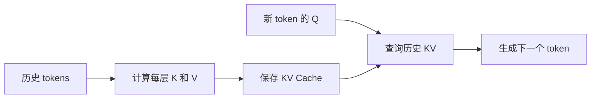
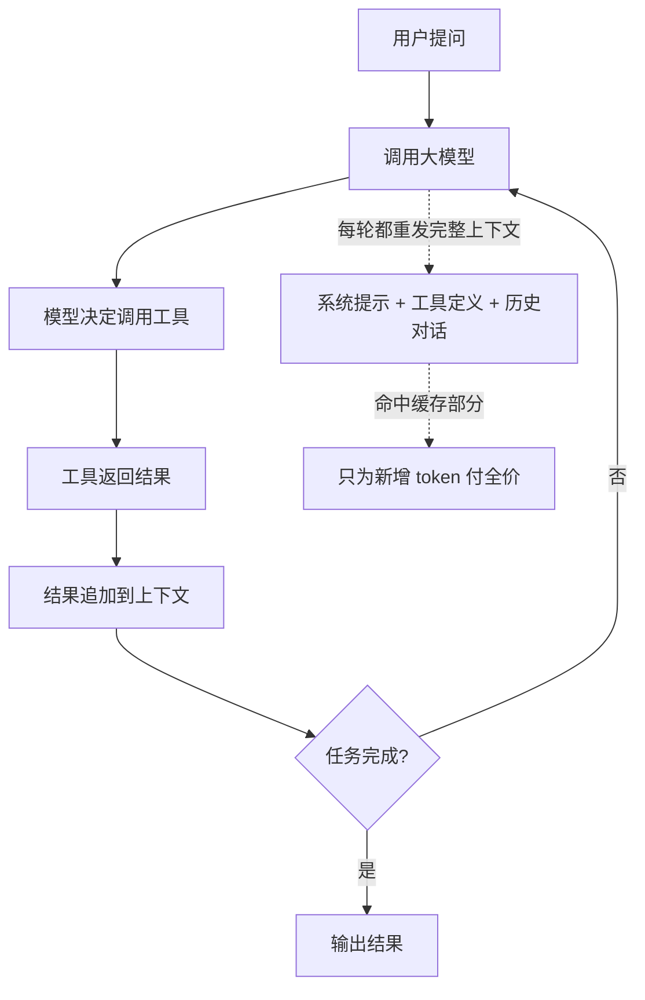

# Prompt Cache 到底是啥，它和 KV Cache 是什么关系？

> [!info] 视频信息
> - 作者：[[轩辕的编程宇宙]]
> - 来源：[Bilibili](https://www.bilibili.com/video/BV1CjH962EVb/)
> - 上传日期：2026-10-08
> - 字幕语言：中文
> - 图文教程：[xuanyuancode.com/ai-llm](https://www.xuanyuancode.com/ai-llm)
> - 相关概念：[[Prompt Cache]]、[[KV Cache]]、[[前缀缓存]]、[[Prefill]]、[[Decode]]、[[因果注意力]]、[[Agent 上下文工程]]

<iframe src="https://player.bilibili.com/player.html?aid=117405581837541&bvid=BV1CjH962EVb&cid=42571534138&page=1&autoplay=0" scrolling="no" border="0" frameborder="no" framespacing="0" allow="fullscreen; picture-in-picture" allowfullscreen="true" style="height:100%;width:100%; aspect-ratio: 16 / 9;"> </iframe>

## 一句话总结

> [!tip] 核心结论
> API 价格里那个便宜到离谱的「命中缓存价格」，背后的技术就是 **Prompt Cache（前缀缓存）**。
>
> 说白了，==Prompt Cache 就是 KV Cache 的跨请求版==：把相同前缀的 KV 跨请求保存下来，下次直接复用。
>
> 一句话记住：
> - **KV Cache**：这一句话里面别重复算。
> - **Prompt Cache**：这一次和上一次别重复算。

## 从 API 价格说起

> [!question] 现象
> AI 大模型 API 价格里，除了输入输出价格，还有一个**命中缓存的价格**，往往便宜到只有正常输入价格的 **1/10**。
>
> 这是为什么？

答案就是 **Prompt Cache**。要搞懂它，先回到上一期讲的 [[KV Cache]]。

## 快速回顾：KV Cache

> [!note] 自回归生成与因果注意力
> 大模型生成内容时，是一个 token 一个 token 往外蹦的。
>
> 因为 [[因果注意力]] 的规定，每一个 token 只能看到自己和前面的内容，看不到后面的内容。所以新 token 的出现，不会改变历史 token 的计算结果。
>
> 于是我们把每一层历史 token 的 **K 和 V** 保存下来。新的 token 来了，只需要拿自己的 **Q** 去查询这些历史的 KV 就可以了。
>
> 这就是 **KV Cache**：==用空间换时间，省掉了海量的重复计算。==

## 问题：KV Cache 只活在单次请求里

> [!warning] 重复计算的浪费
> 假设轩辕做了一个 AI 小助手，专门回答养鹦鹉的问题。每次调用大模型，都会先塞一大段系统提示词，再跟上几千字的饲养手册，最后才是用户的问题。
>
> 模型收到输入后：
> 1. 先把所有输入 token 完整跑一遍，算出每一层的 K 和 V —— 这叫 **Prefill（预填充）**。
> 2. 然后进入 **Decode**，一个 token 一个 token 往外生成答案。
>
> [[KV Cache]] 主要在 **Decode** 阶段发挥作用。
>
> 但注意：==这份 KV Cache 只活在这一次请求里面==。回答完「能不能吃苹果」，请求结束，这些 KV 就被释放掉了。
>
> 几秒钟后，同一个用户再来问「虎皮鹦鹉掉毛怎么办」——系统提示词一模一样，几千字饲养手册一模一样，只有最后的问题变了。可模型又得从第一个 token 开始，把那几千字重新计算一遍。
>
> 这是不是又是一种重复计算？

## Prompt Cache：把 KV 跨请求保存下来

> [!success] 核心思路
> 既然这几千个 token 的 K 和 V 每次算出来都一样，那第一次算完能不能别扔，留着给下一次请求接着用？
>
> 但这里有一个关键问题：**我们凭什么说它们每次算出来都一样？**
>
> 回到因果注意力：一个 token 的 K 和 V，只取决于它自己以及它前面所有的 token。后面跟着什么内容，完全影响不到它。
>
> 所以只要两次请求的开头部分一字不差，那开头这一段每一层的 K 和 V 就一定完全相同。

> [!danger] 反过来：一个 token 变了，后面全废
> 如果中间有一个 token 变了，比如饲养手册的第 100 个 token 改了一个字：
> - 第 100 个 token 的 K 和 V 会变。
> - 第 101 个 token 在注意力计算时会看到这个变化，它的结果也会跟着变。
> - 一路传下去，从第 100 个 token 往后，==所有的缓存全部作废==。
>
> 所以这种缓存只能命中**从第一个 token 开始完全相同的那一段**。这一段就叫**前缀**。

> [!important] 定义
> 把相同前缀的 KV Cache 跨请求保存下来，下次直接复用——这就是 **Prompt Cache**，也叫**前缀缓存**。
>
> ==Prompt Cache 就是 KV Cache 的跨请求版。==

## Prompt Cache 与 KV Cache 的关系

### 联系：缓存的是同一种东西

> [!note] 同一种东西
> 它们缓存的是**每一层历史 token 的 K 和 V**。
>
> Prompt Cache 存的不是你那段文字本身，而是这段文字算出来的 **K 和 V**。

### 区别：主要有三点

| 维度 | KV Cache | Prompt Cache |
|---|---|---|
| **作用范围** | 管的是一次请求内部：生成第 8 个 token 时复用前 7 个的结果 | 管的是不同请求之间：这一次请求复用上次请求的开头 |
| **省的地方** | 主要省 **Decode**，让模型往外吐字更快 | 主要省 **Prefill**，前缀越长省的时间越多，用户最直观的感受是**首字出来更快** |
| **谁来管 / 怎么收费** | 推理引擎内部的事，用户基本感知不到 | 要在服务器上存一段时间，涉及存多久、存在哪、命中了怎么算钱，所以各家厂商都把它做成了==明码标价的功能== |

> [!quote] 一句话总结
> - **KV Cache**：这一句话里面别重复算。
> - **Prompt Cache**：这一次和上一次别重复算。

## Agent 开发：Prompt Cache 太重要了

> [!example] Agent 是怎么干活的
> 用户说：帮我查一下明天的天气适不适合带鹦鹉出门。
>
> 1. Agent 先调用大模型，模型决定调用天气工具。
> 2. 工具返回结果，Agent 把结果追加到上下文里。
> 3. 再调用一次大模型，模型说还要查一下鹦鹉怕不怕冷。
> 4. 又调用一次工具，再追加，再调用……
>
> 注意：==每调用一次工具，就是一次全新的请求==。而每一次请求都要把系统提示词、几十个工具的定义、前面所有的对话和工具结果全部重新发一遍。
>
> 一个任务跑下来，几十轮上下文越滚越长。绝大部分输入的 token，实际上都是上一轮已经发过的。
>
> 如果每一轮都能命中缓存，就只需要为**最后新增的那一小段**付全价。

### 让前缀稳住的四条经验

#### 第一条：拼出来靠前的部分要保持不变

> [!tip] JSON 字段顺序无所谓，拼出来的序列才关键
> 调 API 时，工具定义、系统提示词、历史消息是请求 JSON 里的不同字段。JSON 里这几个字段谁写在前、谁写在后，其实无所谓，因为模型根本不认 JSON。
>
> 服务端收到请求后，会按照自家固定的模板把这些东西拼成一条完整的 token 序列，再送进模型。缓存比对的就是这条**拼好的序列的前缀**。
>
> 比如 [[Anthropic]] 的文档写得很明确：拼接顺序是 **工具 → 系统提示词 → 消息**。其他家模板细节略有不同，但大体思路差不多。
>
> 所以重点不是你怎么排列字段，而是拼出来以后，==靠前的那部分每次都要一模一样==。
>
> 系统提示词里也不要塞每次都在变的东西，比如用户 ID、随机数、时间戳等。它们一变，后面的缓存全部作废。

#### 第二条：工具定义不要动

> [!warning] 工具定义是整个前缀的地基
> 就拿 Anthropic 来说，工具定义拼在最前面，它是整个前缀的地基。差一改，后面系统提示词和历史消息的缓存全部都要跟着失效。
>
> 有的框架每次请求都动态增删工具，或者把工具列表从一个无序的集合里取出来，列表里的工具先后顺序时不时变一下。对人来说呢是同一批工具，可是拼出来的 token 序列已经完全不一样了。对缓存来说就是一个全新的前缀。
>
> 所以工具列表尽量一开始就定好，每次生成出来的内容都要保持完全一致。

#### 第三条：只追加不修改历史

> [!bug] 作者踩过的坑：滑动窗口式裁剪
> 作者刚开始学 Agent 开发时，总觉得上下文太长、太浪费。尤其是工具调用，参数特别长或者返回结果很长，动不动就几千上万个 token。
>
> 于是想了一个「聪明」的办法：把历史上下文里那些超长的工具参数和结果给截断，只留一个开头。但又担心截断影响效果，所以决定最近的几轮不裁剪，保持原样，只截断很久之前的。
>
> 当时还觉得自己挺机智的。但是大家想一想：==这个「最近几轮」是不是一个滑动窗口？==
>
> 每多交互一轮，窗口就往后挪一格。原来不裁剪的那一轮，就掉进了要被裁剪的范围。它的内容被截断，从这个位置往后，前缀就全变了。缓存就这么一轮接着一轮地失效。
>
> 后来盯着账单里的缓存命中率，才发现问题出在这里。把裁剪干脆取消掉，缓存命中率瞬间就上去了。
>
> 更奇怪的是：不裁剪以后，上下文明明更长了，可是因为绝大部分都命中了缓存，==实际花的钱反而降下来了==。

> [!success] 正确做法
> 历史消息尽量只往后追加。要补充新的指令，也**追加一条新的消息**，而不是回头改前面的内容。

#### 第四条：上下文压缩要想清楚代价

> [!warning] 压缩会重写缓存
> 上下文太长，很多 Agent 都会做压缩：把前面几十轮的对话总结成一小段摘要，替换掉原来的。
>
> 这一换，从被替换的位置开始，前缀就变了。压缩之后的第一轮请求，基本上就要**重新写一遍缓存**。
>
> 所以压缩不能太频繁。最好是攒到一定长度，再做一次大的。压缩完以后，新的前缀尽量保持稳定，让后面几次继续命中。
>
> 除此之外，中途切换模型、切换推理强度这些参数，在很多厂商那里也会导致缓存失效，所以也不推荐大家这么做。

## 总结

> [!success] 总结
> - [[KV Cache]] 只活在一次请求里面，请求结束就扔了。
> - 下一次请求相同的开头还是需要重新计算。
> - 那就把有相同前缀的 KV 跨请求保存下来，于是有了 **Prompt Cache**。
> - 为什么只能缓存前缀？因为因果注意力下，一个 token 的 KV 只取决于它和它前面的内容。前面任何一个 token 变了，后面都得全部作废。
> - Agent 每调用一次工具就是一次新的请求，上下文越滚越长。怎么办？==让前缀稳住==。
>   - 拼出来靠前的部分保持不变。
>   - 工具定义别乱动。
>   - 历史只追加不修改。
>   - 不要做滑动窗口式的裁剪。
>   - 上下文压缩不要太频繁。
> - **上下文短一点不一定更省钱，前缀稳住了，长一点反而更便宜。**
>
> Prompt Cache 并不是什么全新的黑科技，它就是把上一期讲的 KV Cache，从一次请求里面延长到了多次请求之间。而能做到这一点，靠的还是 Transformer 里面那条最朴素的规矩：==只能看前面，不能看后面。==

> [!info] 下集预告
> 不管是 KV Cache 还是 Prompt Cache，缓存的都是每一层每一个 token 的 K 和 V。上下文一长，这份缓存本身就大得吓人，注意力的计算量还是在那。
>
> 下一期聊：现代大模型是怎么从注意力本身下手，把它变小变快的——形形色色的注意力计算。

## 关键金句

> [!quote] 摘录
> - 命中缓存的价格往往便宜到只有正常输入价格的 1/10。
> - KV Cache 用空间换时间，省掉了海量的重复计算。
> - 只要两次请求的开头部分一字不差，那开头这一段每一层的 K 和 V 就一定完全相同。
> - 从第 100 个 token 往后，所有的缓存全部作废。
> - Prompt Cache 就是 KV Cache 的跨请求版。
> - KV Cache 是这一句话里面别重复算，Prompt Cache 是这一次和上一次别重复算。
> - 上下文短一点不一定更省钱，前缀稳住了，长一点反而更便宜。
> - 只能看前面，不能看后面。
