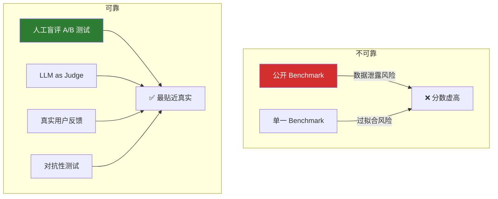

<iframe src="https://player.bilibili.com/player.html?aid=117219623309381&bvid=BV1eab76jEkY&cid=41618966492&page=1&autoplay=0" scrolling="no" border="0" frameborder="no" framespacing="0" allow="fullscreen; picture-in-picture" allowfullscreen="true" style="height:100%;width:100%; aspect-ratio: 16 / 9;"> </iframe>

> **榜单分数只能用来初筛，别拿它当上限依据。** 模型在 MMLU 上考了 85 分，但实际用起来像智障——benchmark 分数和真实能力之间可能差了一个太平洋。

---

## 1️⃣ Benchmark 为什么会骗你？

| 原因 | 说明 |
|:----:|------|
| **① 数据泄露** | 训练数据混入了 benchmark 测试题——模型不是学会了能力，是**记住了答案** |
| **② 过拟合 benchmark** | 模型针对 benchmark 的格式做了特殊优化，**但泛化不了** |
| **③ 覆盖面有限** | Benchmark 是标准化测试题，不能覆盖真实场景的多样性 |

---

## 2️⃣ 两大陷阱

### 陷阱一：数据泄露（最致命）

```
训练数据 ─┬─ 正常数据
           └─ Benchmark 测试题 ← 混进去了！
                  ↓
模型在测试集上得分高 ≠ 学会了能力
                  ↓
                  = 记住了答案（分数虚高，能力原地踏步）
```

| 检测方法          | 做法                                |
| ------------- | --------------------------------- |
| **N-Gram 匹配** | 检查训练集和测试集的 n-gram 重叠率——重叠越高，泄露越严重 |

### 陷阱二：过拟合 Benchmark

```
模型 A：MMLU 85 分，HumanEval 82 分，GSM8K 80 分，其他全是 60 分
                                                          ↑
                                          只有一两个涨分，其他不涨 → 过拟合！
```

| 检测方法 | 做法 |
|----------|------|
| **多独立 Benchmark 交叉验证** | 如果只有 **1~2 个涨分、其他不涨** → 说明模型学会了题型，不是学会了知识 |

### 附加坑：Few-Shot 极其敏感

> Shot 数量、选项顺序、模板写法、解码参数——**都能动摇分数**。同模型不同配置测出的分数可能差好几个点。

---

## 3️⃣ 最可靠的真实评测



| 评测方式 | 可靠性 | 成本 | 说明 |
|----------|:------:|:----:|------|
| **公开 Benchmark** | ❌ 低 | 低 | 容易泄露和过拟合 |
| **多 Benchmark 交叉** | ⚠️ 中 | 低 | 单个可能骗人，多个同时骗人难 |
| **人工盲评 A/B** | ✅ 最高 | 高 | **最贴近真实**，但费人费力 |
| **LLM as Judge** | ✅ 较高 | 中 | 需注意位置/风格/自我偏好偏差 |
| **真实用户反馈** | ✅ 最高 | 直接上线 | 最终检验标准 |
| **对抗性测试** | ✅ 高 | 中 | 故意构造困难样本测试鲁棒性 |

---

## 4️⃣ 实战落地四步法

> 怎么避免被 benchmark 骗？

| 步骤 | 做法 | 作用 |
|:----:|------|------|
| **① 多榜交叉** | 选三个以上不同来源的 benchmark，排名一致才进入候选 | 防止单榜过拟合 |
| **② 自建私有集** | 从真实业务抽 **50~100 题**私有题库，定期换血 | 既防泄露，也防被针对 |
| **③ 控制变量** | 同模板、同 shots、同解码参数——**只换模型** | 否则没有可比性 |
| **④ 人工+业务为准** | 榜单分数只做初筛，**上线决策看盲评和真实指标** | 最终检验 |

> [!important] 关键原则
> **Benchmark 是工具，不是真理。**

---

## ✅ 总结

| # | 要点 |
|---|------|
| 1 | **数据泄露最致命**——测试题混进训练集，分数虚高但能力原地踏步 |
| 2 | **过拟合榜单**——模型学会了题型，没学会知识，一做盲评就露馅 |
| 3 | **Few-Shot 极其敏感**——shot 数量、选项顺序、模板写法都能动摇分数 |
| 4 | **防坑三件套**——多榜交叉 + 私有动态题库 + 人工盲评 |
| 5 | **一句话**——**榜单分数只能用来初筛，别拿它当上限依据** |

> Benchmark 是工具，不是真理。

---

## 🔗 关联阅读

- [[2026-09-09-【MT-Bench 实测】LLM-as-Judge 的四大偏差：位置_冗长_自我偏好_风格|LLM-as-Judge 的四大偏差]]

---

## 📋 字幕全文

<details>
<summary>点击展开完整字幕</summary>

`00:00` 你的模型在MMLU上考了85分
`00:02` 但实际用起来像智障
`00:04` Benchmark
`00:05` 分数和真实能力之间可能差了一个太平洋
`00:07` 今天3分钟讲透评测陷阱
`00:10` 先理解benchmark为什么会骗你
`00:12` benchmark是标准化测试题
`00:14` 但模型在上面考高分不等于真实能力强
`00:17` 原因有三
`00:18` 数据泄漏刷分优化
`00:20` benchmark覆盖面有限
`00:22` 陷阱一数据泄露训练
`00:24` 数据里混入了benchmark测试题
`00:25` 模型不是学会了能力
`00:27` 而是记住了答案
`00:28` 检测方法
`00:29` 用n gram匹配检查重叠率陷阱
`00:32` 二
`00:32` 过拟合benchmark模型
`00:34` 针对benchmark格式做了特殊优化
`00:36` 但泛化不了检测方法
`00:38` 用多个独立benchmark交叉验证
`00:40` 如果只有一两个涨分
`00:42` 其他部长说明过拟合怎么避免被坑
`00:45` 第一用多个独立benchmark交叉验证
`00:48` 第二做区污染检查
`00:50` 第三跑人工评估或LLM s judge
`00:53` 第四定期更新benchmark最可靠的真实评测
`00:57` 第一人工盲评AB测试
`00:59` 第2l l m as judge
`01:01` 第三真实用户反馈
`01:03` 第四对抗性测试
`01:05` benchmark是工具
`01:06` 不是真理
`01:07` 落地怎么做
`01:08` 第一选模型先交叉再看
`01:10` 担保三个以上不同来源的benchmark排名一致
`01:13` 才让他进候选
`01:14` 第二自建50~100题的私有集
`01:17` 从真实业务里抽
`01:18` 定期换血
`01:19` 既防泄漏
`01:20` 也防被提
`01:21` 第三对比要控制变量
`01:23` 同模板
`01:24` 同shots
`01:25` 同解码参数只换模型
`01:27` 否则根本没有可比性
`01:28` 第四最终以人工和业务级为准
`01:31` 榜单分数只做初筛
`01:33` 上线决策要看盲评和真实指标

</details>

---

## 🔗 参考链接

- B 站视频：https://www.bilibili.com/video/BV1eab76jEkY/
- [[2026-09-09-【MT-Bench 实测】LLM-as-Judge 的四大偏差：位置_冗长_自我偏好_风格]]