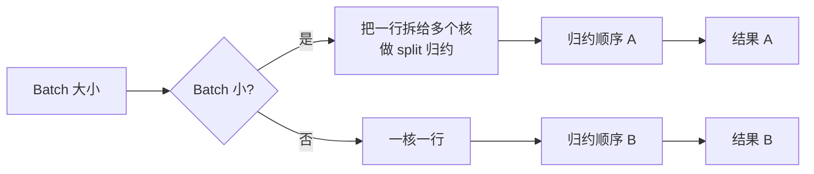
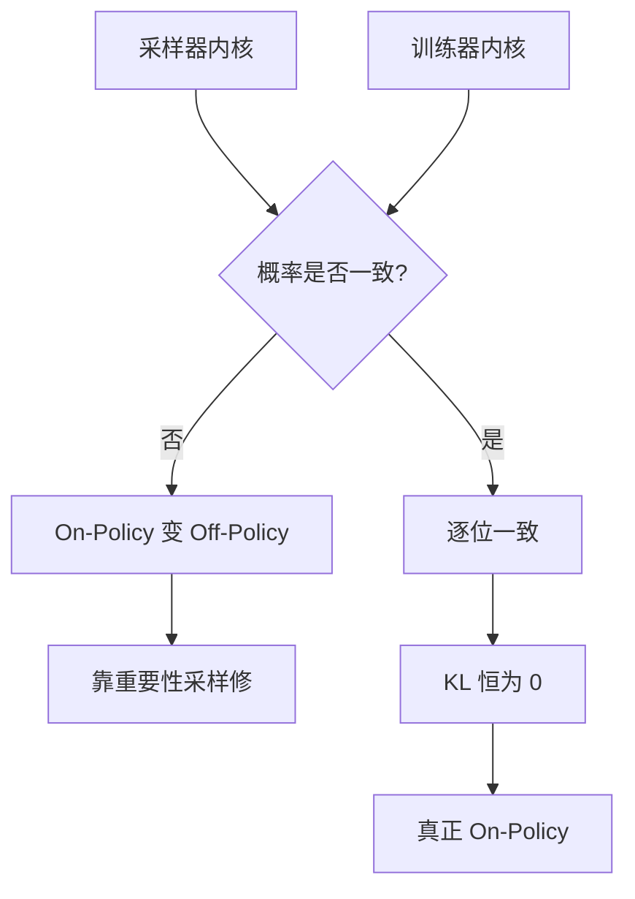

# 【推理 Infra】Batch 不变内核：通过固定归约顺序消除大模型推理的不确定性，RL 训推 KL 归零

> [!info] 视频信息
> - 作者：[[古希腊掌管代码的神]]
> - 来源：[Bilibili](https://www.bilibili.com/video/BV173eY6CESH/)
> - 上传日期：2026-09-21
> - 字幕语言：中文
> - 参考：[[Thinking Machines 博客 - Defeating Nondeterminism in LLM Inference]]
> - 相关概念：[[Batch 不变性]]、[[归约顺序]]、[[浮点结合律]]、[[RMSNorm]]、[[KV Cache]]、[[On-Policy]]、[[Off-Policy]]、[[重要性采样]]、[[TIS]]、[[MIS]]

<iframe src="https://player.bilibili.com/player.html?aid=117298828418690&bvid=BV173eY6CESH&cid=42037414157&page=1&autoplay=0" scrolling="no" border="0" frameborder="no" framespacing="0" allow="fullscreen; picture-in-picture" allowfullscreen="true" style="height:100%;width:100%; aspect-ratio: 16 / 9;"> </iframe>

## 一句话总结

> [!tip] 核心结论
> `temperature=0` 时同一 prompt 跑两次结果不一样，流传多年的解释是“GPU 浮点并发随机”。2025 年 9 月 Thinking Machines 的博客推翻了它：==真凶是 batch 不变性缺失==。
>
> 你的答案取决于同一时刻别人在发什么请求。他们写了 batch 不变的内核，代价是慢 1.6 倍；拿去做 RL，采样器和训练器的 KL 从 0.001 带尖峰变成恒等于零，==RL 第一次真正 on-policy==。

## 问题背景

> [!question] 现象
> `temperature` 设成 0，同一个 prompt 跑两次，结果不一样。
>
> 所有人都说是 GPU 浮点并发随机。2025 年 9 月，Thinking Machines 一篇博客把这个流传多年的解释推翻了。

## 一、浮点不满足结合律

> [!note] 基础事实
> 浮点加法不满足结合律：

$$
(a + b) + c \neq a + (b + c)
$$

在浮点里，两者可能差最后一位。所以只要**归约顺序**变了，结果就变。

> [!warning] 流行解释错在哪
> 流行解释是：GPU 上成千上万个线程并发做归约，谁先谁后是随机的，所以结果随机。
>
> 博客指出这个解释是错的：**单个内核逐次运行时，归约顺序是固定的，结果完全可复现。**

那不确定性从哪来？

## 二、真凶：Batch 不变性缺失

> [!important] 定义
> 一个内核的输出，**不应该依赖这次一起算了多少条序列**。

但现实里为了性能，RMSNorm、矩阵乘、注意力都会按 batch 大小选不同的并行策略：

- batch 小时：把一行拆给多个核做 split 归约。
- batch 大时：一核一行。
- 策略一变，归约顺序就变，结果就变。

> [!danger] 关键推论
> 推理服务的 batch 由**同时到达的请求数**决定。
>
> 所以同一个输入的结果，取决于同一时刻别人在发什么请求。

## 三、修法：写 Batch 不变内核

> [!success] 三个算子各一招

| 算子          | 策略                                                                |
| ----------- | ----------------------------------------------------------------- |
| **RMSNorm** | 数据并行归约：一个核负责一个 batch 元素，无论 batch 多大都不拆行                           |
| **矩阵乘**     | 固定 tensor-core 指令和分块；小 batch 用 padding 补齐，而不是换策略                  |
| **注意力**     | 最难。KV cache 分块时用**固定的 split 大小**，而不是固定的 split 数量；这样序列长度变了，归约顺序也不变 |

> [!warning] 代价
> - 未优化的确定性 vLLM：慢 **2.1 倍**。
> - 改进注意力内核后：慢 **1.6 倍**。
> - 矩阵乘比 cuBLAS 慢约 **20%**。
> - 作者说优化投入很少。

## 四、为什么 RL 圈最激动

> [!important] 核心矛盾
> RL 的采样器和训练器是**两套内核**。同一条回答，两边算出的概率不一样。
>
> 结果：on-policy 悄悄变成 off-policy，之前只能靠**重要性采样**修。

> [!example] 博客实验对比
> | 方案 | KL | 结果 |
> |---|---|---|
> | 不确定内核 + off-policy 修正 | 约 0.001，且有尖峰 | reward 最终崩掉 |
> | 确定性内核 | 恒为 0 | 两边逐位一致，不需要任何修正 |

> [!quote] 结论
> RL 真正 on-policy，不需要任何修正。

## 五、实操四条

> [!todo] 实操清单
> 1. **先确认根因**：单请求重复跑一致，并发下不一致，就是 batch 不变性问题，==不是随机种子==。
> 2. **评测和训练要不要确定性，看场景**：
>    - 评测可复现：值得。
>    - RL 训推一致：值得慢 1.6 倍。
>    - 线上高吞吐服务：未必。
> 3. **注意力用固定 split 大小是关键**，因为 KV cache 长度一直在变。
> 4. **把它和 TIS、MIS 这类修正对比着理解**：它们治标，确定性内核治本。

## 总结三句话

> [!success] 总结
> 1. 推理不确定性的根因不是浮点并发随机，是内核缺乏 **batch 不变性**，结果随并发负载变化。
> 2. 修法是 **batch 不变内核**：RMSNorm 数据并行、矩阵乘固定分块、注意力固定 split 大小，代价 1.6 倍。
> 3. 对 RL 的意义：采样器训练器 **KL 归零**，真正 on-policy，不再需要 off-policy 修正。
>
> 一句话：==训推一致，从内核开始。==

## 关键金句

> [!quote] 摘录
> - 你的答案取决于同一时刻别人在发什么请求。
> - 单个内核逐次运行时，归约顺序是固定的，结果完全可复现。
> - 一个内核的输出不应该依赖这次一起算了多少条序列。
> - TIS、MIS 这类修正治标，确定性内核治本。
> - 训推一致，从内核开始。

## 关键时间戳

| 时间      | 内容                      |
| ------- | ----------------------- |
| `00:00` | 现象：temperature=0 结果不一致  |
| `00:11` | 真凶：batch 不变性缺失          |
| `00:23` | RL KL 从 0.001 带尖峰变成恒等于零 |
| `00:31` | 浮点加法不满足结合律              |
| `00:41` | 流行解释：GPU 线程并发随机         |
| `00:47` | 博客指出解释是错的               |
| `00:56` | 真凶：batch 不变性缺失          |
| `01:25` | 修法：batch 不变内核           |
| `01:49` | 代价：慢 1.6 倍              |
| `02:00` | 为什么 RL 圈最激动             |
| `02:27` | 实操四条                    |
| `02:58` | 总结三句话                   |
