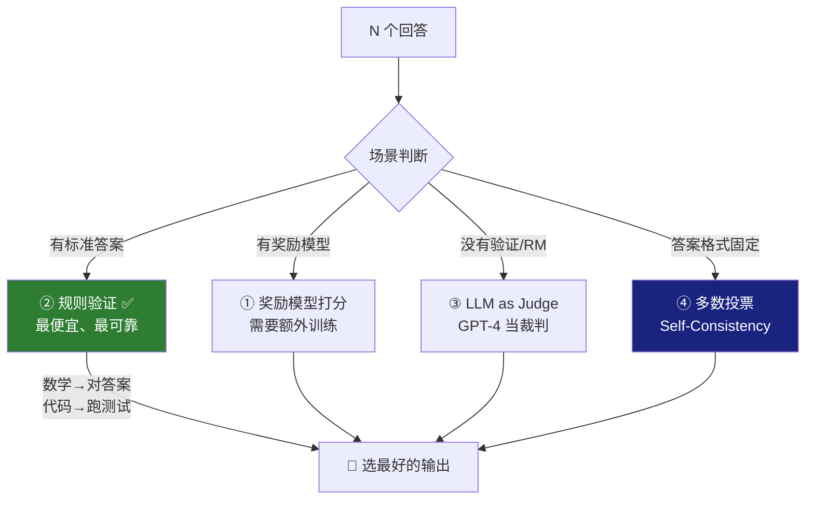
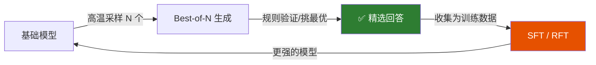

<iframe src="https://player.bilibili.com/player.html?aid=117219623177462&bvid=BV1Qab76LEvu&cid=41619031559&page=1&autoplay=0" scrolling="no" border="0" frameborder="no" framespacing="0" allow="fullscreen; picture-in-picture" allowfullscreen="true" style="height:100%;width:100%; aspect-ratio: 16 / 9;"> </iframe>

> **不想训练又想涨点，先试 Best-of-N。** 零训练、零参数——最简单的推理增强方法，就是多生成几个挑最好的。

---

## 1️⃣ Best-of-N 原理

```
Prompt："3x + 7 = 22，求 x"
            ↓
    高温采样（T=0.7~1.0）
            ↓
┌─────┬─────┬─────┬─────┬─────┬─────┐
│ 回答1│ 回答2│ 回答3│ 回答4│ 回答5│ 回答6│  ← N 个不同回答
│ x=5  │ x=4  │ x=7  │ x=5  │ x=5  │ x=3  │
└──┬──┴──┬──┴──┬──┴──┬──┴──┬──┴──┬──┘
    ↓     ↓     ↓     ↓     ↓     ↓
        挑选最好的那个
            ↓
       输出：x=5 ✅
```

| N | 效果 | 成本 |
|:-:|:----:|:----:|
| **越大** | 挑到好回答的概率越高 | 推理成本线性增加 |
| **N=4~8** | 推荐起步——**收益是对数增长，N 翻倍才多买几分** |

---

## 2️⃣ 四种挑选方法



| 方法 | 做法 | 适合场景 | 成本 |
|:----:|------|----------|:----:|
| **① 奖励模型** | 训练一个 RM 给每个回答打分 | 有标注资源、综合质量评估 | 高（需要训练） |
| **② 规则验证** | 数学对答案、代码跑测试用例 | **有客观标准**的数学/代码 | ✅ **最低** |
| **③ LLM as Judge** | GPT-4 等裁判模型打分 | 开放式问答、创意写作 | 中 |
| **④ 多数投票** | Self-Consistency——取多数答案 | 答案格式固定（如选择题、数学） | 低 |

> [!tip] 最优选择
> **能验证就上规则——代码跑单测、数学对答案，比奖励模型便宜，而且不会被骗。**

---

## 3️⃣ Best-of-N 与 RL 的关系

| 维度 | Best-of-N | RL（PPO/GRPO） |
|:----:|-----------|----------------|
| **参数更新** | ❌ 不更新 | ✅ 更新策略参数 |
| **生效时机** | 推理时 | 训练后 |
| **本质** | **用算力换效果** | **用训练换能力** |
| **组合方式** | 先用 Best-of-N 收集好数据 → 再做 RL | RL 在 Best-of-N 数据上进一步优化 |

---

## 4️⃣ Best-of-N + RFT = 自进化闭环

> 这是 LLaMA 和 Qwen 都用的 pipeline。



| 环节 | 作用 |
|:----:|------|
| **① Best-of-N 生成** | 对每个 prompt 采样 N 个回答，高温保持多样性 |
| **② 挑选最优** | 规则验证 / RM / LLM Judge / 投票——只留正确的 |
| **③ 收集 + SFT** | 选中的回答 = 高质量训练数据 → SFT 微调（这就是 **RFT**） |
| **④ 迭代** | 更强的模型 → 更好的采样 → 更高质量的数据 → 更强... |

> Best-of-N 生成多个、挑出正确的 → 这些正确回答本身就是高质量训练数据 → 收集起来做 SFT → 这就是 RFT。

---

## 5️⃣ 实操建议

| 步骤 | 推荐值 | 原因 |
|:----:|--------|------|
| **① 选场景** | 离线、高价值任务优先 | 数据合成、批量评测、蒸馏采集 |
| **② 选打分方法** | 有规则用规则，没有用 RM/GPT-4 | 规则最便宜且不会被骗 |
| **③ N 值** | **4~8 起步** | 收益对数增长，N 翻倍只多几分——看预算决定 |
| **④ 温度** | **0.7~1.0** | 保多样性；必要时换随机种子，防止 N 个回答一模一样 |
| **⑤ 记录** | 如果用于生成训练数据，**记录被选中的回答** | 否则 RFT 没数据可用 |

---

## ✅ 总结

| # | 要点 |
|---|------|
| 1 | **Best-of-N 原理**：对一个 prompt 采样 N 个回答，再挑最好的那个输出 |
| 2 | **四种挑选**：奖励模型 / 规则验证 / LLM as Judge / 多数投票 |
| 3 | **本质**：RL 的简化版——免训练，推理期直接生效，**用算力换效果** |
| 4 | **进阶玩法**：拿 BoN 攒精选数据 → 做 RFT / SFT → **自进化闭环** |
| 5 | **一句话**：不想训练又想涨点，先试 Best-of-N |

---

## 🔗 关联阅读

- [[Bilibili/2026-09-11-【推理提升】RFT 拒绝采样微调详解：性价比最高的推理能力提升方法|RFT 拒绝采样微调详解]]
- [[2026-09-09-【MT-Bench 实测】LLM-as-Judge 的四大偏差：位置_冗长_自我偏好_风格|LLM-as-Judge 四大偏差]]

---

## 📋 字幕全文

<details>
<summary>点击展开完整字幕</summary>

`00:00` 想让模型回答更好
`00:01` 最简单的方法不是微调
`00:02` 不是RL
`00:03` 而是多生成几个
`00:04` 挑最好的
`00:05` 这就是best of n采样零训练零参数
`00:08` 今天3分钟讲透
`00:09` 先理解best of n的原理
`00:11` 对一个prompt用高温采样生成N个不同回答
`00:14` 然后从中挑最好的N越大
`00:17` 挑到好回答概率越高
`00:18` 但推理成本线性增加
`00:20` 怎么挑最好方法一奖励模型打分方法二
`00:23` 规则验证数学题对答案代码跑测试方法三
`00:27` L l m as judge
`00:28` 让GPT4当裁判
`00:30` 方法四投票
`00:32` Self consistency
`00:33` 取多数票
`00:34` best of n和RL的关系
`00:36` best of n是RL的简化版
`00:38` 不更新参数
`00:39` 只在推理时多采样
`00:41` 挑好的用算力换效果
`00:43` 两者可以组合
`00:44` 先用best of n收集好数据
`00:46` 再做RL和拒绝采样微调RFT的配合
`00:49` best of n生成多个
`00:51` 挑出正确的这些正确回答
`00:52` 本身就是高质量训练数据收集起来做SFT
`00:56` 这就是RFTLLMA和queen都用了这个pipeline

</details>

---

## 🔗 参考链接

- B 站视频：https://www.bilibili.com/video/BV1Qab76LEvu/
- [[Bilibili/2026-09-11-【推理提升】RFT 拒绝采样微调详解：性价比最高的推理能力提升方法]]
- [[2026-09-09-【MT-Bench 实测】LLM-as-Judge 的四大偏差：位置_冗长_自我偏好_风格]]