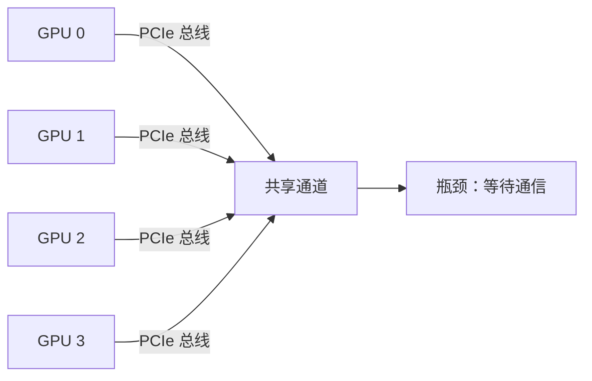

# 拆解 NVLink：多张 GPU 是怎么组成一台 AI 超算的？

<iframe src="https://player.bilibili.com/player.html?aid=117377446449218&bvid=BV11yHi6eE4V&cid=42432598002&page=1&autoplay=0" scrolling="no" border="0" frameborder="no" framespacing="0" allow="fullscreen; picture-in-picture" allowfullscreen="true" style="height:100%;width:100%; aspect-ratio: 16 / 9;"> </iframe>

## 一句话总结

> [!tip] 核心结论
> 单卡训不动大模型：显存墙、算力墙、时间墙决定了必须多卡。多卡互联是 AI 超算的==第一性原理==。
>
> NVLink 干三件事：**卡对卡直连绕开 PCIe 和 CPU**、**配合 NVSwitch 八卡全互联**、**一路扩展到机架 72 张卡合成一台 Giant GPU**。
>
> 记住两个数字：H100 的 **900GB/s**、B200 的 **1.8TB/s**。

## 为什么不能只靠一张显卡？

> [!question] 单卡的三面墙
> 以 GPT-3 级模型为例：**1750 亿参数**，光存权重就要 **350GB**。
>
> - **显存墙**：单卡显存根本装不下。
> - **算力墙**：就算装得下，训练要的算力单卡也不够。
> - **时间墙**：单卡要算上几年。
>
> 所以大模型时代的第一课：==必须多卡==。

## 多卡之间要疯狂交换数据

> [!warning] 最朴素的想法：走 PCIe
> PCIe 5.0 × 16 通道大约 **128GB/s**，看着不小。
>
> 但八张卡瓜分总线，再叠加拷贝，等待通信立刻成为瓶颈。训练的大把时间耗在等数据上。

## NVLink：卡对卡直连专线

> [!success] NVIDIA 的答案
> NVLink 卡对卡直连，**不走 CPU，不走 PCIe**。
>
> 两张卡点对点直通。H100 上一条 NVLink 就是 **900GB/s**，是 PCIe 的 **7 倍**。
>
> 数据交换从乡间小路换成了八车道高速。

### 带宽对比

| 互联方式 | 带宽 | 相对 PCIe |
|---|---|---|
| PCIe 5.0 × 16 通道 | 128GB/s | 1× |
| NVLink 4 代（H100） | 900GB/s | 约 7× |
| NVLink 5 代（B200） | 1800GB/s（1.8TB/s） | 约 14× |

> [!quote] 这就是专线和公用路的差距。

## NVSwitch：让八卡全互联

> [!note] 光有线还不够，还得会交换
> NVSwitch 是交换芯片。八张卡两两直连，任意两卡都跑满 900GB/s。
>
> - 数据不用绕路。
> - 不用排队。
> - 更不用经过 CPU。
>
> ==八张卡，亲密得像一张卡。==

## NVLink 带宽进化史

> [!example] 从 P100 到 B200，带宽翻了 11 倍

| 代际 | GPU | 带宽 |
|---|---|---|
| 第 1 代 | P100 | 160GB/s |
| 第 2 代 | V100 | 300GB/s |
| 第 3 代 | A100 | 600GB/s |
| 第 4 代 | H100 | 900GB/s |
| 第 5 代 | B200 | 1800GB/s（1.8TB/s） |

## 机架级：GB200 NVL72

> [!important] 一台巨型 GPU
> 一个机架 **72 张 Blackwell GPU**，NVLink 全互联。
>
> 对上层的模型来说，这就是**一台巨型 GPU**、机架级计算机。
>
> 这是 AI 超算的当前形态。

## 软件层：NCCL 自动选最快路径

> [!tip] 训练框架下面的 NCCL 通信库
> 自动选最快的路：
> - 同机架走 NVLink。
> - 跨机架走网络。
> - 梯度同步的 AllReduce 全程优化。
>
> ==通信快不快，直接决定训练快不快。==

## 多卡怎么分工：三种并行

> [!note] 三种并行对互联的需求不同

| 并行方式 | 做法 | 互联需求 |
|---|---|---|
| **数据并行** | 每卡一份模型，只同步梯度 | 走 NVLink |
| **张量并行** | 一层切开算，卡间聊得最凶 | 最吃带宽 |
| **流水线并行** | 像接力赛 | 卡间通信少 |

> [!quote] 并行方式决定互联需求。

## 消费级现实：RTX 50 系没有 NVLink

> [!danger] 给消费级用户泼盆冷水
> - RTX 50 系**没有 NVLink**。
> - RTX 3090 是最后一代支持 NVLink 的消费卡。
> - 两张 5090 组多卡只能走 PCIe 跑。
>
> 推理跑小实验没问题，大训练就别想了。

## 怎么选平台？

> [!todo] 按模型规模选
> - **单卡推理**：一张 5090 就够。
> - **多卡微调**：先看卡间带宽大不大。
> - **模型训练**：直接上 HGX 或机架，NVLink 是标配。
>
> 规模不同，玩法完全不同。

## 术语捋清楚

> [!abstract] 四个词，四个层级
> - **NVLink**：卡对卡的线。
> - **NVSwitch**：卡间的交换芯片。
> - **NVLink Switch**：跨机架的交换机。
> - **NVL72**：用这些拼出的 72 卡整机。

## 常见误区澄清

> [!warning] NVLink 不是显存合并
> - 它提速的是**卡与卡之间的通道**。
> - 每张卡的显存还是各自独立。
>
> ==带宽不等于容量，通道不等于池子。==

## 总结

> [!success] 总结
> - 单卡有墙。
> - PCIe 太慢。
> - NVLink 给出专线。
> - NVSwitch 全互联。
> - NVL72 计价成超算。
> - NCCL 让软件自动吃满。
>
> 记住：**H100 的 900** 和 **B200 的 1800**。

> [!info] 下集预告
> 下一集聊 **CUDA**——NVIDIA 真正的护城河。%% 字幕原文为 KD，按上下文疑似 CUDA %%

## 关键金句

> [!quote] 摘录
> - 多卡互联是 AI 超算的第一性原理。
> - 数据交换从乡间小路换成了八车道高速。
> - 八张卡，亲密得像一张卡。
> - 通信快不快，直接决定训练快不快。
> - 并行方式决定互联需求。
> - 带宽不等于容量，通道不等于池子。

## 关键时间戳

| 时间 | 内容 |
|---|---|
| `00:02` | 单卡为什么训不动大模型 |
| `00:20` | 结论：NVLink 干三件事 |
| `00:45` | 单卡的三面墙 |
| `01:07` | 多卡要疯狂交换数据 |
| `01:11` | 天真方案：走 PCIe |
| `01:29` | NVIDIA 的答案：NVLink |
| `01:50` | 带宽直观对比 |
| `02:09` | NVSwitch 交换芯片 |
| `02:27` | 带宽进化史 |
| `02:44` | 机架级：GB200 NVL72 |
| `03:04` | 软件层：NCCL |
| `03:22` | 三种并行 |
| `03:43` | 消费级现实：RTX 50 系无 NVLink |
| `04:02` | 怎么选平台 |
| `04:21` | 术语四个层级 |
| `04:38` | 澄清误区：NVLink 不是显存合并 |
| `04:55` | 总结 |
