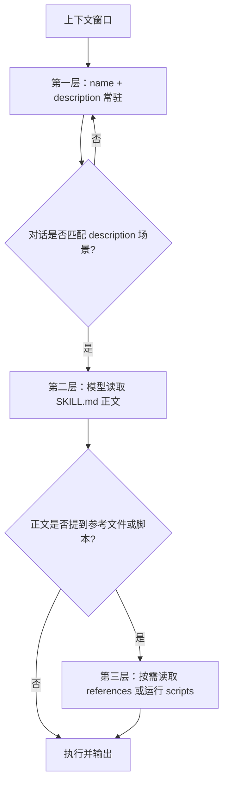

<iframe src="https://player.bilibili.com/player.html?aid=117351525781137&bvid=BV1tMaJ6HECE&cid=42291365985&page=1&autoplay=0" scrolling="no" border="0" frameborder="no" framespacing="0" allow="fullscreen; picture-in-picture" allowfullscreen="true" style="height:100%;width:100%; aspect-ratio: 16 / 9;"> </iframe>

## 一句话总结

> [!tip] 核心结论
> Skill 就是一套 **SOP / 岗位手册**。它把你会反复交代的流程固化成文件夹 + `SKILL.md`，通过 `name` 和 `description` 被模型按需发现，再用 ==渐进式披露== 控制上下文开销。
>
> 写 Skill 的一半功夫，花在 `description` 这一两行路由条件上。

## 视频背景

> [!question] 起因
> 有粉丝私信问：能不能出一期 Skill 制作原理？还说“感觉你很高质量啊，就是不火”。
>
> 作者接题的原因：这个频道从选题、写稿、配音到合成渲染，整条流水线就是 **七个 Skill** 在跑。这期视频从选题卡到稿子，就是 Skill 一个萝卜一个坑接力做出来的。

## 演示：做一个 Radar Reader Skill

> [!example] 假设场景
> 你有一个 `CodeSpaces` 文件夹，里面全是从 GitHub 克隆下来的工程。做一个 Skill 管它，叫 **Radar Reader**（雷达）。

它能干四件事：

1. **同步代码**：一条命令把这些工程全部拉到最新。
2. **分析更新**：谁有新提交、更新日志说了什么、对应代码改了哪几行。
3. **理解工程**：每个工程给你一篇笔记：它是干嘛的、架构上有什么值得抄的，攒成自己的代码知识库。
4. **按需检索**：你说一个功能需求，它去 GitHub 上帮你找现成的开源项目。

### 文件夹结构

```text
radar-reader/
└── SKILL.md
```

### SKILL.md 示例

````markdown
---
name: radar-reader
description: 同步 CodeSpaces 目录下 clone 工程，分析更新日志和对应代码，理解工程说明，按需求检索开源项目
---

对每个工程执行 git pull；同步 fork 来的仓库用 gh repo sync。

对有新提交的工程读 README 和变更日志，用 git show 看关键改动的代码 diff。

每个工程输出一篇笔记，存进知识库目录。

用户提功能需求时，用 gh search repos 检索现成项目，按星数和活跃度给出前五名。
````

### 安装位置

> [!note] 放到哪里生效？
> - 项目内生效：放进项目的 `.claude/skills/` 目录。  
>   %% 字幕原文为 cloud skills，按上下文疑似 Claude Code / Agent Skills 目录 %%
> - 全局生效：放进家目录的 `.claude/skills/`。
> - 不用重启，不用装任何插件。

### 触发演示

新开会话，什么都不交代，只说一句：

> 帮我把 CodeSpaces 里的工程都同步一遍，看看 JMLang 最近更新了什么，对应改了哪些代码，再帮我检索一下网页里渲染 Markdown 有哪些现成的开源项目可以用。

模型的表现：

- 自己去翻这本手册。
- 三个工程挨个 `git pull`，全是 `already up to date`。
- 但它不糊弄，接着翻工作区，发现 `retry` 项目藏着 37 项没提交的改动，正在写试卷扫描模块。
- 分析 JMLang 上个月十次提交，拆成三条线，讲清语言服务、前端收官等，每条线给出对应 diff。
- 检索 Markdown 渲染，列出五个项目：
  - `marked`：37000 星，零依赖。
  - `markdown-it`：22000 星，带插件生态。
  - `DOMPurify`：负责消毒。
  - 还提醒：Marked 官方声明不消毒输出，要配着用。
- 全程没装插件、没改配置，就是一个文件夹放进了它找得到的地方。

## Skill 到底是什么？

> [!abstract] 定义
> Skill 就是一套 SOP。落到磁盘上，它就是一个文件夹。

文件夹里必须有的是：

- `SKILL.md`
  - 开头几行元数据，最关键两个字段：`name`、`description`。
  - 底下正文是写给 AI 看的操作手册。

除了 `SKILL.md`，还可以放三样东西：

| 目录 | 用途 |
|---|---|
| `scripts/` | 放能直接跑的脚本 |
| `references/` | 放参考文档 |
| `assets/` | 放模板和素材 |

> [!quote] 岗位手册比喻
> 你可以把它理解成一份岗位手册。新招一个员工，不用重新教他认字，他本来就会。你只告诉他：咱们这的规矩是什么，遇到什么事翻哪一页。
>
> 模型的智力一点没变，变的是他手里多了一本你写的手册。

> [!info] 官方时间线
> - 2025-10-16 发布。
> - 2025-12-18 做成开放标准规范。
> - 全文挂在 `agent skills 点 IO` 上，谁都可以照着实现。

## 最值钱的设计：渐进式披露

> [!important] 前提
> 上下文是稀缺资源。如果给 AI 配 100 本手册，每次开口前都让他全读一遍，上下文窗口早就爆了。
>
> 整套设计，全是围着“上下文是稀缺资源”这句话转的。

官方解法叫 **渐进式披露**，分三层：



1. **第一层**：平时只有 `name` 和 `description` 两行待在上下文里。一本手册大概占 100 token，就算 100 本也才 1 万。
2. **第二层**：等对话碰到 `description` 描述的场景，模型自己去把手册正文读进来。官方建议正文控制在 500 行以内。
3. **第三层**：正文里要是写了去翻某个参考文件、跑某个脚本，那就到时候再读再跑，平时根本不碰。

> [!tip] 本质
> 100 token 起步，按需加载，用到才读。
>
> 所以它是岗位手册，而不是培训课。培训课得全员全程坐在教室里；手册是放在书架上的，遇到事才抽出来。
>
> 做工程的一眼就认出来了：==这不就是懒加载吗？== 对，就是这个朴素的工程思想，只不过这回缓存的是知识。

## description 是路由条件

> [!warning] 最反直觉的一点
> 写 Skill 的一半功夫，其实花在写那一两行 `description` 上。

为什么？

- 模型判断要不要翻这本手册，唯一依据就是 `name + description`。
- 正文写得再漂亮，`description` 没写对，这本手册就永远躺在书架上，没人抽。

所以，`description` 本质上是一个 **路由条件**。你得替模型回答两个问题：

1. 这手册管什么事？
2. 什么时候该翻它？

> [!example] 真实例子：Alice Compose
> 频道里管合成的 Skill 叫 `Alice Compose`，它的 description 是：
>
> 合成渲染做视频素材，b-roll、BGM、混音、改台标、改场景，lint、jack、终端回放使用。
>
> 写法特点：
> - 前面全是对话里真会出现的原词：做视频、混音、改场景。
> - 最后收口：什么时候用。
>
> 作者摸出来的公式：**先对用户嘴里会说的原词，再补一句什么时候用。**
>
> 反例：写得太文学，比如“赋能创作全流程模型”，一辈子都匹配不上。
>
> 这跟写代码起变量名是一个道理：你是写给下一个读它的人看的，只不过这回的读者是模型。

## 与 MCP、提示词的区别

> [!note] 一句话分工
> **MCP 管通道，Skill 管做法，提示词管一次。**

| 概念 | 解决什么 | 特点 |
|---|---|---|
| MCP | 让 AI 连得上你的数据库、内部系统 | 解决“够得着” |
| Skill | 同样的工具，老手怎么使、步骤是什么、坑在哪 | 解决“会干” |
| 提示词 | 写在对话里 | 这次管用，下次还得重说 |
| Skill | 把反复说的提示词存成文件 | 自带触发条件 |

这三个东西不打架，是一条流水线上的三层。

## 安全提醒

> [!danger] 恶意 Skill
> Skill 既然是手册，就有坏人写手册的可能。一份恶意 Skill 本质上就是一份恶意提示词。
>
> 所以来源不明的 Skill，别往自己环境里放。这跟别乱装浏览器插件是同一个道理。

## 作者自己的流水线：七个 Skill 接力

> [!example] Project ALICE
> 频道从第一期做到编号 21，背后是七个 Skill 在接力。说穿了就是七套固化下来的 SOP。

| Skill | 职责 |
|---|---|
| `Alice Topic` | 选题和事实核查 |
| `Alice Script` | 写稿 |
| `Alice Script` | 管库 %% 字幕此处重复，疑似另一个 Skill，保留原文 %% |
| `Alice Compose` | 合成渲染 |
| `Alice Cover` | 封面 |
| `Alice Publish` | 发布和数据回流 |
| `Alice Produce` | 主控，判断任务该路由给哪个 Skill |

> [!info] ALICE 代号
> 这些名字前面都挂着 `ALICE` 前缀，是项目内部代号 **Project ALICE**，取自《生化危机》电影里的女主角爱丽丝。
>
> 今天这期视频，从选题卡到稿子，就是这条链跑下来的。作者总共就说了一句：粉丝点了道题。

> [!quote] 为什么要费这个劲？
> 因为日更最累的不是创作，是每个环节都要重新交代一遍的那些规矩：
>
> - 字号多大？
> - 字幕留多少？
> - 哪个字体能用？
> - BGM 从哪个白名单里挑？
>
> 这些规矩以前在作者脑子里，现在在七个文件夹里。谁接手都不会走样。
>
> 这套流水线的底座就是 Claude Code 这一系工具。利益相关：作者自己就是用户。

## 动手清单

> [!success] 想动手，清单很短
> 1. 官方那篇工程博客，把设计动机讲透了。
> 2. `agent skills 点 IO` 上有完整规范和 SDK。
> 3. 嫌手写麻烦，就叫 `skill creator` 带你做。
> 4. 最容易踩的坑：`description` 写得太文学，模型匹配不上，手册就永远在书架上吃灰。

## 关键金句

> [!quote] 摘录
> - Skill 就是一套 SOP。
> - 模型的智力一点没变，变的是他手里多了一本你写的手册。
> - 上下文是稀缺资源，这套设计全是围着这句话转的。
> - 这不就是懒加载吗？对，就是这个朴素的工程思想，只不过这回缓存的是知识。
> - `description` 本质上是一个路由条件。
> - MCP 管通道，Skill 管做法，提示词管一次。
> - 一份恶意 Skill 本质上就是一份恶意提示词。
