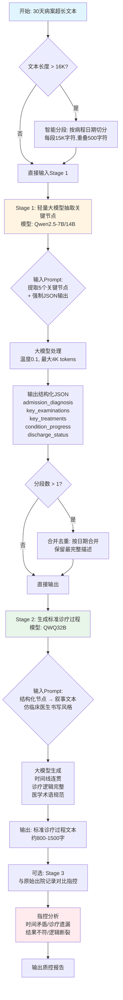

这是一个典型的**长文本处理场景**。针对你的需求，我提供几种专业解决方案，按实施难度和效果排序：
2026-02-24
2026-02-24 15:49
2026-02-24 17:25
> [!quote] I can't change the direction of the wind, but I can adjust my sails to always reach my destination.
> — Jimmy Dean

## 方案一：RAG检索增强生成（推荐）

**核心思路**：不输入全部病案，只输入AI需要的相关片段

```
实施步骤：
1. 将病案按天/按病程分段，建立向量索引
2. 指控时，用出院记录的"诊疗过程"作为查询
3. 检索最相关的3-5个病程片段（控制在8K-16K）
4. 输入QWQ32B进行指控分析
```

**优势**：精准、成本低、可解释性强  
**劣势**：需要搭建向量库（可用Milvus/Chroma）

---

## 方案二：滑动窗口 + 摘要级联

**核心思路**：分段处理，逐层浓缩信息

```
第一层：将30天病案分成6个窗口（每窗口5天，约5K tokens）
        ↓ 每个窗口用轻量模型（如Qwen2.5-7B）提取关键事件
第二层：得到6段摘要（约3K tokens）+ 出院记录
        ↓ 输入QWQ32B做最终指控
```

**关键提示词设计**：
```
"请基于以下病程摘要，检查出院记录'诊疗过程'部分是否存在：
1. 时间线矛盾 2. 诊疗措施遗漏 3. 结果描述不符"
```

---

## 方案三：关键信息结构化提取（最轻量）

**针对出院记录指控的特殊优化**：

出院记录的"诊疗过程"通常只需验证几个**关键节点**：
- 入院诊断 → 入院后主要检查 → 关键治疗决策 → 病情转归 → 出院情况

```
实施方式：
1. 用规则/小模型从30天病案中抽取上述5个节点的原文
2. 结构化对比出院记录 vs 原始病程记录
3. 仅将矛盾点附近的原文（<8K）输入QWQ32B做深度分析
```


抽取关键信息提示词示例：

![[file-20260224165122205.png]]
---

## 方案对比

| 方案    | 改造成本    | 准确率   | 适用阶段       |
| ----- | ------- | ----- | ---------- |
| RAG方案 | 高（需向量库） | ⭐⭐⭐⭐⭐ | 长期系统建设     |
| 滑动窗口  | 中       | ⭐⭐⭐⭐  | 已有基础模型资源   |
| 结构化提取 | 低       | ⭐⭐⭐⭐  | 快速上线/POC验证 |

---

| 方法类别          | 经典文章                                                                                              | 核心方法简述                                               | 适用场景                        | 关键创新点                                             |
| ------------- | ------------------------------------------------------------------------------------------------- | ---------------------------------------------------- | --------------------------- | ------------------------------------------------- |
| **RAG检索增强**   | Lewis et al. (2020) "Retrieval-Augmented Generation for Knowledge-Intensive NLP Tasks" (NeurIPS)  | 将输入查询编码后，从外部知识库检索相关文档片段，再与查询拼接输入生成模型                 | 知识密集型任务、需要外部知识验证的病案指控       | 结合参数化知识（模型记忆）和非参数化知识（检索文本），提高事实准确性和可解释性           |
| **滑动窗口注意力**   | Beltagy et al. (2020) "Longformer: The Long-Document Transformer"                                 | 用局部滑动窗口注意力替代全局自注意力，每个token只关注固定窗口内的邻居，配合全局注意力捕获长距离依赖 | 超长临床文档（4096 tokens）、出院记录分析  | 将注意力复杂度从O(n²)降至O(n×w)，支持长达4096 tokens的临床笔记处理      |
| **稀疏注意力机制**   | Zaheer et al. (2020) "BigBird: Transformers for Longer Sequences"                                 | 结合随机注意力、窗口注意力和全局注意力三种稀疏模式，近似全注意力效果                   | 极长文档（长达4096+ tokens）、病案全文理解 | 理论上证明稀疏注意力可近似全注意力，在多项长文档任务上达到SOTA                 |
| **分层级联摘要**    | Pappagari et al. (2019) "Hierarchical Transformers for Long Document Classification"              | 第一层将长文档分块编码，第二层聚合块表示进行分类/生成，形成层次化表示                  | 超长文档分类、病案质控、多文档汇总           | 通过层次结构解决长距离依赖问题，避免信息丢失                            |
| **领域适配长模型**   | Li et al. (2022) "Clinical-Longformer and Clinical-BigBird"                                       | 在MIMIC-III临床笔记上继续预训练Longformer/BigBird，适配医疗领域术语和结构   | 临床NLP任务（NER、QA、文档分类）、病案指控   | 在2M MIMIC-III笔记上预训练，处理长达4096 tokens的临床文本，显著优于通用模型 |
| **递归分层摘要**    | Hsu et al. (2024) "Leveraging Hierarchical Organization for Medical Multi-document Summarization" | 先按医疗层级（如科室、病程阶段）组织文档，递归生成中间摘要再合并为最终摘要                | 多病程记录汇总、跨科室病案整合             | 利用医疗数据的天然层次结构，提高摘要的连贯性和可理解性                       |
| **分块编码+聚合**   | ChuLo (2024) "Chunk-Level Key Information Representation"                                         | 将长文档切分为块，提取每块关键信息表示，再通过注意力机制聚合为文档级表示                 | 长文档理解、关键信息提取                | 块级关键信息表示避免冗余，支持整文档处理而非截断                          |
| **规则+AI混合质控** | 中文文献 (2023) "基于人工智能的病历质控系统应用"                                                                     | 构建质控规则库+后结构化引擎+AI质控引擎，实现自动化规则匹配与智能判定                 | 中文电子病历质控、书写规范检查             | 结合权威标准规则库与AI，解决人工质控效率低、标准不统一问题                    |
