### 数据表格分析
分析这份ICD编码数据，计算各类占比情况。
**表1：入口编码经过另编后**（总计：34,809）

| 类型 | 计数 |
|------|------|
| 否 | 23,751 |
| 另编 | 9,975 |
| 细化+另编 | 639 |
| 细化 | 444 |

**表2：入口编码经过细化后**（总计：8,056）

| 类型 | 计数 |
|------|------|
| 否 | 4,148 |
| 另编 | 2,270 |
| 细化 | 891 |
| 细化+另编 | 747 |

 一、统计入口粗编码进行细化后，细化目标编码还需要细化另编的占比

在**细化路径**中，总计 8,056 例：
- **细化+另编**：747 例
- **需要细化另编的占比** = 747 / 8,056 = **9.27%**
> 即：经过细化后，约 **9.3%** 的病例还需要进一步另编。

二、统计入口粗编码进行另编后，细化目标编码还需要细化另编的占比
在**另编路径**中，总计 34,809 例：
- **细化+另编**：639 例
- **需要细化另编的占比** = 639 / 34,809 = **1.84%**
> 即：经过另编后，仅约 **1.8%** 的病例还需要进一步细化另编。

三、各类情况在细化条件下的占比（基于表2，总计8,056）

| 类型        | 计数        | 占比         |
| --------- | --------- | ---------- |
| 无（否）      | 4,148     | **51.49%** |
| 纯另编（不含细化） | 2,270     | **28.18%** |
| 纯细化（不含另编） | 891       | **11.06%** |
| 细化+另编     | 747       | **9.27%**  |
| **合计**    | **8,056** | **100%**   |

四、各类情况在另编条件下的占比（基于表1，总计34,809）

| 对比维度 | 细化路径 | 另编路径 |
|---------|---------|---------|
| 需要二次处理的比例 | 48.51% | 31.77% |
| 细化+另编占比 | 9.27% | 1.84% |
| 纯另编占比 | 28.18% | 28.66% |
| 纯细化占比 | 11.06% | 1.28% |

**结论**：
1. **细化路径更复杂**：细化后需要二次处理的比例（48.5%）显著高于另编后（31.8%）
2. **细化+另编在细化路径中更常见**：9.27% vs 1.84%，相差约5倍
3. **另编路径相对"干净"**：68%的病例另编后直接结束，无需进一步处理
4. **纯细化病例较少**：无论在哪种路径中，纯细化（不含另编）的比例都较低（11% vs 1.3%）


### 手术编码迭代案例当出现另编/细化时
包含**重复分支**和**新发现分支**，展示真正的迭代价值。
以 `00.6100 颅外血管经皮血管成形术` 为例，这个编码的问题分类更丰富，能产生更复杂的依赖关系：
##### 第一轮迭代：入口 `00.6100`

| 问题分类       | 细编码                         | 处理标记      | 是否新入口      |
| ---------- | --------------------------- | --------- | ---------- |
| 细化         | `00.6100x008` 经皮颈总动脉球囊扩张成形术 | **另编**    | ✅ **新入口A** |
| 细化         | `00.6100x012` 经皮颈静脉球囊扩张成形术  | **另编**    | ✅ **新入口B** |
| 细化         | `00.6101` 经皮颈动脉球囊扩张成形术      | **另编**    | ✅ **新入口C** |
| 细化         | `00.6102` 经皮椎动脉球囊扩张成形术      | **另编**    | ✅ **新入口D** |
| 另编_支架经皮置入  | `00.6300` 颈动脉支架经皮置入术        | **细化+另编** | ✅ **新入口E** |
| 另编_支架经皮置入  | `00.6400x009` 经皮椎动脉支架置入术    | **细化+另编** | ✅ **新入口F** |
| 另编_粥样硬化切除术 | `17.5300` 经皮颅外血管粥样硬化切除术     | **另编**    | ✅ **新入口G** |
| 另编_取栓      | `39.7400x004` 经皮颈动脉取栓术      | **另编**    | ✅ **新入口H** |

第一轮待处理队列：`[00.6100x008, 00.6100x012, 00.6101, 00.6102, 00.6300, 00.6400x009, 17.5300, 39.7400x004]

##### 第二轮迭代：并行处理8个入口

- 分支A：`00.6101 经皮颈动脉球囊扩张成形术`

| 问题分类 | 细编码 | 处理标记 | 是否新入口 |
|---------|--------|---------|-----------|
| 另编_支架经皮置入 | `00.6300` 颈动脉支架经皮置入术 | **细化+另编** | ⚠️ **与第一轮E重复** |
| 另编_支架经皮置入 | `00.6301` 脑保护伞下颈动脉支架置入术 | **另编** | ✅ **新入口I** |
| 另编_粥样硬化切除术 | `17.5300` | **另编** | ⚠️ **与第一轮G重复** |
| 另编_取栓 | `39.7400x004` | **另编** | ⚠️ **与第一轮H重复** |

**结果**：`00.6300`(重复), `00.6301`(新), `17.5300`(重复), `39.7400x004`(重复)

- 分支B：`00.6300 颈动脉支架经皮置入术`（来自第一轮E）

| 问题分类 | 细编码 | 处理标记 | 是否新入口 |
|---------|--------|---------|-----------|
| 另编_血管成形术 | `00.6100x008` | **另编** | ⚠️ **与第一轮A重复** |
| 另编_血管成形术 | `00.6101` | **另编** | ⚠️ **与第一轮C重复** |
| 另编_血管成形术 | `00.6200x009` 经皮颈内动脉颅内段球囊扩张 | **另编** | ✅ **新入口J** |
| 另编_支架经皮置入 | `00.6301` | **另编** | ✅ **与分支A的I重复（本轮内去重）** |

结果：`00.6100x008`(重复), `00.6101`(重复), `00.6200x009`(新), `00.6301`(新但本轮已存在)

- 分支C：`00.6400x009 经皮椎动脉支架置入术`（来自第一轮F）

| 问题分类 | 细编码 | 处理标记 | 是否新入口 |
|---------|--------|---------|-----------|
| 另编_血管成形术 | `00.6102` | **另编** | ⚠️ **与第一轮D重复** |
| 另编_血管成形术 | `00.6200x008` 经皮椎动脉颅内段球囊扩张 | **另编** | ✅ **新入口K** |
| 另编_支架经皮置入 | `00.6400x013` 经皮椎动脉药物洗脱支架置入术 | **另编** | ✅ **新入口L** |
| 另编_粥样硬化切除术 | `17.5301` 经皮颈动脉粥样斑块切除术 | **另编** | ✅ **新入口M** |

结果：`00.6102`(重复), `00.6200x008`(新), `00.6400x013`(新), `17.5301`(新)

- 分支D：`17.5300 经皮颅外血管粥样硬化切除术`（来自第一轮G）

| 问题分类 | 细编码 | 处理标记 | 是否新入口 |
|---------|--------|---------|-----------|
| 另编_血管成形术 | `00.6101` | **另编** | ⚠️ **与第一轮C重复** |
| 另编_支架经皮置入 | `00.6300` | **细化+另编** | ⚠️ **与第一轮E重复** |
结果：全部重复，该分支为**叶子节点**

- 其他分支（`00.6100x008`, `00.6100x012`, `00.6102`, `39.7400x004`）

经查询均为**叶子节点**（无新的"另编/细化"编码产生，或产生的编码已在历史集合中）

#####  第二轮汇总

| 类型 | 编码 | 来源 |
|-----|------|------|
| 🆕 本轮新发现 | `00.6301` | 分支A、B共同发现（去重后1个） |
| 🆕 本轮新发现 | `00.6200x009` | 分支B |
| 🆕 本轮新发现 | `00.6200x008` | 分支C |
| 🆕 本轮新发现 | `00.6400x013` | 分支C |
| 🆕 本轮新发现 | `17.5301` | 分支C |
| ♻️ 历史重复 | `00.6300`, `00.6101`, `17.5300`, `39.7400x004`, `00.6100x008`, `00.6102` | 过滤掉 |

第二轮待处理队列：`[00.6301, 00.6200x009, 00.6200x008, 00.6400x013, 17.5301]`（5个新入口）

##### 第三轮迭代：处理 `00.6200x009 经皮颈内动脉颅内段球囊扩张成形术`

| 问题分类 | 细编码 | 处理标记 | 是否新入口 |
|---------|--------|---------|-----------|
| 另编_支架经皮置入 | `00.6500x008` 经皮颅内动脉支架置入术 | **另编** | ✅ **新入口N** |
| 另编_支架经皮置入 | `00.6500x014` 经皮大脑中动脉支架置入术 | **另编** | ✅ **新入口O** |
| 另编_粥样硬化切除术 | `17.5400` 颅内血管经皮粥样硬化切除术 | **另编** | ✅ **新入口P** |
| 另编_取栓 | `39.7400x002` 经皮颅内动脉取栓术 | **另编** | ✅ **新入口Q** |

关键发现：从**颅外血管**编码跳转到**颅内血管**编码（`00.65xx`系列），进入全新编码空间！

##### 第四轮迭代：处理 `00.6500x014 经皮大脑中动脉支架置入术`

| 问题分类     | 细编码                          | 处理标记   | 是否新入口      |
| -------- | ---------------------------- | ------ | ---------- |
| 另编_血管成形术 | `00.6200x005` 经皮大脑中动脉球囊扩张成形术 | **另编** | ✅ **新入口R** |
| 另编_血管成形术 | `00.6200x006` 经皮大脑前动脉球囊扩张成形术 | **另编** | ✅ **新入口S** |
| 另编_血管成形术 | `00.6200x007` 经皮大脑后动脉球囊扩张成形术 | **另编** | ✅ **新入口T** |

关键发现：继续深入颅内血管分支，但注意 `00.6200x005` 与第三轮的 `00.6200x009` 同属 `00.62xx` 系列（颅内血管成形术），但**不是同一个编码**，需要继续处理。

##### 第五轮迭代：处理 `00.6200x005 经皮大脑中动脉球囊扩张成形术`

| 问题分类 | 细编码 | 处理标记 | 是否新入口 |
|---------|--------|---------|-----------|
| 另编_支架经皮置入 | `00.6500x014` 经皮大脑中动脉支架置入术 | **另编** | ⚠️ **与第四轮入口重复！** |

**发现循环依赖！** `00.6200x005` → `00.6500x014` → `00.6200x005`
这是**双向引用**：
- 球囊扩张成形术 另编 支架置入术
- 支架置入术 另编 球囊扩张成形术

##### 收敛判断与终止
第五轮结束后，检查待处理队列：
- `00.6500x008` → 产生 `00.6200x008`(重复), `00.6200x009`(重复), `17.5400`(新但后续无新发现)
- `17.5400` → 产生 `00.6200x005-00.6200x009` 系列（全部已在历史集合中）
**无新编码产生，迭代终止。**
---

## 完整迭代路径可视化

```
00.6100 颅外血管经皮血管成形术 [入口]
    ├── 细化 → 00.6100x008 颈总动脉球囊扩张 [叶子]
    ├── 细化 → 00.6100x012 颈静脉球囊扩张 [叶子]  
    ├── 细化 → 00.6101 颈动脉球囊扩张 ──┐
    │                                   │
    ├── 细化 → 00.6102 椎动脉球囊扩张 ──┤   │
    │                                   │   │
    ├── 另编_支架 → 00.6300 颈动脉支架 ──┼───┤  ← 双向循环开始
    │       │                           │   │
    │       └── 另编_成形 → 00.6101 ─────┘   │  (重复，终止)
    │           └── 00.6200x009 颈内动脉颅内段 ──┐
    │               └── 另编_支架 → 00.6500x008 ─┤
    │                   └── 00.6500x014 大脑中动脉支架
    │                       └── 另编_成形 → 00.6200x005 ─┐
    │                           └── 00.6200x006, 00.6200x007
    │                           └── 另编_支架 → 00.6500x014 ─┘ (循环!)
    │
    ├── 另编_支架 → 00.6400x009 椎动脉支架 ──┐
    │       └── 另编_成形 → 00.6200x008 ─────┤ (与上面分支汇合)
    │       └── 另编_支架 → 00.6400x013 ─────┘ [叶子]
    │
    ├── 另编_切除 → 17.5300 ───→ 00.6300 (重复)
    │
    └── 另编_取栓 → 39.7400x004 [叶子]
```

手术编码迭代过程的 Mermaid 流程图

```mermaid
flowchart TB
    subgraph Legend["图例说明"]
        direction LR
        L1[🆕 新发现编码]:::new
        L2[♻️ 重复编码]:::dup
        L3[🛑 叶子节点]:::leaf
        L4[⚠️ 循环依赖]:::cycle
    end

    subgraph Round1["第一轮迭代 - 入口: 00.6100 颅外血管经皮血管成形术"]
        direction TB
        R1_A["00.6100x008<br/>经皮颈总动脉球囊扩张"]:::new
        R1_B["00.6100x012<br/>经皮颈静脉球囊扩张"]:::new
        R1_C["00.6101<br/>经皮颈动脉球囊扩张"]:::new
        R1_D["00.6102<br/>经皮椎动脉球囊扩张"]:::new
        R1_E["00.6300<br/>颈动脉支架经皮置入"]:::new
        R1_F["00.6400x009<br/>经皮椎动脉支架置入"]:::new
        R1_G["17.5300<br/>经皮颅外血管粥样硬化切除"]:::new
        R1_H["39.7400x004<br/>经皮颈动脉取栓术"]:::new
        
        Entry1["00.6100"] --> R1_A & R1_B & R1_C & R1_D & R1_E & R1_F & R1_G & R1_H
    end

    subgraph Round2["第二轮迭代 - 并行处理8个入口"]
        direction TB
        
        subgraph BranchA["分支A: 00.6101"]
            A1["00.6300<br/>♻️ 与E重复"]:::dup
            A2["00.6301<br/>脑保护伞下颈动脉支架置入"]:::new
            A3["17.5300<br/>♻️ 与G重复"]:::dup
            A4["39.7400x004<br/>♻️ 与H重复"]:::dup
            R1_C --> A1 & A2 & A3 & A4
        end
        
        subgraph BranchB["分支B: 00.6300"]
            B1["00.6100x008<br/>♻️ 与A重复"]:::dup
            B2["00.6101<br/>♻️ 与C重复"]:::dup
            B3["00.6200x009<br/>经皮颈内动脉颅内段球囊扩张"]:::new
            B4["00.6301<br/>♻️ 与A2重复(本轮内去重)"]:::dup
            R1_E --> B1 & B2 & B3 & B4
        end
        
        subgraph BranchC["分支C: 00.6400x009"]
            C1["00.6102<br/>♻️ 与D重复"]:::dup
            C2["00.6200x008<br/>经皮椎动脉颅内段球囊扩张"]:::new
            C3["00.6400x013<br/>经皮椎动脉药物洗脱支架置入"]:::new
            C4["17.5301<br/>经皮颈动脉粥样斑块切除"]:::new
            R1_F --> C1 & C2 & C3 & C4
        end
        
        subgraph BranchD["分支D: 17.5300"]
            D1["00.6101<br/>♻️ 重复"]:::dup
            D2["00.6300<br/>♻️ 重复"]:::dup
            D_end["🛑 叶子节点"]:::leaf
            R1_G --> D1 & D2 --> D_end
        end
        
        subgraph Others["其他分支(叶子节点)"]
            O1["00.6100x008 🛑"]:::leaf
            O2["00.6100x012 🛑"]:::leaf
            O3["00.6102 🛑"]:::leaf
            O4["39.7400x004 🛑"]:::leaf
            R1_A --> O1
            R1_B --> O2
            R1_D --> O3
            R1_H --> O4
        end
    end

    subgraph Round3["第三轮迭代 - 关键跳跃: 颅外→颅内"]
        direction TB
        R3_Entry["00.6200x009<br/>经皮颈内动脉颅内段球囊扩张"]:::new
        R3_N["00.6500x008<br/>经皮颅内动脉支架置入"]:::new
        R3_O["00.6500x014<br/>经皮大脑中动脉支架置入"]:::new
        R3_P["17.5400<br/>颅内血管经皮粥样硬化切除"]:::new
        R3_Q["39.7400x002<br/>经皮颅内动脉取栓术"]:::new
        
        B3 --> R3_Entry --> R3_N & R3_O & R3_P & R3_Q
        Note3["💡 关键发现: 从00.62xx(颅外)跳转到00.65xx(颅内)<br/>进入全新编码空间!"]:::note
    end

    subgraph Round4["第四轮迭代 - 深入颅内血管分支"]
        direction TB
        R4_Entry["00.6500x014<br/>经皮大脑中动脉支架置入"]:::new
        R4_R["00.6200x005<br/>经皮大脑中动脉球囊扩张"]:::new
        R4_S["00.6200x006<br/>经皮大脑前动脉球囊扩张"]:::new
        R4_T["00.6200x007<br/>经皮大脑后动脉球囊扩张"]:::new
        
        R3_O --> R4_Entry --> R4_R & R4_S & R4_T
        Note4["💡 注意: 00.6200x005与第三轮的00.6200x009<br/>同属00.62xx系列但不同编码"]:::note
    end

    subgraph Round5["第五轮迭代 - 发现循环依赖"]
        direction TB
        R5_Entry["00.6200x005<br/>经皮大脑中动脉球囊扩张"]:::new
        R5_Cycle["00.6500x014<br/>⚠️ 与第四轮入口重复!"]:::cycle
        
        R4_R --> R5_Entry --> R5_Cycle
        CycleNote["🔄 循环依赖检测:<br/>00.6200x005 ↔ 00.6500x014<br/>球囊扩张↔支架置入 双向引用"]:::cycleNote
    end

    subgraph Convergence["收敛判断与终止"]
        direction TB
        Check{"待处理队列检查"}
        NoNew["无新编码产生"]:::leaf
        Terminate["🛑 迭代终止"]:::leaf
        
        R3_N & R3_P --> Check
        Check -->|00.6500x008<br/>产生重复| NoNew
        Check -->|17.5400<br/>无新发现| NoNew
        Check --> Terminate
    end

    %% 连接各轮次
    Round2 -.->|待处理队列:<br/>00.6301, 00.6200x009,<br/>00.6200x008, 00.6400x013,<br/>17.5301| Round3
    Round3 -.-> Round4
    Round4 -.-> Round5
    Round5 -.-> Convergence

    %% 样式定义
    classDef new fill:#d4edda,stroke:#28a745,stroke-width:2px,color:#155724
    classDef dup fill:#fff3cd,stroke:#ffc107,stroke-width:2px,color:#856404
    classDef leaf fill:#f8d7da,stroke:#dc3545,stroke-width:2px,color:#721c24
    classDef cycle fill:#f8d7da,stroke:#dc3545,stroke-width:3px,stroke-dasharray: 5 5,color:#721c24
    classDef note fill:#d1ecf1,stroke:#17a2b8,stroke-width:2px,color:#0c5460
    classDef cycleNote fill:#f8d7da,stroke:#dc3545,stroke-width:2px,color:#721c24
    
    %% 子图样式
    style Round1 fill:#f8f9fa,stroke:#6c757d,stroke-width:2px
    style Round2 fill:#f8f9fa,stroke:#6c757d,stroke-width:2px
    style Round3 fill:#e7f3ff,stroke:#0066cc,stroke-width:2px
    style Round4 fill:#e7f3ff,stroke:#0066cc,stroke-width:2px
    style Round5 fill:#fff5f5,stroke:#cc0000,stroke-width:2px
    style Convergence fill:#f0f0f0,stroke:#333,stroke-width:2px
    style Legend fill:#ffffff,stroke:#333,stroke-width:1px
```



| 场景 | 处理策略 |
|-----|---------|
| **历史重复**（如第2轮的`00.6300`） | 过滤，不入待处理队列 |
| **本轮内重复**（如`00.6301`在分支A、B都出现） | Set去重，只保留一个 |
| **循环依赖**（`00.6200x005 ↔ 00.6500x014`） | 检测历史集合，标记终止 |
| **编码空间跳转**（`00.61xx`→`00.62xx`→`00.65xx`） | 正常入队，继续迭代 |
| **叶子节点**（无新编码产生） | 自然终止该分支 |

# 程序设计#方案A-从**目标编码（细编码）**的角度重新设计去重策略。
核心洞察：**同一个目标编码被多次预测出来时，只需保留第一次的发现路径**。
```plain
关键洞察：
- 00.6100 可能编出 00.6300
- 00.6101 也可能编出 00.6300  
- 00.6300 只需要被"展开"一次
```

 目标编码去重引擎逻辑说明
```
┌─────────────────────────────────────────┐
│           目标编码去重引擎               │
├─────────────────────────────────────────┤
│  全局状态:                              │
│    - targets: Dict[code, TargetNode]   │
│    - running: Dict[code, Future]         │
│    - queue: 待展开队列                   │
├─────────────────────────────────────────┤
│  主循环:                                │
│    1. 从队列取入口编码E                  │
│    2. 若E已COMPLETED或在RUNNING → 跳过   │
│    3. 调用大模型(E + 手术记录)            │
│    4. 遍历返回的每个目标编码T:            │
│       - T已存在? → 只记录血缘，不处理     │
│       - T全新? → 根据标记决定:            │
│         * 另编/细化/细化+另编 → PENDING  │
│         * 否 → LEAF                      │
│    5. 标记E为COMPLETED                   │
│    6. 队列空则结束，否则继续              │
└─────────────────────────────────────────┘
```


```python
async def handle_target(self, target_code: str, mark: str, 
                       parent: str, depth: int) -> bool:
    """
    处理新发现的目标编码
    返回: 是否加入待处理队列
    """
    # 情况1: 已存在（无论COMPLETED还是RUNNING）
    if target_code in self.targets:
        print(f"  ↪️ {target_code} 已存在，仅记录血缘")
        return False  # 不重复展开
    
    # 情况2: 全新目标
    is_expandable = mark in ["另编", "细化", "细化+另编"]
    
    node = TargetNode(
        code=target_code,
        depth=depth,
        discovered_by=parent,
        status=TargetStatus.PENDING if is_expandable else TargetStatus.LEAF
    )
    self.targets[target_code] = node
    
    if is_expandable:
        await self.queue.put(target_code)
        return True  # 需要展开
    else:
        return False  # 叶子节点，不展开
```
```
初始: 队列=[00.6100]

第1轮: 展开 00.6100
  发现目标: 00.6100x008(另编), 00.6101(另编), 00.6102(另编), 
            00.6300(细化+另编), 00.6400x009(细化+另编), 
            17.5300(另编), 39.7400x004(另编)
  
  状态更新:
    00.6100x008 → PENDING, 加入队列
    00.6101 → PENDING, 加入队列
    00.6102 → PENDING, 加入队列
    00.6300 → PENDING, 加入队列 ⭐关键目标
    00.6400x009 → PENDING, 加入队列
    17.5300 → PENDING, 加入队列
    39.7400x004 → PENDING, 加入队列
  
  队列=[00.6100x008, 00.6101, 00.6102, 00.6300, 00.6400x009, 17.5300, 39.7400x004]

第2轮: 并行展开 00.6101, 00.6300, 00.6400x009...
  
  展开 00.6101:
    发现: 00.6300(细化+另编) ⭐重复发现！
    处理: 00.6300 已在 TARGETS 中，跳过，只记录血缘
    
    发现: 00.6301(另编) 🆕新目标 → PENDING
    发现: 17.5300(另编) ⭐重复，跳过
  
  展开 00.6300: ⭐首次展开
    发现: 00.6101(另编) ⭐反向发现！00.6101已在RUNNING，跳过
    发现: 00.6200x009(另编) 🆕新目标 → PENDING ⭐颅内跳转
    发现: 00.6301(另编) 🆕新目标（与00.6101的发现重复，去重后只一个）
  
  展开 00.6400x009:
    发现: 00.6102(另编) ⭐重复，跳过
    发现: 00.6200x008(另编) 🆕新目标 → PENDING
    发现: 00.6400x013(另编) 🆕新目标 → PENDING
  
  队列=[00.6100x008, 00.6102, 17.5300, 39.7400x004, 00.6301, 00.6200x009, 00.6200x008, 00.6400x013]

第3轮: 展开 00.6200x009（颅内跳转关键节点）
  发现: 00.6500x008(另编), 00.6500x014(另编), 17.5400(另编), 39.7400x002(另编)
  全部 🆕新目标 → PENDING

第4轮: 展开 00.6500x014
  发现: 00.6200x005(另编), 00.6200x006(另编), 00.6200x007(另编)
  全部 🆕新目标 → PENDING

第5轮: 展开 00.6200x005
  发现: 00.6500x014(另编) ⭐循环检测！已在COMPLETED，跳过
  
  无新目标，队列逐渐清空...

第6轮: 队列空，结束

统计:
  总目标编码: 18个
  实际展开调用: 12次（00.6100, 00.6101, 00.6300, 00.6400x009, 00.6200x009, 
                     00.6500x014, 00.6200x005, 00.6200x006, 00.6200x007, 
                     00.6500x008, 17.5400, 39.7400x002）
  去重节省: 6次（00.6101↔00.6300互发现, 00.6102重复, 00.6301重复, 00.6500x014循环等）
```

| 维度        | 入口编码去重 | 目标编码去重（本方案）    |
| --------- | ------ | -------------- |
| **去重粒度**  | 入口编码   | 目标编码（更细）       |
| **循环处理**  | 检测入口循环 | 自然收敛（目标已存在即跳过） |
| **血缘记录**  | 单一路径   | 多路径发现，保留最短路径   |
| **并行效率**  | 一般     | 更高（相同目标自动合并等待） |
| **实现复杂度** | 中等     | 稍高（需管理目标状态机）   |
| **适用场景**  | 入口重复多  | 目标重复多（本业务更优）   |

## 程序设计方案B-缓存方案去重策略。

```
缓存key: (手术记录hash, 问题分类名称)
value: 该问题分类下所有目标编码的大模型输出

核心洞察：
- "Classify.另编_支架" 这个分类，无论入口是00.6100还是00.6101，
  大模型都是判断"要不要编支架"，逻辑相同

```

```
手术记录hash
━━━━━━━━━━━━━━━━━━━━━━━━━━━━━━━━━━━━━━━━
第1轮: 处理 00.6100
━━━━━━━━━━━━━━━━━━━━━━━━━━━━━━━━━━━━━━━━
查Excel得问题分类:
- PC1: Classify.细化
- PC2: Classify.另编_支架  
- PC3: Classify.另编_切除

处理 PC1: Classify.细化
  查缓存 (abc123, "Classify.细化")?  miss
  → 调大模型(00.6100, "Classify.细化")
  ← 返回: [00.6100x008, 00.6101, 00.6102, 00.6300, 00.6400x009]
  存缓存: (abc123, "Classify.细化") -> result
  新入口: 全部加入队列

处理 PC2: Classify.另编_支架
  查缓存 (abc123, "Classify.另编_支架")?  miss
  → 调大模型(00.6100, "Classify.另编_支架")
  ← 返回: [00.6300, 00.6301, 00.6400x009, 00.6401]
  存缓存: (abc123, "Classify.另编_支架") -> result
  新入口: 00.6301, 00.6401 (00.6300等已在队列)

处理 PC3: Classify.另编_切除
  查缓存 (abc123, "Classify.另编_切除")?  miss
  → 调大模型...
  存缓存...

队列: [00.6100x008, 00.6101, 00.6102, 00.6300, 00.6400x009, 00.6301, 00.6401, ...]

━━━━━━━━━━━━━━━━━━━━━━━━━━━━━━━━━━━━━━━━
第2轮: 处理 00.6101
━━━━━━━━━━━━━━━━━━━━━━━━━━━━━━━━━━━━━━━━
查Excel得问题分类:
- PC1: Classify.另编_支架   ⭐注意：和00.6100的PC2同名！
- PC2: Classify.另编_切除
- PC3: Classify.另编_取栓

处理 PC1: Classify.另编_支架
  查缓存 (abc123, "Classify.另编_支架")?  HIT! 💾
  → 直接取缓存结果
  ← 缓存结果: [00.6300, 00.6301, 00.6400x009, 00.6401]
  
  ⚠️ 注意：虽然入口是00.6101，但问题分类相同，
     直接用00.6100时的缓存结果！
     
  新入口: 00.6300, 00.6301, 00.6400x009, 00.6401
  （过滤后只有全新编码加入队列）

处理 PC2: Classify.另编_切除
  查缓存 (abc123, "Classify.另编_切除")?  HIT! 💾
  → 直接取缓存

处理 PC3: Classify.另编_取栓
  查缓存 (abc123, "Classify.另编_取栓")?  miss
  → 调大模型...

━━━━━━━━━━━━━━━━━━━━━━━━━━━━━━━━━━━━━━━━
关键优化效果
━━━━━━━━━━━━━━━━━━━━━━━━━━━━━━━━━━━━━━━━
第1轮大模型调用: 3次（3个新问题分类）
第2轮大模型调用: 1次（只有1个新问题分类）
第3轮及以后: 可能0次（全部缓存命中）

总调用次数 = 不同问题分类的数量（而非入口编码数量）
```


| 维度        | 方案A：目标编码去重         | 方案B：问题分类缓存         |
| :-------- | :----------------- | :----------------- |
| **缓存Key** | `(手术记录hash, 目标编码)` | `(手术记录hash, 问题分类)` |
| **去重粒度**  | 细编码级别              | 问题分类级别             |
| **核心洞察**  | 同一个目标只展开一次         | 同一个问题分类只调一次大模型     |
| **何时拦截**  | 目标被发现时             | 请求发送前              |
| **血缘记录**  | 完整（谁发现我）           | 简化（通过哪个PC）         |
