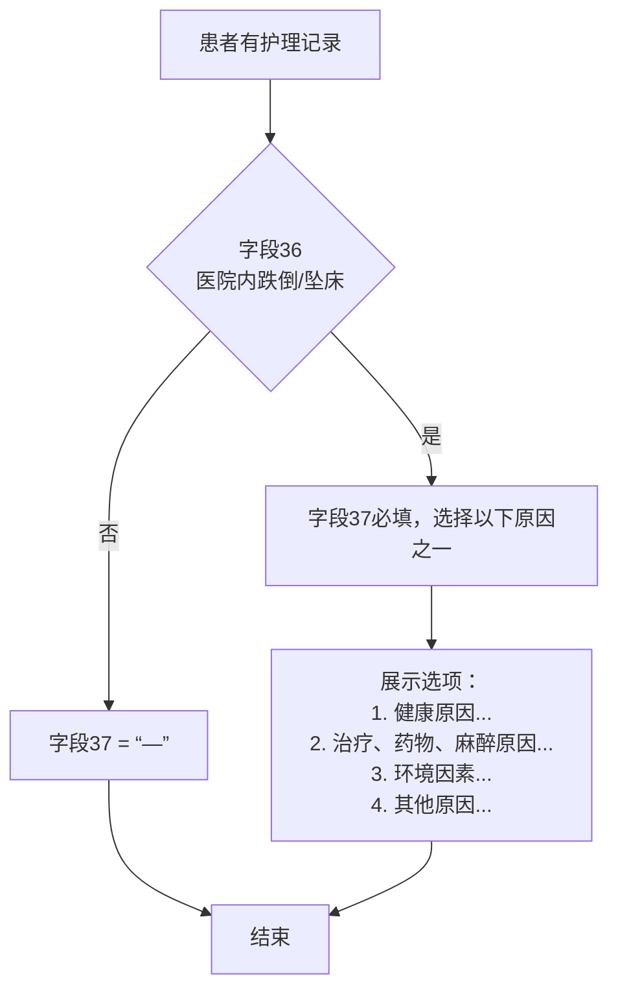
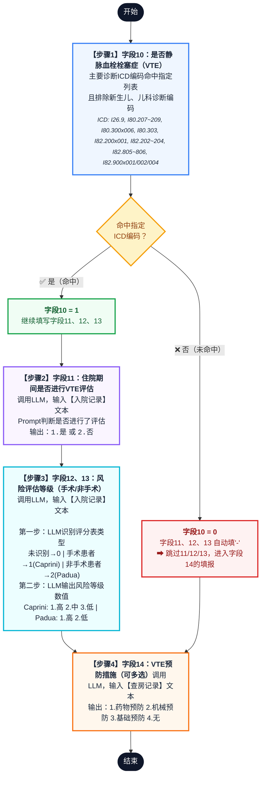
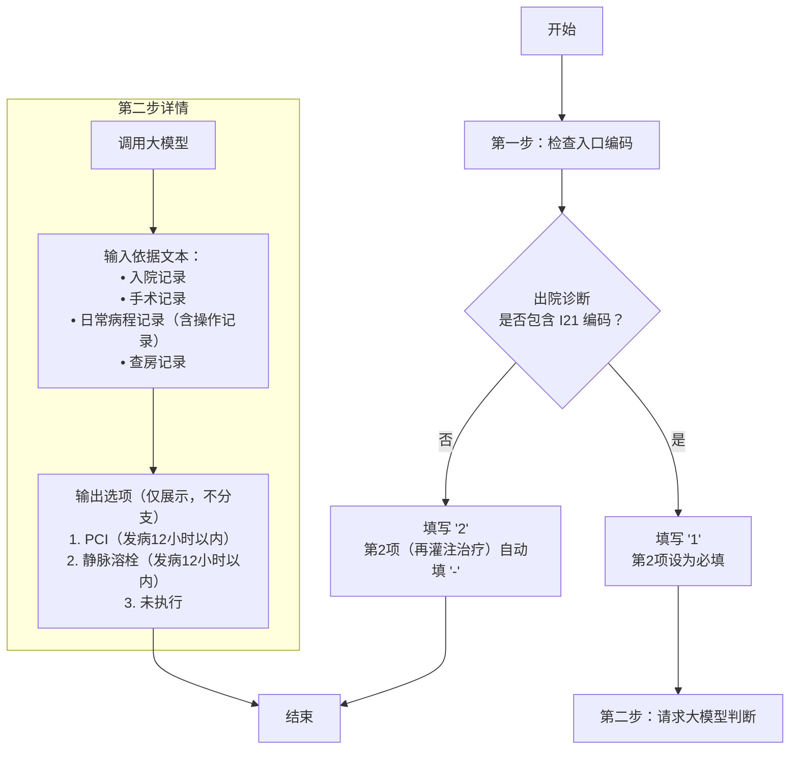
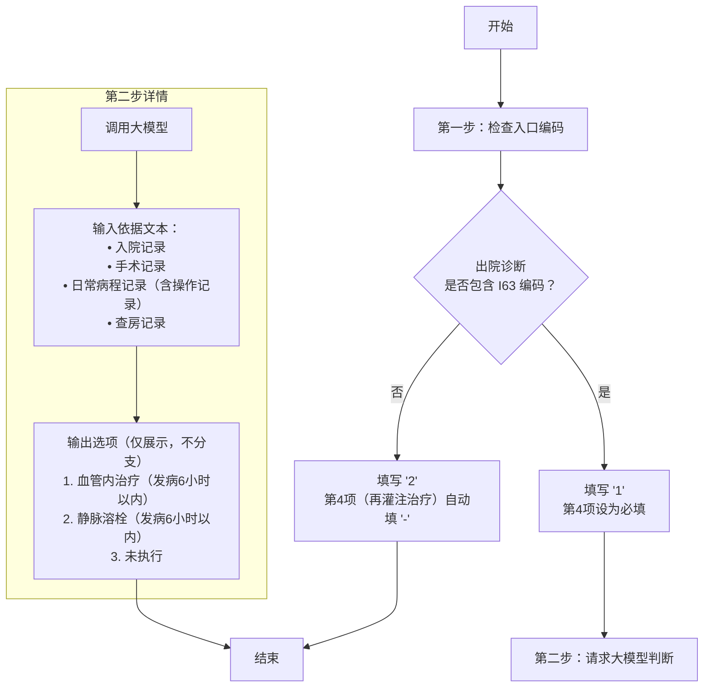

**需求文档：**
[V3366病案首页生成字段](V3366病案首页生成字段.xlsx)

**补充资料：**
![[6.9附件5：湖北省住院病案首页、附页及填写规范技术指南21.pdf]]


### 字段填充统一接口设计：

1. 大模型返回answer是字符串时，遇到特殊字段和长文本 稳定性不足， 可能需要代码修复
2. 以后的住院附页字段填写 希望只改提示词表格，不定制medclient服务的带了， 那么1问题里的修复代码就不希望做  
    解决方案， 返回 code， 用code去对应结果，这样大模型返回比较稳定

```
    "result": [
       {
	  "reasoning": "抗菌药物首次使用时间为1月3日8:00，血培养标本采集时间为1月3日7:30，送检时间在用药之前。",
	  "answer": [{"code": 1, "label": "是"}]
	}
    
    
    ]
```

### 提示词

##### 1）抗菌药物治疗前是否病原学送检

需求序号: 20  
字段： 抗菌药物治疗前是否病原学送检  
流程说明： select prompt_mark_dict WHERE type=24; 存在抗菌药物就触发，大模型查看 手术记录 + 有创操作记录 + 检查报告（是操作记录的）

```
你是一位专业的病案编码员。请判断患者在抗菌药物使用前是否进行了病原学送检。

## 任务
患者使用了抗菌药物，检查手术记录，操作记录，检查报告中是否存在病原学送检的相关描述

## 判断标准
| code | label | 含义 |
|------|------| --- |
| 1 | 是 | 在抗菌药物使用前进行了病原学送检 |
| 0 | 否 | 未在抗菌药物使用前进行病原学送检，或送检在用药之后 |

## 病历文本
### 手术记录
{{ssjl}}
### 操作记录
{{rcbcjl}}
### 检查报告
{{jcbg}}

## 输出格式
严格按JSON输出，reasoning填写判断原因，answer为数组。

完整JSON输出示例：
如果判断为是（code=1），输出：
{
  "reasoning": "抗菌药物首次使用时间为1月3日8:00，血培养标本采集时间为1月3日7:30，送检时间在用药之前。",
  "answer": [{"code": 1, "label": "是"}]
}

如果判断为否（code=0），输出：
{
  "reasoning": "抗菌药物首次使用时间为1月3日8:00，未找到用药前的病原学送检记录。",
  "answer": [{"code": 0, "label": "否"}]
}
```

##### 2）有无输血反应
输血反应 □ 0. 未输 1. 有 2. 无  
红细胞 ______ 血小板 ______ 血浆 ______ 全血 ______ 自体回收 ______ 其他 ______  
HbsAg □ 0. 未做 1. 阳性 2. 阴性  
HCV-Ab □ 0. 未做 1. 阳性 2. 阴性  
HIV-Ab □ 0. 未做 1. 阳性 2. 阴性


字段：有无输血反应  
流程说明：入口判断是否输过血（收费项目判断：红细胞、血小板、血浆、全血、自体回收、其他） 存在就触发，大模型查看 日常病程记录 + 查房记录

```
你是一位专业的医生。请判断患者输血后是否发生了输血不良反应。

## 判断标准
| code | label | 含义 |
|------|------|------|
| 1 | 有 | 输血后出现了输血反应 |
| 0 | 无 | 输血后未出现输血反应 |

## 判断要点
1. 查找输血后不良反应："输血反应"、"输血后发热"、"输血后寒战"、"输血后皮疹"、"过敏反应"、"溶血反应"
2. 输血后短时间内（数分钟至数小时）出现的发热、寒战、皮疹、呼吸困难等
3. 明确记录→"有"（1）；无不良反应记录→"无"（0）

## 病历文本
### 日常病程记录
{{rcbcjl}}
### 查房记录
{{cfjl}}

## 输出格式
严格按JSON输出，reasoning填写判断原因，answer为数组。
完整JSON输出示例：
如果判断为有输血反应（code=1），输出：
{
  "reasoning": "病程记录记载：输血后30分钟出现寒战、发热，体温38.5℃，考虑发热性非溶血性输血反应。",
  "answer": [{"code": 1, "label": "有"}]
}

如果判断为无输血反应（code=0），输出：
{
  "reasoning": "输血过程顺利，输血后无发热、寒战、皮疹等不良反应。",
  "answer": [{"code": 0, "label": "无"}]
}
```

##### 3）护理记录


医院内跌倒/坠床□ 1.无 2.有
跌倒/坠床的原因□ 1.健康原因 2.治疗、药物、麻醉原因 3.环境因素 4.其他原

**护理相关提示词展示：**
字段：有无院内跌倒/坠床  
流程说明：入口判断是否存在护理记录，存在就触发，大模型查看 护理记录

```
你是一位专业的医生。请根据以下护理记录，判断住院期间是否发生跌倒或坠床事件。

## 判断标准
| code | label | 含义 |
|------|------|------|
| 1 | 是 | 住院期间发生了跌倒或坠床 |
| 0 | 否 | 住院期间未发生跌倒或坠床 |


## 判断要点
1. 关键词："跌倒"、"摔倒"、"滑倒"、"坠床"、"从床上摔下"、"跌落"、"不良事件：跌倒"
2. **注意：跌倒风险评估记录 ≠ 跌倒事件发生**，需要确认是否实际发生了事件
3. 完全没有跌倒/坠床描述→"否"（0）

## 病历文本
### 护理记录
{{hljl}}

## 输出格式
严格按JSON输出，reasoning填写判断原因，answer为数组。

完整JSON输出示例：
如果判断为住院期间发生了跌倒或坠床（code=1），输出：
{
  "reasoning": "护理记录记载：2024年1月5日14:30，患者自行下床时跌倒，右膝着地，皮肤擦伤。",
  "answer": [{"code": 1, "label": "是"}]
}

如果判断为住院期间未发生跌倒或坠床（code=0），输出：
{
  "reasoning": "护理记录中无跌倒/坠床事件记录，仅有跌倒风险评估记录，未发生实际跌倒事件。",
  "answer": [{"code": 0, "label": "否"}]
}
```


字段：跌倒/坠床原因  
流程说明：入口判断是否住院期间发生了跌倒或坠床 就触发，大模型查看 护理记录
```
你是一位专业的医生。请根据以下护理记录中跌倒/坠床事件的描述，判断其原因。

## 判断标准
| code | label | 含义描述 |
|------|------|------|
| 1 | 健康原因 | 年龄大、体质弱、头晕、视力障碍、肢体无力、平衡障碍等 |
| 2 | 治疗、药物、麻醉原因 | 镇静药物、降压药、麻醉后反应、术后虚弱等 |
| 3 | 环境因素 | 地面湿滑、光线不足、床栏未拉起、障碍物、鞋不合脚等 |
| 4 | 其他原因 | 不属于以上分类 |

## 判断要点
1. 在护理记录的跌倒/坠床事件描述中查找原因
2. 多个原因时选择最主要的；无法判断→"其他原因"（4）

## 病历文本
### 护理记录（重点关注跌倒/坠床事件描述）
{{hljl}}

## 输出格式
严格按JSON输出，reasoning填写判断原因，answer为数组。
完整JSON输出示例：
如果判断为健康原因（code=1），输出：
{
  "reasoning": "护理记录记载：患者自诉头晕、下肢无力，站立不稳导致跌倒。",
  "answer": [{"code": 1, "label": "健康原因"}]
}

如果判断为治疗药物麻醉原因（code=2），输出：
{
  "reasoning": "护理记录记载：患者术后服用降压药，出现体位性低血压导致跌倒。",
  "answer": [{"code": 2, "label": "治疗、药物、麻醉原因"}]
}

如果判断为环境因素（code=3），输出：
{
  "reasoning": "护理记录记载：卫生间地面湿滑，患者滑倒。",
  "answer": [{"code": 3, "label": "环境因素"}]
}

如果判断为其他原因（code=4），输出：
{
  "reasoning": "护理记录中描述了跌倒事件，但未明确记载具体原因。",
  "answer": [{"code": 4, "label": "其他原因"}]
}
```

##### 4）新生儿入院类型

需求序号: 44  
字段：新生儿入院类型  
流程说明：首页年龄小于28天时，根据入院记录生成

```
你是一位专业的医生。请根据以下入院记录，判断新生儿（年龄0-28天）的入院类型。

## 判断标准
| code | label | 含义 |
|------|------|------|
| 1 | 正常新生儿 | 足月分娩，出生体重正常，Apgar评分正常，无疾病或异常 |
| 2 | 早产儿 | 胎龄<37周（<259天）出生的新生儿 |
| 3 | 有疾病新生儿 | 新生儿患有疾病（窒息、黄疸、肺炎、颅内出血、先天畸形等） |
| 4 | 非无菌分娩 | 产时或产前有感染风险因素（胎膜早破>18小时、产程发热、羊水污染等） |
| 5 | 其它 | 不属于以上分类 |

## 判断要点
1. 查找：胎龄/孕周、出生体重、入院诊断、分娩方式、胎膜早破、宫内感染
2. 同时满足多个条件时，优先级：早产儿 > 有疾病新生儿 > 非无菌分娩 > 正常新生儿

## 病历文本
### 入院记录
{{ryjl}}

## 输出格式
严格按JSON输出，reasoning填写判断原因，answer为数组。

五种情况的完整JSON输出示例：

如果判断为正常新生儿（code=1），输出：
{
  "reasoning": "入院记录：足月顺产，出生体重3200g，Apgar评分9-10-10分，无特殊异常。",
  "answer": [{"code": 1, "label": "正常新生儿"}]
}

如果判断为早产儿（code=2），输出：
{
  "reasoning": "入院记录：孕32周早产，出生体重1800g。",
  "answer": [{"code": 2, "label": "早产儿"}]
}

如果判断为有疾病新生儿（code=3），输出：
{
  "reasoning": "入院记录：新生儿窒息，Apgar评分1分钟3分，5分钟6分。",
  "answer": [{"code": 3, "label": "有疾病新生儿"}]
}

如果判断为非无菌分娩（code=4），输出：
{
  "reasoning": "入院记录：胎膜早破24小时，羊水III度污染。",
  "answer": [{"code": 4, "label": "非无菌分娩"}]
}

如果判断为其它（code=5），输出：
{
  "reasoning": "其他不属于以上分类的情况。",
  "answer": [{"code": 5, "label": "其它"}]
}
```

##### 5）肿瘤相关填报
![[工作交付文档/需求开发记录/assets/随州中心医院-住院病案附页-字段生成/bd648c86af97aaab0327652a3ce2831d_MD5.png]]
背景知识：
**肿瘤分期 = 肿瘤的"严重程度分数"，肿瘤分期时间 = 这个结论是在哪个时间点做出的。
因为**不同器官的癌症"性格"不一样**，一个通用标准不够用。
1. TNM 分期 —— "国际通用普通话"
适用于**所有实体肿瘤**（肺、胃、肝、乳腺等都能用）。
- **T**（Tumor）：原发肿瘤有多大、侵犯多深
- **N**（Node）：淋巴结有没有转移
- **M**（Metastasis）：有没有远处转移（如肝转肺、肺转骨）
> 例：`T2N1M0` = 肿瘤中等大小，附近淋巴结有1-3个转移，没有远处转移。
2. CNLC 分期 —— "中国肝癌方言"
肝癌比较特殊，TNM对肝癌指导意义不够精准。中国专家结合**肝功能、肿瘤大小、血管侵犯**等因素，制定了更适合中国肝癌患者的分期标准。
3. FIGO 分期 —— "妇科肿瘤专用标准"
FIGO 是国际妇产科联盟的缩写。妇科肿瘤（宫颈、子宫内膜、卵巢等）的生长方式和扩散路径很特殊，FIGO 分期更贴合临床实际：
- **FIGO 2018**：宫颈癌
- **FIGO 2009**：子宫内膜癌
- **FIGO 2014**：卵巢癌/输卵管癌/腹膜癌

问题：这几个肿瘤分期可以同时存在或者独立存在吗？
回答：**TNM** 是"国际通用语言"，理论上所有实体瘤都能用，但**不是强制要求**。
其他肿瘤的"行业标准"，在XX领域比 TNM 更权威、更常用。 也就是TNM是可以不存在，而其他分期存在的。**TNM 是"通用普通话"，CNLC/FIGO 是"地方方言"。** 专科医生更爱说方言，所以这些分期单独存在、TNM 缺失的情况非常普遍。


![[工作交付文档/需求开发记录/assets/随州中心医院-住院病案附页-字段生成/07c3cb455247796d84d75a353e076e83_MD5.png]]

需求序号:   添加需求
字段：是否存在五类肿瘤分期的判断  
流程说明：首先通过出院记录、入院记录、查房记录 ，大模型判断

**两个模型差异大，prompt修改注意点：**

| 差异点       | 对 qwq-32b 的影响 | 对 qwen2.5-14b 的影响 | 对一致率的影响  |
| --------- | ------------- | ----------------- | -------- |
| FIGO版本号绑定 | 严格匹配，无版本=不正确  | 模糊匹配，有FIGO=正确     | **巨大分歧** |
| 临床/手术病理定性 | 严格区分，无定性=不确定  | 忽略定性，有分期=正确       | **巨大分歧** |
| 文本长度显示    | 能稳定输出         | 上线8000字符          | 解析失败→不一致 |
| label语义变化 | 能理解新映射        | 容易混淆label该填什么     | 输出内容不一致  |


```
【角色设定】你是一名医学专家，擅长肿瘤分期。 
【背景】对肿瘤患者，按规定应在病历中记录具体肿瘤分期结果。需要对未记录肿瘤分期的病历进行排查。
【任务】针对所提供的病历内容，判断以下表述是否正确。
- 表述1：病历内容中存在医生对肿瘤TNM分期结果的记录。
- 表述2：病历内容中存在医生对肝癌CNLC分期结果的记录。
- 表述3：病历内容中存在医生对宫颈癌FIGO分期结果的记录。
- 表述4：病历内容中存在医生对子宫内膜癌FIGO分期结果的记录。
- 表述5：病历内容中存在医生对卵巢癌/输卵管癌/腹膜癌FIGO分期结果的记录。
【说明】
- 1、表述4中子宫内膜癌不包括子宫肉瘤。
- 2、仅记录了分期所需要的信息，但未给出明确分期结果的，相应表述应判断为‘不正确’。
- 3、TNM分期结果是指对T、N、M给出了明确的分级，如：cT2N1M0。
- 4、CNLC分期结果、FIGO分期结果是指给出了具体I、II、III或IV期。

【判断标准与编码映射】
| code | 含义 |
|------|-----|
| 1 | 表述正确 |
| 0 | 表述不正确 | 


【五种目标分期表述与顺序映射】
| 序号 | 表述 |
|------|----------|
| 1 | 病历内容中存在医生对肿瘤TNM分期结果的记录 |
| 2 | 病历内容中存在医生对肝癌CNLC分期结果的记录 |
| 3 | 病历内容中存在医生对宫颈癌FIGO分期结果的记录 |
| 4 | 病历内容中存在医生对子宫内膜癌FIGO分期结果的记录 |
| 5 | 病历内容中存在医生对卵巢癌/输卵管癌/腹膜癌FIGO分期结果的记录 |

## 病案文本
### 入院记录
{{ryjl}}
### 出院记录
{{cyjl}}
### 查房记录
{{cfjl}}

【输出格式】
请严格按以下JSON格式返回，reasoning 字段为判断依据的简要说明（需针对每一条判断给出理由），answer 数组包含5个分期依次对应的判断结果。

{
   reasoning": "说明判断理由。",
  "answer": [
    {"code": 1, "label":"病历内容中存在医生对肿瘤TNM分期结果的记录"},
    {"code": 0, "label":"病历内容中存在医生对肝癌CNLC分期结果的记录""},
    {"code": 1, "label":"病历内容中存在医生对宫颈癌FIGO分期结果的记录"},
    {"code": 0, "label":病历内容中存在医生对肿瘤TNM分期结果的记录""},
    {"code": 0, "label":"病历内容中存在医生对卵巢癌/输卵管癌/腹膜癌FIGO分期结果的记"}
  ]
}
```


需求序号: 6  
字段：肿瘤临床分期  
流程说明：首先通过主诉和现病史判断患者此次住院是
1、首次入院治疗肿瘤。2、非手术治疗后入院治疗、3、手术治疗后入院治疗。然后还要判断此次入院记录中的初步诊断或出院诊断中出院诊断总肿瘤TNM分期是在手术前还是手术后。
![[工作交付文档/需求开发记录/assets/随州中心医院-住院病案附页-字段生成/4f92f85434adb96639565c47fcdc68b3_MD5.png]]

![[工作交付文档/需求开发记录/assets/随州中心医院-住院病案附页-字段生成/83c8383cc80691dc302de9c0c0a136c2_MD5.png]]

```
入口：肿瘤编码：主要诊断编码中包含“C00-C97、D00-D09、
Z51.0、Z51.1、Z51.5、Z51.8”中的任一编码时
识别不到分期（包括TNM、CNLC、FIGO等下面几种）填5-未执行，
有分期的话判断肿瘤临床分期时间的1/2/3/4，
以及抽取分期结果（先判断2/3/4/5分期，并且抽取1TNM分期）
肝癌  C22
宫颈癌  C53
子宫内膜癌 C54.1
卵巢癌、输卵管癌、原发性腹膜癌  C56 C57.0 C45还是C48不知道
```

四个时间节点的含义

| 选项           | 含义                                           | 临床场景                           |
| ------------ | -------------------------------------------- | ------------------------------ |
| 首次治疗前        | 在放疗、化疗、靶向治疗等首次抗肿瘤治疗开始之前，通过影像学和活检做的临床分期（cTNM） | 最关键的节点，决定了初始治疗方案。如果这个没做，会被质控扣分 |
| 新辅助治疗后 / 手术前 | 患者先接受了新辅助治疗（如术前放化疗），在手术切除之前再次做的分期评估（ycTNM）   | 用来判断新辅助治疗的效果，指导后续手术方案          |
| 手术后          | 手术切除标本后，通过病理检查得到的最終分期（pTNM）                  | 最精确的分期，是出院诊断的最终依据，也是后续辅助治疗的依据  |
| 其他时间         | 以上节点之外的分期，如复发后分期、随访中补做等                      | 属于非标准流程，通常需要备注说明               |
| 未执行          | 整个诊疗过程中没有进行规范的临床TNM分期                        | 质控不合格，属于需要整改的情况                |
```
你是一位专业的病案编码员。请根据以下入院记录、出院记录、查房记录，分析肿瘤患者的肿瘤临床分期时间。

## 任务：肿瘤临床分期时间
| code | label | 含义说明 |
|------|------|------|
| 1 | 首次治疗前 | 在放疗、化疗、靶向治疗等首次抗肿瘤治疗开始之前，通过影像学和活检做的临床分期（cTNM） |
| 2 | 新辅助治疗后/手术前 | 患者先接受了新辅助治疗（如术前放化疗），在手术切除之前再次做的分期评估（ycTNM） |
| 3 | 手术后 | 手术切除标本后，通过病理检查得到的最終分期（pTNM） |
| 4 | 其他时间 | 以上节点之外的分期，如复发后分期、随访中补做等|
| 5 | 未执行 | 整个诊疗过程中没有进行规范的临床TNM分期 |

判断要点：从主诉和现病史中查找"确诊XX癌X月/年"、"外院化疗后"、"术后"等描述。

## 病历文本
### 入院记录（重点关注主诉和现病史）
{{ryjl}}
### 出院记录
{{cyjl}}
### 查房记录
{{cfjl}}

## 输出格式
严格按以下JSON格式输出，reasoning填写判断原因，answer为数组。
完整JSON输出示例：
如果判断为首次治疗前，输出：
{
  "reasoning": "首次治疗前",
  "answer": [{"code": 1, "label": "首次治疗前"}]
}
如果判断为新辅助治疗后/手术前，输出：
{
  "reasoning": "首次治疗前",
  "answer": [{"code": 2, "label": "新辅助治疗后/手术前"}]
}
如果判断为手术后，输出：
{
  "reasoning": "手术后",
  "answer": [{"code": 3, "label": "手术后"}]
}
如果判断为其他时间，输出：
{
  "reasoning": "其他时间",
  "answer": [{"code": 4, "label": "其他时间"}]
}
如果判断为未执行，输出：
{
  "reasoning": "未执行",
  "answer": [{"code": 5, "label": "未执行"}]
}
```


##### 6）VTE 评估
 **界面上需要填写的字段**
- 静脉血栓栓塞症（VTE） □
  住院期间是否进行 VTE 评估 □ 1. 是 2. 否 3. 无需评估
  风险评估等级：手术患者（Caprini 评估量表） □ 1. 高 2. 中 3. 低
  非手术患者（Padua 评估量表） □ 1. 高 2. 低
  VTE 预防措施（可多选） □ 1. 药物预防 2. 机械预防 3. 基础预防 4. 无

**医学背景含义**
- **“住院期间是否进行 VTE 评估”**，在医学上（尤其医疗质量管理的语境下），指的并不是“医生有没有给患者开B超检查来找血栓”，而是指医生是否使用标准化的评分量表（如 Caprini 或 Padua），对患者发生血栓的“风险程度”进行了量化评估，并将评估结果记录在病历中。
- **VTE 评估具体指什么操作？（临床动作）**  指主管医生在患者**入院 24 小时内**、**手术后**或**病情变化时**，依据患者的基础疾病、手术大小、年龄、卧床时间等因素，勾选量表题目，计算总得分，最后得出风险等级（如 **Caprini 评估量表**（风险分：低、中、高），**Padua 评估量表**（风险分：低、高））
- ”**VTE 预防措施**”指的是针对**尚未发生** VTE、但存在风险的患者，采取干预手段来**降低血栓发生概率**
- 为什么“**已经确诊 VTE”还要问“预防措施”**？

**业务遗留问题，已和召召反馈等医院回复：**
VTE 业务逻辑疑问： 
1. 字段14： ”VTE预防措施“  的触发前提应该是  是静脉血栓栓塞症（VTE） + “住院期间是否进行VTE评估“， 但是文档里不是这么写的，需要医院确定？医院回复：“住院期间是否进行VTE评估“ 和 ”VTE预防措施“ 这两个字段先不关联，**评估了也有可能没有预防措施，没有评估也有可能有预防措施**。

2.   字段11：住院期间是否进行VTE评估  和 VET评估表格类型的 判断有重复逻辑， 是不是只要进行了两个表格的评估就是进行率VTE评估， 这两步分类可以一起做， 其中需要注意肿瘤 VET 评估做了算不算   住院期间是进行VTE评估？医院回复：**做了肿瘤 VET 评估也算住院期间是进行VTE评估**；允许VTE评估填“是”，下面两个风险评估等级为空的情况。

**VTE 评估 需求业务流程**
```
字段10（是否静脉血栓栓塞症）：核心前置判断
触发条件：主要诊断ICD编码命中指定列表（","I26.9","I80.207","I80.208","I80.209","I80.300x006","I80.303","I82.200x001","I82.202","I82.203","I82.204","I82.805","I82.806","I82.900x001","I82.900x002","I82.900x004"中的任一编码时，该项填"1"），且排除新生儿、儿科（通过入口编码过滤实现）
命中 → 填"1"，继续填写11、12、13
未命中 → 填"0"，11、12、13自动填"-"

字段11（住院期间是否进行VTE评估）：
前置：字段10=1
调用LLM，输入入院记录，判断是否进行了评估
输出：是(1)或否(0)

字段12、13（风险评估等级）：
前置：字段10=1
第一步：调用LLM读取入院记录，识别评分表类型
未识别到Caprini评分表和Padua评分表 → 0
手术患者 → 1 (Caprini评分表)
非手术患者 → 2 (Padua评分表)
第二步：调用LLM读取入院记录，输出评分表具体风险等级数值
手术患者(Caprini) → 1.高 2.中 3.低
非手术患者(Padua) → 1.高 2.低

字段14（VTE预防措施）：
触发条件： 字段11=1 ， 字段10=1 
调用LLM，输入查房记录，识别具体预防措施
输出：1药物预防 2机械预防 3基础预防 4无  （可多选，采取联合预防）

```





**VTE相关提示词展示：**
1）住院病案附页-住院期间是否进行VTE评估
```
你是一位专业的医生。请根据以下入院记录，判断住院期间医生是否对患者进行了VTE（静脉血栓栓塞症）风险评估。

## 判断标准
| 编码 | 含义 | 说明 |
|------|------|------|
| 1 | 是 | 住院期间进行了VTE风险评估（有评估量表记录） |
| 2 | 否 | 住院期间未进行VTE风险评估 |

## 评估量表识别
Caprini评分表（手术科室）/ Padua评分表（非手术科室）

## 判断要点
1. 在入院记录的"辅助检查"部分查找"Caprini评分"、"Padua评分"、"VTE风险评估"、"血栓风险评估"等关键词
2. 找到评分记录→"是"（1）；无记录且非儿科→"否"（2）；

## 病历文本
### 入院记录（重点关注辅助检查部分）
{{ryjl}}

## 输出格式
严格按JSON输出，reasoning填写判断原因，answer为数组。
的完整JSON输出示例：
如果判断为是（code=1），输出：
{
  "reasoning": "入院记录辅助检查部分记载：Caprini评分5分，高危。已进行VTE风险评估。",
  "answer": [{"code": 1, "label": "是"}]
}

如果判断为否（code=2），输出：
{
  "reasoning": "入院记录中未找到任何VTE风险评估记录",
  "answer": [{"code": 2, "label": "否"}]
}

```

2）住院病案附页-VTE预防措施
```
你是一位专业的医生。请根据以下查房记录，判断住院期间采取了哪些VTE预防措施。
医生有时采取联合预防，所以可同时选择多个选项。

## VTE预防措施分类
| 编码 | 名称 | 判定标准 |
|------|------|----------|
| 1 | 药物预防 | 使用普通肝素、低分子肝素（依诺肝素、那屈肝素等）、利伐沙班、华法林等抗凝药物 |
| 2 | 机械预防 | 使用足底静脉泵、间歇充气加压装置（IPC）、梯度压力弹力袜（GCS）等 |
| 3 | 基础预防 | 术后抬高患肢、静脉血栓知识宣教、早期下床活动、健康指导、充足补液等 |
| 4 | 无 | 未做任何VTE预防措施 |

## 判断要点
1. 药物预防→"低分子肝素"、"利伐沙班"、"抗凝预防"等
2. 机械预防→"弹力袜"、"气压泵"、"IPC"、"足底泵"等
3. 基础预防→"抬高患肢"、"健康宣教"、"早期活动"等
4. 可以多选；如果选择了"无"（4），则不能同时选择其他
5. 完全没有VTE预防描述→"无"（4）

## 病历文本
### 查房记录
{{cfjl}}

## 输出格式
严格按JSON输出，reasoning填写判断原因，answer为数组（可包含多个元素）。
完整JSON输出示例：

如果同时有药物预防和机械预防，输出：
{
  "reasoning": "查房记录显示使用低分子肝素抗凝，同时使用弹力袜进行机械预防。",
  "answer": [{"code": 1, "label": "药物预防"}, {"code": 2, "label": "机械预防"}]
}

如果仅有基础预防，输出：
{
  "reasoning": "查房记录显示术后抬高患肢、早期下床活动、VTE健康宣教。",
  "answer": [{"code": 3, "label": "基础预防"}]
}

如果没有任何预防措施，输出：
{
  "reasoning": "查房记录中未提及任何VTE预防措施。",
  "answer": [{"code": 4, "label": "无"}]
}
```


##### 7) 梗死-灌注治疗
- 急性 ST 段抬高型心肌梗死  
- 再灌注治疗 □ 1. PCI（发病 12 小时以内） 2. 静脉溶栓（发病 12 小时以内） 3. 未执行  
- 急性脑梗死  
- 再灌注治疗 □ 1. 血管内治疗（发病 6 小时以内） 2. 静脉溶栓（发病 6 小时以内） 3. 未执行
**急性 ST 段抬高型心肌梗死流程**


**急性脑梗死流程**



**相关提示词展示：**
急性 ST 段抬高型心肌梗死
```
你是一位专业的医生。请根据以下病历文本，判断急性ST段抬高型心肌梗死（STEMI）患者是否接受了再灌注治疗。

## 核心定义
急性ST段抬高型心肌梗死再灌注治疗，是指对**发病12小时内**的急性STEMI患者给予经皮冠状动脉介入治疗（PCI）或静脉溶栓治疗。

## 判断标准
| code | label | 含义 |
|------|------|----------|
| 1 | PCI（经皮冠状动脉介入治疗） | 发病12小时内实施了PCI治疗：在血管造影仪引导下，通过导管、导丝、球囊、支架等对狭窄/闭塞的冠状动脉进行血运重建 |
| 2 | 静脉溶栓 | 发病12小时内实施了静脉溶栓：应用溶解血栓类药物（如尿激酶、阿替普酶等）以达到血管再通的目的 |
| 3 | 未执行 | 未在发病12小时内实施PCI或静脉溶栓 |

## 判断要点
1. 首先确认患者发病时间（胸痛/心梗症状出现时间），与治疗时间比较是否在12小时内
2. 手术记录中查找"PCI"、"经皮冠状动脉介入"、"球囊扩张"、"支架植入"、"冠脉造影+支架"等关键词
3. 操作记录中查找溶栓药物名称：尿激酶、链激酶、阿替普酶（rt-PA）、瑞替普酶、替奈普酶等
4. 如果既有PCI又有溶栓，优先选择PCI（编码1）
5. 如果发病已超过12小时才治疗，应判为"未执行"（编码3）

## 病历文本
### 入院记录
{{ryjl}}
### 手术记录
{{ssjl}}
### 日常病程记录
{{rcbcjl}}
### 查房记录
{{cfjl}}

## 输出格式
严格按以下JSON格式输出，reasoning字段填写判断原因，answer字段为数组（单选时包含1个元素）。
完整JSON输出示例：
如果判断为PCI（code=1），输出：
{
  "reasoning": "患者发病3小时后入院，手术记录显示发病4小时行急诊PCI术，LAD植入支架1枚，符合发病12小时内PCI标准。",
  "answer": [{"code": 1, "label": "PCI（经皮冠状动脉介入治疗）"}]
}

如果判断为静脉溶栓（code=2），输出：
{
  "reasoning": "患者发病2小时入院，入院记录记载发病2.5小时给予阿替普酶静脉溶栓，符合发病12小时内静脉溶栓标准。",
  "answer": [{"code": 2, "label": "静脉溶栓"}]
}

如果判断为未执行（code=3），输出：
{
  "reasoning": "患者发病已超过24小时入院，入院后未行PCI或静脉溶栓治疗，仅给予保守药物治疗。",
  "answer": [{"code": 3, "label": "未执行"}]
}
```

**急性脑梗死**
```
你是一位专业的医生。请根据以下病历文本，判断急性脑梗死患者是否接受了再灌注治疗。

## 核心定义
急性脑梗死再灌注治疗是指对**发病6小时内**的急性脑梗死患者给予静脉溶栓治疗和（或）血管内治疗。

## 判断标准
| code | label | 含义 |
|------|------|----------|
| 1 | 血管内治疗 | 发病6小时内实施了血管内治疗：包括动脉溶栓、桥接治疗、机械取栓、血管成形及支架术等 |
| 2 | 静脉溶栓 | 发病6小时内实施了静脉溶栓：应用溶解血栓类药物（如阿替普酶rt-PA、尿激酶等） |
| 3 | 未执行 | 未在发病6小时内实施血管内治疗或静脉溶栓 |

## 判断要点
1. 确认发病时间（卒中症状出现时间/"最后正常时间"），比较是否在6小时内
2. 手术/操作记录中查找：机械取栓、动脉溶栓、支架取栓、血管成形、桥接治疗、DSA+介入等
3. 查找溶栓药物：阿替普酶（rt-PA）、尿激酶等，注意区分静脉溶栓和动脉溶栓
4. 既有血管内治疗又有静脉溶栓，优先选择血管内治疗（编码1）
5. 注意"醒后卒中"（wake-up stroke），发病时间按最后正常时间计算


## 病历文本
### 入院记录
{{ryjl}}
### 手术记录
{{ssjl}}
### 日常病程记录
{{rcbcjl}}
### 查房记录
{{cfjl}}

## 输出格式
严格按以下JSON格式输出，reasoning填写判断原因，answer为数组。
完整JSON输出示例：
如果判断为血管内治疗（code=1），输出：
{
  "reasoning": "患者发病4小时入院，手术记录显示发病5小时行急诊机械取栓术，符合发病6小时内血管内治疗标准。",
  "answer": [{"code": 1, "label": "血管内治疗"}]
}

如果判断为静脉溶栓（code=2），输出：
{
  "reasoning": "患者发病2小时入院，入院记录记载发病3小时给予阿替普酶静脉溶栓，符合发病6小时内静脉溶栓标准。",
  "answer": [{"code": 2, "label": "静脉溶栓"}]
}

如果判断为未执行（code=3），输出：
{
  "reasoning": "患者醒后卒中，最后正常时间已超过12小时，入院后未行血管内治疗或静脉溶栓，仅给予抗血小板等保守治疗。",
  "answer": [{"code": 3, "label": "未执行"}]
}
```