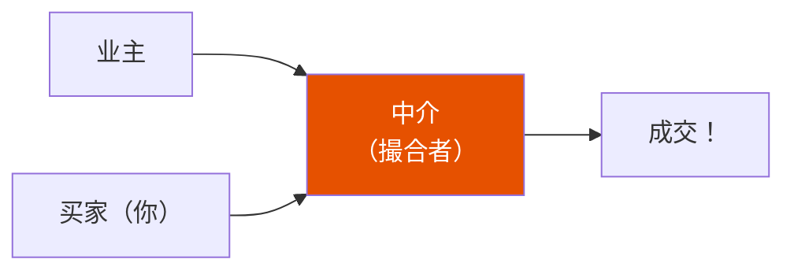
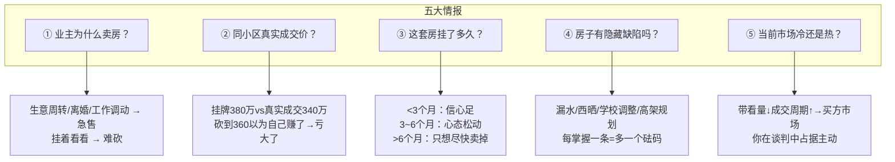

<iframe src="https://player.bilibili.com/player.html?aid=116307932486619&bvid=BV1DaX1BkEPb&cid=37055300364&page=1&autoplay=0" scrolling="no" border="0" frameborder="no" framespacing="0" allow="fullscreen; picture-in-picture" allowfullscreen="true" style="height:100%;width:100%; aspect-ratio: 16 / 9;"> </iframe>

> **砍价不是口才比赛，是信息博弈。** 你掌握的信息越多、越准确，谈判桌上的主动权就越大。同一个小区、同一户型，楼上楼下两套房相差 27 万——买贵的那位砍了 5 万下来还觉得自己赚到了。

---

## 🧭 正确认知框架

### 三大价格关系

| 价格 | 定义 | 特点 |
|------|------|------|
| **挂牌价** | APP 上看到的数字 | 业主故意留了砍价空间，相当于菜市场报价 10 块心里想 8 块 |
| **业主心理价** | 业主真正愿意接受的最低价 | **永远不会告诉你**，且随时间变化——刚挂高，三个月没成交就松动 |
| **市场合理成交价** | 由供需决定，同小区同户型最近半年的真实成交 | 不以任何人的意志为转移，是你的**砍价目标基准** |

> [!important] 砍价目标
> 你的目标不是从挂牌价上砍多少——那是菜市场的思维。你的目标是**让最终成交价尽量接近甚至低于市场合理成交价**。

### 中介的角色定位



| 误解       | 真相                                  |
| -------- | ----------------------------------- |
| 中介会帮我砍价  | 中介的核心 KPI 是**成交量**，不是帮你省钱           |
| 中介是我的人   | 中介既不完全站在你这边，也不完全站在业主那边——**他站在成交这边** |
| 佣金和成交价挂钩 | 成交价越高中介赚的越多，中介的本能是**促成交**，不是帮你压到最低  |

> 理解了这一点，你才能真正正确使用中介——**从中介身上获取信息，而不是被中介牵着鼻子走。**

---

## 1️⃣ 砍价前：信息战（胜负已定七成）

> 上桌之前，胜负其实已经定了七成。80% 的买家走上谈判桌时，对同小区的真实成交价是没有概念的——**拿着一把没有子弹的枪上了战场。**

### 五大关键情报



#### 情报①：业主为什么卖这套房

> **最关键的一条情报，没有之一。**

| 动机 | 心态 | 砍价空间 |
|------|------|----------|
| 生意周转、急需现金 | 赶紧卖掉，价格低点也能接受 | ✅ 大好 |
| 离婚分割财产 | 恨不得赶紧了结，各走各路 | ✅ 好谈 |
| 工作调动去其他城市 | 时间卡得死死的，有压力 | ✅ 可谈 |
| 挂着看看，能卖就卖，卖不掉就出租 | 不着急 | ❌ 很难撬动 |

**怎么打听：**
1. **直接问中介**——旁敲侧击，多聊
2. **看挂牌时长和调价记录**——一个月内降过价 → 业主开始着急
3. **看房时自己观察**——家里是否已搬走一半东西、装修是否变旧

#### 情报②：同小区真实成交价

**查价渠道：**

| 渠道 | 方法 |
|------|------|
| APP 历史成交记录 | 不 100% 准确，但能看个大概 |
| 问中介（换问法） | "这个小区最近成交了哪几套？分别什么价？" 让他给具体案例 |
| 多中介交叉验证 | 不同中介掌握的成交案例不同，综合起来形成完整价格地图 |

#### 情报③：挂牌时长

| 时长 | 业主心态 |
|:----:|----------|
| < 3 个月 | 有信心，觉得房子不愁卖 |
| 3~6 个月 | **开始松动**——挂了三个月没出价，开始怀疑是不是挂贵了 |
| > 6 个月 | 从"想卖个好价钱"变成"什么时候能卖掉" |

#### 情报④：隐藏缺陷

**那些看房时不一定发现、住进去才发现的问题：**

| 缺陷 | 怎么发现 |
|------|----------|
| 顶楼漏水历史 | 跟物业聊、跟同楼栋邻居聊 |
| 西晒问题 | 上午和下午各去看一次 |
| 对口学校调整 | 查片区规划 |
| 高架/变电站规划 | 查政府规划公示 |
| 垃圾转运站噪音/气味 | 观察小区周边环境，不同时间段去 |

> **和保安、保洁阿姨聊——他们什么都知道。**

#### 情报⑤：当前市场冷热

| 信号 | 解读 |
|------|------|
| 带看量减少 | 需求在萎缩 → **天平向买家倾斜** |
| 成交周期拉长 | 买方在观望 → **主动权到你手上** |
| 你不买，三个月都没人出价 | 卖方市场 → 砍价余地很小 |

---

## 2️⃣ 砍价中：谈判桌实战

### 问题一：第一口价怎么报？

> 错误的报价方式

| 错误 | 表现 | 结果 |
|------|------|------|
| **不敢报低** | 挂牌 300 万说 295 万 | 一口抱在业主舒适区，**白白浪费谈判空间** |
| **报太离谱** | 上来就说 200 万 | 业主直接走人，中介觉得你不靠谱 |

> 正确的做法

**第一口价要低到让业主觉得有点勉强，但又不至于被侮辱——而且必须有依据。**

```
"王哥，你这套房我挺喜欢的。
但你看同小区 3 号楼 12 层那套，上个月刚成交，户型一样楼层还比你高一层，成交价是 XXX。
你这套西边卧室有点西晒，而且已经挂了四个多月了。
我诚心想买，想出 XXX 万，你考虑一下。"

        ↓
报了低价 + 三个依据：① 同小区真实成交 ② 房屋客观缺陷 ③ 挂牌时间长
业主就算不同意，也没法说你是胡砍
```

### 问题二：谈判节奏怎么控制？

> **你表现得越不着急，你的筹码越大。**

| 技巧            | 做法                                             |
| ------------- | ---------------------------------------------- |
| **首次看房不表态**   | "我再考虑考虑，这两天还有几套要看"——心里多喜欢都不要带出来                |
| **加价幅度递减**    | 260 → 263 → 266 → 268，**幅度越来越小**，传递"预算快到极限"的信号 |
| **真的走，不是假装走** | 谈不拢就说"我再看看别的"，隔两三天让中介传话试探——**冷却期反而让业主紧张**      |

### 问题三：怎么识别中介话术？

> 中介经典话术拆解

| 中介话术 | 真相 | 应对 |
|----------|------|------|
| "业主那边松口了，底价就是 275，再低真谈不了" | 这个底价很可能不是业主真实底线，而是**中介判断你能接受的价位** | 别急着信，继续谈 |
| "这套房还有另一组客户在看，你不赶紧订就被抢了" | 经典的**制造紧迫感**；如果是真的，中介会催你交定金/签合同，不只是嘴上说说 | 没催你行动 → 大概率是话术 |
| "我帮你跟业主磨了好久，从 282 谈到了 278" | 在用"我帮了你"的人情**换你的让步** | 可以感谢，但不要因此放弃继续谈的空间 |

> 你的微表情在经验丰富的中介面前全是信息：**管好表情，保持冷静。**

### 问题四：什么时候该见好就收？

> 砍价不是砍得越低越好。把业主逼到觉得亏大了——要么反悔不卖，要么交房时使绊子。

| 过度砍价的后果                   |
| ------------------------- |
| 业主反悔不卖了，所有努力白费            |
| 虽签了合同，交房拖延 / 拆走灯具 / 不配合交接 |
| 过户当天突然说不卖                 |
| **拿到房产证之前，主动权始终在业主手里**    |

**适度原则：** 价格接近甚至低于合理成交价时，让业主觉得"价格虽然低了一点，但这个买家靠谱"，比多砍 2 万更重要。

---

## 3️⃣ 砍价后：签合同阶段（藏着好几万）

> 90% 的买家在这个阶段放松警惕——但每个条款背后都有实实在在的经济价值。

### ① 付款方式是筹码

| 方式 | 策略 |
|------|------|
| **全款** | 不要一开始就亮出来。留在最后："这个价格我确实吃力，但如果你能再让一点，我可以全款，两周资金全部到位" |
| **贷款** | 提高首付比例 → 缩短审批金额 → 加快放款 → 用这个换价格让步 |

### ② 交房时间是筹码

| 情况 | 策略 |
|------|------|
| 业主还没找到新住处 | "交房时间可以宽裕两三个月，但价格上再考虑一下" → **用时间换钱** |
| 房子已空 | 要求提前交房、提前验收 → 掌握主动权 |

### ③ 家具家电单独谈

```
一套装修还不错的房子，家具家电价值少则 5~6 万、多则十几万。

流程：
1. 先把房价谈到目标价
2. 最后再提："这些家具家电能不能留下来？"
3. 业主已在心理上接受价格，多送你东西觉得不是什么大事
```

### ④ 定金钱数有讲究

| 定金比例 | 风险 |
|:--------:|------|
| **太少** | 对业主没有约束力——房价涨 30 万，他违约赔你 20 万还赚 10 万 |
| **太多** | 你自己风险大——万一贷款批不下来，这笔钱可能有争议 |
| **5%~10%** | 推荐区间 |

### ⑤ 补充协议保障条款

> 主合同是格式条款，但**补充协议可以加上任何你想要的条款**。

| 建议写入                                | 作用       |
| ----------------------------------- | -------- |
| 卖方承诺房屋不存在未被披露的渗漏/结构问题，交房后发现卖方承担维修费用 | 防漏水等隐藏问题 |
| 卖方承诺过户后 30 日内迁出户口，逾期每日支付违约金         | 防户口纠纷    |
| 如因卖方原因导致交易无法完成，除返还定金外另行赔付 X 元       | 增加业主违约成本 |

> 买房是几百万的事，合同上每一个字都不是多余的。**花几百块请律师审一遍，绝对值。**

---

## ✅ 砍价行动清单

> 下次看二手房之前，对着这个清单准备：

| # | 行动 |
|---|------|
| 1 | **看房前**：查同小区最近半年真实成交记录，至少 3~5 套可对比案例 |
| 2 | **多渠道**：通过多个中介交叉了解业主卖房原因、挂牌时长 |
| 3 | **看房时**：不止看房子本身——看小区环境、物业状态、周边配套；**任何缺陷都是筹码** |
| 4 | **第一口报价**：低于目标价，留出加价空间，但必须有理有据 |
| 5 | **全程控情绪**：不要让业主和中介看出你非这套不可 |
| 6 | **价格谈完后**：继续在付款方式、交房时间、家具家电、合同条款上争取 |
| 7 | **签合同前**：花几百块请专业人士审一遍合同和补充协议 |

> **买房是大多数人这辈子最大的一笔消费。多花一个星期做功课，省下来的钱可能比你加班一整年赚的还多。**

---

## 📋 字幕全文

<details>
<summary>点击展开完整字幕</summary>

因字幕篇幅较长（720+ 行），此处折叠。完整字幕请直接观看 B 站视频。

内容结构：
- `00:00`~`04:09`：三大价格关系 + 中介角色定位
- `04:10`~`09:14`：五大情报搜集方法
- `09:15`~`14:50`：谈判桌实战四问
- `14:51`~`18:44`：签合同阶段的五大隐藏空间
- `18:45`~`20:38`：行动清单 + 总结

</details>

---

## 🔗 参考链接

- B 站视频：https://www.bilibili.com/video/BV1DaX1BkEPb/