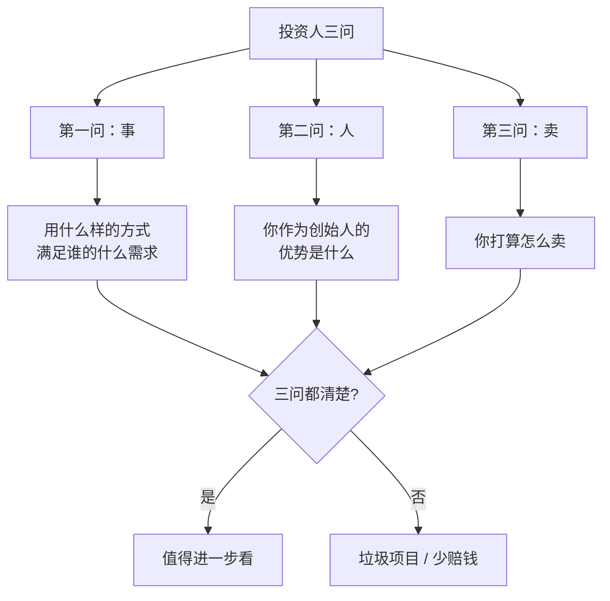

| 视频来源                                                 | 视频标题              | 视频总结                                                                           | 视频详细内容                      |
| ---------------------------------------------------- | ----------------- | ------------------------------------------------------------------------------ | --------------------------- |
| [B站链接](https://www.bilibili.com/video/BV1kgv4BPEqy/) | 老王视频：自媒体核心认知与实操指南 | 自媒体不是快速变现捷径，需以长期主义心态深耕；明确"卖什么、卖给谁、怎么卖"三要素，以商业目的为先，通过对标同行快速复制已验证模式，低成本启动、持续试错迭代 | 详见下方 [[#老王视频：自媒体核心认知与实操指南]] |
|                                                      |                   |                                                                                |                             |

---

## 老王视频：自媒体核心认知与实操指南

> [!tip] 1. 核心认知误区
> - 自媒体**不是快速变现的捷径**，急躁心态会导致失败
> - 需养成**"说用户想听的"**而非"自己想说的"习惯
> - **警示案例**：郭有才持续 **4 年**才爆火；作者从 2021 年深耕至今

> [!abstract] 2. 定位三要素
> | 要素 | 说明 |
> |------|------|
> | **卖什么** | 明确产品或服务（知识付费、实体商品） |
> | **卖给谁** | 目标用户画像（年龄、需求等） |
> | **怎么卖** | 内容形式（短视频、直播等） |
>
> **执行逻辑**：先解决"卖什么"，其余通过对标账号快速学习

> [!important] 3. 方法论与目的
> - 手段 ≠ 目的：IP号、传单号仅是工具，核心是明确**商业目的**
> - "为什么做"比"怎么做"更重要

> [!note] 4. 对标与执行
> - 避免闭门造车：在抖音等平台观察同行如何解决"卖给谁"和"怎么卖"
> - 确定卖点后，快速复制已验证的商业模式

> [!quote] 5. 长期主义
> - 自媒体需持续积累，短期内"造富神话"多为**幸存者偏差**
> - 号作废可重启，试错成本低但需坚持

> [!success] 6. 低成本启动
> - 自媒体成本低、风险低，适合快速验证想法
> - **立即开始**，避免过度规划，通过实践迭代认知

> [!tip] 7. 离钱最近的路径
> - 优先为**现有业务引流**（内容导流至私域或店铺）
> - 即使账号失败，仍可获得成长和局部盈利
---

---

# 我选项目，只看这三样，项目拆解
<iframe src="https://player.bilibili.com/player.html?aid=117379946255680&bvid=BV1pvHz6ME87&cid=42442427355&page=1&autoplay=0" scrolling="no" border="0" frameborder="no" framespacing="0" allow="fullscreen; picture-in-picture" allowfullscreen="true" style="height:100%;width:100%; aspect-ratio: 16 / 9;"> </iframe>

## 一句话总结

> [!tip] 核心结论
> 看所有项目，本质上只看三件事：==事、人、卖==。
>
> 你作为自己的投资人、自己项目的第一责任人，投任何项目、做任何创业之前，先问自己这三个问题。
>
> 问清楚了不一定能多挣钱，但==至少能少赔钱==。

## 投资人三问总览

## 第一问：事——用什么样的方式满足谁的什么需求？

> [!question] 只给 10 到 15 分钟
> 让项目负责人讲一下他的项目，只给 **10 到 15 分钟**。
>
> 任何项目如果 10 到 15 分钟都讲不明白、讲不清楚，==一定是个垃圾项目==。

听的过程中，只抓以下信息：

> [!important] 三个空
> **用什么样的方式，满足谁的什么需求？**

| 要素 | 对应问题 |
|---|---|
| **什么样的方式** | 这是你干的事儿的主线 |
| **满足谁** | 你的客群，你要服务于哪个人群 |
| **什么需求** | 需求点，能够创造价值的点 |

> [!todo] 自检
> 试着往自己现在正在做的生意里套一套，看看能不能清晰地回答清楚这三个问题。
>
> 如果这三个空填不清楚、填不明白，==垃圾项目==。

### 想干大事的人，额外加一问

> [!important] 方式新在哪里？
> 想干大事的人，除了上面三个问题，额外还要回答一个问题：
>
> ==你这个方式新在哪里？==

> [!quote] 商机的本质
> 商机的本质是满足需求，是这个问题。但所有的商业机会不是满足需求，而是我们要找到一个==满足需求的新方式==。
>
> 因为需求变化不大，但是满足需求的方式在不停地发生迭代。

## 第二问：人——你的优势是什么？

> [!question] 事在人为
> 如果第一问全部回答清楚，并且我也感兴趣，就问第二个非常重要的问题：
>
> ==你作为创始人做这件事，你的优势是什么？==

> [!warning] 注意：是人的优势，不是事的优势
> 前面我们把事说清楚了，但是记住：==事在人为==。
>
> 这件事我听完了，它靠谱。但凭什么你能干成？你的相对优势是什么？

## 第三问：卖——你打算怎么卖？

> [!question] 再好的项目，卖不出去也是扯
> 我是一个非常实干、非常务实的创业者，因为我自己一路干过来的。所以我要问的第三个问题是：
>
> ==你打算怎么卖？==
>
> 再好的项目、再好的 idea、你人再对，卖不出去，是不是也是扯？

> [!danger] 这个时代最核心的两个成本
> - **流量成本**
> - **成交成本**

> [!success] 第三问的本质
> 你事也靠谱，你人也靠谱，你要告诉我：==你打算怎么卖==。

## 关键提醒：你是自己的投资人

> [!important] 投资人三问
> 您就是您自己的投资人。您投的钱，那是您的钱，不是别人的钱。
>
> 投任何项目之前，自己做任何创业之前，问一问自己这三个问题。
>
> 没有人问你话，==自己问问自己这三个问题==。

> [!quote] 最后的总结
> 这三个问题你问清楚了，问完了以后能不能让你多挣钱，我不知道。
>
> 老王唯一的本事是：你这问清楚了以后，你自己想明白了以后，你是不是==至少少赔钱==呢？

## 可背版：投资人三问

> [!success] 面试 / 自检可背版
> 1. **事**：用什么样的方式，满足谁的什么需求？（想干大事再加一问：方式新在哪里？）
> 2. **人**：你作为创始人做这件事，你的优势是什么？（是人的优势，不是事的优势）
> 3. **卖**：你打算怎么卖？（流量成本 + 成交成本是核心）

## 关键金句

> [!quote] 摘录
> - 任何项目如果 10 到 15 分钟都讲不明白、讲不清楚，一定是个垃圾项目。
> - 用什么样的方式满足谁的什么需求。
> - 需求变化不大，但是满足需求的方式在不停发生迭代。
> - 事在人为。
> - 再好的项目、再好的 idea、你人再对，卖不出去，是不是也是扯？
> - 您就是您自己的投资人。
> - 问清楚了不一定多挣钱，但至少能少赔钱。
