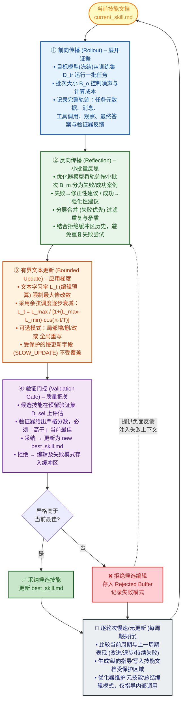

**论文**：SkillOpt: Executive Strategy for Self-Evolving Agent Skills  
**论文地址**：https://arxiv.org/abs/2605.23904  
**项目地址**：https://github.com/microsoft/SkillOpt

## 论文基本信息
- **文章名字**：SkillOpt: 自我进化代理技能的执行策略  
- **作者与机构**：杨一帆、龚子洋、黄伟权、杨启豪、周子威、黄子苏、李妍、高雪梅、戴琪、刘蓓、邱凯、杨雨晴、陈东东、杨雪、罗冲（微软、上海交通大学、同济大学、复旦大学）  
> [!abstract] 一句话总结
> SkillOpt = 冻结模型 + 外部技能文档优化：用**文本空间的训练循环**替代黑盒微调，靠编辑预算控制步长、验证门控防退化、rejected-edit buffer 避错，最终只部署一份纯文本 `best_skill.md`。

**问题**：现有智能体技能多为手工编写或一次性生成，缺乏系统化的优化机制，无法像深度学习权重那样进行可控的迭代提升，导致在目标领域或执行框架下表现脆弱。
**方法**：提出 SkillOpt，一种文本空间技能优化器。它将技能文档视为外部可训练状态，通过独立的优化器模型分析执行轨迹，生成受限的增/删/改编辑建议，并仅在通过预留验证集（门控）评估后才采纳。核心控制机制包括：文本学习率（编辑预算）、被拒编辑缓冲区、逐轮次慢速/元更新，确保训练稳定且不增加推理开销。
**贡献**：首次将深度学习训练范式系统性地引入技能优化；提出一套与框架无关、可审计、可迁移的优化流程；在52个评估单元上取得全面最优。
**结果**：在6项基准、7个目标模型、3种执行框架（直接对话、Codex、Claude Code）的52个单元中全部取得最佳或并列最佳。GPT-5.5在直接对话中平均提升 +23.5 个百分点，Codex 中 +24.8，Claude Code 中 +19.1。优化后的技能在跨模型、跨框架、跨基准迁移中均保持显著正收益。

---

## 二、问题背景
### 当前智能体优化主要分三个方向：
- **权重微调**（效果好但成本高，且对非开源模型不可用）；
- **提示工程**（轻量但脆弱，缺乏系统化优化）；
- **技能构建与进化**（如Trace2Skill, EvoSkill，从轨迹中提取经验，但优化过程松散，缺乏控制）。
SkillOpt 处于第三派的延长线上，但首次将深度学习训练的控制论（批次、学习率、验证、动量）引入文本技能优化，使技能成为一个可训练、可验证、可复用的稳定状态。
### AI 技能进化困境？
**Q：目前让 AI 自主学习技能的做法为什么都在原地打转？**
**A：三条死胡同**

| #   | 方法        | 比喻          | 问题                                                                                   |
| --- | --------- | ----------- | ------------------------------------------------------------------------------------ |
| 1   | **手工编写**  | 给极其死板的说明书   | 工程师一行行写提示词、设计工作流，极其耗时，人类脑容量穷尽不了现实世界的边界场景，遇到没见过的变量直接崩                                 |
| 2   | **一次性生成** | 扔一本书就不管了    | 直接把问题扔给 LLM 让它生成技能策略，缺乏后续反馈——不管好坏就定死了，环境一变无法纠错                                       |
| 3   | **松散自反思** | 没有老师指导自己瞎琢磨 | AI 自己干完活 -> 自己评价自己 -> 然后自己改，但自然语言自由度太高，没有约束的自我反思极易偏离最初目标，走着走着陷入逻辑死循环，彻底忘了最初要解决的业务是什么 |

> [!quote] 总结比喻
> 手工编写就像给 AI 一本死板的说明书；
> 一次性生成就是扔一本书给它就不管了；
> 松散自反思就是让它在没有老师指导的情况下自己瞎琢磨，很容易走火入魔。

##### 松散自反思的痛点：
- **不可控的演化**：现有技能进化方法（如EvoSkill）缺乏更新步长控制，重写可能抹去有用规则或引入不兼容指令，导致性能震荡甚至退化。
- **缺乏验证与反馈闭环**：大多数方法从轨迹中提取经验后直接应用，没有预留验证集的“门控”机制，容易过拟合训练集或采纳错误的修正。
- **一次性或高成本**：手工编写耗时，一次性LLM生成缺乏迭代优化能力，无法从实际执行反馈中学习。

**核心比对 – 黑盒重构（松散自反思） vs 训练循环（SkillOpt ）**

| 对比维度      | 常规提示词优化（Prompt Rewrite）  | SkillOpt 优化框架（SkillOpt Framework） |
| :-------- | :----------------------- | :-------------------------------- |
| **演进逻辑**  | 「一次性重写」全局重构，断裂性演进        | 「机器学习式循环」持续迭代，稳步逼近最优解             |
| **优化定位**  | 黑盒试错，难以确定是哪个 Prompt 片段生效 | 精准归因，仅对有问题的「缺陷微件」实施修改             |
| **退化风险**  | 极高。改好 A 问题的同时往往会改坏 B 问题  | 极低。局部修改 + 自动测试集回归保障不退化            |
| **工程自动化** | 人工经验驱动，高度依赖工程师感性直觉       | 算法自适应寻优，实现工程化、标准化的闭环              |


---
## 三、SkillOpt 破局的关键 --- 范式转变：把文本当权重调（**SkillOpt ：局部文本空间优化类比**）


![[file-20260626165735942.png]]
**目标模型**利用当前技能执行任务，**前沿优化器模型**将轨迹转化为**有界的添加/删除/替换技能编辑项**，而**预留的验证门**仅接受能提升验证性能的编辑。
- 被采纳的编辑 → 导出为**可复用的技能构件**
- 遭拒的编辑 → 转化为后续更新的**负面反馈**
##### 文本空间优化类比（Text-space optimization analogy）

| 传统优化概念                              | →   | SkillOpt 对应概念                                         |
| :---------------------------------- | :-- | :---------------------------------------------------- |
| **parameter**（参数）                   | →   | **skill document**（技能文档）                              |
| **gradient direction**（梯度方向）        | →   | **trajectory-derived edit direction**（轨迹派生的编辑方向）      |
| **learning rate**（学习率 η）            | →   | **edit budget**（编辑预算 Lt（最大修改条数）                       |
| **validation check**（验证检查）          | →   | **held-out selection gate**（预留选择门）                    |
| **stable training setting**（稳定训练设置） | →   | **batch / minibatch / schedule / gate**（批次/小批次/调度/门控） |


SkillOpt 将传统深度学习的训练循环映射到了**离散的自然语言文本空间**：

```
传统深度学习                    SkillOpt 文本空间
    │                                │
    ├── 前向传播 → 计算损失           ├── 前向执行 → 收集轨迹+得分
    │                                │
    ├── 反向传播 → 计算梯度           ├── 反向反思 → 生成文字批判+修正方案
    │                                │
    ├── 学习率 → 控制步长            ├── 编辑预算 Lt → 控制修改条数
    │                                │
    └── 验证集 → 评估泛化            └── 验证门控 → 回归测试准入
```


---

##### 1.SkillOpt 是怎么破局的？
借用了深度学习中最成功的理念，但应用在了一个全新的维度上——**把智能体的技能文档视为外部权重，把文本里的字词当成网络里的数字权重去调**。

> [!important] 巨大的范式转变
> - **传统深度学习**（SGD/Adam 优化器）：优化对象是深度网络里的数字，评估用损失函数，更新方式是数字变大变小（梯度下降）
> - **SkillOpt**：优化对象变成纯文档的智能体技能，评估信号变成带有评分的执行展开（实际跑个分），更新方式变成具体的文本增删改操作

**Q：数字可以微调（比如 0.5 变成 0.51），自然语言怎么微调？加半个词？**
**A：** 这就是关键。更新方式变成了具体的文本操作——比如**去掉文档里一句容易引起歧义的指令**，或者**插入一句特定的代码格式要求**。这就等同于调整了文本权重。
##### 2. 如何保证改动真的朝好的方向走？
**Q：传统深度学习有严密的微积分数学逻辑支撑，你怎么保证改几句自然语言真的是朝更好的方向走，而不是让 AI 胡言乱语？**
**A：** 引入了传统训练里的验证及早停概念，把它变成了**流出验证集**：
- 修改完文本后，绝不会仅凭一次执行就拍板
- **必须让修改后的技能在未见过的测试数据上跑出更好的分数** (train 、test 、eval )
> [!tip] 精妙的比喻
> 这真的是给松散的自然语言套上了一件**极其严密的数学紧身衣**。

##### 3. 算力和上下文不会被撑爆?
**Q：这个系统既要干活、又要看录像反思、还要修改文本、最后还得跑测试集——AI 的算力和上下文不会被直接撑爆吗？**
**A：** 这就是 SkillOpt 极其精妙的物理运作机制——**双引擎架构**(赛车手 + 维修站)，把工作拆开了：

```
┌─────────────────────────────────────────────────────┐
│                    SkillOpt 系统                      │
│                                                     │
│  ┌──────────────────┐    ┌─────────────────────┐    │
│  │  左侧：执行智能体   │    │  右侧：优化器模型      │    │
│  │  （冻结参数）      │    │  （独立于执行过程）    │    │
│  │                  │    │                     │    │
│  │  赛车手            │    │  维修站工程师团队     │    │
│  │  只管开车          │    │  分析遥测数据         │    │
│  │  读取技能文档干活   │    │  调整赛车零部件       │    │
│  │                  │    │  改写技能文档         │    │
│  └──────────────────┘    └─────────────────────┘    │
└─────────────────────────────────────────────────────┘
```

**Q：冻结是什么意思？参数被锁死了？**
**A：** 是的。左侧执行智能体的模型权重和基础逻辑绝对不变，职责极其单一——仅仅负责读取那份技能文档，然后去干活。

**Q：那优化和反思呢？**
**A：** 全在右侧。右侧是一个完全独立的优化器模型，游离于执行过程之外，专门负责看录像、找问题、并动手改写技能文档。

> [!abstract] 类比
> 就好比一级方程式赛车——赛车手只管专心致志在赛道上开车，维修站的工程师团队在场外分析遥测数据、调整赛车的零部件。赛车手自己完全不需要一边开车一边修车。正因为这样，**他在赛道上跑的时候（大模型推理部署时），完全没有任何额外的算力负担**。

##### 4. 内部优化循环一共分四个严密步骤
SkillOpt 将技能优化建模为一个“训练循环”。**冻结的目标模型**（学生）使用当前技能执行任务，产生轨迹证据；一个**独立的前沿优化器模型**（教师）分析这些证据，提出结构化的编辑建议（增/删/改）。这些建议在**编辑预算（文本学习率）**下被排序和截取，形成候选技能。候选技能必须通过**验证门控**（在预留验证集上评估）才能被采纳。被拒绝的编辑进入**缓冲区**作为负面反馈，而**逐轮次的慢速/元更新**则提供跨周期的长期稳定性。
整体流程可类比为：**前向传播**（目标模型推出轨迹）→ **反向传播**（优化器分析失败/成功，生成梯度即编辑建议）→ **参数更新**（有界的编辑应用）→ **验证**（门控检查）。

1. **前向传播：展开证据 (Rollout)**  
   目标模型在当前技能下，从训练集 $D_{tr}$ 运行一个批次。记录完整轨迹：任务元数据、消息、工具调用、观察、最终答案、验证器反馈。批次大小 $B_o$ 控制噪声与计算成本。
2. **反向传播：小批量反思 (Reflection)**  
   优化器模型将轨迹分为失败和成功案例，并按小批次 $B_m$ 进行分析。失败小批次生成“修正性”编辑建议，成功小批次生成“强化性”建议。通过分层合并（先合并失败驱动，再合并成功驱动，失败优先）过滤重复和矛盾，产生最终候选编辑池。
3. **有界文本更新 (Bounded Update)**  
   文本学习率 $L_t$（编辑预算）限制每一步应用的最大编辑数。采用余弦调度策略（从较大逐步衰减）。可选补丁模式（局部增/删/改）或重写模式。受保护的慢更新字段不受步骤级编辑影响。
   编辑预算调度示例：
   $$
   L_t = \frac{L_{max}}{1 + (L_{max} - L_{min}) \cdot \cos(\pi \cdot t / T)}
   $$
4. **验证门控与拒绝缓冲区 (Validation Gate & Rejected Buffer)**  
   候选技能在验证集 $D_{sel}$ 上评估。若分数 **严格** 高于当前最佳，则采纳并可能成为新的 `best_skill.md`；否则拒绝，并将该编辑及其失败模式存入缓冲区。后续反思调用会收到此缓冲区，避免重复失败尝试。
5. **逐轮次慢速/元更新 (Slow/Meta Update)**  
   每个周期结束时，比较上一周期与当前周期技能在同一采样任务上的表现，分类为改进、退步、持续失败等。优化器据此生成一份“纵向指导”写入技能文档的受保护区域（`<!-- SLOW_UPDATE_START -->`），该区域不受步骤级编辑覆盖。同时，优化器侧维护一个“元技能”，总结编辑模式的有效性，仅用于指导未来优化器调用，不随部署产物发布。

最终输出是一个紧凑的 `best_skill.md` 文件（约300-2000词元），可独立部署，不依赖优化器状态。


##### 5. 如何保证训练不发散？

**5.1 文本学习率预算**
**Q：就算有了拦截，如果优化器像个没头苍蝇一样疯狂乱改文字，系统一样会瘫痪吧？怎么保持情绪稳定？**
**A：** 第一重稳定器——**文本学习率预算**。系统严格限制了每次更新的文本修改幅度（比如控制在 0.005 到 0.01 之间）。

**Q：0.005 的文本修改，具体怎么操作？**
**A：** 强制要求每次只能对极小的一部分文本做手术，就像控制梯度不涨一样。它不能把整个文档推翻重写，只能修饰哪怕是一个特定的条件语句。这就防止了机能过度拟合或者发生灾难性遗忘。

> [!tip] 比喻
> 这就相当于给 AI 规定了**每天只能改十行代码的配额**，必须小步试错。

**5.2 被拒编辑缓冲区（错题本）**
**Q：但如果你小步走，却在同一个死胡同里反复走怎么办？每次都提出一模一样的错误修改？**
**A：** 第二重稳定器——**被拒编辑缓冲区**。当门控拒绝了一次失败的修改后，系统不仅是丢弃它，还会把它存起来（最多缓冲 128 次）。当下一次优化器生成编辑建议时，系统会把这些失败记录当做上下文直接喂给它。

> [!tip] 比喻
> 他实际上是在**读自己的错题本**，绝不在同一个坑里跌倒两次。这就给他负面反馈——和人一样，不仅需要知道做什么，更需要记住不该做什么。

**5.3 Epoch 级慢速更新** 
**Q：第三重稳定器呢？**
**A：** 为了防止模型在局部的修修补补中迷失，系统引入了宏观更新周期——每 1-10 个 epoch，会在更大的时间尺度上评估全局的优化趋势是否真的在收敛。

> [!success] 三重稳定器总结
> **配额制限制冲动 + 错题本提供负反馈 + 宏观周期把控大局 = 滴水不漏的防发散机制。**


 **5.4 反向反思的双向分析**
```
失败轨迹 → 归因分析 → 定位缺失规则与错误引导
    +
成功轨迹 → 行为标定 → 锚定已生效的高质量行为模式
    ↓
合并 → 去重 → 优先级排序 → 候选编辑池
```
> [!important] 为什么双向分析
> 只看失败容易反应过度破坏原有逻辑；只看成功会遗漏隐藏盲区。双向分析是**防范灾难性遗忘的底层保险**。


---
## 五、实验与关键洞察
### 实验配置
- **基准测试**：SearchQA (问答), SpreadsheetBench (电子表格), OfficeQA (多轮工具), DocVQA (文档VQA), LiveMathematicianBench (数学), ALFWorld (具身决策)。
- **目标模型**：GPT-5.5, GPT-5.4, GPT-5.4-mini, GPT-5.4-nano, GPT-5.2, Qwen3.5-4B, Qwen3.6-35B-A3B。
- **执行框架**：直接对话, Codex, Claude Code。
- **优化器 (教师)**：默认为 GPT-5.5 (或与目标模型匹配以进行强度消融)。
- **评估指标**：各基准原生硬分数或精确匹配准确率。

**主要结果**
SkillOpt 在全部 52 个评估单元（模型×基准×框架）中取得最佳或并列最佳。以 GPT-5.5 直接对话为例，六项基准平均分从 58.8 (无技能) 提升至 82.3，绝对增益 **+23.5 个百分点**。在 Codex 框架下，平均增益 **+24.8**；Claude Code 下 +19.1。小型模型收益更为显著，如 GPT-5.4-nano 在 ALFWorld 上从 34.3 提升至 69.4 (翻倍)。

**核心对比表**

| 模型 | 技能来源 | SearchQA | Spreadsheet | OfficeQA | DocVQA | LiveMath | ALFWorld |
|------|----------|----------|-------------|----------|--------|----------|----------|
| GPT-5.5 (Direct) | No skill | 77.7 | 41.8 | 33.1 | 78.8 | 37.6 | 83.6 |
| | Human skill | 81.8 | 72.9 | 66.9 | 90.1 | 38.4 | 91.8 |
| | **SkillOpt** | **87.3** | **80.7** | **72.1** | **91.2** | **66.9** | **95.5** |
| GPT-5.4-nano (Direct) | No skill | 55.8 | 23.5 | 16.3 | 30.8 | 23.2 | 34.3 |
| | **SkillOpt** | **74.8** | **42.5** | **50.0** | **80.2** | **27.2** | **69.4** |
> **数据解读与局限性**：SkillOpt 在所有基准上均稳定超越无技能和人类基线。在流程密集型任务（SpreadsheetBench, OfficeQA）上增益巨大（+38.9, +39.0），验证了其程序性知识注入的有效性。然而，在知识密集型任务（SearchQA）上，由于上限较高，绝对提升空间有限（+9.6）。优化过程依赖高质量的验证集和可计算的奖励信号，对于主观性或开放式任务，验证门控的设计将面临挑战。跨迁移实验显示，技能在跨框架（Codex → Claude Code）迁移时表现稳健，但在跨基准（OlympiadBench → Omni-MATH）迁移时增益较小（+1.3 ~ +3.7），表明技能中的部分规则具有领域特定性。
##### 关键消融结论
- **有界文本学习率至关重要**：移除编辑预算（“无学习率”）导致 SpreadsheetBench 从 78.0 降至 75.7，验证了步长控制防止有害重写的效果。
- **拒绝缓冲区提供稳定负反馈**：移除后 SpreadsheetBench 下降 4.6 个点，表明记录失败编辑能有效引导后续优化。
- **慢速/元更新是长期稳定性的基石**：同时移除两者导致 SpreadsheetBench 大幅下降 22.5 个点 (77.5 → 55.0)，证明跨周期的纵向指导和受保护区域对保持程序性知识积累至关重要。
##### 优化轨迹示例 (Figure 3 描述)
验证集性能随周期稳步上升，且最终测试集性能与验证集最佳点高度一致，证明门控机制成功避免了过拟合。

---
## 总结
- **可解释性优势**：最终技能仅含1-4次编辑，长度<2000 token，完全可审查，这对于监管严格的行业（金融、医疗）至关重要。
- **与权重微调的互补**：SkillOpt 可作为权重微调前的快速验证步骤，或权重不可修改时的最终适配手段。

**💡 创新性 (9/10)**  
理由：并非简单拼接，而是将深度学习训练范式（学习率、验证集、动量、批次）系统性映射到文本空间，形成了一套可控、可审计的优化框架。其“被拒编辑缓冲区”和“慢速/元更新”机制在设计层面具有较高原创性，解决了技能演化中的不稳定和遗忘问题。
**🛠️ 实用性 (8/10)**  
理由：部署产物仅为轻量级 Markdown 文件，不增加推理成本，具备很高的工程落地价值。优化流程与框架解耦，适配性强。
**📈 行业价值 (8.5/10)**  
理由：直面了工业界部署大模型代理时“适配成本高、迁移困难”的核心痛点。通过训练可复用的技能构件，有望显著降低企业在不同业务场景下适配 LLM 的边际成本。其“一次优化，多处部署”的特性（跨模型、跨框架迁移）具有很强的商业吸引力。若能进一步发展技能共享生态，将可能改变 LLM 应用适配模式。


```
完整论文逻辑链：

现有大模型提示词方法困境（手工/一次性/松散自反思）
       ↓
范式转变：文本 = 权重，编辑 = 步长，跑分 = 损失函数
       ↓
双引擎架构（赛车手 + 维修站）
       ↓
四步循环（跑圈 → 编辑 → 验证 → 门控）
       ↓
三重稳定器（学习率配额 + 错题本 + 宏观周期）
       ↓
52比0全矩阵领先
       ↓
跨界迁移 + 零推理成本部署
