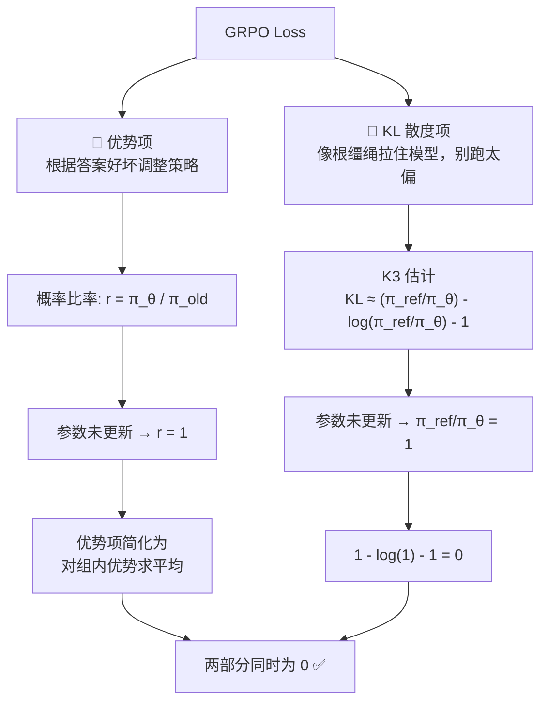

<iframe src="https://player.bilibili.com/player.html?aid=116885186151310&bvid=BV1imM36EEqD&cid=39770128827&page=1&autoplay=0" scrolling="no" border="0" frameborder="no" framespacing="0" allow="fullscreen; picture-in-picture" allowfullscreen="true" style="height:100%;width:100%; aspect-ratio: 16 / 9;"> </iframe>

> **用 GRPO 训练大模型，刚一启动 loss 竟然精确等于 0——不是 bug，而是数学上的必然。**

---

## 🧭 一句话总结

> [!abstract] 一句话
> GRPO 开始时 loss 为 0，是两部分共同为 0 的结果：**优势自相抵消，KL 起点归零。**

---

## 1️⃣ 前提：训练启动那一刻

> [!important] 核心前提
> 训练刚启动的那一刻，待更新的参数还一次都没更新过，所以此刻：
>
> ```
> 当前策略 π_θ = 旧策略 π_old = 参考策略 π_ref
>                = 同一个初始模型
> ```
>
> **两部分归零都从这里推出来。**

---

## 2️⃣ GRPO Loss 的两部分组成



要证明开始时 loss = 0，就得让这两部分**同时为 0**。

---

## 3️⃣ 优势项 = 0 的推导

### 第一步：比率归 1

因为参数没更新，当前策略和旧策略一模一样：

```
概率比率 r = π_θ / π_old = 1
```

所以优势项简化为对一组答案的优势值求平均。

### 第二步：组内标准化（Group Normalization）

GRPO 的优势是在**组内标准化**过的：

```
Â_i = (r_i - mean) / std
```

每个答案的优势 = 它的分数 - 组内平均分，再除以标准差。

### 第三步：求和必为 0

> [!tip] 关键数学性质
> 一堆数，每一个都减掉了它们的平均值，那它们加起来**必然等于 0**。

```
Σ(Â_i) = Σ((r_i - mean) / std) = 0
```

所以这一组标准化优势的总和是 0，优势项的 loss 自然就是 0。

---

## 4️⃣ KL 项 = 0 的推导

GRPO 没有用标准的 KL 公式，而是用了一个叫 **K3 估计（K3 Estimator）** 来减少计算量：

### K3 估计公式

```
KL ≈ (π_ref / π_θ) - log(π_ref / π_θ) - 1
```

### 代入初始条件

训练刚开始，当前策略和参考策略参数完全相同：

```
π_ref / π_θ = 1
```

于是整个式子变成：

```
1 - log(1) - 1 = 1 - 0 - 1 = 0
```

KL 项的 loss 也是 0。

---

## 5️⃣ 为什么 Loss = 0 是健康的

| 阶段 | 状态 | Loss | 意义 |
|------|------|------|------|
| **启动时** | 比率 = 1，优势完全抵消，K3 = 0 | **精确 = 0** | 模型没有任何意外，平稳起步 |
| **训练后** | 参数更新，比率偏离 1，优势不再完全抵消 | **慢慢涨起来** | 梯度开始积累，策略开始学习 |

> [!success] 正常且健康
> Loss = 0 说明第一步模型没有任何意外，一切都从这个零点平稳地开始。积累梯度之后，随着参数更新，loss 才慢慢涨起来。

### Loss 变化曲线

```
Loss
  ↑
  |        ╱
  |      ╱
  |    ╱
  |  ╱
  |╱
  └────────────────────→ 训练步数
  0
```

- **起点：** 精确的 0（数学必然）
- **上升阶段：** 策略偏离初始模型 → 比率 ≠ 1 → 优势不再完全抵消 → KL 项 > 0
- **平稳阶段：** 策略已固定，loss 在某个水平附近波动

---

## 6️⃣ 面试标准答案

> [!quote] 面试官想听你讲清三件事
>
> 1. **比率 = 1**：参数未更新，π_θ = π_old
> 2. **组内标准化优势和 = 0**：每个数减均值后求和必然为 0
> 3. **K3 在比率 = 1 时 = 0**：1 - log(1) - 1 = 0

### 避免踩坑

| 常见错误 | 正确理解 |
|----------|----------|
| "loss = 0 是因为初始化得好" | 不是初始化质量，是**数学必然**，任何初始化在第一步都 = 0 |
| "loss 一直为 0 说明模型不收敛" | 第一步后参数更新，loss 会自然上涨，不再为 0 |
| "优势项为 0 是因为 reward 全相等" | 即使 reward 全相等，标准化后和为 0 只是巧合？**不**——减均值后求和**必然**为 0 |

---

## ✅ 关键 Takeaways

| # | 要点 |
|---|------|
| **1** | GRPO 启动时 loss = 0 是**数学必然**，不是 bug |
| **2** | 前提：参数未更新 → π_θ = π_old = π_ref = 同一个模型 |
| **3** | 优势项 = 0：比率 = 1 使目标简化，组内标准化优势求和天然为 0 |
| **4** | KL 项 = 0：K3 估计中比率 = 1 代入得 1 - 0 - 1 = 0 |
| **5** | Loss = 0 说明模型健康启动，之后参数更新比率偏离 1，loss 才涨 |

> 起点 loss = 0，是因为**优势自相抵消，KL 起点归零**。

---

## 🔗 关联阅读

- [[Bilibili/2026-09-10-OPD 是骗局？教师信号全是噪声，去掉教师效果反而更好｜OPSA 新方法|OPSA：在线策略自适应的去教师蒸馏]]
- [[Bilibili/2026-09-10-AgentOPSD 全新递归自蒸馏！解决智能体长时序强化学习信用分配痛点|AgentOPSD：递归自蒸馏与贝叶斯信用分配]]

---

## 📋 字幕全文

<details>
<summary>点击展开完整字幕</summary>

`00:00` 用GRPO训练大模型
`00:02` 刚一启动你可能发现loss
`00:04` 精确等于0
`00:05` 是bug还是挂了对
`00:07` 我今天帮你看清楚
`00:08` 先给结论
`00:09` 这不是bug
`00:10` 是数学上的必然
`00:12` 先说前提
`00:13` 训练刚启动的那一刻
`00:14` 待更新的参数还一次都没更新过
`00:16` 所以此时当前策略和教育策略
`00:19` 以及参考策略参数完全一样
`00:21` GRPO loser有两部分
`00:23` 优势项和KL散度项
`00:25` 要证明开始时loss为0
`00:27` 就必须让这两部分同时为零
`00:29` 先看优势项
`00:31` 因为参数没更新
`00:32` 概率比率r等于πθ
`00:35` 除以π老等于1
`00:37` 所以优势项简化为对一组答案的
`00:39` 优势值求平均
`00:40` 但GRPO的优势
`00:42` 是在组内标准化过的
`00:44` 每个答案的优势等于
`00:46` 它的分数减去组内平均分
`00:48` 再除以标准差
`00:49` 关键性质在这
`00:51` 几个数每一个都减掉了它们的平均值
`00:54` 那它们加起来必然等于0
`00:56` 所以这一组优势的总和是0
`00:59` 优势项loss自然就是0
`01:01` 再看KL散度项
`01:03` GRPO没用标准KL公式
`01:05` 而是用了一个叫K3的估计
`01:07` 来减少计算量
`01:08` 公式是这样的
`01:10` KL约等于πref除以πθ
`01:13` 减去logπref除以πθ再减1
`01:16` 训练刚开始
`01:17` πref和πθ完全相同
`01:19` 所以πref除以πθ等于1
`01:21` 于是整个式子变成
`01:23` 1减log1减1等于0
`01:26` KL项的loss也是0
`01:28` 两部分同时为0
`01:30` GRPO的loss在启动时精确等于0
`01:33` 这是正常的正常的
`01:35` loss等于0说明第一步模型没有任何意外
`01:38` 一切都从这个零点平稳的开始了
`01:41` 积累梯度之后
`01:42` 随着参数更新
`01:43` loss才慢慢涨起来
`01:45` 面试官其实就想听到三件事
`01:47` 第一比率等于1
`01:49` 参数未更新πθ等于πold
`01:51` 第二组内标准化优势
`01:53` 和为0每个数减均值后求和必然为0
`01:56` 第三K3在比率等于1时等于0
`01:59` 1减log1减1等于0
`02:02` 三件事讲清
`02:03` 面试官就知道你
`02:04` 真的把GRPO吃透了

</details>

---

## 🔗 参考链接

- B 站视频：https://www.bilibili.com/video/BV1imM36EEqD/
- [[Bilibili/2026-09-10-OPD 是骗局？教师信号全是噪声，去掉教师效果反而更好｜OPSA 新方法]]
- [[Bilibili/2026-09-10-AgentOPSD 全新递归自蒸馏！解决智能体长时序强化学习信用分配痛点]]