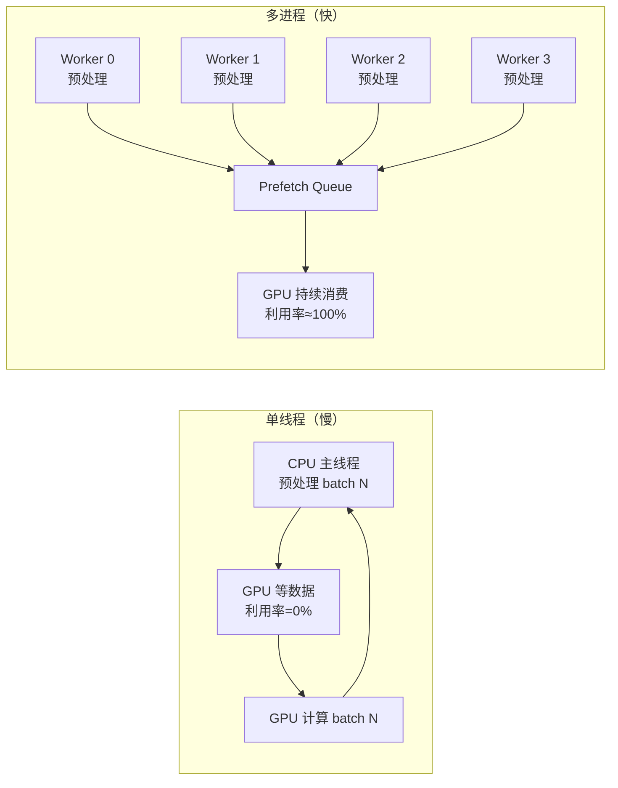
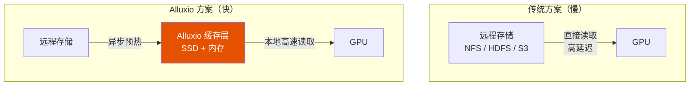

<iframe src="https://player.bilibili.com/player.html?aid=117219153480756&bvid=BV1xfb56cEdo&cid=41616476440&page=1&autoplay=0" scrolling="no" border="0" frameborder="no" framespacing="0" allow="fullscreen; picture-in-picture" allowfullscreen="true" style="height:100%;width:100%; aspect-ratio: 16 / 9;"> </iframe>

> **GPU 假忙不是 GPU 的问题，是数据喂料跟不上。** 利用率上不去，先别怀疑算力，去看数据喂的够不够快。

---

## 1️⃣ 症状：GPU 利用率周期性归零

### GPU 在等什么？

```
            ┌───────────────┐
GPU 算完 ──→│  等待下一个 batch │ ← 数据加载慢 → 利用率归零
 batch      └───────────────┘
                |
                | 几百 ms ~ 几 s
                ↓
            ┌───────────────┐
            │  数据终于到了   │ → GPU 恢复计算
            └───────────────┘
                ↓
            算完下一个 batch → 又开始等数据...
```

```
GPU 利用率
    ↑
100% ┤████████    ████████    ████████
    │████████    ████████    ████████
    │████████    ████████    ████████
 0% ┤        ████        ████
    └──────────────────────────────→ 时间
     计算中 等数据 计算中 等数据
```

> [!warning] 诊断标志
> **周期性的利用率归零，就是典型的 IO 瓶颈。**

---

## 2️⃣ 根因一：数据预处理太慢

### 问题

很多数据集需要实时预处理：

- **Tokenization**：文本转 token ID
- **数据增强**：图像翻转、裁剪、噪声……
- **动态 padding**：每个 batch 的序列长度不同

如果这些操作在**主线程**里做，每个 batch 都要现算——**GPU 要等 CPU 算完才能拿到数据**。

### 解法：DataLoader 多进程 + 锁页内存

```python
DataLoader(
    dataset,
    batch_size=32,
    num_workers=8,          # ← 多进程并行加载
    pin_memory=True,        # ← 锁页内存加速 CPU→GPU
    prefetch_factor=4,      # ← 提前准备未来 batch
    persistent_workers=True # ← epoch 间不重启 worker
)
```



---

## 3️⃣ 根因二：存储读取慢

### 问题

| 场景 | 延迟 | 原因 |
|------|------|------|
| **NFS 网络文件系统** | 几十 ms 延迟 | 网络 IO 开销，远高于本地读取 |
| **小文件爆炸** | 开销 >> 数据本身 | 几百万个 JSON，每个几 KB——文件打开/寻道时间远超读取时间 |

### 解法三选

| 方案 | 做法 | 效果 |
|------|------|------|
| **① 预打包成大文件** | WebDataset / HDF5 / TFRecord | 大幅减少 IO 次数，把几百万小文件合并成几十个大文件 |
| **② mmap 内存映射** | `mmap` 将文件映射到虚拟内存 | 避免显式 read 调用，操作系统按需加载 |
| **③ 预取到本地 SSD** | 训练前把数据拷贝到本地 NVMe SSD | 延迟从网络级（几十 ms）降到本地级（~0.1 ms） |

---

## 4️⃣ Alluxio：专业数据缓存层

### 架构



| 功能 | 说明 |
|------|------|
| **缓存介质** | SSD + 内存（两级缓存） |
| **策略** | 热点数据自动预热，冷数据按需加载 |
| **效果** | GPU 直接从缓存读，不再等远程存储 |

### 实战数据

> 知乎团队报告：用 Alluxio 把 GPU 利用率从 **60% 提升到 90%**。

对于大规模分布式训练——几百甚至上千张 GPU——Alluxio **几乎是标配**。

---

## 5️⃣ DataLoader 调参清单

> 四个参数调好，IO 瓶颈能大幅缓解。

| 参数 | 推荐值 | 作用 | 注意事项 |
|------|--------|------|----------|
| **`num_workers`** | GPU 数量的 **2~4 倍** | 多进程并行加载数据 | 太少跟不上 GPU，太多进程切换开销大 |
| **`pin_memory`** | `True` | 数据放到锁页内存，加速 CPU→GPU 传输 | PyTorch 专属，默认就是 `False`——记得改 |
| **`prefetch_factor`** | **2~4** | 让 DataLoader 提前准备未来 N 个 batch | 配合 `num_workers` 使用效果更好 |
| **`persistent_workers`** | `True` | 避免每个 epoch 重启 worker 进程 | 节省 epoch 切换时的进程创建开销 |

> [!tip] PyTorch 标准配置
> ```python
> DataLoader(
>     dataset,
>     batch_size=32,
>     num_workers=8,           # 2~4 × GPU 数量
>     pin_memory=True,         # 加速 CPU→GPU
>     prefetch_factor=4,       # 预取 4 个 batch
>     persistent_workers=True, # 不重启 worker
> )
> ```

---

## ✅ 总结

| 层级 | 问题 | 解法 |
|------|------|------|
| **症状** | GPU 利用率周期性归零 | 诊断：计算和 IO 串行了 |
| **根因一** | CPU 预处理太慢 | `num_workers` + `pin_memory` + 多进程 |
| **根因二** | 网络存储延迟 + 小文件爆炸 | WebDataset 打包 / mmap / 本地 SSD 预取 |
| **缓存层** | 大规模分布式训练 | **Alluxio**：GPU 利用率 60% → 90% |
| **调参** | DataLoader 配置不当 | 4 参数调好：workers / pin / prefetch / persistent |

> **一句话：利用率上不去，先别怀疑算力，去看数据喂的够不够快。**

---

## 📋 字幕全文

<details>
<summary>点击展开完整字幕</summary>

`00:00` 训练时GPU利用率忽高忽低
`00:02` 周期性归零
`00:03` 训练速度远低于预期
`00:04` 大概率不是GPU的问题
`00:06` 是数据未料跟不上IO瓶颈
`00:08` 今天3分钟讲透数据加载瓶颈的定位和优化
`00:12` 先理解GPU利用率为什么忽高忽低
`00:14` GPU算完一个batch的梯度后
`00:16` 需要等下一个batch的数据
`00:18` 如果数据加载速度快
`00:20` GPU几乎不停歇
`00:21` 利用率高
`00:22` 如果数据加载慢
`00:23` GPU算完一个batch后
`00:25` 要等几百毫秒甚至几秒等数据
`00:28` 这段时间利用率归零
`00:29` 周期性的利用率归零
`00:31` 就是典型的IO瓶颈
`00:33` GPU在等数据
`00:34` 根音一数据预处理太慢
`00:36` 很多数据集需要TOGANIZATION
`00:38` 数据增强动态拍ding
`00:40` 如果这些操作在主线程里做
`00:42` 每个batch都要现算
`00:44` 速度极慢
`00:45` 解决方案
`00:46` 用data loader的nm workers参数开启多进程加载
`00:49` 让多个CPU进程并行预处理数据
`00:52` 同时用pin memory把数据放到首页内存
`00:55` 加速CPU到GPU的传输
`00:57` 根in2存储读取慢
`00:59` 如果训练数据放在NFS网络文件系统上
`01:02` 读取延迟可能高达几10ms
`01:04` 小文件多的情况更严重
`01:06` 几百万个JASON文件
`01:07` 每个几KB读取开销远大于数据本身
`01:10` 解决方案
`01:11` 第一把数据预打包成大文件
`01:14` 比如web dataset或HDF5
`01:17` 减少IO次数
`01:18` 第二用map内存映射
`01:20` 避免实际读取
`01:21` 第三把数据预取到本地SSD
`01:24` ALLUXIO是一个专业的数据缓存方案
`01:26` 它在存储和GPU之间加一层缓存
`01:29` 把热点数据预取到SSD和内存里
`01:32` GPU直接从缓存读
`01:34` 不再等远程存储
`01:35` 知乎团队报告
`01:36` 用ALAXIU
`01:37` 把GPU利用率从60%提升到90%
`01:40` 对于大规模分布式训练
`01:42` ALLUXIO几乎是标配
`01:43` data loader调参清单
`01:45` numb workers一般设为GPU数量的2~4倍
`01:49` 太少了
`01:49` 数据加载跟不上太多了
`01:51` 进程切换开销大
`01:53` pin memory设true
`01:55` prefetch factor设2~4
`01:58` 让data loader提前准备好下一个batch
`02:00` persistent workers设true
`02:01` 避免每个epoch重启worker进程
`02:04` 这四个参数调好IO瓶颈能大幅缓解

</details>

---

## 🔗 参考链接

- B 站视频：https://www.bilibili.com/video/BV1xfb56cEdo/
- [[Bilibili/2026-09-09-【科学调参】梯度噪声尺度：用一百步小实验算出最优 batch size|梯度噪声尺度与 batch size]]
- [[Bilibili/2026-09-09-【调参工具】LR Finder 详解：怎么画、怎么读、怎么和 warmup 配合|LR Finder 详解]]