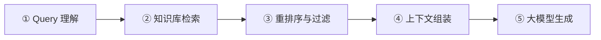
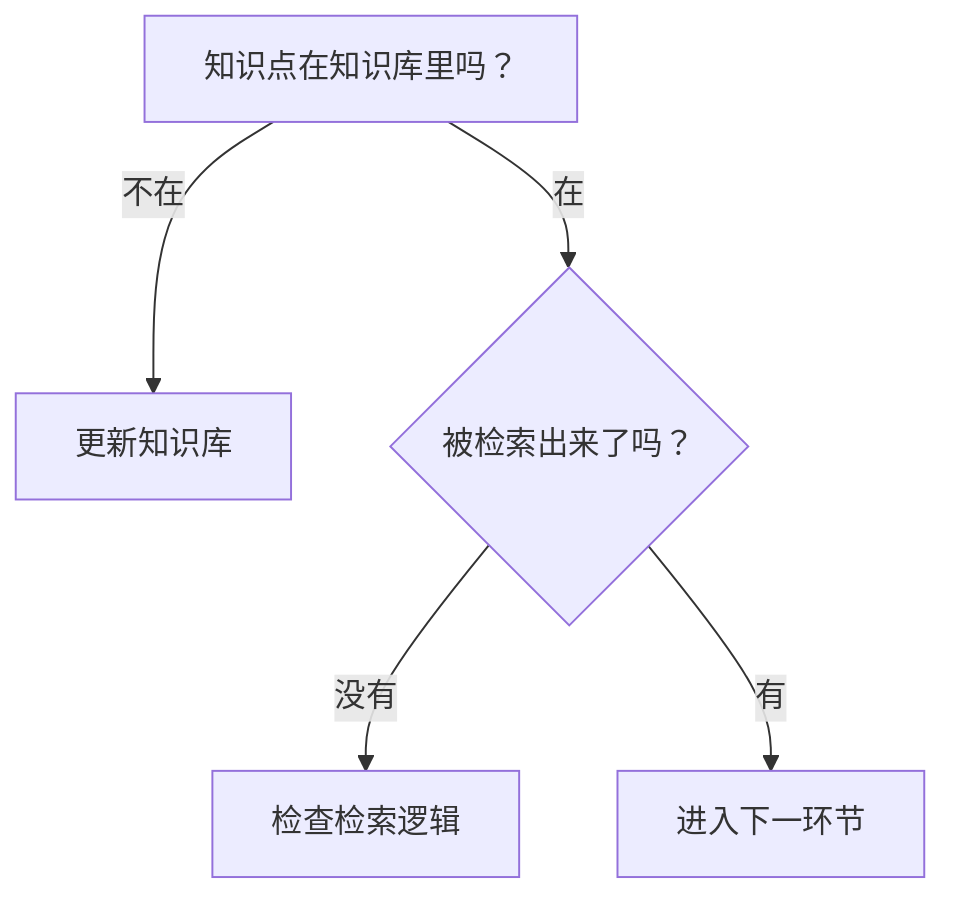

<iframe src="https://player.bilibili.com/player.html?aid=117239000925793&bvid=BV1i3Ys6mEKE&cid=41714124261&page=1&autoplay=0" scrolling="no" border="0" frameborder="no" framespacing="0" allow="fullscreen; picture-in-picture" allowfullscreen="true" style="height:100%;width:100%; aspect-ratio: 16 / 9;"> </iframe>

## 🎯 面试题

> **线上 RAG 系统回答不准确，该如何定位和优化？**

正确的做法是：**先定位问题，再针对性优化，最后用数据验证。**

绝不能一上来就说"改提示词、换模型"——那会让面试官直接让你出门右转。

---

## 🗺️ RAG 五大核心步骤



任何一个环节有问题，答案都不会准。所以应该**顺着链路，一个环节一个环节地排查**。

---

## 🔍 逐环节排查与优化

### 环节一：Query 理解

> 核心：**把人话翻译成规范查询。**

你直接拿人话去搜，可能搜不到；但转成更规范的查询之后再去检索，就能检索到更相关的知识点。

**五种问题类型：**

| 类型 | 示例 | 处理方式 |
|------|------|----------|
| **简单问题** | "你好"、"你是谁" | 直接回答，不走后续检索流程 |
| **指代问题** | "这个能退吗？" | 先做**指代消除**，确定"这个"是哪个 |
| **复合问题** | "X7 能退吗？X8 多少钱？" | **拆成两个问题**分别检索（售后 vs 售前，不同知识库） |
| **乱码问题** | 用户贴了一段 HTML | 先**格式化清洗**，再走后续流程 |
| **意图路由** | 涉及人事/财务等不同业务域 | 先判断属于哪个业务域，再到对应知识库检索 |

---

### 环节二：知识库检索

**关键点：** 先确认知识点到底在不在知识库里。



#### 混合检索

| 检索方式 | 适用场景 | 示例 |
|----------|----------|------|
| **向量检索** | 语义模糊匹配 | "超过七天能不能退" → 匹配"七天内无条件退款" |
| **关键字检索** | 精确匹配 | "X7000 能退吗" → 直接搜 X7000，不会捞回 X6000/X8000 |

> **应该用混合检索，两者结合。** 纯向量检索可能在精确匹配时捞回无关内容。

#### 排查要点

- 知识块**切分逻辑**是否合理？（段落、标题、图表）
- **Top-K** 是否需要调整？
- 向量化和关键字索引是否有问题？

---

### 环节三：重排序与过滤

检索出来可能有很多知识点——不能保证全都相关。

**处理流程：**

```
检索结果
   ↓
① 去重 — 通过知识块 ID 去重
   ↓
② 版本过滤 — 按版本号 / 数据时间过滤，确保不含旧版本
   ↓
③ Rerank — 用 Rerank 模型排序，把最相关的排前面
   ↓
最终知识点列表
```

---

### 环节四：上下文组装

**发送给大模型的数据包含：** 知识点 + 用户问题 + 系统提示词 + **对话历史**。

#### 风险：上下文窗口超限

如果对话很长 + 知识点内容多 → 可能超过上下文窗口 → 需要**上下文压缩**。

> ⚠️ 压缩后要检查：回答用户问题的**关键信息是否丢失**。

#### 排查要点

检查真正发送给大模型的数据里，**到底有没有包含回答用户问题所需的检索资料**。

- ✅ 如果有 → 进入生成环节（可能是忠实度问题）
- ❌ 如果有丢失 → 优化上下文工程（长期记忆、短期记忆、结构化记忆、压缩策略）

---

### 环节五：大模型生成

如果发送的资料包含了用户问题所需数据，但模型仍然回答不准确 → **忠实度不够**。

> 所谓忠实度不够，就是明明给了参考资料，模型却不参考，自由发挥。

#### 系统提示词三条铁律

| 铁律 | 内容 | 说明 |
|------|------|------|
| ① | **只依据资料回答** | 不能自由发挥，不能脑补 |
| ② | **保留前提** | "七天不含激活费"等例外情况不能忽略 |
| ③ | **资料不足就说无法确认** | 答不了就明说，别硬编。恰当的拒绝回答也是正确答案 |

#### 排查路径

```
提示词优化
   ↓ 还不行？
检查资料是否充足
   ↓ 还不行？
换模型
```

---

## ✅ 优化验证

优化之后要用**数据证明**优化是真的有效，不能凭感觉。

### 评估集构建

| 题目类型 | 说明 | 目的 |
|----------|------|------|
| 用户常问问题 + 标准答案 | 核心高频场景 | **守住基本盘** |
| 用户真实问题 | 线上实际流量 | 反映真实效果 |
| 模型答不出的问题 | 边界情况 | 测试能否**恰当拒绝** |
| **有问题的问题** | 复合问题、指代问题、乱码问题等 | 测试 Query 理解能力 |

### 评估原则

> **一次只改一个变量。**

如果你改的步骤越多，最后发现效果提升或变差了——你也不知道到底是哪个步骤影响的。所以建议**每改一个步骤就做一次测试和评估**。

### 持续迭代

不断补充新的 **Bad Case** 到评估集里，形成闭环。

---

## 📋 面试回答模板

```
排查思路：
1. 先看知识库里有没有 → 没有就补充知识库
2. 知识库里有，但检索没找到 → 检查知识块切分 + 混合检索逻辑
3. 检索到了，但排序有问题 → 检查去重、版本过滤、Rerank 逻辑
4. 排序没问题 → 检查上下文工程（资料有没有丢？）
5. 资料都给了但模型答不对 → 检查提示词工程（忠实度），最后考虑换模型
6. 每一步优化后都要用评估集做量化验证
```

> 按照这个思路来回答这道题目，一定能拿到高分。

---

## 📋 字幕全文

<details>
<summary>点击展开完整字幕</summary>

`00:00` Hello
`00:00` 大家好
`00:00` 我是大都督周瑜
`00:02` 从这个视频开始
`00:03` 我会给大家更新一系列的AI相关的面试题
`00:07` 我们先从这一道面试题开始
`00:10` 线上RAG系统回答不准确
`00:12` 我们该如何定位和优化
`00:15` 这道题目
`00:16` 考的其实是你对RAG系统了解的程度
`00:19` 你肯定不能一上来就说改提示词换模型
`00:23` 你如果这么回答
`00:25` 面试官
`00:25` 面试官立马就会让你出门右转
`00:28` 正确的做法是
`00:29` 我们应该先定位问题
`00:31` 因为一般的RAG系统都会有五个核心步骤
`00:35` 我们应该先确定问题出在哪个步骤
`00:39` 或者哪些步骤
`00:40` 然后再有针对性地进行优化
`00:43` 而不是做无用功
`00:45` 优化完之后
`00:47` 我们还要对优化的动作进行验证
`00:49` 我们不能凭感觉要用数据证明优化是真的有效
`00:54` 接下来我们就来看一下啊
`00:57` IG里面这条链路里面五个重要的步骤
`01:00` 第一个步骤是query理解
`01:03` 第二个步骤是知识库检索
`01:05` 第三个步骤是重排序与过滤
`01:08` 第四个步骤是上下文组装
`01:11` 第五个步骤是大模型生成
`01:14` 其中任何一个环节如果有问题
`01:16` 答案都不会准
`01:18` 所以我们应该顺着这条链路
`01:20` 一个环节一个环节的去排查
`01:23` 我们先来看第一个环节
`01:25` query理解
`01:26` query理解的核心是要把人话翻译成规范查询
`01:31` 具体什么意思呢
`01:33` 我这里列举了五种类型的问题
`01:36` 我们依次来看一下
`01:37` 第一种是简单问题
`01:40` 用户如果直接问你好
`01:42` 你是谁
`01:42` 这种简单问题我们可以直接回答
`01:45` 而不需要走后续的检索排序等等流程
`01:50` 第二种是指代问题
`01:52` 用户如果说这个能退吗
`01:54` 那这个具体是指哪一个呢
`01:57` 我们在进行检索之前要先做纸代消除
`02:01` 确定用户说的这个到底是哪个
`02:04` 第三种是复合问题
`02:06` 用户问X7能退吗
`02:08` X8多少钱
`02:10` 这实际上是两个问题
`02:12` 我们应该把它们拆开之后
`02:14` 单独去进行检索
`02:16` 因为这本质上一个是售后问题
`02:19` 一个是售前问题
`02:21` 在你的RAG系统里面
`02:23` 可能是两个不同的知识库
`02:26` 所以应该分别去走后续的检索排序等流程
`02:31` 第四种是乱码问题
`02:33` 如果用户在问问题的时候
`02:35` 贴的是一段HTML
`02:37` 它可能是从其他地方复制过来的
`02:40` HTML里面有用户想问的问题
`02:44` 但同时还有很多额外的乱码
`02:46` 带着这些乱码是没办法直接去检索知识库的
`02:51` 我们应该先进行格式化
`02:53` 先对数据进行清洗之后
`02:56` 再去走后面的步骤
`02:58` 第五种是意图路由
`03:01` 如果你的RG系统里面涉及多个业务域
`03:04` 比如人事
`03:05` 比如财务
`03:06` 那么用户在用RAG系统提问的时候
`03:10` 我们就需要先判断这个问题
`03:13` 对应的是哪个业务域
`03:15` 然后再到对应业务域的知识库里面去进行检索
`03:19` 所以从这里可以看出
`03:21` 作为一个RAG系统
`03:23` 最重要的第一步
`03:24` 其实是把人画翻译成
`03:27` 适合RAG系统工作的规范
`03:30` Query
`03:30` 你直接拿人话去搜去查
`03:32` 可可能查不到
`03:34` 但把它转成更规范的查询之后再去检索
`03:38` 就能检索到更相关的知识点
`03:41` query理解做完之后
`03:42` 接下来我们就要拿这个query
`03:44` 或者说是改写之后的规范
`03:47` 查询到知识库里面去进行检索
`03:50` 这里有一个非常重要的环节
`03:52` 其实是知识库的创建
`03:54` 它需要根据你具体的文档
`03:57` 可能是PDF
`03:59` 可能是HTML
`04:00` 可能是markdown等等
`04:02` 对文章里面的段落标题图表去进行切分
`04:06` 然后进行向量化生成最终的向量知识库
`04:10` 关于这一部分
`04:11` 我后面会单独分享一个视频来讲解
`04:14` 那知识库构建好之后
`04:16` 真正处理用户query的时候
`04:18` 我们就需要到这个知识库里面去进行检索
`04:22` 一般来说我们都会用混合检索
`04:25` 也就是向量检索加关键字检索
`04:29` 两者结合起来
`04:30` 因为有的情况下向量检索是不合适的
`04:34` 比如用户问X7000能退吗
`04:36` 如果用向量检索
`04:38` 很有可能会把X6000
`04:40` X8000相关的知识块捞回来
`04:43` 这种是没有必要的
`04:45` 而且捞出来之后其实是会有副作用的
`04:48` 所以这种query就特别适合关键字检索
`04:52` 直接用X7000到知识库里面去进行关键字搜索
`04:57` 搜出来的肯定都是跟X7000相关的知识点
`05:02` 而向量解锁呢则更适合语义模糊匹配
`05:06` 比如用户问超过七天能不能退
`05:08` 就很容易匹配到我们知识库里面
`05:11` 七天内无条件退款的知识点
`05:14` 因为我们在做检索的时候
`05:16` 应该用混合检索
`05:17` 来更好的把用户问题匹配的知识点找出来
`05:21` 我们在排查的时候
`05:22` 首先要确定用户问题对应的知识点
`05:25` 到底在不在知识库里面
`05:28` 如果连知识点都不在知识库里面
`05:30` 那我们应该先更新知识库
`05:33` 而如果需要的知识点已经在知识库里面
`05:36` 只是检索
`05:37` 没有把它检索出来
`05:39` 那么我们就要具体看向量检索以及关键字检索
`05:43` 是不是有问题
`05:44` 可能需要调整top k或具体的检索逻辑
`05:48` 或者还要调整知识块的切分逻辑
`05:51` 尽可能把用户问题所需要的知识点检索出来
`05:56` 解锁做完之后可能会检索出来很多知识点
`05:59` 这些知识点里面
`06:01` 我们不能保证
`06:02` 一定都是跟当前query相关的问题
`06:05` 很有可能有一些没有那么相关的知识点
`06:09` 也被找出来了
`06:11` 这时候我们就需要对检索出来的知识点
`06:14` 进行排序
`06:15` 把跟query非常相关的排在前面
`06:18` 没那么相关的排在后面
`06:20` 所以一般来说我们会用RERANK模型来进行排序
`06:24` 当然在排序之前其实还可以先做去虫
`06:28` 因为通过向量检索关键字检索
`06:30` 很有可能会找到相同的知识点
`06:33` 那我们就可以通过知识点的id
`06:36` 或者其他的一些维度来进行去
`06:39` 从
`06:39` 另外如果你的知识库里面
`06:41` 某些知识点发生了更新
`06:44` 但旧版本还留在知识库里的话
`06:46` 那要注意你解锁出来的内容
`06:49` 可能既包含新的版本
`06:51` 也包含老的版本
`06:53` 所以检索出来之后还要做版本过滤
`06:55` 根据版本号数据时间来过滤
`06:58` 只有对检索出来的知识点做了
`07:01` 正确的去从过滤排序
`07:03` 我们最终才能得到一份更好的知识点列表
`07:07` 拿到排序之后的知识点列表
`07:10` 我们就需要把知识点用户的问题
`07:13` 连同系统提示词一起发给大模型
`07:16` 但要注意除了这三者
`07:18` 我们还需要把兑换历史也发送给大模型
`07:22` 所以这个地方就要注意
`07:24` 如果你当前的对话以及很长
`07:27` 再加上刚刚找出来的知识点的内容
`07:30` 很有可能会超过大模型
`07:32` 现在的上下文窗口
`07:34` 所以就需要做上下文压缩
`07:37` 而一旦做了三项文压缩
`07:39` 就要注意
`07:40` 会不会把回答用户问题的关键信息丢失掉
`07:44` 如果丢失掉了回答问题的关键信息
`07:48` 那么大模型尽管接收到了
`07:50` 我们检索出来的知识点
`07:53` 最终也可能回答不准确
`07:55` 所以我们需要做好上下文工程
`07:58` 长期记忆
`07:59` 短期记忆
`07:59` 结构化记忆
`08:00` 包括压缩提示词都要认真设计
`08:03` 所以在排查问题的时候
`08:05` 我们要去检查真正发送给大模型的数据里面
`08:09` 到底有没有包含
`08:11` 回答用户问题所检索出来的资料
`08:14` 如果发现有丢失有遗漏
`08:16` 那就要去优化我们的上下文工程
`08:20` 如果发送给模型的数据
`08:21` 里面包含了用户问题所需要的数据
`08:26` 但模型最终仍然回答不准确
`08:29` 这就表示忠实度不够
`08:32` 所谓忠实度不够
`08:34` 就是明明给了参考资料
`08:35` 模型却布置参考
`08:37` 而是自由发挥
`08:38` 这是生成环节的典型问题
`08:41` 要解决这个问题
`08:43` 我们就需要提示词工程
`08:46` 我们在RG的系统提示词里面
`08:48` 至少要有三条铁律
`08:50` 第一条只依据资料回答
`08:53` 不能自由发挥
`08:54` 不能脑补
`08:55` 第二条
`08:56` 保留前提
`08:57` 例外否定像七天不含激活费除外情况
`09:01` 这些都不能忽略
`09:03` 第三条
`09:04` 资料不足
`09:04` 就说无法确认
`09:06` 答不了就明说
`09:07` 别硬编
`09:08` 恰当的拒绝回答也是正确答案咳
`09:13` 所以一旦发现模型的忠实度比较低
`09:16` 我们就要去优化系统提示时
`09:18` 如果提示词也优化了
`09:21` 给的资料也充足了
`09:22` 模型仍然还是回答不对
`09:25` 这个时候可能就要考虑换模型了
`09:28` 最后经过上面这些步骤的排查和优化
`09:31` 我们还要对优化的动作进行验证
`09:34` 进行评估
`09:35` 所以要准备一套评估题目
`09:38` 也就是评估集
`09:39` 这个评估集里面的题目类型要全一点
`09:43` 这样我们才能评得更准一点
`09:46` 比如第一用户常问的一些问题以及标准答案
`09:49` 我们肯定要有
`09:50` 这样才能守住基本盘
`09:53` 第二用户问的一些真实问题
`09:55` 我们也要拿来进行测试
`09:57` 第三模型或者RAG回答不了的问题
`10:01` 我们也要测试
`10:02` 看我们的RAG系统能不能拒绝回答
`10:04` 第四有问题的问题
`10:06` 就是我们前面讲的复合问题
`10:09` 指代问题
`10:09` 乱码问题等等
`10:11` 我们要看系统能不能正确处理
`10:13` 另外我们还要持续不断的补充新的bad case
`10:17` 到评估集里面
`10:19` 还有一点
`10:19` 我们每次优化的时候
`10:21` 建议只改一个变量
`10:23` 也就是只改一个步骤
`10:25` 然后来进行评估
`10:26` 因为如果你改的步骤越多
`10:29` 最后发现效果提升了或变得更差了
`10:32` 你也不知道到底是哪个步骤影响的
`10:36` 所以建议每改一个步骤就做一次测试和评估
`10:41` 最后总结一下面试官问啊
`10:44` AG系统回答不准确
`10:45` 如何定位和优化
`10:47` 我们的排查思路就是先看知识库里面有没有
`10:51` 如果没有
`10:51` 就补充知识库
`10:53` 知识库里面有
`10:54` 但是检索没找到
`10:56` 那我们就要检查知识库的知识块的切分
`11:00` 以及混合检索的逻辑是不是需要优化
`11:04` 如果检索到了
`11:05` 但是排序有问题
`11:07` 那我们要去检查
`11:08` 去从排序过滤的逻辑
`11:10` 如果排序也没有问题
`11:12` 那我们就要去检查上下文工程以及提示时工程
`11:17` 按照这个思路来回答这道题目
`11:19` 一定能让你拿到高分

</details>

---

## 🔗 相关链接

- B 站视频：https://www.bilibili.com/video/BV1i3Ys6mEKE/
- [[2026-09-09-Google总结了5种Skill设计模式，让Agent稳定输出]]（RAG 的上层 Agent 设计模式）
- [[【MT-Bench 实测】LLM-as-Judge 的四大偏差]]（评估方法论）