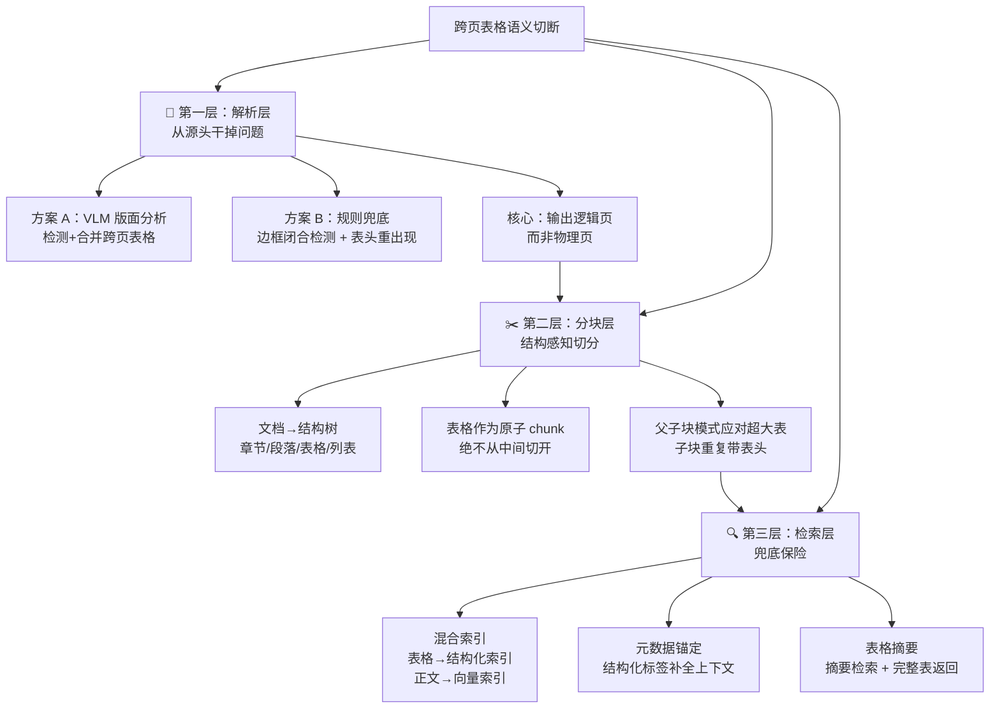

<iframe src="https://player.bilibili.com/player.html?aid=117245325876496&bvid=BV1QhYM6fEs3&cid=41752266464&page=1&autoplay=0" scrolling="no" border="0" frameborder="no" framespacing="0" allow="fullscreen; picture-in-picture" allowfullscreen="true" style="height:100%;width:100%; aspect-ratio: 16 / 9;"> </iframe>

> [!question] 面试题
> RAG 系统里跨页表格怎么规避语义被切断的问题？——要是只回答"把 chunk 调大一点"，那基本就凉了。

---

## 🧠 问题本质

> **物理分页把语义完整性给破坏了。**

PDF 文档按页组织（物理边界），但表格可能从一页底部延伸到下一页顶部（语义边界）——**两者打架了**。

```
┌──────────────┐
│  表头 (第 N 页) │ ← 一个 chunk 只剩表头
├──────────────┤
│  ── 分页线 ── │
├──────────────┤
│ 裸数字 (N+1 页)│ ← 另一个 chunk 只剩无头数字
└──────────────┘
```

这两个 chunk 被 embedding 后，不管命中哪个，大模型拿到都是一脸懵。

---

## ⚠️ 为什么不好解决？——四个难点

| 难点 | 说明 |
|------|------|
| **① 表格结构依赖性强** | 表头 + 行列关系才构成完整语义；切断后裸数字 embedding 质量直接崩掉 |
| **② 跨页检测本身难** | PDF 解析器逐页独立处理，不知道上一页有个表格还没完，**缺乏跨页语义感知** |
| **③ 分块粒度矛盾** | chunk 切小 → 表格必被切；chunk 切大 → embedding 语义密度稀释 → 检索精度下降 |
| **④ 表格类型五花八门** | 有限表 / 无限表 / 合并单元格 / 嵌套表，每种解析难度不同；加上前后引导/分析文字也被切断 |

---

## 🏗️ 三层递进解决方案



---

## 第一层 🔧 解析层：从源头干掉问题

> **根解不在分块策略，而在解析阶段。**

### 核心思路

既然问题是按页切导致表格被拆散，那就在**解析的时候识别跨页表格 → 直接合并成一张完整表格 → 再进分块流程**。

**输出的是逻辑页，不是物理页。**

### 做法对比

| 方案 | 方法 | 优劣 |
|------|------|------|
| **VLM 版面分析（推荐）** | 用视觉语言模型识别：页面上哪里有表格 + 表格是否在底部被截断 + 下一页开头是否延续了上一页的表格 → 自动合并 | ✅ 精度高，从根源解决问题<br>❌ 需要 VLM 推理成本 |
| **规则兜底** | 检测表格最后一行有没有闭合边框 + 下一页开头有没有出现新的表头 → 判断是否合并 | ✅ 零额外成本<br>❌ 规则覆盖不全，容易漏 |

> [!important] 第一层核心
> **表格的完整性必须在解析阶段就保证好，别等到分块的时候再亡羊补牢。**

---

## 第二层 ✂️ 分块层：结构感知切分

解析层合并完整后，分块时不能再切碎。

### 做法

1. **文档先解析成结构树**：章节 / 段落 / 表格 / 列表 全部理清楚
2. **表格作为原子 chunk**，绝不从中间切开
3. **chunk 边界必须对齐文档的逻辑结构**，而不是物理页面

### 应对超大表：父子块模式（Parent-Child Chunking）

当表格超过 embedding 模型的 token 上限时：

```
完整表格（父块）
├── 子块① [表头 + 行 1~5]
├── 子块② [表头 + 行 6~10]
└── 子块③ [表头 + 行 11~15]
```

| 组件 | 角色 |
|------|------|
| **子块**（Child） | 用于精确检索，**每个子块都重复带表头**，确保语义完整 |
| **父块**（Parent） | 命中子块后，返回完整表格给大模型 |

> 检索精度和语义完整性都保住了。

---

## 第三层 🔍 检索层：兜底保险

### 三招兜底

| 招数 | 做法 | 目的 |
|------|------|------|
| **① 混合索引** | 表格走结构化索引（甚至关系数据库），正文走文本向量索引；查询时**并行检索两边结果融合** | 表格检索精度大幅提升 |
| **② 元数据锚定** | 给每个 chunk 加结构化标签：所属表格、表头、前后 chunk、语义是否完整 | 命中不完整 chunk 时自动拉取相邻 chunk 补全上下文 |
| **③ 表格摘要** | 超长表格先生成一个摘要文本，摘要进向量库检索；命中摘要后将完整表返回给大模型 | 摘要做代理，避免长表检索稀释语义 |

> 第三层是"防漏网"——前两层已解决大部分问题，检索层作为最后一道保险。

---

## ✅ 面试标准答案框架

> 三点答清，体现系统性工程思维：

| 层面 | 一句话 | 技术要点 |
|------|--------|----------|
| **第一层：解析** | 从源头干掉问题 | VLM 版面分析 / 规则兜底 → 检测并合并跨页表格 → 输出逻辑页 |
| **第二层：分块** | 结构感知切分 | 结构树 → 表格作为原子 chunk → 超大表用父子块 + 重复表头 |
| **第三层：检索** | 兜底保险 | 混合索引 / 元数据锚定 / 表格摘要 |

> [!quote] 面试官想听到的
> 面试官想听的不仅是你懂 RAG，还懂**系统性的工程思维**——从源头到兜底，层层守住表格的语义完整性。

---

## 🔗 关联阅读

- [[Bilibili/2026-09-10-DeepSeek面试官问：生产RAG系统回答不准确，该如何定位和优化？|RAG 生产系统定位与优化五步法]]
- [[RAG 分块策略对比]]

---

## 📋 字幕全文

<details>
<summary>点击展开完整字幕</summary>

`00:00` 面试官问你
`00:01` rag系统里跨页表格
`00:02` 怎么规避语义被切断的问题
`00:04` 这个问题啊
`00:05` 你要是只回答把chunk调大一点
`00:07` 那基本就凉了
`00:08` 为什么来咱们一层一层把它拆开
`00:11` 首先搞清楚这个问题到底是怎么来的
`00:14` 你看啊
`00:15` PDF文档是按页来组织的
`00:17` 一页一页翻吗
`00:18` 但表格呢
`00:19` 它可能从这一页的底部
`00:21` 一直延伸到下一页的顶部
`00:23` 物理边界和语义边界
`00:25` 他俩打架了
`00:26` 结果就是什么
`00:28` 表头在第N页数据行跑到第N加一页去了
`00:31` 切完之后
`00:32` 一个chunk只剩个表头
`00:34` 另一个chunk只剩一堆没有表头的裸数字
`00:37` 那这两个chunk被embedding之后
`00:39` 扔进向量库检索的时候
`00:41` 不管命中哪个大模型
`00:42` 拿到手里都是一脸懵
`00:44` 这对数字到底啥意思
`00:46` 这就是问题本质
`00:47` 物理分页把语义完整性给破坏了
`00:50` 那你可能会想
`00:51` 这问题听起来也不复杂
`00:53` 为什么不好解决
`00:54` 我跟你说
`00:55` 难点还真不少
`00:56` 第一个表格的结构依赖性特别强
`00:59` 表头加上行列关系
`01:01` 这才构成完整的语义
`01:02` 一旦切断数据行就变成裸数字了
`01:05` embedding质量直接崩掉
`01:07` 第二个跨页检测本身就很难
`01:09` PDF解析器
`01:10` 它是一页一页独立处理的
`01:12` 他不知道上一页有个表格还没完
`01:14` 缺乏跨页的语义感知能力
`01:16` 第三个分块力度有个天然的矛盾
`01:19` chunk切小了吧
`01:21` 表格必被切切大了吧
`01:23` embedding的语义密度又会被稀释
`01:25` 检索精度就下来了
`01:27` 左右为难
`01:28` 还有表格类型五花八门
`01:30` 有限表无限表
`01:31` 合并单元格的嵌套的每种解析难度都不一样
`01:34` 再加上表格前后往往还有引导文字和分析文字
`01:38` 这些上下文也会被分块一起切断
`01:41` 所以你看这真不是一个简单问题
`01:43` 那怎么解决第一层也是最重要的一层
`01:47` 在文档解析阶段就从源头把问题干掉
`01:50` 思路是这样的
`01:51` 既然问题是暗夜切
`01:53` 导致表格被拆散
`01:54` 那我就在解析的时候识别出哪些表格是跨页的
`01:58` 直接把它们合并成一张完整表格
`02:01` 然后再进入后面的分块流程
`02:03` 用大白话说就是输出的是逻辑页
`02:06` 不是物理液
`02:07` 具体怎么做
`02:08` 现在主流的做法是
`02:09` 用视觉语言模型来做版面分析
`02:12` 比如它能识别页面上哪里有表格
`02:14` 表格有没有在页面底部被截断
`02:17` 下一页开头是不是延续了上一页的表格
`02:19` 识别出来之后自动合并
`02:21` 这就是从根源上解决问题
`02:24` 当然如果你不用VRM也可以靠规则来兜底
`02:28` 比如检测表格最后一行有没有闭合边框
`02:31` 下一页开头有没有出现新的表头
`02:33` 通过这些信号来判断要不要合并核心
`02:36` 就一句话
`02:37` 表格的完整性必须在解析阶段就保证好
`02:40` 别等到分块的时候再亡羊补牢好
`02:43` 解析层做完之后
`02:45` 表格已经是完整的了
`02:46` 但分块这一步你还得小心
`02:48` 你不能因为chunk窗口设的不好
`02:50` 又把人家辛辛苦苦合并好的表格给切了
`02:53` 所以第二层的思路是结构感知切分什么意思
`02:57` 就是把文档先解析成一颗结构树
`03:00` 章节段落表格列表
`03:01` 这些都理清楚
`03:02` 然后分块的时候
`03:04` 表格作为一个整体
`03:05` 当做一个chunk
`03:06` 绝不从中间切开
`03:08` chunk的边界
`03:09` 必须对其文档的逻辑结构
`03:11` 而不是物理页面
`03:12` 那如果表格实在太大
`03:13` 超过了embedding模型的token上限怎么办
`03:16` 这时候就用父子块模式
`03:18` 把大表按行拆成若干个子块
`03:21` 每个子块里都把表头重复带上
`03:23` 这样每个子块都是表头加若干行数据的
`03:26` 完整语义单元
`03:28` 检索的时候
`03:29` 子块用来做精确匹配
`03:30` 命中了
`03:31` 就把整个副块也就是完整表格返回给大模型
`03:34` 这样一来检索精度和语义完整性就都保住了
`03:38` 前两层已经把大部分问题解决了
`03:41` 但检索这一层呢
`03:42` 我们还得再上一道保险
`03:44` 作为兜底
`03:45` 第一招
`03:45` 混合索引表格和正文不要混在一起
`03:48` 见向量索引分开建表格
`03:50` 走结构化索引
`03:51` 甚至可以放到支持表格查询的关系数据库里
`03:54` 正文走文本向量索引查询的时候
`03:57` 并行检索两边结果融合
`03:59` 这样表格的检索精度会高很多
`04:01` 第二招
`04:02` 原数据锚定
`04:03` 给每个chunk加一些结构化标签
`04:05` 属于哪个表格
`04:06` 表头是什么
`04:07` 前后chunk是谁
`04:09` 语义是否完整
`04:10` 这样检索的时候
`04:11` 如果命中了一个不完整的chunk
`04:13` 系统能自动把相邻chunk也拉过来
`04:15` 补全上下文
`04:16` 第三招
`04:17` 表格摘要
`04:18` 如果表格实在太长
`04:20` 可以先生成一个摘要文本
`04:21` 把摘要扔进向量库参与检索检索
`04:24` 命中摘要之后
`04:25` 再把完整表格返回给大模型
`04:28` 等于是用摘要做代理好
`04:30` 最后咱们串一下跨页表格语义切断这个问题
`04:34` 它的根解不在分块策略
`04:35` 而在解析阶段
`04:36` 先进工具在解析时
`04:38` 就完成了跨页表格的检测和合并
`04:40` 这是第一层分块阶段
`04:42` 用结构感知切分
`04:43` 保证表格作为原子单元存在
`04:45` 这是第二层检索阶段
`04:47` 用混合索引和父子快机制兜底
`04:49` 这是第三层三层递进
`04:51` 从源头到兜底
`04:53` 层层守住表格的语义完整性
`04:55` 才能真正根治这一顽疾
`04:57` 面试的时候
`04:58` 你按这个思路答
`04:59` 面试官就知道你不仅懂rag
`05:01` 还懂系统性的工程思维
`05:03` 这才是他们想听到的

</details>

---

## 🔗 参考链接

- B 站视频：https://www.bilibili.com/video/BV1QhYM6fEs3/
- [[Bilibili/2026-09-10-DeepSeek面试官问：生产RAG系统回答不准确，该如何定位和优化？|RAG 生产系统定位与优化五步法]]