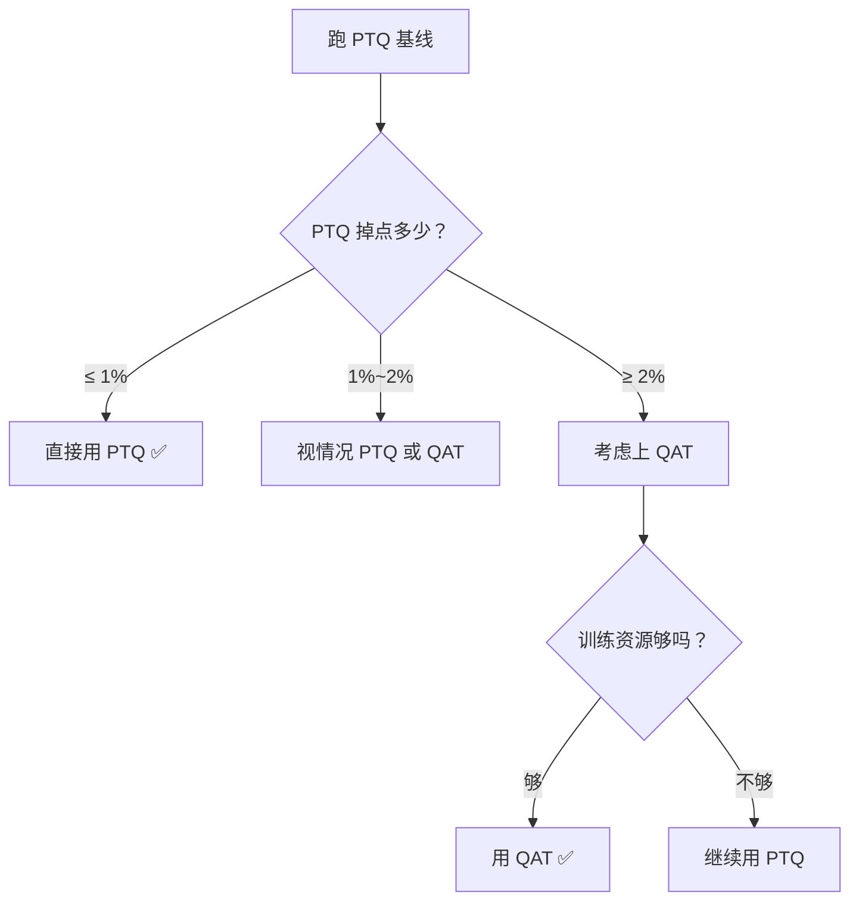

<iframe src="https://player.bilibili.com/player.html?aid=117219338095241&bvid=BV1pQb76YE6q&cid=41617588539&page=1&autoplay=0" scrolling="no" border="0" frameborder="no" framespacing="0" allow="fullscreen; picture-in-picture" allowfullscreen="true" style="height:100%;width:100%; aspect-ratio: 16 / 9;"> </iframe>

## 📺 视频简介

训练后量化（PTQ）掉点多，训练时就量化（QAT）能少掉甚至不掉，但训练复杂度大增。**什么时候用 QAT、什么时候用 PTQ？**

适合做模型量化部署 & 准备算法岗面试的同学。

---

## ⚖️ QAT vs PTQ：总览对比

| 维度 | PTQ（训练后量化） | QAT（量化感知训练） |
|------|------------------|-------------------|
| **时机** | 训练完的 FP32 模型 → 直接量化到 INT8 | 训练过程中就模拟量化效果 |
| **复杂度** | 简单 ✅ | 复杂 |
| **精度** | 掉点多 ❌（通常 2%~5%） | 掉点少 ✅（通常 < 0.5%） |
| **资源需求** | 低 | 高 |

---

## 🔧 QAT 核心机制

### ① Fake Quantization（伪量化）

前向传播时模拟量化效果：

```
权重 / 激活 (FP32)
    ↓  量化
INT8
    ↓  反量化
FP32（精度已损失，和真正量化后一样）
```

> 前向计算的精度和真正量化后一致。

### ② Straight-Through Estimator（直通估计器）

**问题：** 量化操作**不可导**，反向传播时梯度无法通过量化节点。

**解法：** 直通估计器——把梯度**直接传过去**，绕过量化不可导的问题。

```
反向传播时：
梯度 ──→ [量化节点(不可导)] ──→ 梯度直接穿透，不修改
```

---

## 📋 QAT 训练流程五步


| 步骤 | 操作 | 说明 |
|------|------|------|
| ① | 加载预训练好的 **FP32 模型** | 基座模型 |
| ② | 插入 **QAT 模块** | 在权重和激活上添加 `FakeQuantize` 节点 |
| ③ | 用原始数据**微调几个 epoch** | 让模型适应量化精度损失，学习率需比原始训练**低 10 倍** |
| ④ | 训练完成 → **导出真正的量化模型** | 移除伪量化节点，导出 INT8 |
| ⑤ | **验证精度** | 和 FP32 基线对比 |

---

## 🤔 选型标准

### 判断流程



### 一句话决策

> **能 PTQ 就别 QAT，掉点超过两个点再上重武器。**

| 场景 | 推荐 |
|------|------|
| PTQ 掉点 ≤ 1% | **PTQ** ✅ 直接上，不需要 QAT |
| PTQ 掉点 ≥ 2% | **考虑 QAT** |
| 移动端部署（精度敏感） | **QAT** |
| 训练资源不够 | **PTQ** |
| 训练资源够且精度要求高 | **QAT** ✅ 效果更好 |

---

## 🛠️ 实操建议

### 工具：PyTorch Quantization 模块

```
Prepare → 插入 QAT Config → 微调 → Convert → 验证
```

### 关键参数

| 参数 | 建议 |
|------|------|
| **微调 epoch** | 3 ~ 5 个 epoch |
| **学习率** | 比原始训练**低 10 倍**（否则会破坏已有的表示） |
| **预期精度损失** | QAT：**< 0.5%** ✅ / PTQ：**2%~5%** ❌ |

---

## 📋 30 秒回顾

1. **PTQ** = 训练后直接量化，简单但掉点多
2. **QAT** = 训练时就模拟量化，让模型适应精度损失
3. **核心机制**：`FakeQuantize` + `Straight-Through Estimator`——让不可导的量化变得可训练
4. **选型标准**：PTQ 掉点 **超过 2%** 才值得上 QAT
5. **QAT 精度**：损失通常 **0.5% 以内**，远好于 PTQ 的 2%~5%

> **一句话带走：能 PTQ 就别 QAT，掉点超过两个点再上重武器。**

---

## 📋 字幕全文

<details>
<summary>点击展开完整字幕</summary>

`00:00` 训练后量化PTQ掉点多
`00:01` 训练时就量化QAT能少掉甚至不掉
`00:05` 但训练复杂度大增
`00:06` 什么时候用q a at
`00:07` 什么时候用PTQ
`00:09` 今天3分钟讲透
`00:10` 先理解QAT和PTQ的区别
`00:13` PTQ训练完的FP32模型
`00:15` 直接量化到INT8简单
`00:17` 但吊点q a at训练时就模拟量化效果
`00:19` 让模型适应量化后的精度
`00:21` 损失复杂
`00:22` 但掉点少
`00:23` q a at的核心机制
`00:24` Fake quantization
`00:26` 在前向传播时模拟量化效果
`00:28` 权重先量化到INT8
`00:30` 再反量化回FP32
`00:32` 这样前项计算的精度和真正量化后一样
`00:35` 反向传播时用直通估计straight through estimator
`00:38` 绕过量化不可导的问题
`00:40` 把梯度直接传过去
`00:41` q a at怎么训练
`00:43` 第一步加载预训练好的FP32模型
`00:46` 第二步插入QAT模块
`00:48` 在权重和激活上加fake quanti
`00:50` 第三步
`00:51` 用原始数据微调几个epoch
`00:53` 让模型适应量化精度损失
`00:55` 第四步
`00:56` 训练完成后
`00:57` 导出真正的量化模型
`00:58` 第五步
`00:59` 验证量化模型的精度和FP32基线对比
`01:02` 什么时候用QATPTQ掉点在1%以内
`01:05` 直接用PTQ
`01:06` 不需要q a at p t q掉点超过2%
`01:09` 考虑q a at对量化精度极度敏感的场景
`01:12` 比如移动端部署用q a at训练资源不够
`01:15` 用PTQ训练资源够用q a at效果更好
`01:19` 实操建议用PYTORCH的框TIZATION模块
`01:21` qa at支持准备模型
`01:23` 插入q a at config微调3~5个epoch
`01:26` 导出量化模型
`01:27` 注意q a at微调的学习率要比原始训练低十倍
`01:31` 否则会破坏已有的表示经验值
`01:33` q a at后精度损失通常在0.5%以内
`01:36` 远好于PTQ的2%到五三十秒带走
`01:40` 第一q a at训练时就模拟量化
`01:42` 让模型适应精度损失
`01:44` 第2PTQ训练后直接量化简单
`01:47` 但掉点多
`01:47` 第3fake quantize加直通估计器是核心机制
`01:51` 第4PDQ掉点超2%才值得用QAT
`01:54` 第5QAT后精度损失通常0.5%以内
`01:58` 看懂了点个关注
`01:59` 下期接着拆
`02:00` 30秒回顾第一PTQ是训练后量化
`02:04` q a at是训练中就模拟量化
`02:07` 第2q a at靠伪量化节点加直通估计器
`02:11` 让本来不可导的量化操作变得可训练
`02:14` 第三落地五步
`02:16` Prepare caught
`02:17` 校准微调convert
`02:19` 最后验证
`02:20` 第四判断标准很简单
`02:22` PDQ掉点超过2%
`02:24` 就该上QAT来救精度
`02:26` 一句话带走
`02:27` 能PDQ就别QAT掉点超过两个点
`02:30` 再上重武器
`02:31` 看懂了点个关注
`02:32` 下期接着拆

</details>

---

## 🔗 相关链接

- B 站视频：https://www.bilibili.com/video/BV1pQb76YE6q/
- PyTorch Quantization 文档：https://pytorch.org/docs/stable/quantization.html
- [[2026-09-09-【科学调参】梯度噪声尺度：用一百步小实验算出最优 batch size]]
- [[2026-09-09-【调参工具】LR Finder 详解：怎么画、怎么读、怎么和 warmup 配合]]