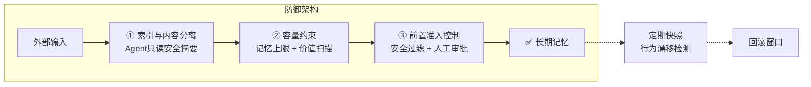
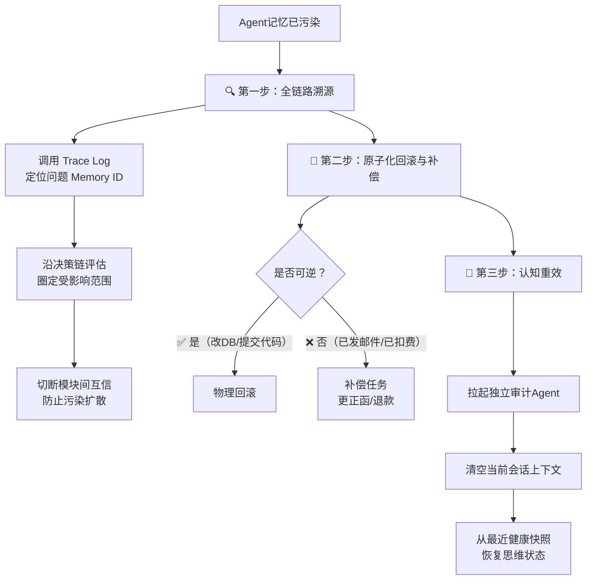

<iframe src="https://player.bilibili.com/player.html?aid=116832623201731&bvid=BV1yzKU6aEY9&cid=39504381776&page=1&autoplay=0" scrolling="no" border="0" frameborder="no" framespacing="0" allow="fullscreen; picture-in-picture" allowfullscreen="true" style="height:100%;width:100%; aspect-ratio: 16 / 9;"> </iframe>

> [!danger] 面试别踩坑
> 千万别只回答"清空缓存就完事"——这个问题在大厂 AI 架构师面试里考察的是**系统架构安全机制 + 灾后恢复能力的深度思考**，不是简单的 bug 修复。

---

## 1️⃣ 记忆污染 ≠ 缓存异常

| 维度       | 传统缓存异常               | Agent 记忆污染                                               |
| -------- | -------------------- | -------------------------------------------------------- |
| **数据性质** | 死数据系统，出错抛 Error 程序中断 | Agent 拿着错误记忆**继续自主决策**，自己浑然不知                            |
| **修复方式** | 清空缓存、重启会话            | 需要全链路溯源 + 状态恢复，远超简单清理                                    |
| **风险等级** | 局部故障，影响有限            | **认知受损**——记忆成为 Agent 的"动态配置"，控制后续行为                      |
| **典型案例** | 缓存穿透、雪崩              | **间接提示注入**（攻击者将恶意指令藏在网页中，Agent 读取后写入长期记忆，后续每次任务静默执行恶意操作） |

> [!warning] 记忆污染的本质
> 记忆不再只是数据——它直接变成了 Agent 的**动态配置层**，控制了 Agent 的行为。像防范 SQL 注入一样警惕外部写入源。

---

## 2️⃣ 事前防御：三道防线



### ① 索引与内容分离（Index-Content Separation）

| 层级            | 存储内容       | 访问权限     |
| ------------- | ---------- | -------- |
| **Agent 可访问** | 安全摘要、元数据索引 | 所有 Agent |
| **隔离环境**      | 原始敏感内容     | 受限、高安全隔离 |

> 就算内容被污染了，**它也扩散不出来**——影响范围被大大缩小。

### ② 容量约束与漂移防护

```
无限记忆空间
      ↓ ❌
  垃圾信息/恶意指令淹没 Agent
      ↓
设定记忆上限 → 倒逼价值扫描
      ↓
定期做记忆快照
      ↓
检测到行为漂移 → 从快照回滚
```

| 机制 | 作用 |
|------|------|
| **记忆容量上限** | 限制垃圾信息堆积，倒逼写入前先**价值扫描** |
| **定期快照** | 保留历史健康状态，形成**回滚窗口** |
| **行为漂移检测** | 发现 Agent 行为异常时，回滚到干净快照 |

### ③ 前置准入控制

```
数据写入长期记忆前
      ↓
┌──────────────────────┐
│  安全扫描过滤器        │ ← 识别异常行为模式
└──────────────────────┘
      ↓
┌──────────────────────┐
│  （可选）人工审批环节    │ ← 高价值写入操作
└──────────────────────┘
      ↓
✅ 绝大多数的污染源在门口就被拦截
```

---

## 3️⃣ 事后恢复：三步走

> 错误信息已经被 Agent 用过了怎么办？——这才是拉开差距的地方。



### 第一步：全链路溯源

| 动作 | 方法 |
|------|------|
| **定位毒源** | 调用 Trace Log（链路日志），顺藤摸瓜找到出问题的 **Memory ID** |
| **评估影响** | 沿决策链走查，圈定所有派生决策的**影响范围** |
| **切断传播** | 切断相关模块间的互信关联，**防止污染在多 Agent 系统中像病毒一样传染** |

### 第二步：原子化回滚与补偿

| 动作类型 | 示例 | 处理方式 |
|----------|------|----------|
| **可逆操作** | 改了数据库、提交了代码 | 直接**物理回滚**到事故前状态 |
| **不可逆操作** | 已发出错误邮件、已创建扣费账单 | 启动**补偿任务**——自动生成并执行补救动作（更正函 / 退款申请） |

> 把实体的损失降到最低。

### 第三步：认知重效（Cognitive Reset）

```
① 拉起完全独立的审计 Agent → 会诊
② 强行清空当前会话上下文
③ 从最近一个健康快照 → 恢复思维状态
```

> **外部行为补救 + 内部记忆净化**——实现存储层和执行层的深度进化。

---

## 4️⃣ 核心架构洞察

### 核心认知

> [!quote] 关键洞察
> 在现代 Agent 系统里，**长期记忆 = 非结构化的动态微调配置层**。既然是配置层，改了记忆就能改变 Agent 的行为逻辑。

### 两条红线

| 红线 | 原因 |
|------|------|
| **❌ 不设无限记忆空间** | 无克制的存储 = 高昂 token 成本 + 长尾指令混淆 + 攻击者可乘之机 |
| **❌ 不剥夺用户的回滚控制权** | 用户必须拥有记忆的**最终解释权 + 清理权**，系统才有安全兜底 |

---

## ✅ 面试答案框架

> **防重于治是基础，溯源回滚是核心。**

| 环节 | 一句话 | 要点 |
|------|--------|------|
| **辨明本质** | 记忆污染 ≠ 缓存异常 | 间接提示注入、认知受损、动态配置层 |
| **三道防线** | 事前防 | 索引分离 / 容量约束+快照 / 准入控制 |
| **三步恢复** | 事后救 | 溯源 → 回滚/补偿 → 认知重效 |
| **红线** | 架构兜底 | 无限记忆不行，用户控制权不能丢 |

> 把记忆污染上升为**系统级故障状态恢复**——通过链路溯源锁死扩散，通过补偿任务挽回实体损失，最后通过认知重效实现存储层和执行层的深度进化。

---

## 🔗 关联阅读

- [[2026-09-10-面试精讲：多 Agent 系统共享记忆核心原理|多 Agent 共享记忆核心原理]]（同一 UP 主的姊妹篇）

---

## 📋 字幕全文

<details>
<summary>点击展开完整字幕</summary>

`00:00` 面试官如果问你
`00:01` agent把错误信息写进记忆后要怎么办
`00:03` 你可千万别只回答一句
`00:05` 清空缓存就完事了
`00:06` 这个问题啊
`00:07` 现在在各大厂的AI架构师面试里
`00:09` 那可是妥妥的高频题
`00:11` 它考察的可不是什么简单的bug修复
`00:14` 而是你对agent整个系统架构安全机制
`00:17` 还有灾后恢复能力的深度思考
`00:19` 今天咱们就借着这套方案
`00:21` 彻底把agent的记忆污染和全链路防线给拆解的
`00:24` 明明白白来
`00:26` 我们先来看第一部分
`00:27` 很多同学一听到记忆污染
`00:29` 脑子里第一反应就是哦
`00:30` 不就是缓存出错了吗
`00:32` 清理一下不就行了
`00:33` 打住这正是面试官要给你挖的坑
`00:35` 咱们得先搞清楚
`00:36` 传统缓存异常和记忆污染的本质区别
`00:39` 你想啊
`00:40` 传统的缓存或者状态异常
`00:42` 它是个死数据系统
`00:43` 走到这儿啪抛出一个error程序
`00:46` 直接中断了
`00:47` 这种情况下
`00:47` 你清空缓存
`00:48` 重启会话确实就能搞定
`00:50` 但是记忆污染呢
`00:51` 这可就完全不是一码事了
`00:53` 它的核心风险在于
`00:54` agent在拿到了错误的甚至是恶意的记忆之后
`00:58` 他会拿着这些错误信息继续去自主做决策
`01:01` 而且最可怕的是
`01:02` 他自己根本不知道自己错了
`01:04` 这就是所谓的认知受损
`01:05` 比如说现在行业里非常典型的间接提示注入
`01:09` 攻击者
`01:09` 可以通过把恶意指令藏在网页或者文档里
`01:12` 当你的agent去读取时
`01:13` 就会不知不觉把这些指令
`01:15` 写进自己的长期记忆里
`01:17` 然后呢他在接下来的每一次任务中
`01:19` 都会静默的持续的执行这些错误的动作
`01:22` 你发现没有
`01:23` 这时候的记忆已经不仅仅是数据了
`01:25` 它直接变成了agent的动态配置
`01:28` 控制了agent的行为
`01:29` 所以千万不能把它等同于简单的缓存清理
`01:32` 那既然这个记忆污染这么隐蔽
`01:34` 这么危险
`01:35` 我们在架构层面上应该怎么防范呢
`01:38` 来咱们继续往下看
`01:39` 业界目前有三种非常经典的防御套路
`01:42` 第一个是索引与内容分离的设计
`01:44` 这是什么意思呢
`01:45` 就是不要让agent直接去生啃那些原始的
`01:48` 可能带读的文本
`01:49` 我们在存储的时候
`01:51` 只给agent提供安全的摘要或者原数据索引
`01:54` 至于真正的敏感内容
`01:55` 保存在受限制的高安全的隔离环境里
`01:58` 这样一来就算内容被污染了
`02:00` 它也扩散不出来
`02:01` 影响范围被大大缩小了
`02:03` 第二个是类似HERMES机制里的
`02:05` 容量约束和漂移防护
`02:07` 你想啊
`02:08` 要是给agent无限的记忆空间
`02:09` 他迟早会被垃圾信息甚至恶意指令给淹没
`02:12` 所以我们得给他的记忆容量设个上限
`02:15` 倒逼他在写入新记忆之前
`02:17` 必须先过一遍价值扫描
`02:19` 而且啊系统还要定期给记忆做快照
`02:22` 一旦发现agent的行为发生漂移
`02:24` 我们能有一个回滚窗口
`02:26` 直接把它恢复到干净的快照配置
`02:28` 当然了
`02:29` 除了这两种
`02:29` 最直接的手段
`02:30` 就是前置的准入控制
`02:32` 也就是在数据正式写进长期记忆之前
`02:35` 先过一道安全扫描过滤器
`02:37` 识别有没有异常的行为模式
`02:39` 对于一些特别关键高价值的写入操作
`02:41` 咱们甚至可以加上人工审批环节
`02:44` 把准入门槛直接拉高
`02:45` 这样绝大多数的污染源在门口就被拦截掉了
`02:49` 好听到这儿
`02:50` 面试官肯定会点头
`02:51` 但他绝对会继续追问你一个更绝的问题
`02:54` 那要是这些错误信息已经被agent用过了
`02:56` 甚至已经造成后果了
`02:58` 你又要怎么处理呢
`02:59` 哎这才是拉开差距的地方
`03:01` 这个时候你得表现出一种
`03:03` 全链路治理的架构师思维
`03:05` 我们要使出三步走的大招
`03:07` 第一步全链路溯源
`03:08` 既然错误已经发生
`03:09` 我们就不能像无头苍蝇一样乱撞
`03:11` 我们要立刻调用系统的链路日志
`03:13` 也就是trace log
`03:14` 顺藤摸瓜
`03:15` 精准的找出到底是哪一个memory id出了问题
`03:18` 找到这个毒源之后
`03:19` 我们要顺着决策链去评估
`03:21` 看看他都派生出了哪些后续决策
`03:23` 把受影响的范围死死圈出来
`03:25` 同时赶紧切断相关模块之间的互信关联
`03:28` 防止污染在多agent系统里像病毒一样传染
`03:31` 第二步
`03:32` 原子化回滚与补偿
`03:34` 对于agent执行过的动作
`03:35` 我们要区分对待
`03:36` 如果它调用的是可逆的外部操作
`03:38` 比如改了数据库
`03:39` 提交了某段代码
`03:40` 那好办
`03:41` 直接触发物理回滚
`03:43` 把数据恢复到事故发生前
`03:45` 但你想过没有
`03:45` 要是动作不可逆呢
`03:47` 比如agent已经给客户发出去一封错误的邮件
`03:50` 或者已经创建了扣费账单
`03:52` 这怎么回滚
`03:53` 这时候就必须启动补偿任务
`03:55` 我们要让系统自动生成并执行一个补救动作
`03:58` 比如自动给客户发一封更正函
`04:00` 或者自动去申请退款
`04:02` 把实体的损失降到最低
`04:04` 第三步
`04:05` 认知重效
`04:05` 做完物理层面的补救
`04:07` 我们还得净化agent的大脑
`04:08` 我们要拉起一个完全独立的审计agent
`04:11` 对他进行会诊
`04:12` 强行清空当前的绘画上下文
`04:14` 并从最近的一个健康快照里
`04:16` 把他的思维状态恢复出来
`04:18` 这样既做到了外部行为的补救
`04:21` 也完成了内部记忆和执行层的深度进化
`04:24` 来我们把这个思路再升华一下
`04:26` 其实从这道面试题里
`04:27` 我们能提炼出非常深度的架构思考
`04:30` 首先我们得有一个核心洞察
`04:32` 在现代agent的系统里
`04:33` 长期记忆绝对不是一个简简单单的数据库
`04:36` 它本质上已经演化成了非结构化的动态微调
`04:39` 配置层
`04:40` 既然是配置层
`04:41` 那就意味着只要改了记忆
`04:42` 就能改变agent的行为逻辑
`04:44` 有了这个认识
`04:45` 你的安全警觉就得跟上
`04:47` 以后我们对待外部写入的数据源
`04:49` 必须像防范SQL注入一样充满警惕
`04:51` 同时在开发过程中
`04:53` 有两条红线是绝对不能踩的
`04:55` 第一个是千万别设计什么无限记忆空间
`04:58` 没有克制的存储
`04:59` 不仅会带来高昂的token成本
`05:01` 更容易导致长尾指令混淆
`05:03` 给攻击者留下可乘之机
`05:05` 第二个是
`05:06` 无论你的agent设计的多自动化
`05:07` 也绝对不能完全剥夺
`05:09` 最终用户对记忆系统的修改和回滚控制权
`05:12` 用户必须拥有记忆的最终解释权和清理权
`05:15` 这样系统才是有安全兜底的
`05:17` 所以啊各位同行下次面试再遇到这个问题
`05:19` 咱们把这一整套逻辑甩给面试官
`05:22` 记住这句话
`05:23` 防重于治是基础
`05:24` 溯源回滚是核心
`05:26` 处理记忆污染
`05:27` 不能只把它当成一个单点的数据清理bug
`05:30` 我们必须把它上升为一次系统级的故障
`05:32` 状态恢复
`05:33` 通过链路溯源锁死扩散
`05:35` 通过补偿任务挽回实体损失
`05:37` 最后通过认知重效
`05:39` 实现整个存储层和执行层的深度进化
`05:42` 把这一套思路打通
`05:43` 你在这个领域的技术深度
`05:45` 绝对能让面试官眼前一亮

</details>

---

## 🔗 参考链接

- B 站视频：https://www.bilibili.com/video/BV1yzKU6aEY9/
- [[2026-09-10-面试精讲：多 Agent 系统共享记忆核心原理]]（同一 UP 主姊妹篇）