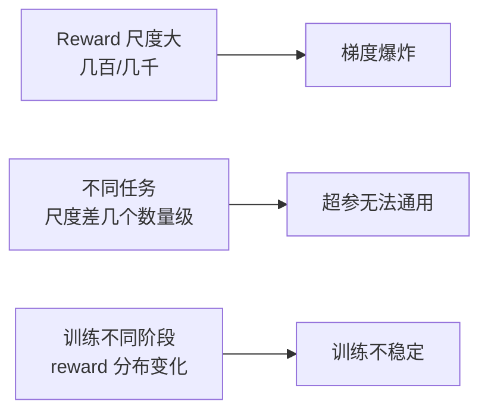

<iframe src="https://player.bilibili.com/player.html?aid=117219421848876&bvid=BV1CDb76AEk8&cid=41617982953&page=1&autoplay=0" scrolling="no" border="0" frameborder="no" framespacing="0" allow="fullscreen; picture-in-picture" allowfullscreen="true" style="height:100%;width:100%; aspect-ratio: 16 / 8;"> </iframe>

> **奖励归一化解决的不是奖励对不对，是它的尺度稳不稳。** 不归一化训练不稳定、超参难调；归一化做错直接发散。

---

## 1️⃣ 为什么 reward 需要归一化？

### 问题



| 问题 | 说明 |
|------|------|
| **梯度爆炸** | Reward 动辄几百几千 → 梯度等比放大 → 参数更新步长失控 |
| **超参不通用** | 任务 A 的 reward 在 0~1，任务 B 在 0~1000——同一个学习率无法同时适用 |
| **分布漂移** | 训练前期 reward 低，后期 reward 高——静态超参跟不上动态尺度 |

### 解法

> **归一化把 reward 拉到统一尺度，让训练稳定。**

---

## 2️⃣ 两种归一化方式

### 方式一：Running Mean-Std 归一化（PPO 常用）

维护移动平均的均值和标准差，每步标准化 reward：

```
normalized_reward = (reward - running_mean) / √(running_var + ε)
```

| 要素 | 做法 |
|------|------|
| **统计量** | 维护全局的 `running_mean` 和 `running_var`（指数移动平均 EMA） |
| **更新方式** | 每步拿到新 reward → 更新 stats → 做标准化 |
| **优点** | 实现简单、效果稳定、对 reward 尺度变化有自适应能力 |

> [!warning] 注意
> 必须用**移动平均**（EMA），不要用全量统计——否则会**引入未来信息**（未来 reward 的统计量泄漏到当前步）。

### 方式二：Batch 内归一化（GRPO 天然使用）

在 batch / group 内计算 reward 的均值和标准差做标准化，也就是 **z-score 归一化**：

```
Â_i = (r_i - mean_group) / std_group
```

| 特点 | 说明 |
|------|------|
| **范围** | 只在当前 group 内，不跨 group |
| **GRPO 关联** | 这就是 GRPO **不需要 critic 网络的秘密之一**——group 内归一化本身就相当于做了一次基线调整 |
| **效果** | 完全消除跨 group 的 reward 尺度差异 |

### 方式对比

| 维度 | Running Mean-Std | Batch 归一化 |
|------|-----------------|--------------|
| **统计范围** | 全局（滑动窗口） | 当前 batch / group |
| **适用算法** | PPO 等 | GRPO |
| **是否引入未来信息** | ✅ 用 EMA 则不会 | ❌ 完全不需要——只在本 group 内 |
| **实现复杂度** | 低（维护两个变量） | 极低（直接计算） |

---

## 3️⃣ 三个常见坑

### 🕳️ 坑一：先 clip 再归一化 ❌

> [!danger] 错误顺序
> **Clip → Normalize** ❌ 先截断再归一化 → clip 的边界被归一化破坏，等于白 clip

> [!success] 正确顺序
> **Normalize → Clip** ✅ 先归一化到统一尺度，再 clip 控制比率范围

```
✅ 正确：reward → 归一化 → clip(ratio)
❌ 错误：reward → clip(reward) → 归一化
```

### 🕳️ 坑二：Running Stats 用简单平均 ❌

| 方式 | 问题 |
|------|------|
| **简单平均**（全量统计） | 引入未来信息——当前步的归一化用到了未来 reward 的统计量 |
| **指数移动平均 EMA** ✅ | 只依赖过去，自适应性好 |

```python
# ✅ 正确：指数移动平均
running_mean = 0.99 * running_mean + 0.01 * reward.mean()
running_var  = 0.99 * running_var  + 0.01 * reward.var()

# ❌ 错误：简单平均（全量统计）
running_mean = reward_history.mean()
```

### 🕳️ 坑三：把 Reward 归一化和 Advantage 归一化混为一谈

> 这是**两件不同的事**。


| 归一化 | 对象 | 作用 |
|--------|------|------|
| **① Reward 归一化** | 原始 `reward` | 把不同尺度的 reward **拉到统一量纲**，稳定梯度 |
| **② Advantage 归一化** | 计算后的 `Â` | 让优势值保持 0 均值单位方差，**稳定比率裁剪** |

> 两者顺序不同、对象不同、目的不同——**不要混淆，跳一步都会出问题。**

---

## 4️⃣ 代码实现（完整流程）

```python
# 初始化
running_mean = 0.0
running_var  = 1.0
epsilon      = 1e-8

# 每步训练
for step, batch in enumerate(dataloader):
    rewards = get_rewards(batch)  # 原始 reward
    
    # === 第一步：Reward 归一化（Running EMA）===
    # 更新 stats
    running_mean = 0.99 * running_mean + 0.01 * rewards.mean()
    running_var  = 0.99 * running_var  + 0.01 * rewards.var()
    # 标准化
    normalized_rewards = (rewards - running_mean) / (running_var.sqrt() + epsilon)
    
    # === 第二步：计算 Advantage（以 GRPO 为例）===
    advantages = (normalized_rewards - rewards.mean()) / (rewards.std() + epsilon)
    
    # === 第三步：Advantage 归一化（Batch 内）===
    advantages = (advantages - advantages.mean()) / (advantages.std() + epsilon)
    
    # === 第四步：更新策略 ===
    # loss = -mean(min(ratio * advantages, clip(ratio, 1-ε, 1+ε) * advantages))
```

> **两层归一化**确保梯度稳定——reward 层拉平全局尺度，advantage 层稳定局部比率。

---

## ✅ 总结

| # | 要点 |
|---|------|
| 1 | **为什么归一化**：Reward 尺度直接影响梯度——不归一化梯度跟着一起崩 |
| 2 | **方式一**：Running Mean-Std（PPO）——全局移动平均，用 EMA |
| 3 | **方式二**：Batch 归一化（GRPO）——group 内 z-score，不需要 critic |
| 4 | 🕳️ **坑一**：先归一化再 clip，顺序不能反 |
| 5 | 🕳️ **坑二**：Running stats 用 EMA，不要简单平均 |
| 6 | 🕳️ **坑三**：Reward 归一化 ≠ Advantage 归一化——两件事两个步骤 |

> **奖励归一化解决的不是奖励对不对，是它的尺度稳不稳。**

---

## 🔗 关联阅读

- [[Bilibili/2026-07-21-【强化学习面试高频】GRPO 的损失为什么开始时是 0？两部分同时归零|GRPO Loss 为零详解]]
- [[Bilibili/2026-09-10-【RL 工程】batch 组织策略：难度分布、类型平衡与 rollout 数量|Batch 组织策略]]
- [[2026-09-10-【RL 进阶】GSPO：通过序列级重要性比率改进 PPO_GRPO 的逐 token 方差问题|GSPO 序列级比率]]

---

## 📋 字幕全文

<details>
<summary>点击展开完整字幕</summary>

`00:00` RL训练reward归一化必做
`00:02` 但很多人做错了不归一化
`00:04` 训练不稳定
`00:04` 超参难调归一化
`00:06` 做错直接发散
`00:07` 今天3分钟讲透两种方式和三个坑
`00:09` 先理解为什么reward需要归一化
`00:12` RL训练中reward的尺度直接影响梯度大小
`00:15` 如果reward动辄几百几千梯度会爆炸
`00:18` 不同任务
`00:19` 不同阶段reward尺度差好几个数量级归一化
`00:22` 把reward拉到统一尺度
`00:24` 让训练稳定
`00:25` 方式1running min s t d归一化
`00:28` 维护移动平均的均值和标准差
`00:31` 每部标准化reward reward减均值除标准差
`00:35` 最常用方法实现简单效果稳定
`00:37` 但要用移动平均
`00:38` 不要用全量统计
`00:40` 否则引入未来信息方式2batch内归一化
`00:43` 在batch内计算reward均值和标准差
`00:46` 标准化
`00:47` GRPO天然用这种方式
`00:48` 在每个group内做z score归一化
`00:50` 这就是gr po不需要critic的秘密之一
`00:53` 三个坑坑
`00:55` 一不要在归一化之前clip正确顺序
`00:57` 先归一化再clip坑
`00:59` 2running stats要用指数移动平均e ma
`01:02` 不要简单平均con
`01:04` 三
`01:04` reward归一化和advantage归一化是两件不同的事
`01:07` 不要混淆代码实现初始化running mean和running war
`01:12` 每步拿到reward更新
`01:14` stats计算normalized
`01:15` reward等于reward减running mean除根号
`01:18` running war加XSLO
`01:20` 然后算advantage
`01:21` 再做一次batch归一化
`01:23` 两层归一化
`01:24` 确保梯度稳定

</details>

---

## 🔗 参考链接

- B 站视频：https://www.bilibili.com/video/BV1CDb76AEk8/
- [[Bilibili/2026-07-21-【强化学习面试高频】GRPO 的损失为什么开始时是 0？两部分同时归零]]
- [[Bilibili/2026-09-10-【RL 工程】batch 组织策略：难度分布、类型平衡与 rollout 数量]]
- [[2026-09-10-【RL 进阶】GSPO：通过序列级重要性比率改进 PPO_GRPO 的逐 token 方差问题]]