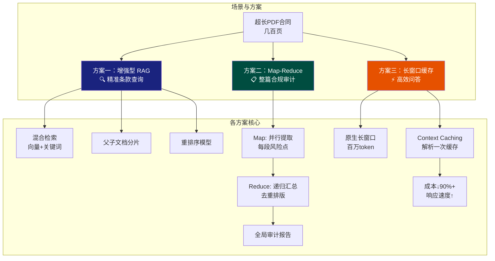
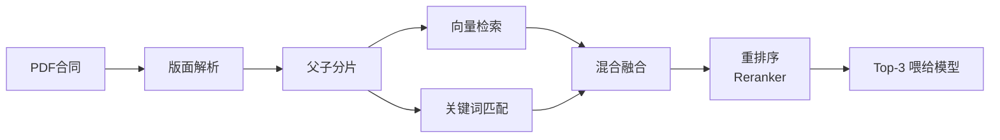

<iframe src="https://player.bilibili.com/player.html?aid=116955801588857&bvid=&cid=40150043983&page=1&autoplay=0" scrolling="no" border="0" frameborder="no" framespacing="0" allow="fullscreen; picture-in-picture" allowfullscreen="true" style="height:100%;width:100%; aspect-ratio: 16 / 9;"> </iframe>

> 面试官问几百页的 PDF 大合同怎么办——别只说 RAG，那是实习生水平。要表现出对**复杂工程的掌控力**，从高精度解析 → 架构选型 → 工程优化，分三步走。

---

## 1️⃣ 业务洞察：为什么普通方法搞不定

> 先展示业务洞察——处理合同长文本，难点不在模型，而在**三个硬骨头**。

| 硬骨头 | 问题 | 后果 |
|--------|------|------|
| **① 版面解析** | 双栏排版、嵌套表格、扫描件上的红公章 | 纯文本提取逻辑混乱，表格数据错行 |
| **② 长距离逻辑依赖** | 第 1 页定义的"关联交易"，权利义务在第 400 页才出现 | 信息切太碎 → 模型断章取义 |
| **③ 零幻觉容忍度** | 法律文书错一个小数点就是几百万损失 | 必须保证输出**百分之百精准** |

---

## 2️⃣ 三种架构方案



---

### 方案一：增强型 RAG 🔍（精准条款查询）

> 专门对付"某一页第 X 条"这类条款定位场景。

| 硬指标 | 做法 | 为什么 |
|--------|------|--------|
| **① 混合检索** | 向量检索 + 关键词匹配（BM25） | 合同里的金额、日期、条款编号——向量检索不一定准，但关键词能精确定位 |
| **② 父子文档分片** | 检索用短子块精准匹配，喂模型时拉回完整父段落 | 子块保精度，父段落保上下文完整性 |
| **③ 重排序模型** | 从几千个片段初筛 20 个 → 精排选出前 3 个最稳的喂给模型 | 噪音降下去，准确度升上来 |



---

### 方案二：Map-Reduce 分治法 📋（整篇合规审计）

> 适合做整篇合同的合规审计、摘要提炼、一致性核对——RAG 会漏掉没被检索到的信息，M-R 不会。

```
        ┌───────────────────── 整份大合同 ─────────────────────┐
        │                                                       │
        ↓           ↓           ↓           ↓           ↓        Map：并行
    ┌──────┐   ┌──────┐   ┌──────┐   ┌──────┐   ┌──────┐     ← 切成小块
    │ 段1  │   │ 段2  │   │ 段3  │   │ 段4  │   │ 段5  │      各自提取风险点
    └──┬───┘   └──┬───┘   └──┬───┘   └──┬───┘   └──┬───┘
        ↓           ↓           ↓           ↓           ↓
    ┌──────┐   ┌──────┐   ┌──────┐   ┌──────┐   ┌──────┐
    │风险点A│   │风险点B│   │风险点C│   │风险点D│   │风险点E│
    └──────┘   └──────┘   └──────┘   └──────┘   └──────┘
        ↓           ↓           ↓           ↓           ↓
        └─────────────┬──────────┴───────────┘
                      ↓                              Reduce：递归汇总
              ┌────────────────┐                       去重 + 排版
              │ 全局审计总报告   │
              └────────────────┘
```

| 维度 | 说明 |
|------|------|
| **Map 阶段** | 合同切小块 → 模型并行读取，提取每段风险点 |
| **Reduce 阶段** | 零散子结果 → 递归汇总 → 去重排版 → 全局审计报告 |
| **优缺点** | ✅ 地毯式搜索，不遗漏任何角落；❌ 慢一点、贵一点，但**最稳** |

---

### 方案三：原生长窗口 + 上下文缓存 ⚡（高效问答）

> 现在很多模型能吃下 100 万甚至几百万 token——能不能直接把合同塞进去？可以，但有挑战。

| 问题 | 方案 | 效果 |
|------|------|------|
| **多轮提问重复传几百页** → 首字延迟巨大、成本爆炸 | **Context Caching**：整份合同只解析**一次**缓存，后续所有问答复用缓存 | 成本直降 **90%+**，响应速度大幅提升 |

> 这招出来，面试官绝对觉得你是有实战经验的。

---

## 3️⃣ 工程闭环：实干派必答

> 讲完架构方案，还要表现出你是个**干活的实干派**。

### ① 极致的前端解析

```
❌ 常规 PDF 提取工具
✅ 带版面分析的引擎 → 标题/段落层级完美还原为 Markdown

双栏表格   →  正确还原行列关系
扫描件公章  →    OCR + 版面识别
嵌套表格   →   结构化提取
```

### ② 自动化评测

> 怎么证明方案行不行？

**大海捞针测试（Needle in a Haystack）：**
- 在几百页合同里**随机插入一个漏洞条款**
- 看系统能不能**精准召回**
- 定量评估召回率和准确率

### ③ 多 Agent 审计

```
法务专家 Agent  ← →  财务专家 Agent  ← →  合规专家 Agent
       ↓                       ↓                       ↓
                    ┌────────────────┐
                    │  合拢决策       │
                    └────────────────┘
```

几个人分头行动，最后合拢决策——**技术高度够了，可落地性也满分。**

---

## ✅ 面试通关口诀

> 在真实的业务场景中，没有一种方案能解决所有问题。遵循**三步走公式**：

| 步骤 | 针对 | 方案 | 关键词 |
|------|------|------|--------|
| **第一层：基础** | 深度解析 | PDF 结构化 → Markdown | **地基** |
| **第二层：精度** | 搜索场景 | RAG 优化：混合检索 + 父子分片 + Reranker | **精度** |
| **第三层：效率** | 全局任务 | 长窗口 + Context Caching | **效率** |

> 先基础 → 再精度 → 后效率——这套组合拳下来，既懂大模型底层原理，又有极强的工程落地能力。

---

## 📋 字幕全文

<details>
<summary>点击展开完整字幕</summary>

`00:00` 面试官要是问你
`00:01` 如果现在有一份好几百页的PDF大合同
`00:03` 大模型的上下文窗口不够了
`00:05` 你打算怎么处理呢
`00:07` 这时候你千万别上来就只说个rag
`00:10` 那太基础了
`00:11` 也就是个实习生的水平
`00:13` 想拿高级架构师的offer
`00:15` 你得表现出对复杂工程的掌控力
`00:18` 你要告诉面试官
`00:19` 处理这种超长文档不能只靠模型
`00:22` 得从高精度解析架构选型到工程优化
`00:25` 分三步走
`00:26` 给出一套闭环的黄金解题思路
`00:28` 咱们在给方案之前
`00:30` 得先表现出你对业务的深刻洞察
`00:32` 你得跟面试官说
`00:34` 处理合同长文本难点不在模型
`00:36` 而在三个硬骨头
`00:38` 第一个就是版面解析
`00:40` 地域合同里到处是双栏排版
`00:42` 嵌套表格
`00:43` 甚至还有扫描件上的红公章
`00:46` 你要是直接用那种传统的只读纯文本的提取法
`00:50` 拿出来的文本逻辑全是乱的
`00:52` 表格数据甚至会错行
`00:54` 第二个难题是长距离逻辑依赖合同第一页定义的那个关联交易
`00:59` 他的权利义务可能在第400页才提到
`01:02` 如果信息切得太碎
`01:03` 模型就会断章取义
`01:05` 第三个最关键就是零幻觉容忍度
`01:08` 法律文书这玩意儿错一个小数点可能就是几百万的损失
`01:12` 我们必须得保证模型输出百分之百精准
`01:16` 绝不能胡编乱造
`01:17` 这三个坑普通的处理方式一个都跳不过去
`01:20` 好接下来咱们抛出第一个具体的方案
`01:24` 增强型rag
`01:26` 这是专门对付特定条款查询的
`01:28` 这时候你要提三个硬指标
`01:30` 首先别只做向量检索
`01:32` 那太单一了
`01:33` 一定要上混合检索
`01:35` 也就是向量加上关键词匹配
`01:37` 为什么呢
`01:38` 因为合同里的那些金额日期或者专属的条款编号
`01:42` 向量检索有时会找不准
`01:44` 但关键词匹配能精准定位
`01:46` 接着你得提一个工程细节
`01:48` 叫父子文档分片
`01:50` 简单说就是找的时候用短小的子块去精准匹配
`01:54` 但真正喂给模型的时候
`01:56` 要把完整的副段落拉回来
`01:58` 这样模型才会有充足的上下文
`02:00` 最后别忘了一定要加一个重排序模型
`02:03` 也就是ri rank
`02:05` 我们先从几千个片段里初筛出20个
`02:07` 再精挑细选出前三个最稳的喂
`02:10` 给模型噪音降下去了
`02:12` 准确度自然就上来了
`02:13` 这就是在精准度上给面试官吃定心丸
`02:16` 那如果面试官追问
`02:18` 要是我想做整篇合同的合规审计或者摘要提炼呢
`02:22` 那rag就不够看了
`02:24` 因为rag容易丢掉那些没被检索到的信息
`02:27` 这时候你就得甩出方案2map reduce分治法
`02:31` 这思路就像咱们带团队先把大合同切成一小块
`02:34` 一小块分给模型并行去读
`02:37` 这就是map阶段去提取每一段的风险点模型
`02:40` 看完了每一段咱再进入reduce阶段
`02:43` 也就是递归汇总
`02:44` 把这些零散的子结果汇总起来去重排版
`02:48` 最后生成一份连贯的全局审计总报告
`02:51` 这种方式虽然慢一点
`02:53` 贵一点
`02:53` 但它最稳
`02:54` 能保证合同的每一个角落都被模型地毯式搜索过
`02:58` 特别适合做大纲提炼和一致性核对
`03:02` 当然了
`03:02` 作为技术大拿
`03:04` 你还得展示你对前沿技术的追踪
`03:06` 你可以提方案
`03:07` 三
`03:07` 原生长窗口加上缓存技术
`03:10` 现在很多模型都能吃下100万甚至几百万个token了
`03:14` 如果是这种情况
`03:15` 咱们能不能直接把几百页合同塞进去
`03:18` 可以
`03:18` 但这有挑战
`03:20` 你要重点提一个绝招
`03:21` 叫context cashing
`03:23` 也就是上下文缓存
`03:25` 你想啊
`03:25` 如果你多轮提问
`03:26` 每次都重传几百页PDF
`03:29` 那个首字延迟和token成本会让老板心疼死的
`03:32` 用了上下文缓存
`03:34` 整份合同只解析一次并缓存
`03:36` 后续所有的问答都直接复用缓存
`03:39` 这不仅能让回复速度变快
`03:41` 成本还能直降90%以上
`03:44` 这招出来
`03:45` 面试官绝对觉得你是有实战经验的
`03:48` 讲完这三个架构方案
`03:50` 你还得表现出你是个干活的实干派
`03:52` 秀一把工程闭环

</details>

---

## 🔗 参考链接

- B 站视频：https://www.bilibili.com/video/BV15yK46SEEz/
- [[Bilibili/2026-09-10-DeepSeek面试官问：生产RAG系统回答不准确，该如何定位和优化？|RAG 生产系统定位与优化]]
- [[Bilibili/2026-09-10-【大厂面试】RAG系统中跨页表格如何规避语义被切断？|跨页表格与语义完整性]]