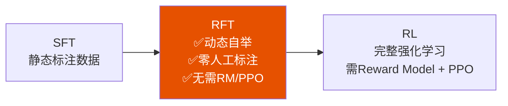
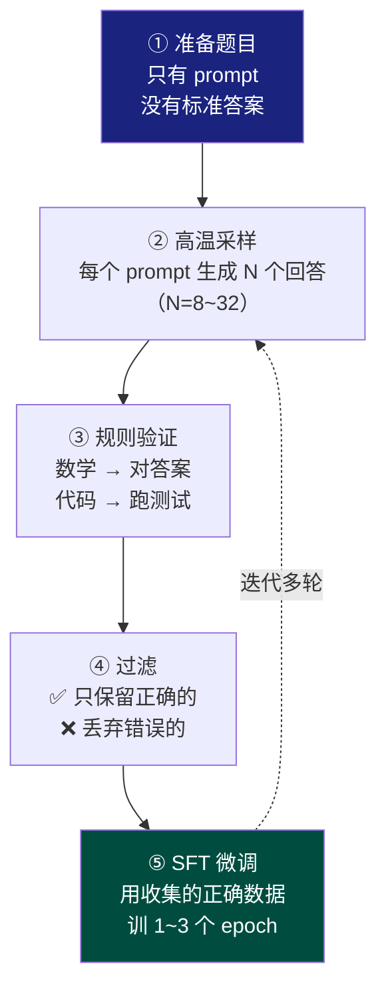

<iframe src="https://player.bilibili.com/player.html?aid=117219354744534&bvid=BV1kdb76fEAX&cid=41617657557&page=1&autoplay=0" scrolling="no" border="0" frameborder="no" framespacing="0" allow="fullscreen; picture-in-picture" allowfullscreen="true" style="height:100%;width:100%; aspect-ratio: 16 / 9;"> </iframe>

> **不想搭 RL 全家桶，先用拒绝采样，把自举闭环跑起来。** SFT 数据不够？与其人工标注，不如让模型自己做题——做对的保留，做错的扔掉。

---

## 1️⃣ RFT 是什么？

### SFT vs RFT

| 维度 | 普通 SFT | RFT（拒绝采样微调） |
|------|----------|-------------------|
| **数据来源** | 静态预标注数据 | **动态生成**——模型自己造题自己答 |
| **数据质量** | 人工标注，但数量有限 | 模型生成 + 规则验证，可无限扩展 |
| **迭代方式** | 一次性训练 | **多轮自举**——每轮用更强的模型采更多正确数据 |
| **类比** | 用别人编好的教材学 | **模型自己做题 → 只把正确答案当教材再学一遍** |

> RFT 的核心思想：让模型对同一个 prompt 生成多个不同的回答（高温采样），只保留**验证通过**的正确回答作为训练数据，然后做 SFT。

### 在训练管线中的位置



RFT 是介于 SFT 和 RL 之间的**轻量方案**——比 SFT 数据效率高，比 RL 工程简单得多。

---

## 2️⃣ RFT 五步流程



| 步骤 | 操作 | 要点 |
|------|------|------|
| **① 准备题目** | 数学题、代码题、事实问答 | 必须**可验证**——有客观对错标准 |
| **② 高温采样** | 每个 prompt 生成 N 个回答 | N=8~32，温度调高增加**探索多样性** |
| **③ 规则验证** | 对答案 / 跑测试用例 / 查事实 | 不需要人工——**规则自动化** |
| **④ 过滤** | 只保留正确的回答 | 错误轨迹丢弃，不作为负样本 |
| **⑤ SFT 微调** | 用收集的正确数据再训 | 1~3 个 epoch，过少欠拟合过多过拟合 |

---

## 3️⃣ 为什么 RFT 有效？

### 核心原理：自举式经验总结

```
模型在高温采样时
      ↓
探索多种解题路径
      ↓
         路径 A → 走通 ✅
         路径 B → 走通 ✅
         路径 C → 没走通 ❌
         路径 D → 走通 ✅
         路径 E → 没走通 ❌
      ↓
RFT：只收集走通的路径 → 强化训练
      ↓
模型总结自己的成功经验
```

### 关键洞察

> RFT 比用别人的标准答案更**贴近模型自身的能力分布**——它学到的是在**自己能力范围内**怎么解题最好。高温采样带来的多样性探索，让模型看到了多种可行的解法路径，而不仅仅是某一种标准答案。

---

## 4️⃣ RFT vs RL
[[file-20260911165118119.png|Open: file-20260911164940776.png]]
![[file-20260911165118119.png]]

| 维度 | RFT | 完整 RL（PPO/GRPO） |
|------|-----|---------------------|
| **训练信号** | 二值信号：对 / 错 | 连续 reward 信号，指导每一步更新 |
| **负样本利用** | ❌ 丢弃——不使用错误轨迹 | ✅ 负信号用于约束策略 |
| **Critic 网络** | ❌ 不需要 | ✅ 需要（PPO）或 group norm（GRPO） |
| **工程复杂度** | 极低——SFT 框架即可 | 高——多模型协同、reward 归一化等 |
| **效果上限** | 中等 | **更高**——利用了负信号，学习更精细 |
| **适用场景** | 快速迭代、冷启动 | 追求极致性能、有工程资源 |

> [!tip] 最佳实践
> RFT 跑两到三轮效果就很好了。如果想进一步提效，**在 RFT 基础上接 RLVR**——先用 RFT 拉起基础推理能力，再用 RL 继续打磨。

---

## 5️⃣ 实操建议

### 适用条件

| 条件 | 说明 |
|------|------|
| **任务必须可验证** | 数学、代码、事实问答——有客观标准 |
| **正确率门槛** | 低于 10% 说明题目太难 → **需要加简单题** |
| **采样数量** | N=8~32——太少多样性不足，太多收益递减 |

### 迭代策略

```
第 1 轮：基础模型 → 采样 → 收集 ~5 万条正确轨迹 → SFT → 模型 V1
第 2 轮：模型 V1 → 采样（正确率更高→可收集更多）→ SFT → 模型 V2
第 3 轮：模型 V2 → 采样 → SFT → 模型 V3
```

每轮收集几万到几十万条正确轨迹，**通常两到三轮效果就很好了。**

### 为什么工业界都用

> LLaMA 和 Qwen 的推理模型训练都用了 RFT。

| 优势 | 说明 |
|------|------|
| 不需要 Reward Model | 节省一个模型 + 训练管线 |
| 不需要 PPO | 避免多模型协同的工程复杂度 |
| 可迭代自举 | 每轮用更好的模型采更多的正确数据 |
| 成本可控 | 推理成本远低于人工标注 |

---

## ✅ 总结

| # | 要点 |
|---|------|
| 1 | **RFT = 拒绝采样微调**——让模型自己给自己造训练数据 |
| 2 | **流程五步**：出 prompt → 高温采样 → 规则验证 → 只留正确的 → SFT |
| 3 | **可迭代多轮**：每轮用更强的模型重新采样，数据质量越来越高 |
| 4 | **RL 的极简版**：没有 critic、没有 advantage——工程上简单太多 |
| 5 | **性价比最高**：不需要 RM 不需要 PPO，只需要可验证的规则 |

> **不想搭 RL 全家桶，先用拒绝采样，把自举闭环跑起来。**

---

## 🔗 关联阅读

- [[Bilibili/2026-07-21-【强化学习面试高频】GRPO 的损失为什么开始时是 0？两部分同时归零|GRPO Loss 为零详解]]
- [[2026-09-10-【RL 进阶】GSPO：通过序列级重要性比率改进 PPO_GRPO 的逐 token 方差问题|GSPO 序列级比率]]
- [[2026-09-11-【RL 工程】reward 归一化详解：running mean-std、batch 归一化与三个常见坑|Reward 归一化详解]]

---

## 📋 字幕全文

<details>
<summary>点击展开完整字幕</summary>

`00:00` SFT数据不够怎么办
`00:01` 与其人工标注
`00:02` 不如让模型自己做题
`00:04` 做对的保留
`00:05` 做错的扔掉
`00:06` 这就是拒绝采样微调
`00:08` RFT介于SFT和RL之间的轻量方案
`00:11` 今天3分钟讲透
`00:13` 先理解RFT和sf t的区别
`00:15` 普通SFT用的数据是静态的
`00:18` 你有什么数据就训什么
`00:20` RFT的数据是动态生成的
`00:22` 让模型对一个prompt生成多个回答
`00:24` 只保留正确的做训练数据
`00:26` 相当于让模型自己做题
`00:28` 然后只把正确答案收集起来
`00:30` 当教材再学一遍RFT的具体步骤
`00:32` 第一步准备一批只有prompt
`00:34` 没有标准答案的题目
`00:36` 数学题
`00:37` 代码题等
`00:38` 第二步
`00:38` 对每个prompt让模型生成N个不同的回答
`00:41` 通过高温采样增加多样性
`00:43` 第三步
`00:44` 用规则验证哪些回答是正确的
`00:46` 数学题对答案
`00:47` 代码题跑测试
`00:49` 第四步
`00:50` 只保留正确的回答作为训练数据
`00:52` 第五步
`00:52` 用这些数据做SFT微调

</details>

---

## 🔗 参考链接

- B 站视频：https://www.bilibili.com/video/BV1kdb76fEAX/
- [[Bilibili/2026-07-21-【强化学习面试高频】GRPO 的损失为什么开始时是 0？两部分同时归零]]
- [[2026-09-10-【RL 进阶】GSPO：通过序列级重要性比率改进 PPO_GRPO 的逐 token 方差问题]]
- [[2026-09-11-【RL 工程】reward 归一化详解：running mean-std、batch 归一化与三个常见坑]]