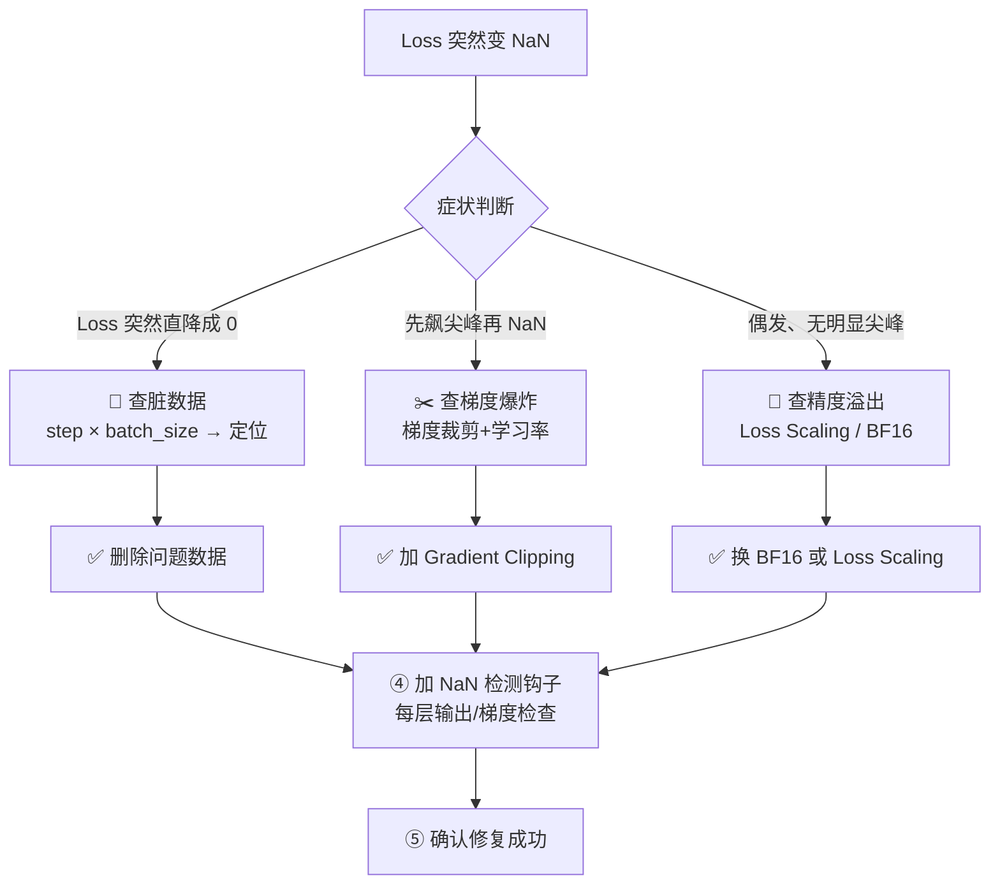
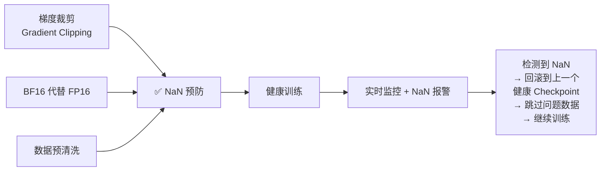

<iframe src="https://player.bilibili.com/player.html?aid=117143135849357&bvid=BV13f846kEU1&cid=41181249813&page=1&autoplay=0" scrolling="no" border="0" frameborder="no" framespacing="0" allow="fullscreen; picture-in-picture" allowfullscreen="true" style="height:100%;width:100%; aspect-ratio: 16 / 9;"> </iframe>

> **训练出 NaN 别慌，按脏数据 → 梯度爆炸 → 精度溢出三路排查。**

---

## 1️⃣ 为什么 NaN 这么可怕？

> NaN（Not a Number）就像传染病——一旦出现在计算链路里，会扩散到所有后续计算。

```
前向传播中某个值 → NaN
        ↓
反向传播依赖这个值 → 梯度全 NaN
        ↓
权重更新 = 梯度 × 学习率 → 权重全 NaN
        ↓
模型参数被污染 → 彻底废掉 💀
```

> NaN 不是某个位置的问题，是**整条计算链路的连锁崩溃。**

---

## 2️⃣ 三大根因

### 根因一：脏数据 🗑️（最常见）

> **如果训练好好的突然出 NaN，优先怀疑数据问题。**

| 常见场景      | 说明                   |
| --------- | -------------------- |
| 空文本       | 某条数据内容为空             |
| 超长序列截断后变空 | 截断后只剩特殊 token，实际内容为空 |
| 除以零       | 数学运算除零 → INF → NaN   |
| log(0)    | 对 0 取对数 → -INF → NaN |

**定位方法：**
```
出问题的 step × batch size → 定位到具体某条数据
                          ↓
                    手动删除 → 恢复训练 ✅
```

---

### 根因二：梯度爆炸 💥

> 学习率太大，或某些层的梯度范数突然飙升，权重更新直接把参数推到无穷大。

**典型表现：**

```
Loss
 ↑
 │    ╱
 │  ╱
 │╱
 │                      ● ← loss 先出现一个巨大的尖峰
 │                                        ↓
 │                                                  NaN
 └────────────────────────────────────────────→ 时间
```

| 诊断信号 | Loss 在变 NaN 之前先出现一个**巨大的尖峰** |
|----------|---------------------------|
| **解法** | **梯度裁剪（Gradient Clipping）**——把梯度范数限制在一个上限以内 |
| **地位** | 大模型训练**必开** |

---

### 根因三：混合精度溢出 🧮

> FP16 的数值范围有限——最大只有 **65504**，超过就变 INF → NaN。

| 精度 | 范围 | 风险 |
|------|------|------|
| **FP16** | 最大 65504 | ❌ 梯度超出范围即溢出 |
| **BF16** | 与 FP32 相同（≈ 3.4×10³⁸） | ✅ 几乎不会溢出 |
| **FP32** | 动态范围最大 | ✅ 但速度最慢 |

**解法一：Loss Scaling（损失缩放）**

```
正向传播 → 把 loss 放大几百倍 → 反向传播（梯度也等比放大）
    → 算完梯度 → 把梯度缩回原始尺度 → 更新权重
```

**解法二：换 BF16**

> BF16 的动态范围和 FP32 一样大，几乎没有溢出风险。能用 BF16 就别用 FP16。

---

## 3️⃣ 实战排查流程



### 四步排查法

| 步骤 | 动作 | 判断依据 |
|------|------|----------|
| **① 看 Loss 曲线** | 观察 NaN 前的损失走势 | **直降成 0** → 脏数据；**先尖峰** → 梯度爆炸；**无征兆** → 精度溢出 |
| **② 加 NaN 检测** | 在每一层的输出和梯度上挂检测钩子（hook） | 定位 NaN **最早出现在哪一层** |
| **③ 查数据** | 对出问题的 batch 做逐条排查 | 找到空文本、非法运算的条目 |
| **④ 查精度** | 确认是否用了 loss scaling，是 BF16 还是 FP16 | 精度配置是否正确 |

---

## 4️⃣ 预防 > 治疗

> 成熟的训练框架都内置了这些机制——**标配组合**：



| 预防措施 | 作用 |
|----------|------|
| **梯度裁剪**（Gradient Clipping） | 防止梯度爆炸 |
| **BF16 代替 FP16** | 避免精度溢出 |
| **数据预清洗** | 去掉脏数据 |
| **训练监控 + 实时报警** | 第一时间发现 NaN |
| **自动回滚 + 跳过** | 检测到 NaN → 回滚到最近健康 checkpoint → 跳过问题数据 → 继续训练 |

---

## ✅ 总结

| # | 要点 |
|---|------|
| 1 | **NaN 会像传染病扩散**——一旦出现整条计算链路连锁崩溃 |
| 2 | **三大根因**：脏数据（最常见） / 梯度爆炸 / 混合精度溢出 |
| 3 | **排查四步**：看 Loss 曲线 → 加 NaN 检测钩子 → 逐条查数据 → 查精度配置 |
| 4 | **预防组合**：梯度裁剪 + BF16 + 数据清洗 + 实时监控 + 自动回滚 |

> **训练出 NaN 别慌，按脏数据 → 梯度爆炸 → 精度溢出三路排查。**

---

## 🔗 关联阅读

- [[Bilibili/2026-09-07-【训练工程】GPU 利用率周期性归零：IO 瓶颈的定位与优化|GPU 利用率归零与 IO 瓶颈]]
- [[Bilibili/2026-09-09-【科学调参】梯度噪声尺度：用一百步小实验算出最优 batch size|梯度噪声尺度]]
- [[Bilibili/2026-09-09-【调参工具】LR Finder 详解：怎么画、怎么读、怎么和 warmup 配合|LR Finder 详解]]

---

## 📋 字幕全文

<details>
<summary>点击展开完整字幕</summary>

`00:00` 训练跑了几小时
`00:01` loss突然变成N整个run报废
`00:04` 这是每个大模型训练工程师都踩过的坑
`00:06` 一个脏数据
`00:07` 一次梯度爆炸
`00:09` 一个混合精度一出就能让几天的训练功亏一篑
`00:12` 今天3分钟从零讲to loss变难的三大根因
`00:15` 以及实战中怎么快速排查和修复
`00:17` 先理解loss为什么会变成name nn
`00:20` 就是不是一个数的意思
`00:21` 它一旦出现在计算链路里
`00:23` 会像传染病一样扩散到所有后续计算
`00:26` 比如移步前向传播里
`00:28` 某个值变成了N
`00:29` 后面所有依赖它的梯度权重更新
`00:32` 全变承担整个模型参数被污染
`00:34` 彻底废掉
`00:35` 所以NN不是某个位置的问题
`00:37` 是整条计算链路的连锁崩溃
`00:39` 根因易脏数据
`00:40` 这是最常见的原因
`00:42` 训练数据里有空文本
`00:44` 超长序列截断后变空除以零
`00:46` log0之类的非法运算都会产生N经验之谈
`00:50` 如果训练好好的突然出单
`00:52` 优先怀疑数据问题
`00:53` 用出问题的step和batch size
`00:55` 反推定位到具体哪条数据
`00:57` 手动删掉就能恢复
`00:59` 根因二梯度爆炸
`01:00` 学习率太大
`01:02` 或者某些层的梯度范数突然飙升
`01:04` 权重更新幅度过大
`01:05` 直接把参数推到无穷大
`01:07` 然后INF变单表现就是loss在变NIN之前
`01:11` 会先出现一个巨大的尖峰
`01:13` 解决办法是梯度裁剪
`01:15` 把梯度范数限制在一个上限以内
`01:17` 这是大模型训练避开的根音三混合精度溢出
`01:21` FP16的数值范围有限
`01:23` 最大只有65504
`01:24` 超过就变INF再变单梯度
`01:27` 如果在这个范围外就会溢出
`01:29` 解决办法是用损失缩放
`01:31` 先把LOS放大几百倍
`01:33` 再反向传播
`01:34` 算完梯度再缩回来
`01:36` 或者直接用bf16
`01:37` 它的动态范围和FP32一样大
`01:40` 几乎不会溢出

</details>

---

## 🔗 参考链接

- B 站视频：https://www.bilibili.com/video/BV13f846kEU1/
- [[Bilibili/2026-09-07-【训练工程】GPU 利用率周期性归零：IO 瓶颈的定位与优化]]
- [[Bilibili/2026-09-09-【科学调参】梯度噪声尺度：用一百步小实验算出最优 batch size]]
- [[Bilibili/2026-09-09-【调参工具】LR Finder 详解：怎么画、怎么读、怎么和 warmup 配合]]