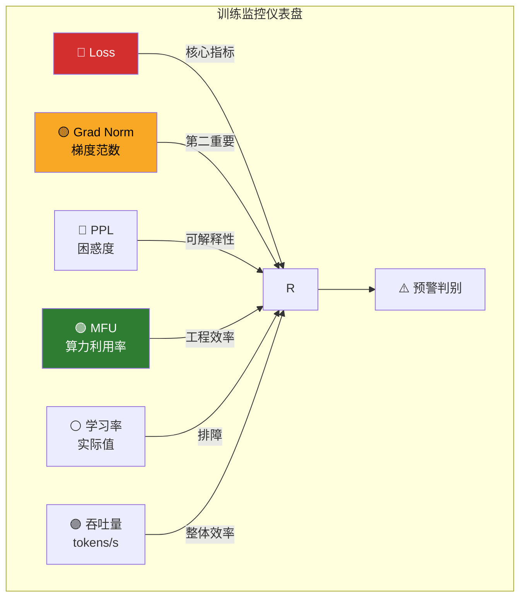
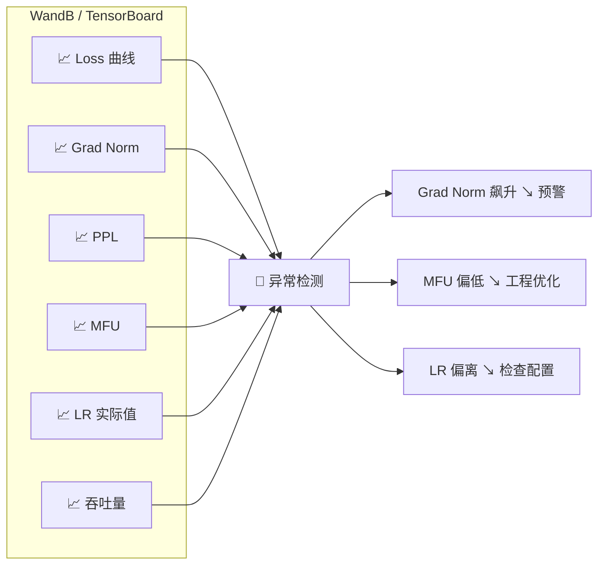

<iframe src="https://player.bilibili.com/player.html?aid=117219556069426&bvid=BV1zwbE6REWX&cid=41618639771&page=1&autoplay=0" scrolling="no" border="0" frameborder="no" framespacing="0" allow="fullscreen; picture-in-picture" allowfullscreen="true" style="height:100%;width:100%; aspect-ratio: 16 / 9;"> </iframe>

> **只看 loss 会瞎，四个辅助指标才拼得出全貌。** 大模型训练有"内科指标"——不直接表现在 loss 上，但能提前预警问题。

---

## 📊 仪表盘总览



> 如果 grad norm 突然飙升但 loss 还没崩——你有**几步的时间窗口**来处理：回滚 checkpoint 或降学习率。这就是监控的价值：**在问题变成灾难之前发现它。**

---

## 1️⃣ Grad Norm（梯度范数）——第二重要的指标

衡量当前步梯度的大小=**训练健康度的第二指标**。

### 怎么看

| 表现 | 含义 | 应对 |
|------|------|------|
| **稳定范围内波动** | ✅ 正常训练 | 继续 |
| **突然飙升几个数量级** | ⚠️ 训练不稳定——可能是学习率太大、脏数据、**梯度爆炸前兆** | **立即预警**，准备回滚或降学习率 |
| **持续趋近于零** | 模型已收敛或卡在鞍点 | 考虑加噪声或调整优化器 |

### 预警阈值

> [!tip] 工程经验
> **Grad Norm 超过平均值的 10 倍就报警。**

---

## 2️⃣ PPL（困惑度）——可跨模型比较

### 公式

```
PPL = exp(Loss)
```

### 含义

| PPL 值 | 含义 |
|:------:|------|
| **= 1** | 模型完全确定下一个 token（完美） |
| **= 词表大小** | 模型完全随机猜 |
| **7B 模型预训练结束** | 大约 **5~10** 之间 |

### 好处

> PPL 比裸 loss 更直观，而且**跨模型可比**——不同词表大小的模型，loss 不能直接比，但 PPL 可以。

---

## 3️⃣ MFU（Model FLOPs Utilization）——硬件吃没吃饱

### 定义

> MFU = GPU 实际有效计算 / 理论峰值计算

| GPU | 理论峰值 | 实际训练 MFU | 差距原因 |
|:---:|:--------:|:------------:|----------|
| A100 | 312 TFLOPS | **40%~55%** | 通信开销 / 数据加载瓶颈 / Kernel 效率低 |

### 重要性

> MFU 低**不是模型的问题，是工程的问题。**

| 问题 | 优化方向 |
|------|----------|
| 通信开销大 | 优化分布式策略（Tensor Parallel / Pipeline Parallel） |
| 数据加载瓶颈 | DataLoader 调参（num_workers / prefetch） |
| Kernel 效率低 | 开 Flash Attention / 用编译优化 |

---

## 4️⃣ 学习率实际值

> 确认 warmup 和 decay 是否按预期执行。

### 常见 Bug

| Bug | 表现 |
|:---:|------|
| **Warmup 步数设错** | 学习率曲线开头异常 |
| **Decay 起点不对** | 学习率过早或过晚开始下降 |
| **阶段切换没生效** | 某个阶段学习率没按 schedule 切换 |

> **打印每一步的实际学习率，画出曲线，和你设计的 schedule 对比。** 曲线偏离 → 配置写错了。

---

## 5️⃣ Token 吞吐量（tokens/s）

综合反映**数据加载 + 前向计算 + 反向传播**的整体效率。

| 吞吐量下降的可能原因 |
|----------------------|
| IO 瓶颈——GPU 在等数据 |
| 模型太大——batch size 被迫缩小 |
| 通信开销——分布式同步成本高 |

---

## 6️⃣ 构建监控仪表盘



### 关键原则

| 原则 | 说明 |
|------|------|
| **不要只看 loss** | Grad Norm 和 MFU **至少同样重要** |
| **多指标并排** | 6 个指标画在同一个面板上实时更新 |
| **设置预警** | Grad Norm 飙升 → 几秒内做出反应 |
| **回滚机制** | 检测到异常 → 自动回滚到上一个健康 checkpoint |

---

## ✅ 总结

| # | 指标 | 一句话 |
|---|------|--------|
| 1 | **Grad Norm** | **训练健康度第二指标**——飙升预警发散，归零表示收敛或卡住 |
| 2 | **PPL** | Loss 的指数变换，**跨模型可比**，7B 预训练结束约 5~10 |
| 3 | **MFU** | 硬件吃没吃饱——A100 正常 **40%~55%**，低是工程问题不是模型问题 |
| 4 | **学习率实际值** | 画出来和 schedule 对比——**偏离就说明配置写错了** |
| 5 | **吞吐量** | 数据加载 + 前反向的整体效率 |

> **训练监控不止看 loss，grad norm 和 MFU 同样重要。**

---

## 🔗 关联阅读

- [[Bilibili/2026-09-13-【调参细节】warmup 步数详解：比例怎么定、做错了会怎样、怎么监控|Warmup 步数详解]]
- [[Bilibili/2026-09-07-【训练工程】GPU 利用率周期性归零：IO 瓶颈的定位与优化|GPU 利用率归零与 IO 瓶颈]]
- [[Bilibili/2026-09-12-【训练排障】loss 突然变 NaN 怎么办？脏数据、梯度爆炸、精度溢出三路排查|Loss NaN 排查]]

---

## 📋 字幕全文

<details>
<summary>点击展开完整字幕</summary>

`00:00` 训练大模型只看loss远远不够
`00:02` 杨志林说过
`00:03` 大模型训练有内科指标
`00:05` 那些不直接表现在loss上
`00:07` 但能提前预警问题的信号
`00:08` 今天3分钟讲透
`00:10` 除了loss之外
`00:11` 你还必须监控的五个关键指标
`00:13` 第一个也是第二重要的指标
`00:15` 梯度范数
`00:16` Grad norm
`00:17` 它衡量当前步梯度的大小
`00:19` 正常训练中
`00:20` grad norm应该在一个稳定范围内波动
`00:23` 如果突然飙升几个数量级
`00:24` 说明训练不稳定
`00:26` 可能是学习率太大
`00:27` 脏数据或者梯度爆炸的前兆
`00:29` 如果持续趋近于零
`00:31` 说明模型已经收敛或者卡在暗点
`00:33` 建议设置预警阈值
`00:35` Grad norm
`00:36` 超过平均值的十倍就报警
`00:37` 第二个指标困惑度
`00:39` PPLPPL是loss的指数变换
`00:42` PPL等于E的loss次方
`00:45` 但比裸loss更直观
`00:46` PPPL等于一表示模型完全确定下一个token
`00:49` PPL等于此表大小表示完全随机猜
`00:53` 7B模型预训练结束
`00:54` PPL大约在5~10之间
`00:56` PPL的好处是
`00:58` 跨模型可比不同词表大小的模型
`01:00` loss不能直接比
`01:01` 但PPPL可以
`01:03` 第三个指标m fu model flos utilization
`01:06` 他衡量GPU实际做了多少有效计算
`01:09` 占理论峰值的比例
`01:10` A100的理论峰值是312TFLOPS
`01:14` 但实际训练中
`01:15` MFU通常只有40%到55
`01:17` MFUD不是模型的问题
`01:19` 是工程的问题
`01:20` 通信开销
`01:21` 数据加载瓶颈
`01:23` kernel效率低
`01:24` 监控MFU能帮你找到工程优化的方向
`01:27` 第四个指标学习率的实际值
`01:29` 确认warm up和decay是否按预期执行
`01:32` 常见bug
`01:33` warm up步数设错
`01:34` decay起点不对
`01:35` 某个阶段学习率没切换
`01:37` 打印每一步的实际学习率
`01:39` 画出曲线和你的歇脚设计对比
`01:41` 第五个指标token吞吐量
`01:43` Tokens per second
`01:45` 它综合反映了数据加载前向计算
`01:47` 反向传播的整体效率
`01:48` 构建监控仪表盘
`01:50` 理想状态是把以上五个指标加loss
`01:52` 画在同一个面板上
`01:54` 实时更新
`01:55` wanna be和TENSORBOARD都支持关键原则
`01:57` 不要只看loss
`01:58` grad norm和MFU至少同样重要
`02:00` 如果grad norm突然飙升
`02:02` 但loss还没崩
`02:03` 你有几步的时间窗口来处理回滚
`02:05` checkpoint或者降学习率
`02:07` 这就是监控的价值
`02:08` 在问题变成灾难之前
`02:10` 发现它

</details>

---

## 🔗 参考链接

- B 站视频：https://www.bilibili.com/video/BV1zwbE6REWX/
- [[Bilibili/2026-09-13-【调参细节】warmup 步数详解：比例怎么定、做错了会怎样、怎么监控]]
- [[Bilibili/2026-09-07-【训练工程】GPU 利用率周期性归零：IO 瓶颈的定位与优化]]
- [[Bilibili/2026-09-12-【训练排障】loss 突然变 NaN 怎么办？脏数据、梯度爆炸、精度溢出三路排查]]