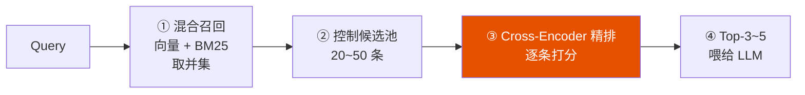

<iframe src="https://player.bilibili.com/player.html?aid=117245359429623&bvid=BV1MZYT6pEdF&cid=41752659889&page=1&autoplay=0" scrolling="no" border="0" frameborder="no" framespacing="0" allow="fullscreen; picture-in-picture" allowfullscreen="true" style="height:100%;width:100%; aspect-ratio: 16 / 9;"> </iframe>

> **Rerank 不是排序器，它是整个 RAG 系统里守住上下文质量的那道门。** 追求的不是让大模型读得更多，而是让它读得更对。

---

## 1️⃣ Rerank 解决的根本问题

### 一句话结论

> **Rerank 是 RAG 里的上下文质量守门员。** 它解决的根本不是"你有没有找到资料"，而是 **"你找到的这批资料，到底能不能回答这个问题。"**

### 召回 vs Rerank 分工

| 环节 | 负责 | 目标 | 像什么 |
|------|------|------|--------|
| **🚀 粗召回**（Retrieval） | **别漏掉** | 保 **Recall（召回率）** | 广撒网——快、覆盖广 |
| **🎯 Rerank**（精排） | **排得对** | 保 **Precision（精确率）** | 精准捞——慢、质量高 |

> 两部配合下来，送进大模型的上下文噪声更少，答案自然更靠谱。

---

## 2️⃣ 为什么粗召回不够细？——双塔 vs 交叉

### 粗召回用双塔（Bi-Encoder）

```
Query → 单独编码 → Query 向量        ← 从头到尾没碰过面
文档 → 单独编码 → 文档向量
                                  ← 只能比"像不像"，不能判"对不对"
最终：比一下向量相似度
```

| 优势 | 劣势 |
|------|------|
| ✅ 快——海量文档也扛得住 | ❌ Query 和文档**各自独立编码**，全程没交互过 |
| | ❌ **只能判断像不像**——主题沾边、措辞差不多就排到前面去了 |

### Rerank 用交叉编码器（Cross-Encoder）

```
[Query] 拼接 [文档] → 逐字逐词级别的交互 → 真正判断这篇文档有没有回答上这个问题
```

| 优势 | 劣势 |
|------|------|
| ✅ 精细——做深层语义匹配 | ❌ **慢**——只能处理小范围候选（几十条） |

### 互补关系

```
粗召回（双塔）：管广撒网   →  快，保 Recall
       ↓
精排（Cross-Encoder）：管精准捞 → 准，保 Precision
       ↓
LLM 生成
```

---

## 3️⃣ 为什么不能把候选全塞给大模型？

> 面试官追问："上下文窗口现在这么大，我干脆全塞给大模型，是不是就没 Rerank 什么事了？"

有三个坑等着你：

| 坑 | 说明 |
|:--:|------|
| **① 噪声放大** | 召回的越多，混进来的不相关内容也越多 |
| **② 注意力稀释** | 大模型对**中间位置的内容不敏感**，关键证据被淹没——"Lost in the Middle" |
| **③ 成本增加** | Token 多了 → 延迟上去了 → 钱包疼了 |

> 真正想要的是**提高上下文信噪比（Signal-to-Noise Ratio）**——让信号更强，让噪声更弱。

---

## 4️⃣ 工程落地四步法

> **先广泛召回，再精准压缩。** 用一小段不算贵的精排计算，去换生成阶段更高的准确性、稳定性和成本效率。



| 步骤 | 操作 | 作用 |
|------|------|------|
| **① 混合召回** | 向量检索 + BM25 多个通道取并集 | 先保证正确答案不漏掉（高 Recall） |
| **② 控候选池** | 结果压缩到 **20~50 条** | Rerank 只能处理小范围 |
| **③ Cross-Encoder 精排** | Query + 文档拼接，细粒度相关性打分 | 逐字逐词级别交互判断 |
| **④ Top-3~5 喂给 LLM** | 只把最靠前的几条交给大模型 | 高信噪比输入 |

> **核心取舍：用一小段精排计算，换生成阶段更高的准确性、稳定性和成本效率——这笔账算得过来。**

---

## 5️⃣ Rerank 的四大边界

> 面试官真正爱挖的是 Rerank 的**边界**——它不是万能修复器。

| 做不到 | 原因 |
|:------:|------|
| **① 不能无中生有** | 召回阶段要是压根没把正确答案捞回来，Rerank 排得再好也没用 |
| **② 自身也有延迟和成本** | 候选越多、模型越大，线上越吃力 |
| **③ 领域漂移** | 到法律、医疗这种专业场景，相关性的定义变了——**需要拿领域数据再调** |
| **④ 打分高 ≠ 答案好** | 还得端到端看答案质量和忠实度——模型是不是**老老实实照着证据说话** |

---

## ✅ 面试通关总结

| 面试官问题 | 正确回答框架 |
|------------|-------------|
| **Rerank 解决什么问题？** | Rerank 是 RAG 的**上下文质量守门员**——解决的不是"有没有找到"，而是"找到的能不能回答" |
| **向量检索自己怎么就排不准？** | 双塔各自独立编码，只能判"像不像"不能判"对不对" |
| **全塞给大模型不行吗？** | 三个坑：噪声放大 + 注意力稀释 + 成本增加 |
| **Rerank 有什么局限？** | 四个边界：不能无中生有 / 有成本 / 领域漂移 / 打分≠答案 |

> **Rerank 的本质是把召回上限转化为回答精度。**
> 
> **高召回 + 精排序 = 高质量上下文**

---

## 🔗 关联阅读

- [[Bilibili/2026-09-10-DeepSeek面试官问：生产RAG系统回答不准确，该如何定位和优化？|RAG 生产系统定位与优化五步法]]
- [[Bilibili/2026-09-10-【大厂面试】RAG系统中跨页表格如何规避语义被切断？|跨页表格与语义完整性]]
- [[Bilibili/2026-09-11-【大模型面试】当大模型遇到几百页的PDF合同上下文窗口不够用了怎么办？|超长文档合同处理]]

---

## 📋 字幕全文

<details>
<summary>点击展开完整字幕</summary>

`00:00` 面试官问你rag中RERANK到底解决什么问题
`00:03` 你张口就来RERANK嘛
`00:05` 就是召回之后再排一遍序
`00:07` 把最相关的放到最前面
`00:08` 回答就更准了呗
`00:10` 面试官接着追问
`00:11` 那向量检索他自己怎么就排不准呢
`00:14` 上下文窗口现在这么大
`00:15` 我干脆全塞给大模型
`00:17` 是不是就没他什么事了
`00:19` 要是第一轮召回压根没把正确答案捞回来
`00:22` RERANK又能变出什么花来
`00:24` 你一下卡住了
`00:25` 脑子里只有个模模糊糊的印象
`00:27` 什么双塔
`00:28` 什么金牌
`00:29` 具体差在哪
`00:30` 边界在哪
`00:31` 一个字都说不出来
`00:32` 如果这道题你也不会回答的话
`00:34` 我整理了让大厂面试官沉默的必考题库
`00:36` 包含大模型
`00:37` 基础面试
`00:38` rag微调
`00:39` Transformer
`00:40` Deep sick agent
`00:41` 项目方案
`00:42` 面试题等等
`00:42` 只要是我粉丝留下666打包带走
`00:45` 那今天呢咱们就把这道题从头到尾捋一遍
`00:48` 主题就一句话
`00:50` RERANK它解决的到底是什么问题
`00:52` 你只要记住一个角度
`00:54` 看懂他守的是上下文质量这道门它的价值
`00:58` 它的边界就全都清清楚楚了
`01:00` 先上结论
`01:02` RERANK是rag里的上下文质量守门员
`01:04` 注意啊
`01:05` 他解决的根本不是你有没有找到资料
`01:08` 而是你找到的这批资料
`01:09` 到底能不能回答这个问题
`01:11` 你看rag本来就有两部召回
`01:14` 负责别漏掉
`01:15` 保的是recall召回率
`01:17` RERANK呢负责排的队
`01:19` 保的是precision精确率
`01:21` 这两部配合下来送进大模型的上下文噪声更少
`01:24` 那答案自然也就更靠谱对吧

</details>

---

## 🔗 参考链接

- B 站视频：https://www.bilibili.com/video/BV1MZYT6pEdF/
- [[Bilibili/2026-09-10-DeepSeek面试官问：生产RAG系统回答不准确，该如何定位和优化？]]
- [[Bilibili/2026-09-10-【大厂面试】RAG系统中跨页表格如何规避语义被切断？]]
- [[Bilibili/2026-09-11-【大模型面试】当大模型遇到几百页的PDF合同上下文窗口不够用了怎么办？]]