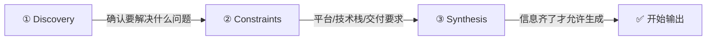
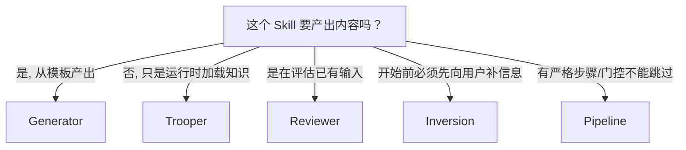

<iframe src="https://player.bilibili.com/player.html?aid=116255939959485&bvid=BV1fMwyzkEPQ&cid=25982868769&page=1&autoplay=0" scrolling="no" border="0" frameborder="no" framespacing="0" allow="fullscreen; picture-in-picture" allowfullscreen="true" style="height:100%;width:100%; aspect-ratio: 16 / 9;"> </iframe>

## 📺 视频简介

Skill 搭好了，`skill.md` 也写了——但 Agent 用起来输出还是不稳定：一会儿格式乱，一会儿漏步骤，一会儿自信地答偏。

> 原文：**5 Agent Skill design patterns every ADK developer should know**
> 发布账号：Google Cloud Tech

Google Cloud Tech 团队认为：**问题很少出在格式上**——现在主流 Agent 工具已经逐渐统一了 `skill.md` 的格式规范。真正的问题出在 **内容设计** 上，也就是 Skill 里面的逻辑究竟该怎么组织。

他们研究了 Anthropic、Vertex AI、Google 内部的 Skill 构建方式，总结出五种设计模式。

---

## 🗺️ 五种模式速览

| # | 模式 | 解决的问题 | 核心思路 |
|---|------|-----------|----------|
| 1 | **Trooper** | 知识什么时候加载 | 按需注入知识，而非一次全塞 |
| 2 | **Generator** | 输出结构总是不稳定 | 固定模板 + 风格指南，不现场发挥 |
| 3 | **Reviewer** | 审查标准和流程混在一起 | Checklist 和审查逻辑硬拆开 |
| 4 | **Inversion** | 信息不全却急着开工 | 先问清楚再开工，信息不齐禁止生成 |
| 5 | **Pipeline** | 复杂任务容易跳步骤 | 写成工作流，每步设门控 |

---

## 🔧 五种模式详解

### 1️⃣ Trooper — 按需注入知识

**问题：** 很多人把某个技术栈的全部规范一次性全塞进 System Prompt（React 规范 + FastAPI 规范 + 团队约定 + 命名规则……）。大部分任务根本用不到这些东西——浪费 Context，还容易被无关知识干扰。

**解法：** 把详细内容放进 **References**，Skill 只负责**判断当前任务是否需要**。只有命中才加载那一套知识。

> 你可以把它理解成 Skill 像一个**总闸门**，负责在合适的时候把某个专家手册接进上下文。

**示例：**
- 让 Agent 改 React 页面 → 才加载 References 里的 React 规范
- 当前任务只是写 SQL 或改产品文案 → 前端规范根本不出现

> ✅ **本质：按需注入知识**

---

### 2️⃣ Generator — 模板化输出

**问题：** 同样让 Agent 写文档，今天长这样，明天又长成另一种样子。本质原因是模型每次都在**现场重新决定**输出该长什么样。

**解法：** 别让它现场发挥——把输出结构固定在模板里，把表达方式固定在风格指南里。

```
模板（Template）      → what to produce（产什么）
风格指南（Style Guide）→ how to write（怎么写）
```

**示例：** 生成 API 文档
- **模板**规定：接口说明 → 参数表 → 返回值 → 错误码 → 示例调用
- **风格指南**规定：标题格式、术语统一、语气、字段命名

> 今天写、明天写、不同人触发——出来的结构还是同一套。

**适用场景：** API 文档、标准化报告、Commit Message、脚手架生成

---

### 3️⃣ Reviewer — 审查标准与流程分离

**问题：** 审查任务经常要推倒重来。很多团队把两件事写混了：
- **检查什么**（标准）
- **怎么检查**（流程）

**解法：** 把这两件事**硬拆开**。

```
检查什么（标准）→ 放进 Checklist（可替换）
怎么检查（流程）→ 留在 skill.md（不动）
```

这样**流程不动，规则可换**：
- 今天做 Python 风格审查 → 加载 Python Checklist
- 明天做 OWASP 安全检查 → 替换为安全 Checklist
- 后天做合规规则审查 → 再换一套

不需要为每一类审查重写一遍 Skill。输出统一为 `Error / Warning / Info` 层级。

---

### 4️⃣ Inversion — 先问清楚再开工

**问题：** 很多 Agent 最大的问题是**太爱猜**——一拿到模糊需求就急着开始生成，信息不够就自己补，而且补得非常自信。

**解法：** 把流程反过来——Agent **先发问**，用户**先回答**，分三个阶段：



**示例：** 规划一个客服机器人
- 应该先问：服务对象是谁？接入微信还是网页？要不要对接工单系统？
- 有没有合规要求？有没有人工接管机制？
- **这些没问清之前，禁止直接开始写方案。**

> ✅ **核心：用门控指令明确规定——信息没齐不准开工。**

---

### 5️⃣ Pipeline — 工作流化

**问题：** 多步骤任务总有人跳步骤。有些任务本身就是强顺序流程——先分析输入，再生成中间产物，再组装最终结果，最后验证。

如果把这件事当成一句 Prompt，模型很容易**中途偷懒**。

**解法：** 直接把 `skill.md` 写成**工作流**：

```
第一步：解析公开 API
  ↓ (门控确认)
第二步：生成 Docstring
  ↓ (门控确认)
第三步：组装成完整文档
  ↓ (门控确认)
第四步：质量检查
```

每一步只加载当前所需的 **References 和 Templates**，让 Context 一直保持干净。

**适用场景：** 文档生成、复杂代码修改、发布流程、合规流程——**不能跳过验证的任务**。

---

## 🤔 如何选择：判断路径

Google 文章给出的实用判断流程：



### 模式可以叠加

| 组合 | 效果 |
|------|------|
| **Generator** 前面 + **Inversion** | 先收集信息再模板化输出 |
| **Pipeline** + **Reviewer** 结尾 | 流程化执行后自动审查 |
| **Trooper** + 任何模式 | 负责在运行时补充知识，几乎可叠在任何模式上 |

---

## ✅ 总结

> **别再把越来越复杂的指令一股脑塞进同一个 System Prompt。**

真正可靠的 Skill，靠的是**更合适的结构**。

先判断自己遇到的到底是：
- **知识问题** → Trooper
- **结构问题** → Generator
- **审查问题** → Reviewer
- **澄清问题** → Inversion
- **流程问题** → Pipeline

> **模式选对了，Agent 才会稳定。**

---

## 📋 字幕全文

<details>
<summary>点击展开完整字幕</summary>

`00:00` 你是不是也遇到过这种情况
`00:02` skill搭好了
`00:03` skill点MD也写了
`00:05` 但agent点又用skill输出还是不稳定
`00:08` 一会儿格式乱
`00:09` 一会漏步骤
`00:10` 一会又自信地答偏
`00:12` 本期我们读google cloud tech团队的博客
`00:15` Five agent skill design patterns
`00:17` Every adk developer should know
`00:19` 他们认为问题很少出在格式上
`00:23` 现在主流的agent工具已经逐渐统一了
`00:26` skill点MD的格式规范
`00:28` 真正的问题出在内容设计上
`00:32` 也就是skill里面的逻辑究竟该怎么组织
`00:35` 他们研究了ANTHROPICVERS
`00:37` le google内部的skill构建方式
`00:40` 总结出五种设计模式
`00:42` 用对了skill的输出才能稳定有质量
`00:45` 这五种模式对应的正是agent最常见的五类失控点
`00:50` 第一类是知识什么时候加载
`00:52` 对应to rapper
`00:54` 第二类是输出结构总是不稳定
`00:57` 对应generator
`00:58` 第三类是审查标准和审查流程混在一起
`01:02` 对应reviewer
`01:03` 第四类是信息不全却急着开工
`01:07` 对应inversion
`01:08` 第五类是复杂任务
`01:11` 容易跳步骤
`01:12` 对应pipeline
`01:13` 先看第一种to rapper
`01:15` 它解决的是知识什么时候应该被交给agent
`01:20` 很多人会把某个技术站的全部规范提前塞进
`01:24` System prompt
`01:26` 比如react规范
`01:27` fast API规范团队组建约定命名规则
`01:30` 一次性全塞进去
`01:32` 问题是大部分任务根本用不到这些东西
`01:35` 你平时在浪费context模型
`01:37` 还更容易被无关知识干扰
`01:39` true rapper的做法是把这些内容放进references
`01:44` Skill
`01:44` 只负责判断现在这个任务是否进入了react领域
`01:48` 或者是否进入了数据库领域
`01:50` 只有判断命中才加载那一套知识
`01:53` 你可以把它理解成skill
`01:55` 像一个总闸门
`01:57` 负责在合适的时候把某个专家手册接近上下文
`02:01` 比如让agent改一个react页面时
`02:04` 在加载references里的react规范
`02:06` 但如果当前任务只是写SQL查询
`02:09` 或者只是改一段产品文案
`02:10` 那份前端规范根本不出现
`02:13` 所以to rapper的本质就是按需注入知识
`02:16` 第二种generator
`02:18` 它解决的是为什么同样让agent写文档
`02:22` 今天长这样
`02:23` 明天又长成另一种样子
`02:25` 本质原因是模型每次都在现场
`02:28` 重新决定这份输出该长什么样
`02:31` generator的答案很直接
`02:33` 别让他现场发挥
`02:35` 把输出结构固定在模板里
`02:37` 把表达方式固定在风格指南里
`02:40` skill点MD负责做的是先补问缺失变量
`02:43` 再把内容填进去
`02:45` 所以模板回答的是what to produce
`02:48` 风格指南回答的是how to write
`02:51` 比如你要让agent产出API文档
`02:54` 模板规定必须有接口说明参数表返回值
`02:58` 错误码示例调用style guide
`03:01` 规定标题格式
`03:03` 术语
`03:04` 统一语气和字段命名
`03:06` 这样你今天写
`03:07` 明天写不同人触发出来的结构还是同一套
`03:10` 这就是为什么generator特别适合API文档
`03:13` 标准化报告
`03:14` commit message脚手架生成第三种reviewer
`03:18` 它解决的是
`03:20` 为什么你的审查任务经常要推倒重来
`03:23` 很多团队把两件事写混了
`03:25` 一件事是检查什么
`03:28` 另一件事是怎么检查
`03:30` reviewer模式要求你把这两件事硬拆开
`03:33` 检查什么放进checklist
`03:36` 怎么检查
`03:37` 留在skill点MD
`03:39` 但这样一来
`03:40` 流程不动
`03:41` 规则可换
`03:42` 比如你今天做Python风格审查
`03:44` 明天换成OWASP安全检查
`03:48` 后天又换成合规规则
`03:50` 你不需要为每一类审查重写一遍skill
`03:53` 只需要替换不同的checklist
`03:55` 最后输出再统一成error warning info这种层级
`03:59` 这样人一看就知道哪些必须修
`04:02` 哪些建议修哪些
`04:04` 只是提醒第四种inversion
`04:07` 这是我觉得最容易让人有实感的一种
`04:10` 因为很多agent最大的问题是太爱猜
`04:13` 他
`04:14` 一拿到一个模糊需求就急着开始生成
`04:17` 信息不够他就自己补
`04:19` 而且补的非常自信
`04:21` inversion的思路是把流程反过来
`04:24` 流程会变成agent先发问
`04:26` 用户先回答它
`04:28` 通常会分成三个阶段
`04:31` 第一阶段discovery先确认你到底要解决什么问题
`04:35` 第二阶段constraints
`04:37` 把平台技术站限制条件交付
`04:39` 要求问完整
`04:41` 第三阶段synthesis
`04:43` 信息齐了之后才允许开始生成
`04:45` 比如你让agent规划一个客服机器人
`04:48` 他应该先问服务对象是谁
`04:51` 接入微信还是网页
`04:52` 要不要对接工单系统有没有合规要求
`04:55` 有没有人工接管机制
`04:57` 这些没问清之前
`04:58` 禁止直接开始写方案
`05:00` 所以inversion的关键是用门控指令明确规定
`05:05` 信息没齐不准开工
`05:07` 第五种pipeline
`05:09` 它解决的是多步骤任务
`05:12` 为什么总有人跳步骤
`05:14` 有些任务本身就是一个强顺序流程
`05:17` 比如先分析输入
`05:19` 再生成中间产物
`05:20` 再组装最终结果最后还要验证
`05:23` 如果你把这件事当成一句prompt模型
`05:26` 很容易中途偷懒
`05:27` pipeline的做法是直接把skill点MD写成工作流
`05:32` 定义
`05:32` 第一步做什么
`05:33` 第二步做什么
`05:35` 什么时候能进入
`05:36` 下一步全都写清楚
`05:38` 中间还要放gate
`05:39` 也就是显示门控
`05:40` 比如先解析公开API
`05:43` 再生成dog string
`05:44` 确认之后再组装成完整文档
`05:47` 最后做质量检查
`05:49` 这类模式特别适合文档生成复杂代码
`05:53` 修改发布流程
`05:54` 合规流程
`05:55` 这种不能跳过验证的任务
`05:57` 因为它的价值不只是顺序清除
`06:00` 还在于每一步只加载当前所需的
`06:03` references和templates
`06:05` 能让context一直保持干净
`06:07` 这五种模式讲完之后
`06:09` 最后一个问题就是到底该怎么选
`06:11` 这篇文章给了一个很实用的判断路径
`06:15` 先问这个skill是否要产出内容
`06:17` 不过要而且是从模板里产出
`06:19` 那通常就是generator roll要产出
`06:22` 但本质只是运行时加载某一套知识
`06:25` 那更像tour rapper
`06:27` 如果这个skill是在评估已有输入
`06:30` 那通常是reviewer
`06:31` 如果他在开始之前必须先向用户补全信息
`06:35` 那就是inversion
`06:36` 如果他还有严格步骤确认点不能跳过的门
`06:40` 那就是派盘来
`06:42` 这些模式之间可以互相叠加
`06:44` Generator
`06:45` 前面可以接inversion pipeline
`06:47` 结尾可以接reviewer
`06:49` true rapper几乎可以叠在任何模式上
`06:51` 负责补知识
`06:52` 最后总结一下
`06:54` 别再把越来越复杂的指令
`06:56` 一股脑塞进同一个system prompt
`06:59` 真正可靠的skill
`07:01` 靠的是更合适的结构
`07:03` 你要先判断自己遇到的到底是知识问题
`07:07` 结构问题
`07:08` 审查问题
`07:09` 澄清问题还是流程问题
`07:12` 模式选对了agent才会稳定
`07:14` 这里是慢学AI
`07:16` 我们下期再见

</details>

---

## 🔗 参考链接

- B 站视频：https://www.bilibili.com/video/BV1fMwyzkEPQ/
- Google Cloud Tech 原文：https://x.com/GoogleCloudTech/status/2033953579824758855
- Google ADK 文档：https://google.github.io/adk-docs/
- [[2026-09-09-为什么你的 AI Agent 到不了生产级？25k 星开源方法论说透了]]