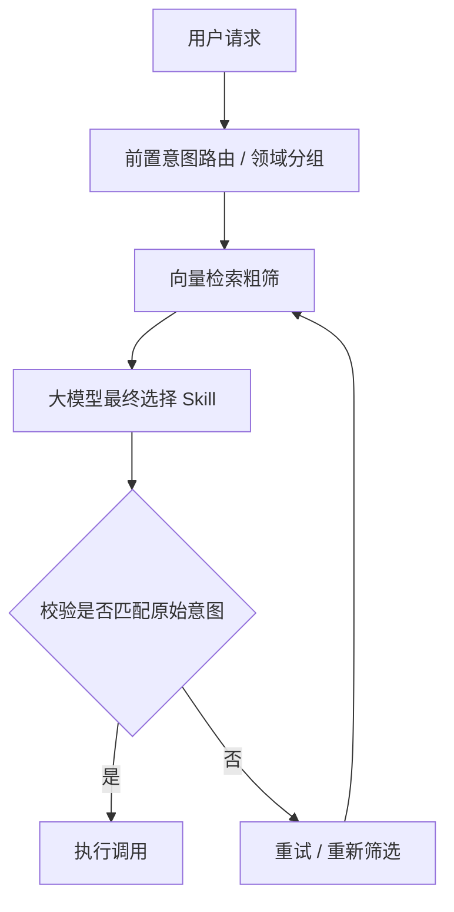

# Agent Skill 命中率：别一次性把所有能力丢给模型

> [!abstract] 一句话总结
> Skill 数量一多，命中率下降的根因通常不是描述不够长，而是 ==候选信息过载 + 功能边界重叠==。解决思路不是让模型自己猜，而是：**前置筛选、定义边界、校验兜底**。

## 面试问题

> [!question] 高频追问
> - Skill 数量多，如何保障 Agent 工具调用命中率？
> - 上百个 skill 功能相似，模型频繁误选怎么办？
> - 只优化 skill 描述，能不能解决 skill 池很大时的错选问题？

## 核心逻辑：Agent 如何选择 Skill

Agent 选择 skill 的本质：

1. 大模型接收用户请求。
2. 理解用户真实意图。
3. 在候选能力列表中筛选匹配的 skill。
4. 发起后续调用。

- Skill 少：候选集合简单，模型识别压力不大。
- Skill 多：相似功能扎堆，大量描述一次性送入上下文，模型注意力被稀释。
- 结果：错选、漏选，甚至同时选中多个冲突 skill。

> [!warning] 常见误区
> 以为把每个 skill 描述写得足够细致，模型就一定能精准命中。实际不是。提示词和描述约束有上限，模型本身有随机性，候选一多仍会混淆。

## 为什么 Skill 多了会误选？

| 问题 | 表现 | 例子 |
|---|---|---|
| 功能边界模糊 | 多个 skill 能力相近、输入输出格式差不多，只有适用场景细微差别 | 查客户基础信息 vs 查客户业务记录，关键词高度重合 |
| 候选池信息过载 | 全部 skill 描述一次性塞入上下文，有效意图信号被淹没 | 模型优先选中关键词多的 skill，而非真正匹配的 |
| 意图泛化误选 | 用户提问模糊，没有明确关键词，模型主观联想 | 强行匹配看似相关但不适用的 skill，后续推理跑偏 |

## 四层优化策略

| 层级 | 策略 | 目的 |
|---|---|---|
| 第一层 | 领域分组 + 前置意图路由 | 缩小候选集合，过滤无关 skill |
| 第二层 | 规范 skill 定义 + 单一职责 | 划清能力边界，减少混淆 |
| 第三层 | 向量检索粗筛 | 降低模型读取和识别负担 |
| 第四层 | 选择后校验 + 重试兜底 | 拦截意图不匹配的错误调用 |

### 第一层：领域分组 + 前置意图路由

不要一次性把所有 skill 全部丢给模型。

- 按业务领域划分 skill 分组。
- 先做轻量意图分类，锁定用户需求所属领域。
- 只把该分组下少量 skill 送入模型候选列表。
- 效果：缩减候选范围，过滤大量无关 skill，从源头减少干扰。

### 第二层：规范 Skill 定义，明确能力边界

- 每个 skill 遵循 ==单一职责原则==：一个 skill 只做一件事。
- 描述中同时写明：
  - 适用场景
  - 不适用场景
  - 与其他相似 skill 的区分点
- 效果：减少功能重叠带来的混淆，让模型更容易分清使用条件。

### 第三层：向量检索粗筛

面对海量 skill：

1. 先用向量检索对用户 query 做召回。
2. 只取语义相似度靠前的少量候选 skill。
3. 再交给大模型做最终抉择。

效果：不用让模型通读全部 skill 信息，降低读取和识别负担。

### 第四层：选择后校验 + 重试兜底

选定 skill 后，不直接执行调用。

- 增加校验逻辑：对比选中 skill 能力与用户原始意图。
- 如果匹配度不足：
  - 不直接执行
  - 触发重试
  - 重新进行 skill 筛选
- 效果：避免错误 skill 直接执行，产生无效调用。

## 推荐调用流程

## 面试追问

> [!question]- 单纯优化 skill 描述能不能搞定 skill 池很大时的错选问题？
> 不行。提示词和 skill 描述的约束能力有上限，模型本身存在随机性。候选 skill 一多，描述打磨再好也会混淆。不能完全依靠模型自主判断，必须搭配前置路由、向量召回等机制一起兜底。

## 容易忽略的点：多 Skill 协作

- Skill 选择不一定是单选。
- 复杂用户需求需要多个 skill 配合。
- 需要区分**串行调用**和**并行调用**。
- 不能放任模型一次性随意挑选一堆 skill，造成调用混乱。

## 灵魂总结

> [!important] 记住这四句话
> 1. Skill 过多的核心难点：==候选信息过载 + 功能边界重叠==。
> 2. 只优化 skill 描述，无法彻底解决命中率下降。
> 3. 优先用 **分组路由 + 向量检索** 做前置筛选，缩小候选集合。
> 4. 每个 skill 保持 **单一职责**，标注适用与禁用场景，划清边界；再加 **选择校验与重试兜底**，拦截意图不匹配的调用。

## 面试表达模板

> [!tip] 可以这样回答
> 我不会把所有 skill 一次性丢给模型。我会先按业务领域分组，用轻量意图路由或向量检索召回少量候选；每个 skill 保持单一职责，描述里写清适用和不适用场景；模型选定后再做意图匹配校验，不匹配就重试兜底。复杂需求还要区分串行和并行调用，避免模型随意选一堆冲突 skill。
