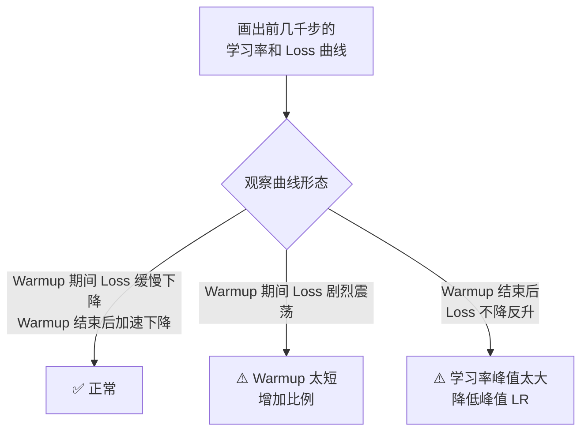

<iframe src="https://player.bilibili.com/player.html?aid=117219572845718&bvid=BV1qcbE6xEoL&cid=41618769440&page=1&autoplay=0" scrolling="no" border="0" frameborder="no" framespacing="0" allow="fullscreen; picture-in-picture" allowfullscreen="true" style="height:100%;width:100%; aspect-ratio: 16 / 9;"> </iframe>

> **Warmup 不是仪式，是给优化器一段适应梯度尺度的缓冲。** 步数太少训崩，太多浪费时间——到底设多少合适？

---

## 1️⃣ 为什么需要 Warmup？

### 训练初期的三个不稳定因素

> 训练刚开始时，模型参数是随机的。如果一上来就用大学习率，前几步就会震荡甚至发散。

| 问题 | 说明 |
|------|------|
| **参数随机** | 初始权重未经过任何优化，输出完全随机 |
| **梯度方差大** | 随机参数下，梯度的方向和大小都很不稳定 |
| **Adam 二阶矩未稳定** | Adam 的 `v_t`（二阶矩估计）还没积累足够统计量，**步长调节不可靠** |

### Warmup 的作用

```
学习率
  ↑
  │
峰值 ┤───────────────────
  │                   ╱
  │                 ╱     ← Cosine Decay
  │               ╱
  │         ╱──╱           ← Warmup 后加速下降
  │    ╱──╱
  │ ╱──╱
  │╱                     ← Warmup 从 0 线性增长
  └────────────────────────→ 训练步数
   ↑ warmup ↑
     1%~2%
```

Warmup 让学习率从**零线性增长**到峰值，给优化器一个热身期——等梯度方差稳定了再上大学习率。

---

## 2️⃣ Warmup 步数怎么定？

### 黄金比例

| 阶段 | 推荐比例 | 原因 |
|------|:--------:|------|
| **预训练** | 总步数的 **1%~2%** | 模型从头训，参数最不稳定 |
| **SFT 微调** | 总步数的 **0.5%~1%** | 模型已预训练过，参数比较稳定 |
| **RL 训练** | 与 SFT 差不多 | 策略初始化相对稳定 |

> [!tip] 具体例子
> 总训练 10 万步 → warmup = 1,000 ~ 2,000 步

---

## 3️⃣ Warmup 做错了会怎样？

### 太短 vs 太长

| 问题 | 表现 | 根因 |
|:----:|------|------|
| **太短**（< 0.1%） | 训练初期 Loss **剧烈震荡**甚至 NaN | 优化器没热身好，上大学习率直接崩 |
| **太长**（> 5%） | 前期 Loss 下降慢，**浪费算力** | Warmup 阶段学习率太小，模型学得慢 |

### 最常见错误

> [!danger] 把 warmup 步数设成**固定值**
> 固定 2000 步——当总训练步数不同时，占比完全不同：
> - 总步数 10 万 → 2%（合理）
> - 总步数 1 万 → 20%（太长 ❌）
> - 总步数 100 万 → 0.2%（太短 ❌）
> 
> ✅ **应该用比例，不是固定值。**

---

## 4️⃣ 怎么监控 Warmup 效果？



| 表现 | 诊断 | 解法 |
|------|------|------|
| **✅ Warmup 期间 Loss 缓慢下降，结束后加速下降** | 正常 | 保持 |
| **⚠️ Warmup 期间 Loss 剧烈震荡** | Warmup 太短 | 增加 warmup 比例 |
| **⚠️ Warmup 后 Loss 不降反升** | 学习率峰值太大 | 降低峰值学习率 |

---

## ✅ 总结

| # | 要点 |
|---|------|
| 1 | **为什么需要**：训练初期梯度方差大、Adam 二阶矩没稳定——需要 warmup 缓冲 |
| 2 | **步数比例**：预训练 **1%~2%**，SFT **0.5%~1%** |
| 3 | **用比例，不用固定值**：固定 2000 步在不同总步数下占比天差地别 |
| 4 | **太短** → Loss 震荡/NaN；**太长** → 浪费算力 |
| 5 | **监控方法**：看前几千步的 Loss 曲线——**平滑下降正常，震荡太短，不降反升高峰值太大** |

> **Warmup 不是仪式，是给优化器一段适应梯度尺度的缓冲。**

---

## 🔗 关联阅读

- [[Bilibili/2026-09-09-【调参工具】LR Finder 详解：怎么画、怎么读、怎么和 warmup 配合|LR Finder 详解]]
- [[Bilibili/2026-09-09-【科学调参】梯度噪声尺度：用一百步小实验算出最优 batch size|梯度噪声尺度]]
- [[Bilibili/2026-09-12-【训练排障】loss 突然变 NaN 怎么办？脏数据、梯度爆炸、精度溢出三路排查|Loss NaN 排查]]

---

## 📋 字幕全文

<details>
<summary>点击展开完整字幕</summary>

`00:00` warm up步数太少
`00:01` 训崩太多
`00:02` 浪费时间
`00:02` 到底设多少合适
`00:04` 0.5%还是2%
`00:06` 今天3分钟讲透
`00:07` 先理解为什么需要warm up训练
`00:09` 刚开始时模型参数是随机的
`00:12` 梯度方差很大
`00:13` ADAM优化器的二阶矩估计还没稳定
`00:16` 如果一上来就用大学习率
`00:18` 前几步就会震荡甚至发散
`00:20` warm up让学习率从零线性增长
`00:23` 给优化器一个热身期
`00:24` warm up步数怎么定经验值
`00:27` 总训练步数的1%到二
`00:28` 比如总训练10万步
`00:30` warm up1000到2000步太少
`00:33` 0.1%以下
`00:34` 优化器没热身好
`00:36` 训练初期不稳定
`00:37` loss震荡太多
`00:39` 5%以上浪费算力
`00:40` warm up阶段学习率太小
`00:42` 模型学得慢
`00:43` 不同阶段不同
`00:45` warm up预训练
`00:46` warm up通常是总步数的1%到二
`00:48` 因为模型从头训参数最不稳定
`00:50` SFT微调
`00:51` warm up可以更短5到1%
`00:54` 因为模型已经预训练过
`00:56` 参数比较稳定
`00:57` RL训练warm up和SFT差不多
`01:00` warm up做错了会怎样
`01:02` warm up up太短
`01:03` 训练初期loss震荡甚至难
`01:05` warup up太长
`01:06` 前期loss下降慢
`01:08` 浪费算力
`01:09` 最常见的错误是warm up部署设成固定值
`01:12` 比如固定2000步
`01:14` 但总训练步数不同时
`01:15` 2000步的占比完全不同
`01:17` 应该用比例不是固定值监控warm up效果
`01:20` 画出前几千步的学习率和loss曲线正常
`01:23` warm up期间loss缓慢下降
`01:25` warm up结束后
`01:26` loss加速下降
`01:27` 如果warm up期间loss剧烈震荡
`01:29` 说明warm up太短
`01:30` 如果warm up后loss不降反升
`01:33` 说明学习率峰值太大

</details>

---

## 🔗 参考链接

- B 站视频：https://www.bilibili.com/video/BV1qcbE6xEoL/
- [[Bilibili/2026-09-09-【调参工具】LR Finder 详解：怎么画、怎么读、怎么和 warmup 配合]]
- [[Bilibili/2026-09-09-【科学调参】梯度噪声尺度：用一百步小实验算出最优 batch size]]
- [[Bilibili/2026-09-12-【训练排障】loss 突然变 NaN 怎么办？脏数据、梯度爆炸、精度溢出三路排查]]