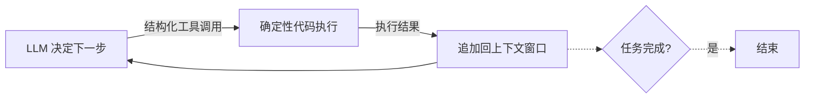

<iframe src="https://player.bilibili.com/player.html?aid=117045962215690&bvid=BV1dEMS6QExa&cid=40638613187&page=1&autoplay=0" scrolling="no" border="0" frameborder="no" framespacing="0" allow="fullscreen; picture-in-picture" allowfullscreen="true" style="height:100%;width:100%; aspect-ratio: 16 / 9;"> </iframe>

## 📺 视频简介

你有没有过这样的经历？用某个 agent 框架搭了一个看起来很酷的 AI 助手，演示的时候惊艳全场，可一旦要把它真正交给客户用，事情就开始失控——输出不稳定，工具调用出错，上下文莫名其妙被塞爆，你调整提示词的时间比写业务代码还多。

这不只是你一个人的问题。**一整个行业都被这个卡着。**

有一个开源项目，专门回答一个问题：**到底要用什么原则，才能构建出真正够格交给生产客户的 AI 软件？** 它在 GitHub 拿下了 **25,000 颗星**，叫 **12 Factor Agents**（十二因素智能体）。

---

## 🗺️ 核心框架速览

| 分组 | 原则 | 主题 |
|------|------|------|
| **掌控三件套**（1-3） | ① 自然语言→工具调用 | 入口标准化 |
| | ② 掌控提示词 | 拒绝黑箱 |
| | ③ 掌控上下文窗口 | 主动管理内存 |
| **结构与生命周期**（4-6） | ④ 工具即结构化输出 | 统一范式 |
| | ⑤ 统一执行/业务状态 | 一处管理 |
| | ⑥ 启动/暂停/恢复 | 可中断 |
| **人机协作**（7） | ⑦ 人类即工具调用 | 安全护栏 |
| **规模化**（8-12） | ⑧ 掌控控制流 | 决策权在手 |
| | ⑨ 压缩错误信息 | 防上下文爆炸 |
| | ⑩ 小而专注 | 微服务哲学 |
| | ⑪ 随处触发 | 去用户所在处 |
| | ⑫ 无状态规约器 | Redux 模式 |

---

## 💀 问题：Agent 开发的"八成死亡谷"

> **框架帮你快速起跑，却把你困在 80% 的天花板下面。**

创始人 Dex Horthy 聊过 100+ 创业者，他们的经历惊人相似：

1. 决定要做一个 Agent
2. 做产品设计，想清楚要解决什么问题
3. 为了赶进度，随便抓一个框架就开始写
4. **很快做到七到八成的完成度**
5. 发现这八成对面向客户来说根本不够用
6. **意识到要突破剩下两成，得反向工程框架的提示词、流程状态管理**
7. 推倒重来

**真正做出厉害产品的创始人，大多数根本不用框架**——都是自己撸一套。

---

## 🧠 核心洞察

### 好的 Agent，说到底主要就是软件

> 你以为那些酷炫的 AI 产品背后是一个无所不能的自主智能体，实际上它可能就是**一堆判断逻辑，中间夹着几次大模型调用**。

构建可靠的 AI 应用，靠的不是更玄学的提示词，不是更花哨的框架，而是**最朴素的软件工程**。

### Agent 的本质：一个循环

1. **LLM 根据当前上下文**，决定下一步该做什么，输出结构化工具调用
2. **确定性代码**负责真正执行这个工具调用
3. **执行结果追加回上下文窗口**
4. 重复，直到 LLM 判断任务完成

但这个循环实际跑起来会犯错、会跑偏、会把上下文塞爆——所以才需要 12 条原则把它**工程化**。

---

## ⚙️ 十二原则详解

### 第一组：掌控三件套（原则 1-3）——控

> **放弃控制权 = 放弃产品质量**

**① 自然语言 → 工具调用**
用户说的是人话，但系统需要结构化指令。必须有一套清晰机制，把非结构化的自然语言稳稳翻译成结构化的工具调用。

**② 掌控你的提示词**
这是冲着框架去的。很多框架把提示词封装在黑箱里。**提示词是你的，你必须能完全看见它、修改它。**

**③ 掌控你的上下文窗口**
上下文就是大模型的短期记忆，就是你的内存。哪些信息该塞进去、哪些该清理、什么时候该压缩——**必须由你主动管理**，而不是交给框架瞎填。

---

### 第二组：结构与生命周期（原则 4-6）

**④ 工具就是结构化输出**
别把工具调用想得多特殊，它本质上就是让大模型输出一段符合特定格式的结构化数据。用同一套思路去处理工具、结果、错误。

**⑤ 统一执行状态和业务状态**
Agent 执行到哪一步、调用了哪些工具——这些执行状态应该和你的业务数据**放在同一个地方管理**，而不是单独搞一套 Agent 专属存储。

**⑥ 用简单的接口实现启动/暂停/恢复**
Agent 往往是长时间运行的任务，必须能让它随时停下来、存好状态、等条件满足再接着跑。这是从玩具走向**生产级**的关键一步。

---

### 第三组：把人类当工具调用（原则 7）

> **我们能给软件的最有用的功能，往往也是最危险的。**

**⑦ 用工具调用来联系人类**
Agent 会遇到高风险操作：删数据、发邮件、执行支付。解法是把**询问人类也设计成一种工具调用**——Agent 调用"联系人类"工具，通过 Slack/短信/邮件问人一句，人回复了 Agent 再继续。

这不是退步，是让强大能力安全落地的**唯一办法**。

---

### 第四组：规模化五原则（原则 8-12）

**⑧ 掌控你的控制流**
什么时候重试、什么时候放弃——这些决策权必须在你手里，不能交给框架的默认行为。

**⑨ 把错误压缩进上下文窗口**
原始报错全塞回去会爆掉上下文。要学会**提炼错误信息**，只把有用的喂给大模型。

**⑩ 小而专注的 Agent**
别幻想做一个无所不能的超级 Agent。**把任务拆开，每个 Agent 只专注做好一件事。** 这跟微服务、UNIX 哲学是一个路子。

**⑪ 随处触发，与用户相会**
Agent 不应该只活在你的网页对话框里。它应该能从任何地方被触发——定时任务、Webhook、Slack 消息——然后主动去用户所在的渠道里找他们。

**⑫ 把 Agent 做成无状态的规约器**

> 这是最深刻的一条。

Agent 本身应该是一个**纯函数**——不持有状态，所有状态序列化存在外部。每次循环都是拿着当前状态和这一步输入，算出下一个状态。这正是 React 和 Redux 的核心思想。

把 Agent 做成无状态规约器，它就变得**可测试、可恢复、可扩展**——这是工程上最好打理的形态。

---

## 🎯 总结：一份给工程师的清醒宣言

> **AI 没有免除你做好软件工程的责任。**

12 Factor Agents 不卖框架，甚至反过来劝你别太依赖框架。它是在告诉你：

- 哪怕大模型还在指数级变强，这些工程原则依然成立
- 因为它们对付的不是模型的智商，而是**软件的复杂度**
- 在一个到处都在吹 Agent 神话的时代，这份 25,000 星的开源文档，更像是一份给工程师的**清醒宣言**

**最性感的 AI 产品，底层也是最朴素的工程纪律。**

> 12 Factor Agents **不是一个框架，是一种思维方式。**

---

## 📋 字幕全文

点击展开完整字幕

`00:05` 你有没有过这样的经历
`00:07` 兴致勃勃地用某个agent框架
`00:10` 搭了一个看起来很酷的AI助手
`00:13` 演示的时候惊艳全场
`00:15` 可一旦要把它真正交给客户用
`00:17` 事情就开始失控
`00:19` 输出不稳定
`00:21` 工具调用出错
`00:22` 上下文莫名其妙就被赛爆
`00:25` 你花在调整提示词上的时间比写业务代码还多
`00:29` 到最后你发现自己不是在做一个产品
`00:33` 是在给一个黑箱擦屁股
`00:35` 这不只是你一个人的问题
`00:38` 一整个行业都被这个卡着
`00:41` 而有一个开源项目专门来回答一个问题
`00:44` 到底要用什么原则
`00:46` 才能构建出真正够格交给生产客户的AI软件
`00:51` 他在GITHUB上拿下了2万5000颗星
`00:54` 它叫12factor agents
`00:56` 12音速智能体
`00:58` 这期视频我们就来好好聊聊他
`01:01` 12factor agents
`01:03` 光听名字你可能觉得有点眼熟没错
`01:07` 他在致敬一份10年前的经典
`01:10` 2011年
`01:11` HARRACLE的工程师ADAMWIGINS写了一份文档
`01:15` 叫12factor app
`01:17` 12因素应用
`01:18` 那份文档
`01:19` 用12条原则定义了什么叫一个现代的
`01:23` 可扩展的
`01:24` 能在云上跑起来的应用
`01:26` 他没有发明什么新技术
`01:29` 但他给一整代开发者提供了一套共同语言
`01:33` 直到今天
`01:34` 你在任何一家公司聊软件架构都绕不开它
`01:38` 12factor agents做的是同一件事
`01:41` 只不过对象换成了AI agent
`01:44` 他同样用12条原则试图回答
`01:48` 什么样的LLM应用才算真正够格
`01:51` 交给生产客户
`01:53` 这份方法论的作者叫DEXHAI
`01:56` 他在一家叫replicated的公司干了7年
`02:00` 专门帮别的团队
`02:02` 把产品改造成能在cuber nice上跑的云原声版本
`02:06` 他做过容器编排
`02:08` 带过产品团队
`02:09` 还创立了公司的市场部门
`02:12` 2023年
`02:13` 他自己出来创业
`02:15` 成立了human layer
`02:16` 拿到了YCOMBINATOR的投资
`02:19` human layer做的事情很有意思
`02:21` 它让软件能够在关键操作时联系人类
`02:25` 去获取批准和反馈
`02:27` 听起来不起眼
`02:28` 但这正是后面第七条原则的核心
`02:32` 我们先记住这个名字
`02:34` 在正式讲12条之前
`02:36` DEX先戳破了一个让很多人扎心的事实
`02:40` 他聊过至少100个想把产品做成agent化的创业者
`02:45` 他们的经历几乎一模一样
`02:47` 可以总结成七部
`02:49` 第一步决定要做一个agent
`02:52` 第二步做产品设计
`02:54` 想清楚要解决什么问题
`02:57` 第三步为了赶进度
`02:59` 随便抓一个现成的框架就开始写
`03:02` 第四步很快做到七成到八成的完成度
`03:06` 第五步
`03:07` 发现这八成对面向客户的功能来说根本不够用
`03:12` 第六步意识到要突破
`03:15` 剩下的两成得反向工程那个框架的提示词
`03:19` 流程状态管理
`03:21` 第七部
`03:22` 推倒重来
`03:23` 这就是他说的agent开发的死亡谷框架
`03:28` 能帮你快速起跑
`03:29` 却把你困在八成的天花板
`03:31` 下面那些他认识的真正做出了厉害产品的创始人
`03:36` 无论是在YC里面还是外面
`03:39` 大多数根本不用框架
`03:41` 他们都是自己撸一套
`03:43` 这本身就说明一个问题
`03:46` 现成的agent框架
`03:47` 在生产环境里可能并没有它宣称的那么好用
`03:52` 接下来是整个方法论最反直觉
`03:55` 也最重要的一句话
`03:56` DEX说
`03:58` 他很惊讶地发现
`03:59` 市面上大多数把自己标榜为AI agent的产品
`04:04` 其实并不怎么agent tic
`04:06` 他们当中很多主体就是确定性的代码
`04:10` 只是在几个恰到好处的位置
`04:12` 点缀了一些大模型的步骤
`04:15` 让体验变得很神奇
`04:17` 换句话说
`04:18` 你以为那些酷炫的AI产品
`04:21` 背后是一个无所不能的自主智能体
`04:24` 实际上他可能就是一堆判断逻辑
`04:27` 中间夹着几次大模型调用
`04:30` 而真正好的agent也不遵循那个被吹捧的范式
`04:34` 什么范式呢
`04:36` 就是给你一个提示词
`04:38` 给你一袋工具
`04:39` 让它自己循环
`04:41` 直到达成目标
`04:42` DEX的结论很尖锐
`04:44` 好的agent说到底主要就是软件
`04:48` 这话的分量在于
`04:49` 他给整个行业的agent狂热浇了一盆冷水
`04:53` 他告诉我们
`04:55` 构建可靠的AI应用
`04:57` 靠的不是更玄学的提示词
`04:59` 不是更花哨的框架
`05:01` 而是最朴素的软件工程
`05:03` 这正是12factor agents这个名字的用意
`05:07` 他没打算给你一个新玩具
`05:09` 它的作用是把你拽回工程的基本功
`05:13` 那agent到底是什么
`05:15` DEX给了一个非常清醒的定义
`05:18` 他说别把agent想的多神秘
`05:21` 它的本质就是一个循环
`05:23` 这个循环只有三步
`05:26` 第一步
`05:27` 大模型根据当前的上下文决定下一步该做什么
`05:31` 输出一个结构化的工具调用
`05:34` 第二步
`05:35` 一段确定性的代码负责真正执行这个工具调用
`05:39` 第三步
`05:40` 把执行结果追加回上下文窗口里
`05:44` 然后重复这个过程
`05:46` 直到大模型判断任务完成
`05:49` 你看agent的全部秘密就在这
`05:52` 他谈不上是个有自我意识的数字生命
`05:56` 它就是一个循环
`05:57` 但问题来了
`05:59` DEX也很坦诚的说
`06:01` 这个看起来很优雅的循环
`06:03` 实际跑起来并不如我们期望的那么好用
`06:07` 它会犯错
`06:09` 会跑偏
`06:10` 会把上下文塞爆
`06:11` 会在不该停的时候停
`06:13` 所以才需要接下来的12条原则
`06:17` 这12条要解决的就是怎么把这个循环工程化
`06:21` 让他从一个不靠谱的玩具
`06:24` 变成一个能在生产环境扛试的系统
`06:27` 我们正式进入12条原则
`06:30` 为了方便理解
`06:32` 我按主题把它们分成了几组
`06:34` 第一组我称之为掌控三件套
`06:38` 对应前三条原则
`06:40` 它们的共同主题是一个字控
`06:43` 第一条
`06:44` 自然语言转工具调用
`06:46` 这是agent的入口
`06:48` 用户说的是人话
`06:50` 但你的系统需要的是结构化的指令
`06:53` 这一条要求你有一套清晰的机制
`06:56` 把非结构化的自然语言
`06:58` 稳稳的翻译成结构化的工具调用
`07:01` 第二条
`07:02` 掌控你的提示词
`07:04` 这一条是冲着框架去的
`07:07` 很多框架喜欢把提示词封装在黑箱里
`07:10` 你觉得方便
`07:11` 但等你需要金条的时候
`07:13` 根本摸不到DEX的态度
`07:16` 很明确
`07:17` 提示词是你的
`07:18` 你必须能完全看见它
`07:20` 修改它
`07:21` 第三条掌控你的上下文窗口
`07:24` 这是最被低估的一条上下文窗口
`07:28` 就是大模型的短期记忆
`07:30` 它就是你的内存
`07:32` 哪些信息该塞进去
`07:34` 哪些该清理出去
`07:35` 什么时候该压缩
`07:37` 必须由你主动管理
`07:38` 而不是交给框架瞎填
`07:41` 这三条合起来就一句话
`07:43` 在agent的世界里
`07:45` 放弃控制权
`07:46` 就等于放弃产品质量
`07:49` 第二组原则讲的是agent的结构和生命周期
`07:53` 第四条工具就是结构化输出
`07:57` 这句话的意思是
`07:58` 别把工具调用想的多特殊
`08:01` 它本质上就是让大模型输出一段
`08:05` 符合特定格式的结构化数据
`08:08` 理解了这一点
`08:09` 你就能用同一套思路去处理工具
`08:12` 处理结果
`08:13` 处理错误
`08:14` 第五条
`08:15` 统一执行状态和业务状态
`08:18` agent在跑的过程中会产生状态
`08:22` 比如执行到哪一步了
`08:23` 调用了哪些工具
`08:25` 这些执行状态应该和你的业务数据
`08:28` 放在同一个地方管理
`08:31` 而不是单独搞一套agent专属的存储
`08:34` 否则你的系统迟早会顾此失彼
`08:38` 第六条
`08:39` 用简单的接口实现启动暂停恢复
`08:43` agent往往是长时间运行的任务
`08:46` 他不可能一直占着资源不放手
`08:49` 你必须能让它随时停下来
`08:51` 存好状态
`08:52` 等条件满足了再接着跑
`08:55` 这一条是agent从玩具走向生产线的关键一步
`09:00` 接下来这条是整个12条里最特别的一条
`09:04` 也是human layer这家公司的核心
`09:07` 它就是第七条
`09:08` 用工具调用来联系人类
`09:11` 什么意思呢
`09:13` agent在执行任务时难免会遇到高风险的操作
`09:17` 比如删数据
`09:18` 发邮件
`09:19` 执行支付
`09:21` 让他自己擅自干
`09:22` 太危险
`09:23` 可如果每一步都让人盯着
`09:26` 又失去了自动化的意义
`09:28` DEX给出的解法非常巧妙
`09:31` 把询问人类也设计成一种工具调用
`09:34` 当agent遇到拿不准的关键操作
`09:37` 他就调用一个联系人类的工具
`09:40` 通过slack短信邮件去问人一句
`09:44` 这个操作批准吗
`09:46` 人回复了agent再接着跑
`09:49` 这个想法正是DEX创立human layer的起源
`09:53` 他当初想做一个能自动清理数据库的agent
`09:57` 要让他能删表
`09:59` 他很清楚
`10:00` 不能让一个AI在没有监督的情况下跑删表语句
`10:05` 于是他加了一道人类批准的环节
`10:08` 那一刻
`10:09` 他琢磨出一件事
`10:11` 我们能给软件的最有用的功能
`10:13` 往往也是最危险的
`10:15` 尤其在由大模型驱动的这种非确定性系统里
`10:19` 这个矛盾更加尖锐
`10:21` 所以把人放进循环里
`10:24` 这不是退步
`10:25` 想让强大的能力安全落地
`10:28` 这是唯一的办法
`10:30` 最后这一组原则覆盖第八到第12条
`10:33` 讲的是怎么让agent在真实世界里规模化
`10:37` 稳健的跑起来
`10:39` 第八条
`10:40` 掌控你的控制流
`10:42` 还是那个字控循环的逻辑
`10:45` 什么时候重视
`10:47` 什么时候放弃
`10:48` 这些决策权必须在你手里
`10:51` 不能交给框架的默认行为
`10:53` 第九条
`10:54` 把错误压缩进上下文窗口
`10:57` agent会犯错
`10:58` 工具会报错
`11:00` 如果把一长串原始报错信息全部塞回上下文
`11:04` 很快就会爆掉
`11:06` 这一条要求你学会提炼错误
`11:09` 只把有用的信息喂给大模型
`11:11` 第十条
`11:12` 小而专注的agent
`11:15` 别幻想做一个无所不能的超级agent
`11:18` 把任务拆开
`11:19` 让每个agent只专注做好一件事
`11:23` 这跟微服务跟UNIX哲学是一个路子
`11:27` 第11条
`11:28` 随处触发与用户相会
`11:30` agent不应该只活在你的网页对话框里
`11:34` 他应该能从任何地方被触发一个定时任务
`11:38` 一个网络钩子
`11:39` 一条slack消息
`11:41` 然后主动去用户所在的渠道里找他们
`11:45` 第12条
`11:46` 把你的agent做成一个无状态的规约器
`11:49` 这是最深刻的一条
`11:51` 意思是agent本身应该是一个纯函数
`11:55` 它不持有状态
`11:57` 所有的状态都序列化存在
`12:00` 外部
`12:00` 每次循环都是拿着当前的状态和这一步的输入
`12:05` 算出下一个状态
`12:07` 听起来耳熟吧
`12:08` 没错
`12:09` 这就是react和REDUX的核心思想
`12:13` 把agent做成一个无状态的归约器
`12:16` 它就变得可测试
`12:18` 可恢复
`12:19` 可扩展
`12:20` 这是工程上最好打理的形态
`12:23` 12条原则讲完了
`12:25` 我们退一步看12factor
`12:27` agents真正的价值到底是什么
`12:30` DEX在文档里说了一句很关键的话
`12:34` 他见过最快的
`12:35` 把高质量AI软件交到客户手里的方式
`12:39` 不是压住一个框架推倒重来
`12:42` 而是从agent开发里提取出那些小的模块化的概念
`12:47` 把它们融进现有的产品里
`12:50` 这句话点破了整份方法论的立场
`12:53` 他不卖框架
`12:55` 甚至反过来劝你别太依赖框架
`12:58` 他是在告诉你
`12:59` AI没有免除你做好软件工程的责任
`13:03` 10年前的12factor app
`13:05` 帮一整代人理清了云原生应用的思路
`13:09` 今天的12factor agents想做同样的事
`13:13` 而且他有一个底气
`13:15` 哪怕大模型还在指数级变强
`13:18` 这些工程原则依然成立
`13:21` 因为他们对付的不是模型的智商
`13:24` 而是软件的复杂度
`13:26` 在一个到处都在吹agent神话的时代
`13:29` 这份2万5000颗星的开源文档
`13:32` 更像是一份给工程师的清醒宣言
`13:35` 它提醒我们最性感的AI产品
`13:39` 底层也是最朴素的工程纪律
`13:42` 12factor agents不算一个框架
`13:45` 它更像一种思维方式

---

## 🔗 相关链接

- B 站视频：https://www.bilibili.com/video/BV1dEMS6QExa/
- GitHub 项目：[12 Factor Agents](https://github.com/humanlayer/12-factor-agents)
- 原著：《12-Factor App》- https://12factor.net/