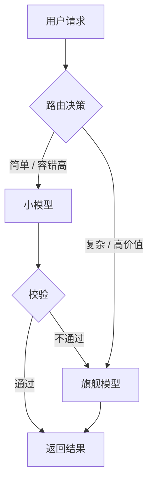

<iframe src="https://player.bilibili.com/player.html?aid=117347532805194&bvid=BV1D5aG6PEJa&cid=42271444944&page=1&autoplay=0" scrolling="no" border="0" frameborder="no" framespacing="0" allow="fullscreen; picture-in-picture" allowfullscreen="true" style="height:100%;width:100%; aspect-ratio: 16 / 9;"> </iframe>

## 一句话总结

> [!tip] 核心答案
> 不是简单“换个便宜模型”，而是做 **模型路由**：按任务难度分配模型，用级联升级兜住误判，算清路由成本，并用日志与 AB 迭代。最终在 **成本、延迟、质量** 三角里做可度量、可回退、可迭代的取舍。

## 面试题背景

> [!question] 面试题
> 线上 AI 助手每天 100 万次调用，全部走顶配旗舰模型，一个月成本 300 万。老板要求成本砍一半，用户满意度不能明显掉。你打算怎么干？

> [!warning] 常见错误
> 第一反应说“换个便宜点的模型”——这是一刀切。质量掉多少心里没数，满意度掉了也没法兜。老板要的不是便宜，是“便宜一半还不出事”。

## 核心框架：模型路由四层

### 第一层：如何判断请求是简单还是难？

- 起步：**规则路由**，按任务类型分。
  - 改写、总结、抽取、格式转换：容错高，走小模型。
  - 复杂推理、长文规划、代码生成：走旗舰模型。
- 进阶：加轻量分类器，或让小模型先当一次裁判，给请求打难度分。
  - 信号越细，路由越准，但也越贵、越慢。
- 坑：多轮对话一致性。
  - 上一轮走旗舰模型，这一轮被切到小模型，上下文能力和风格会跳。
  - 处理方式：按会话锁定模型，或只在会话首轮做路由决策。

### 第二层：分类器一定会判错，代价谁扛？

- 及格回答：加个兜底。
- 优秀回答：**级联升级**。
  - 小模型先答 → 立刻校验 → 不达标 → 自动升级到旗舰模型重答。
- 校验四手段：
  1. 看输出置信度。
  2. 同一问题多采几次，看答案是否一致。
  3. 用一个小模型当评审打分。
  4. 硬校验：代码能不能跑通、JSON 能不能解析、必填字段在不在。
- 精髓：**路由不是一锤子买卖，它是一条能回退的链路。**

### 第三层：路由自己要不要花钱？

- 要。路由本身也是一次调用，也会加延迟。
- 必须算账：

$$
\text{净节省} = \text{路由命中率} \times \text{单次省下的钱} - \text{路由开销} - \text{误判损失}
$$

- 只有收益大于开销和损失，这套路由才该上。
- 阈值不能全局拍一个数，要按任务分层：
  - 客服问答：可以松一点。
  - 代码生成：必须严一点。
- 方法：画出成本和质量曲线，再调拐点。
- 体感：假设 80% 请求分到小模型，单次省 70%，扣掉路由那一跳的开销，再扣掉误判重答的部分，最后剩下的才是真正省下来的钱。

### 第四层：上线后怎么知道策略改好了还是改坏了？

- 路由日志里必须记一件事：**这次为什么走这个模型**。
- 记不住原因，事后就没法归因，策略永远迭代不了。
- 再配一个离线评测集，加在线 AB 闭环，才算跑起来。

## 高分补充：路由不只是省钱

> [!example] 即使老板说“成本无所谓，只要质量”，路由仍有意义
> - **合规路由**：某些数据不能出私有环境，这是硬约束。
> - **延迟路由**：用户愿意等就走强模型，要秒回就走快模型。
> - **稳定性路由**：某个供应商出问题，自动切备用。

> [!warning] 反面：什么时候别上路由？
> 如果调用量本来就小，任务也高度同质，那就别上路由，复杂度不划算。

## 可背完整答案

> [!success] 面试可背版
> 1. 先拉调用分布和质量基线。
> 2. 按任务类型 + 难度打分做路由。
> 3. 用级联升级兜住误判。
> 4. 按分层阈值算清投入产出。
> 5. 用路由日志 + AB 跑迭代闭环。
> 6. 合规要求和用户指定优先，直接短路。
>
> 记住：面试官想听的不是“换模型”，而是你能不能在 **成本、延迟、质量** 这个三角里做出 **可度量、可回退、可迭代** 的取舍。

## 关键金句

> [!quote] 摘录
> - 路由不是简单的用小模型、难的用大模型一句话就完事儿，它有四层。
> - 路由不是一锤子买卖，它是一条能回退的链路。
> - 算不过来，这套路由就不该上。
> - 记不住原因，事后就没法归因，策略永远迭代不了。

## 关键时间戳

| 时间      | 内容                          |
| ------- | --------------------------- |
| `00:00` | 面试题背景：100 万次调用、月成本 300 万、砍半 |
| `00:49` | 核心答案：做路由                    |
| `00:58` | 第一层：判断请求难度                  |
| `01:36` | 第二层：级联升级兜误判                 |
| `02:12` | 第三层：算清路由成本                  |
| `02:52` | 第四层：日志、离线评测、在线 AB           |
| `03:11` | 高分补充：合规、延迟、稳定性路由            |
| `03:40` | 可背完整答案                      |
