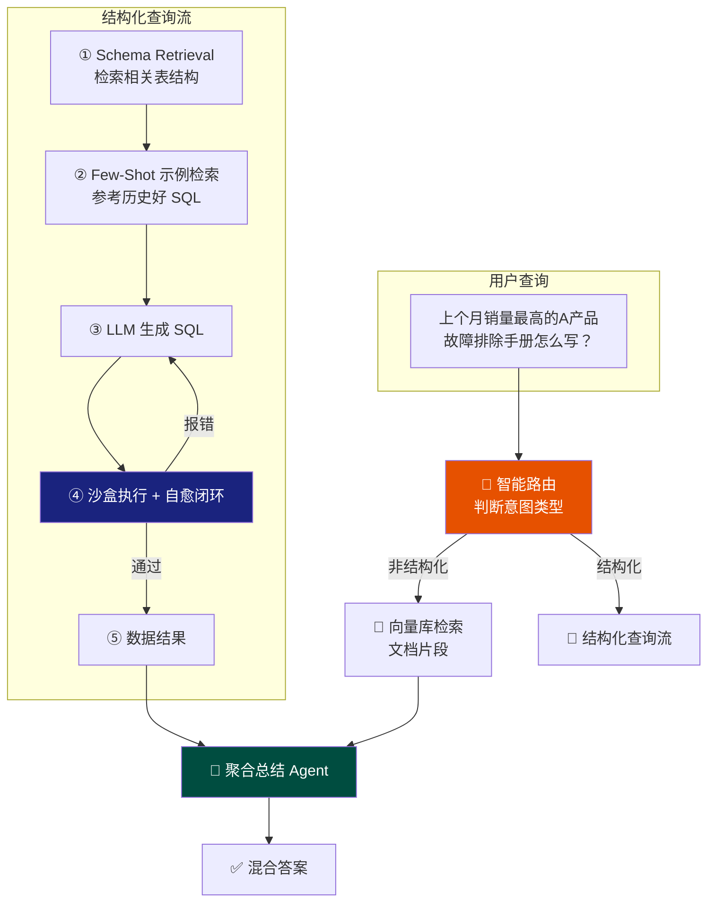
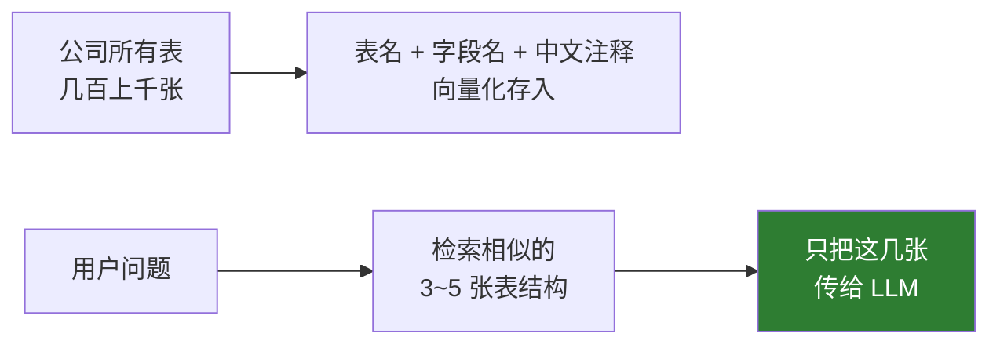
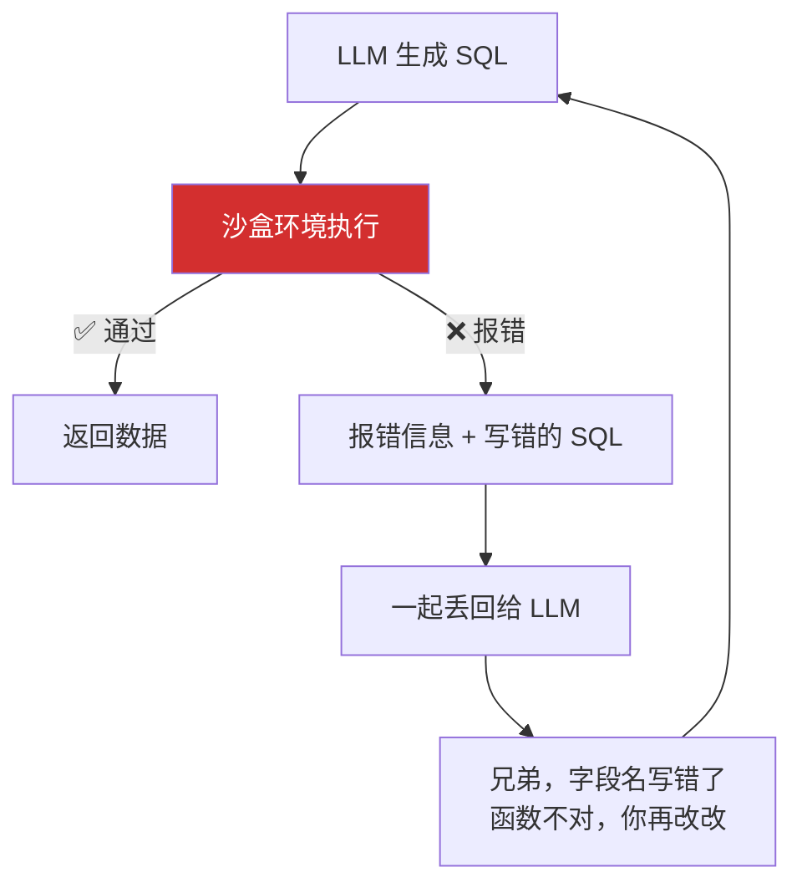

<iframe src="https://player.bilibili.com/player.html?aid=116361837746065&bvid=BV1KkDYBhEYQ&cid=37306107518&page=1&autoplay=0" scrolling="no" border="0" frameborder="no" framespacing="0" allow="fullscreen; picture-in-picture" allowfullscreen="true" style="height:100%;width:100%; aspect-ratio: 16 / 9;"> </iframe>

> 如果只回答"让大模型写个 SQL 不就完了"——面试官心里肯定想：这人没做过实战。**这道题考的不是 Text-to-SQL 这种基础概念，而是企业级生产环境的鲁棒性。**

---

## 1️⃣ 问题：结构化查询的独特挑战

### 向量检索搞不定的事

| 场景 | 向量检索 | 需要什么 |
|------|----------|----------|
| "上个月 A 产品总销售额多少？" | ❌ 只能搜到"销售额"三个字的文档片段 | **聚合计算** |
| "销量前十的产品排序" | ❌ 搜不到 | **排序 + 数值运算** |
| "合同编号 HX-2024-001 的付款状态" | ❌ 模糊匹配不精确 | **精确匹配** |

### 大模型写 SQL 的三大坑

| 坑 | 问题 |
|:--:|------|
| **① 表太多** | 公司几百上千张表，全塞进 prompt → 模型 CPU 过载，**幻觉满天飞** |
| **② 记不住业务逻辑** | 什么叫"活跃用户"？登录过就算，还是下单才算？模型不知道**业务口径** |
| **③ 猜不透 SQL 语法** | 字段名写错、函数不对、语法报错——生成的结果**大概率跑不通** |

---

## 2️⃣ 整体架构：双轨制 + Agent 闭环



---

## 3️⃣ 第一招：Schema Retrieval（精简上下文）

> 不要一次性把所有字段全塞进 prompt。



| 方式 | 做法 |
|------|------|
| **向量化 Schema** | 所有表的表名、字段名、中文注释 → 向量化存储 |
| **检索注入** | 模型写 SQL 前先搜一下与问题相关的表，只把最相关的 **3~5 张表** 传入 |
| **效果** | 从"全塞进去→幻觉"变成"精简上下文→准确" |

---

## 4️⃣ 第二招：Few-Shot 示例检索

> 模型不知道你们公司的业务口径——把之前写对的 SQL 例子存成库。

| 问题 | 解法 |
|------|------|
| "什么是活跃用户？登录过就算，还是下单才算？" | 之前高手写过的 SQL 示例 → 检索相似问题 → **照葫芦画瓢** |
| "准确率" | 从 **60% → 90%+** |

```
用户问题："上个月活跃用户数量"
        ↓
检索 → 历史 SQL："SELECT COUNT(DISTINCT user_id) FROM orders WHERE month = '2024-01'"
        ↓
参考这个模式生成新 SQL："SELECT COUNT(DISTINCT user_id) FROM orders WHERE month = '2024-08'"
```

---

## 5️⃣ 第三招：沙盒执行 + 自愈闭环（Agent 闭环）

> 这是面试的高分点。**大模型第一次生成的 SQL 报错了怎么办？**



| 传统做法 | Agent 闭环（推荐） |
|----------|-------------------|
| 报错直接甩给用户 ❌ | SQL 先在沙盒跑一次 |
| | 报错 → 把错误信息 + 错误 SQL 丢回给模型 → 模型自修 → **直到跑通为止** |

> **这种自我进化的能力，才是解决 SQL 语法幻觉的终极武器。**

---

## 6️⃣ 安全防线

> 万一大模型写了个 `DROP TABLE` 把数据库删了怎么办？

| 防线 | 做法 |
|:----:|------|
| **① 账号权限** | 给大模型的数据库账号必须是严格的 **READ ONLY** |
| **② 拦截层** | SQL 真正执行前——用 **AST 解析**或**正则校验**——检测到 `DROP`/`DELETE`/`UPDATE` → **直接毙掉** |

> **技术再强，安全防线不能丢。**

---

## 7️⃣ 最终输出：聚合总结

> 文档片段拿到了，数据报表也算出来了——**聚合总结 Agent**把两者揉在一起。

```
向量库：A 产品故障排除手册 → 红灯闪烁请检查电源
SQL：A 产品上月销量 10,000 台
        ↓
聚合总结 Agent
        ↓
"老板，上个月销量最高的是 A 产品，一共卖了 1 万台。
顺便您关心的这款产品的故障排除手册里提到——
如果遇到红灯闪烁，记得先检查电源。"
```

> 不是生硬地抛表格，而是像秘书一样自然地告诉你——**有理有据有温情。**

---

## ✅ 面试总结

| 层面 | 要点 |
|------|------|
| **根本问题** | 向量检索不能做聚合/排序/精确匹配——必须走结构化查询 |
| **三大坑** | 表太多记不住 / 业务口径不知道 / SQL 语法写不对 |
| **Schema Retrieval** | 只传相关表（3~5 张），不全部塞入 |
| **Few-Shot 示例** | 历史好 SQL 检索参考，准确率 60% → 90%+ |
| **自愈闭环** | 沙盒执行 → 报错自修 → 直到跑通 |
| **安全** | Read Only 账号 + AST 拦截层 |
| **架构本质** | 不是靠超级 prompt，是**意图路由 + 工具调用 + 容错重试的流程式智能体架构** |

---

## 🔗 关联阅读

- [[Bilibili/2026-09-13-面试官：RAG中，Rerank解决什么问题？|RAG 中 Rerank 的作用]]
- [[Bilibili/2026-09-11-【大模型面试】当大模型遇到几百页的PDF合同上下文窗口不够用了怎么办？|超长文档合同处理]]

---

## 📋 字幕全文

<details>
<summary>点击展开完整字幕</summary>

`00:00` 面试官问
`00:01` 在rag系统中结构化数据也就是circle或表格查询的难题
`00:04` 你到底怎么解决
`00:06` 唉大家注意了
`00:07` 如果你只回答让大模型写个circle不就完了吗
`00:10` 那面试官心里肯定想
`00:11` 这人没做过实战
`00:12` 大家好
`00:13` 我是彭宇
`00:14` 这道题考的不是text to circle这种基础概念
`00:17` 而是企业级生产环境的鲁棒性来
`00:19` 同学们盯着屏幕上这张架构图
`00:22` 今天我把这套EGAGREG混合架构给你们讲透
`00:25` 咱们先思考一个问题
`00:27` 平时我们做文档检索靠的是向量相似度
`00:30` 但我问你上个月A产品的总销售额是多少
`00:33` 或者把销量前十名的产品排个序向量检索
`00:36` 能把这个数给你算出来吗
`00:38` 那肯定不行对吧
`00:40` 他顶多能帮你搜到提到过销售额三个字的文档片段
`00:43` 他没法做数学运算
`00:45` 这种涉及到聚合排序精确匹配的需求
`00:48` 必须走结构化查询
`00:49` 但大模型直接写SQL会有三大坑
`00:52` 表太多
`00:53` 记不住业务逻辑
`00:54` 猜不透SQL语法写不对
`00:55` 那怎么破
`00:56` 怎么往下滑看方案
`00:58` 大家看架构图的最上方
`00:59` 用户提问进来后
`01:01` 第一站不是去查数据
`01:02` 而是去智能路由
`01:04` 这一步至关重要
`01:05` 我们要让大模型先判断这个问题
`01:08` 是该查手册文档这种非结构化数据
`01:10` 还是该查报表数据库这种结构化数据
`01:13` 比如用户问上个月销量最高的A产品
`01:16` 他的手册里怎么写故障排除的
`01:18` 你看这是一个混合意图
`01:20` 路由agent会把问题拆开
`01:22` 一部分派给左边的向量库去搜文档
`01:24` 另一部分派给右边的结构化流去算销量
`01:27` 最后再合在一起
`01:29` 这种双轨制才是专业玩家的标配
`01:31` 好重点来了
`01:32` 大家看右边这条蓝色的线
`01:34` 这是解决结构化查询的核心
`01:36` 第一招
`01:37` Chema reg
`01:38` 咱公司可能有几百上千张表
`01:40` 你一次性把所有字段全塞进prompt
`01:42` 那模型直接就CPU过载了
`01:45` 幻觉满天飞
`01:46` 瞎编表明我们的解法是把所有表的表名字
`01:49` 段名和中文注释也做成向量存起来
`01:52` 模型写SQL前先去搜一下跟这个问题相关的表是哪几张
`01:56` 只把那三五张最相关的表结构传进去
`01:59` 这叫精简上下文

</details>

---

## 🔗 参考链接

- B 站视频：https://www.bilibili.com/video/BV1KkDYBhEYQ/
- [[Bilibili/2026-09-13-面试官：RAG中，Rerank解决什么问题？]]
- [[Bilibili/2026-09-11-【大模型面试】当大模型遇到几百页的PDF合同上下文窗口不够用了怎么办？]]